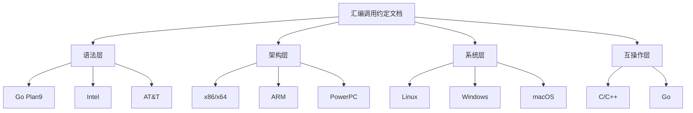

# 设计文档

## 概述

本设计文档定义了汇编语言调用约定技术文档的结构、内容组织和呈现方式。该文档是一份纯技术参考文档，面向汇编语言专家，提供全面、准确、易于查阅的调用约定参考资料。

文档采用模块化设计，按照"语法 → 架构 → 操作系统 → 互操作"的逻辑顺序组织内容，便于读者按需查阅或系统学习。

## 架构

### 文档整体架构

```
assembly-calling-conventions/
├── 00-index.md                    # 总目录和导航
├── 01-syntax-comparison/          # 汇编语法对比
│   ├── overview.md
│   ├── go-plan9.md
│   ├── intel.md
│   ├── att.md
│   └── comparison-tables.md
├── 02-x86-x64/                    # Intel架构调用约定
│   ├── overview.md
│   ├── x86-conventions.md
│   ├── x64-sysv.md
│   ├── x64-microsoft.md
│   └── registers.md
├── 03-arm/                        # ARM架构调用约定
│   ├── overview.md
│   ├── arm32-aapcs.md
│   ├── arm64-aapcs64.md
│   └── registers.md
├── 04-powerpc/                    # PowerPC架构调用约定
│   ├── overview.md
│   ├── ppc32.md
│   ├── ppc64-elfv1.md
│   ├── ppc64-elfv2.md
│   └── registers.md
├── 05-os-differences/             # 操作系统差异
│   ├── overview.md
│   ├── linux.md
│   ├── windows.md
│   ├── macos.md
│   └── comparison.md
├── 06-interop/                    # 语言互操作
│   ├── c-cpp.md
│   ├── go-assembly.md
│   └── inline-assembly.md
├── 07-stack-frames/               # 栈帧结构
│   ├── overview.md
│   ├── x86-x64-frames.md
│   ├── arm-frames.md
│   └── ppc-frames.md
├── appendix/                      # 附录
│   ├── register-reference.md
│   ├── glossary.md
│   └── references.md
└── diagrams/                      # 图表资源
    └── *.mermaid
```

### 内容层次结构



## 组件与接口

### 文档组件定义

#### 1. 语法对比模块

**职责**: 提供三种汇编语法的详细对比分析

**内容结构**:
- 语法概述和历史背景
- 操作数顺序对比（源/目标）
- 寄存器命名规范
- 内存寻址语法
- 立即数和常量表示
- 指令前缀和后缀
- 等效代码对照表

#### 2. 架构调用约定模块

**职责**: 提供各CPU架构的调用约定详细规范

**内容结构**:
- 架构概述
- 寄存器分类和用途
- 参数传递规则
- 返回值处理
- 栈对齐要求
- Caller/Callee保存寄存器

#### 3. 操作系统差异模块

**职责**: 说明不同操作系统的调用约定差异

**内容结构**:
- 用户态调用约定
- 系统调用约定
- 特殊区域（Red Zone、Shadow Space）
- ABI版本和兼容性

#### 4. 互操作模块

**职责**: 说明汇编与高级语言的互操作规范

**内容结构**:
- 函数声明和链接
- 参数和返回值映射
- 名称修饰规则
- 内联汇编语法

### 交叉引用接口

文档各模块之间通过以下方式建立关联：

1. **锚点链接**: 每个重要概念设置唯一锚点ID
2. **参见引用**: 使用"参见: [章节名](#anchor)"格式
3. **术语链接**: 首次出现的术语链接到术语表

## 数据模型

### 调用约定数据结构

每种调用约定使用统一的描述结构：

```
CallingConvention {
    name: string                    // 约定名称
    platform: Architecture          // 适用架构
    os: OperatingSystem[]           // 适用操作系统
    
    parameter_registers: Register[] // 参数传递寄存器
    return_registers: Register[]    // 返回值寄存器
    caller_saved: Register[]        // 调用者保存寄存器
    callee_saved: Register[]        // 被调用者保存寄存器
    
    stack_alignment: number         // 栈对齐字节数
    stack_direction: "down" | "up"  // 栈增长方向
    stack_cleanup: "caller" | "callee" // 栈清理责任
    
    special_areas: {
        red_zone: number | null     // 红区大小
        shadow_space: number | null // 影子空间大小
    }
}
```

### 寄存器数据结构

```
Register {
    name: string                    // 寄存器名称
    aliases: string[]               // 别名（不同语法）
    size: number                    // 位宽
    purpose: string                 // 用途说明
    volatile: boolean               // 是否易失
    sub_registers: Register[]       // 子寄存器
}
```

### 栈帧数据结构

```
StackFrame {
    architecture: Architecture
    components: [
        { name: "return_address", offset: number, size: number },
        { name: "saved_frame_pointer", offset: number, size: number },
        { name: "saved_registers", offset: number, size: number },
        { name: "local_variables", offset: number, size: number },
        { name: "parameters", offset: number, size: number }
    ]
    alignment: number
    growth_direction: "down" | "up"
}
```

## 正确性属性

*正确性属性是指在系统所有有效执行中都应保持为真的特征或行为——本质上是关于系统应该做什么的形式化陈述。属性作为人类可读规范和机器可验证正确性保证之间的桥梁。*

由于本项目是纯文档项目，不涉及代码实现，因此正确性属性主要关注文档内容的准确性和完整性验证。


由于本项目是纯文档项目，不涉及可执行代码，因此没有适合属性测试的正确性属性。所有验收标准都是关于文档内容的要求，需要通过人工审查来验证：

1. **内容完整性**: 各章节是否包含规范要求的所有内容
2. **技术准确性**: 调用约定描述是否与官方规范一致
3. **结构一致性**: 文档格式是否统一规范

可通过文档审查清单进行验证的项目：
- 检查每个调用约定章节是否包含：参数寄存器、返回值寄存器、栈对齐、寄存器分类
- 检查语法对比章节是否包含：操作数顺序、寄存器命名、内存寻址、立即数表示
- 检查文档是否包含：目录、交叉引用、代码示例、图表、参考资料

## 错误处理

由于本项目是文档项目，错误处理主要涉及：

1. **内容错误**: 通过交叉引用官方规范文档进行验证
2. **格式错误**: 通过Markdown lint工具检查
3. **链接错误**: 通过链接检查工具验证内部和外部链接

## 测试策略

### 文档验证方法

由于本项目不涉及代码实现，测试策略转化为文档验证策略：

**1. 结构验证**
- 验证文档目录结构符合设计规范
- 验证每个章节包含必要的子章节
- 验证交叉引用链接有效

**2. 内容审查**
- 对照官方ABI规范文档验证技术内容准确性
- 验证代码示例的语法正确性
- 验证图表与文字描述的一致性

**3. 格式检查**
- Markdown语法检查
- 代码块语法高亮正确性
- 表格格式规范性

**4. 审查清单**

每个调用约定章节必须包含：
- [ ] 参数传递寄存器列表
- [ ] 返回值寄存器说明
- [ ] Caller-saved寄存器列表
- [ ] Callee-saved寄存器列表
- [ ] 栈对齐要求
- [ ] 栈帧结构图示

每个语法对比必须包含：
- [ ] 操作数顺序对比
- [ ] 寄存器命名对比
- [ ] 内存寻址语法对比
- [ ] 立即数表示对比
- [ ] 等效代码示例

**参考资料验证**

文档内容应与以下官方规范保持一致：
- System V AMD64 ABI
- Microsoft x64 Calling Convention
- ARM Architecture Procedure Call Standard (AAPCS)
- Power Architecture 64-Bit ELF V2 ABI
- Go Internal ABI Specification
