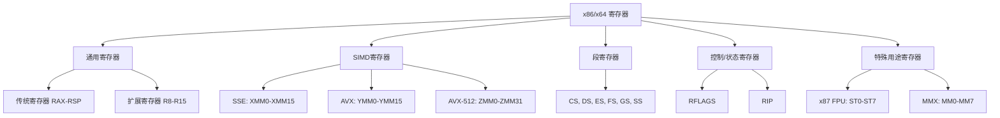
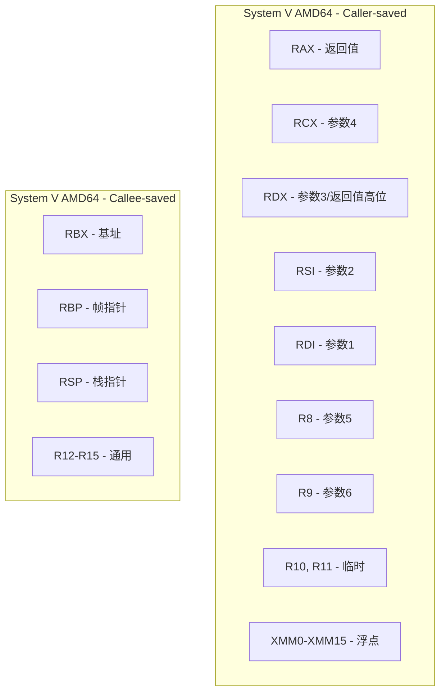
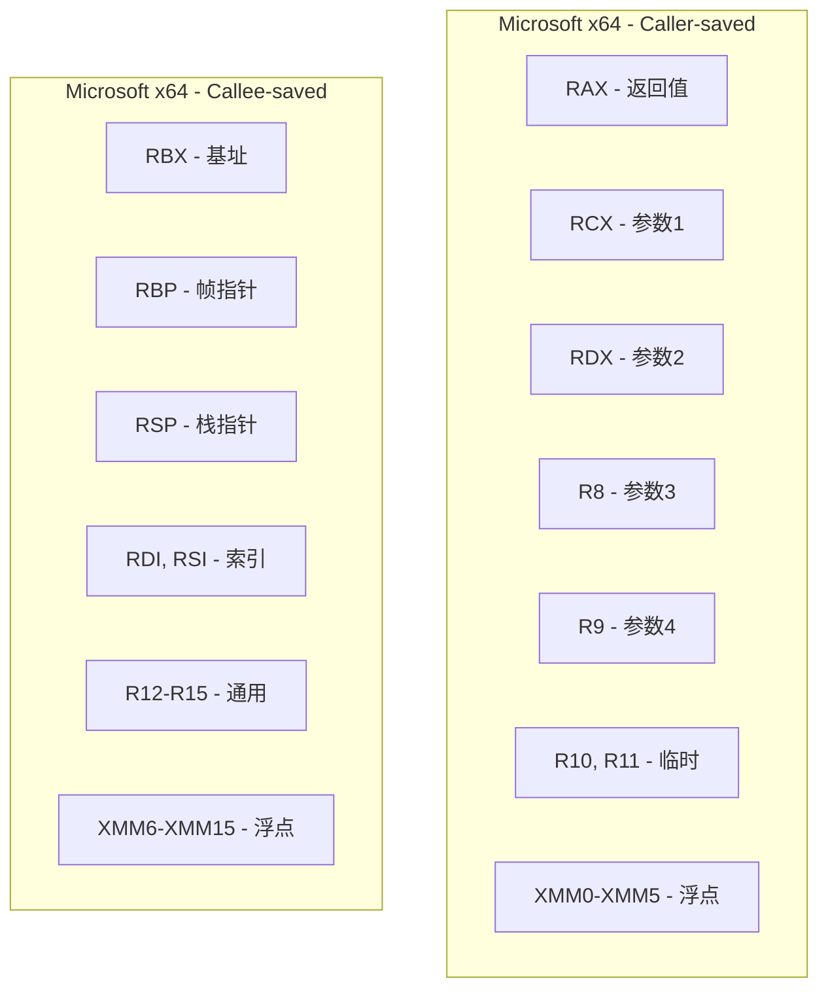

# x86/x64 寄存器参考

> x86和x64架构寄存器的完整参考，包含通用寄存器、SIMD寄存器、段寄存器、控制寄存器，以及不同调用约定下的寄存器分类

## 概述

x86/x64架构提供了丰富的寄存器集合，从最初的8个16位通用寄存器发展到现代的64位扩展寄存器和SIMD向量寄存器。理解这些寄存器的用途、命名规范和在不同调用约定下的分类，是编写高效汇编代码的基础。

### 寄存器演进历史

| 架构 | 年代 | 通用寄存器 | 位宽 | SIMD寄存器 |
|------|------|------------|------|------------|
| 8086 | 1978 | AX, BX, CX, DX, SI, DI, BP, SP | 16位 | 无 |
| 80386 | 1985 | EAX, EBX, ECX, EDX, ESI, EDI, EBP, ESP | 32位 | 无 |
| x86-64 | 2003 | RAX-RSP, R8-R15 | 64位 | XMM0-XMM15 |
| AVX | 2011 | 同上 | 64位 | YMM0-YMM15 |
| AVX-512 | 2016 | 同上 | 64位 | ZMM0-ZMM31 |

### 寄存器分类概览




---

## 通用寄存器（General-Purpose Registers）

### 寄存器命名规范

x64架构的通用寄存器支持多种访问宽度，每种宽度有不同的命名：

#### 传统寄存器（RAX, RBX, RCX, RDX, RSI, RDI, RBP, RSP）

| 64位 | 32位 | 16位 | 8位高 | 8位低 | 说明 |
|------|------|------|-------|-------|------|
| `RAX` | `EAX` | `AX` | `AH` | `AL` | 累加器（Accumulator） |
| `RBX` | `EBX` | `BX` | `BH` | `BL` | 基址（Base） |
| `RCX` | `ECX` | `CX` | `CH` | `CL` | 计数器（Counter） |
| `RDX` | `EDX` | `DX` | `DH` | `DL` | 数据（Data） |
| `RSI` | `ESI` | `SI` | - | `SIL` | 源索引（Source Index） |
| `RDI` | `EDI` | `DI` | - | `DIL` | 目标索引（Destination Index） |
| `RBP` | `EBP` | `BP` | - | `BPL` | 基址指针（Base Pointer） |
| `RSP` | `ESP` | `SP` | - | `SPL` | 栈指针（Stack Pointer） |

#### 扩展寄存器（R8-R15）

| 64位 | 32位 | 16位 | 8位低 | 说明 |
|------|------|------|-------|------|
| `R8` | `R8D` | `R8W` | `R8B` | 扩展寄存器8 |
| `R9` | `R9D` | `R9W` | `R9B` | 扩展寄存器9 |
| `R10` | `R10D` | `R10W` | `R10B` | 扩展寄存器10 |
| `R11` | `R11D` | `R11W` | `R11B` | 扩展寄存器11 |
| `R12` | `R12D` | `R12W` | `R12B` | 扩展寄存器12 |
| `R13` | `R13D` | `R13W` | `R13B` | 扩展寄存器13 |
| `R14` | `R14D` | `R14W` | `R14B` | 扩展寄存器14 |
| `R15` | `R15D` | `R15W` | `R15B` | 扩展寄存器15 |

### 寄存器位布局

```
64位寄存器 RAX 的位布局:

位:  63                              32 31              16 15     8 7      0
     ┌────────────────────────────────┬────────────────────┬────────┬────────┐
RAX: │         高32位（仅64位模式）    │       EAX高16位    │   AH   │   AL   │
     └────────────────────────────────┴────────────────────┴────────┴────────┘
     │◄─────────────────── RAX (64位) ──────────────────────────────────────►│
                                      │◄────────── EAX (32位) ──────────────►│
                                                           │◄─── AX (16位) ──►│
                                                           │◄ AH ►│◄── AL ──►│

扩展寄存器 R8 的位布局:

位:  63                              32 31              16 15              0
     ┌────────────────────────────────┬────────────────────┬────────────────┐
R8:  │         高32位（仅64位模式）    │       R8D高16位    │      R8W       │
     └────────────────────────────────┴────────────────────┴────────────────┘
     │◄─────────────────── R8 (64位) ───────────────────────────────────────►│
                                      │◄────────── R8D (32位) ──────────────►│
                                                           │◄── R8W (16位) ──►│
                                                                    │◄ R8B ──►│
```


### 32位写入的零扩展规则

**重要规则**：在x64模式下，写入32位寄存器（如EAX）会自动将高32位清零。

```nasm
; Intel/NASM 语法示例
mov     rax, 0xFFFFFFFFFFFFFFFF  ; RAX = 0xFFFFFFFFFFFFFFFF
mov     eax, 1                   ; RAX = 0x0000000000000001 (高32位被清零)

mov     rax, 0xFFFFFFFFFFFFFFFF  ; RAX = 0xFFFFFFFFFFFFFFFF
mov     ax, 1                    ; RAX = 0xFFFFFFFFFFFF0001 (只修改低16位)

mov     rax, 0xFFFFFFFFFFFFFFFF  ; RAX = 0xFFFFFFFFFFFFFFFF
mov     al, 1                    ; RAX = 0xFFFFFFFFFFFFFF01 (只修改低8位)
```

### 通用寄存器的传统用途

| 寄存器 | 传统用途 | 特殊指令关联 |
|--------|----------|--------------|
| `RAX` | 累加器、乘除法结果 | `MUL`, `DIV`, `IMUL`, `IDIV`, `CMPXCHG` |
| `RBX` | 基址寄存器 | `XLAT`, `CMPXCHG8B/16B` |
| `RCX` | 循环计数器 | `LOOP`, `REP`, `SHIFT/ROTATE` |
| `RDX` | I/O端口、乘除法高位 | `IN`, `OUT`, `MUL`, `DIV` |
| `RSI` | 字符串操作源地址 | `MOVS`, `CMPS`, `LODS` |
| `RDI` | 字符串操作目标地址 | `MOVS`, `CMPS`, `STOS`, `SCAS` |
| `RBP` | 栈帧基址指针 | 栈帧寻址 |
| `RSP` | 栈顶指针 | `PUSH`, `POP`, `CALL`, `RET` |


---

## 特殊用途寄存器

### 栈指针（RSP）

栈指针寄存器指向当前栈顶，是最重要的特殊用途寄存器之一。

| 特性 | 说明 |
|------|------|
| **用途** | 指向栈顶（最后压入的数据） |
| **增长方向** | 向低地址增长（PUSH减小RSP，POP增加RSP） |
| **对齐要求** | 函数调用前必须16字节对齐 |
| **保存规则** | 被调用者必须保持（调整后恢复） |

```nasm
; 栈操作示例
push    rax         ; RSP -= 8, [RSP] = RAX
pop     rbx         ; RBX = [RSP], RSP += 8

sub     rsp, 32     ; 分配32字节栈空间
add     rsp, 32     ; 释放32字节栈空间
```

### 帧指针（RBP）

帧指针用于建立稳定的栈帧引用点。

| 特性 | 说明 |
|------|------|
| **用途** | 指向当前栈帧的基址 |
| **优势** | 提供稳定的局部变量访问基址 |
| **可选性** | 现代编译器可省略以获得额外寄存器 |
| **调试** | 便于栈回溯和调试 |

```nasm
; 标准函数序言
push    rbp         ; 保存调用者的帧指针
mov     rbp, rsp    ; 建立新帧
sub     rsp, 32     ; 分配局部变量空间

; 访问局部变量和参数
mov     rax, [rbp - 8]   ; 局部变量
mov     rbx, [rbp + 16]  ; 栈参数

; 标准函数尾声
mov     rsp, rbp    ; 恢复栈指针
pop     rbp         ; 恢复帧指针
ret
```


### 指令指针（RIP）

指令指针寄存器指向下一条要执行的指令。

| 特性 | 说明 |
|------|------|
| **用途** | 指向下一条指令的地址 |
| **访问** | 不能直接读写，通过控制流指令间接修改 |
| **RIP相对寻址** | x64支持RIP相对寻址模式 |

```nasm
; RIP相对寻址（x64特有）
lea     rax, [rip + data]       ; 获取data的地址
mov     rbx, [rip + variable]   ; 读取变量

; 等效的NASM语法
lea     rax, [rel data]
mov     rbx, [rel variable]
```


---

## 标志寄存器（RFLAGS）

### RFLAGS寄存器结构

RFLAGS是64位标志寄存器，包含状态标志、控制标志和系统标志。

```
RFLAGS 寄存器位布局:

位:  63                              21 20 19 18 17 16    14 13 12 11 10  9  8  7  6    4    2  1  0
     ┌────────────────────────────────┬──┬──┬──┬──┬──┬────┬──┬──┬──┬──┬──┬──┬──┬──┬────┬────┬──┬──┐
     │           保留（0）             │ID│VP│VF│AC│VM│    │NT│IO│OF│DF│IF│TF│SF│ZF│    │PF  │  │CF│
     │                                │  │  │  │  │  │ RF │  │PL│  │  │  │  │  │  │ AF │    │1 │  │
     └────────────────────────────────┴──┴──┴──┴──┴──┴────┴──┴──┴──┴──┴──┴──┴──┴──┴────┴────┴──┴──┘
```

### 状态标志（Status Flags）

这些标志反映算术和逻辑运算的结果：

| 位 | 标志 | 名称 | 说明 |
|----|------|------|------|
| 0 | CF | 进位标志（Carry Flag） | 无符号运算溢出 |
| 2 | PF | 奇偶标志（Parity Flag） | 结果低8位中1的个数为偶数 |
| 4 | AF | 辅助进位标志（Auxiliary Carry） | BCD运算使用 |
| 6 | ZF | 零标志（Zero Flag） | 结果为零 |
| 7 | SF | 符号标志（Sign Flag） | 结果为负（最高位为1） |
| 11 | OF | 溢出标志（Overflow Flag） | 有符号运算溢出 |

### 控制标志（Control Flags）

| 位 | 标志 | 名称 | 说明 |
|----|------|------|------|
| 10 | DF | 方向标志（Direction Flag） | 字符串操作方向（0=递增，1=递减） |

### 系统标志（System Flags）

| 位 | 标志 | 名称 | 说明 |
|----|------|------|------|
| 8 | TF | 陷阱标志（Trap Flag） | 单步调试 |
| 9 | IF | 中断标志（Interrupt Flag） | 允许可屏蔽中断 |
| 12-13 | IOPL | I/O特权级 | I/O操作所需特权级 |
| 14 | NT | 嵌套任务标志 | 任务嵌套 |
| 16 | RF | 恢复标志（Resume Flag） | 调试断点控制 |
| 17 | VM | 虚拟8086模式 | 虚拟8086模式启用 |
| 18 | AC | 对齐检查 | 对齐检查启用 |
| 19 | VIF | 虚拟中断标志 | 虚拟中断 |
| 20 | VIP | 虚拟中断挂起 | 虚拟中断挂起 |
| 21 | ID | ID标志 | CPUID指令支持检测 |

### 条件码与标志关系

| 条件码 | 含义 | 测试的标志 |
|--------|------|------------|
| `E/Z` | 等于/零 | ZF = 1 |
| `NE/NZ` | 不等于/非零 | ZF = 0 |
| `A/NBE` | 高于（无符号） | CF = 0 且 ZF = 0 |
| `AE/NB/NC` | 高于等于（无符号） | CF = 0 |
| `B/NAE/C` | 低于（无符号） | CF = 1 |
| `BE/NA` | 低于等于（无符号） | CF = 1 或 ZF = 1 |
| `G/NLE` | 大于（有符号） | ZF = 0 且 SF = OF |
| `GE/NL` | 大于等于（有符号） | SF = OF |
| `L/NGE` | 小于（有符号） | SF ≠ OF |
| `LE/NG` | 小于等于（有符号） | ZF = 1 或 SF ≠ OF |
| `S` | 负数 | SF = 1 |
| `NS` | 非负数 | SF = 0 |
| `O` | 溢出 | OF = 1 |
| `NO` | 无溢出 | OF = 0 |
| `P/PE` | 奇偶（偶数） | PF = 1 |
| `NP/PO` | 非奇偶（奇数） | PF = 0 |


---

## SIMD寄存器

### SSE寄存器（XMM0-XMM15）

SSE（Streaming SIMD Extensions）引入了128位XMM寄存器。

| 寄存器 | 位宽 | 可容纳数据 |
|--------|------|------------|
| `XMM0-XMM15` | 128位 | 4×float, 2×double, 16×int8, 8×int16, 4×int32, 2×int64 |

```
XMM寄存器数据布局:

128位 XMM 寄存器:
┌────────────────────────────────────────────────────────────────────────────┐
│                              XMM0 (128位)                                  │
├────────────────┬────────────────┬────────────────┬────────────────────────┤
│   float[3]     │   float[2]     │   float[1]     │      float[0]          │
│   (96-127)     │   (64-95)      │   (32-63)      │      (0-31)            │
├────────────────┴────────────────┼────────────────┴────────────────────────┤
│         double[1]               │              double[0]                  │
│         (64-127)                │              (0-63)                     │
└─────────────────────────────────┴─────────────────────────────────────────┘
```

### AVX寄存器（YMM0-YMM15）

AVX（Advanced Vector Extensions）将寄存器扩展到256位。

| 寄存器 | 位宽 | 可容纳数据 |
|--------|------|------------|
| `YMM0-YMM15` | 256位 | 8×float, 4×double, 32×int8, 16×int16, 8×int32, 4×int64 |

```
YMM寄存器与XMM的关系:

256位 YMM 寄存器:
┌────────────────────────────────────────┬────────────────────────────────────────┐
│           YMM0 高128位                 │           YMM0 低128位 (= XMM0)        │
│           (128-255)                    │           (0-127)                      │
└────────────────────────────────────────┴────────────────────────────────────────┘
                                         │◄──────────── XMM0 ────────────────────►│
```

### AVX-512寄存器（ZMM0-ZMM31）

AVX-512将寄存器扩展到512位，并增加了寄存器数量。

| 寄存器 | 位宽 | 可容纳数据 |
|--------|------|------------|
| `ZMM0-ZMM31` | 512位 | 16×float, 8×double, 64×int8, 32×int16, 16×int32, 8×int64 |

```
ZMM寄存器与YMM/XMM的关系:

512位 ZMM 寄存器:
┌────────────────────────────────────────┬────────────────────────────────────────┐
│           ZMM0 高256位                 │           ZMM0 低256位 (= YMM0)        │
│           (256-511)                    │           (0-255)                      │
└────────────────────────────────────────┴────────────────────────────────────────┘
                                         │◄──────────── YMM0 ────────────────────►│
                                                                                   │
                                         ┌────────────────────┬────────────────────┤
                                         │   YMM0高128位      │  YMM0低128位(XMM0) │
                                         └────────────────────┴────────────────────┘
                                                              │◄────── XMM0 ──────►│
```

### AVX-512掩码寄存器（K0-K7）

AVX-512引入了8个掩码寄存器用于条件操作。

| 寄存器 | 位宽 | 用途 |
|--------|------|------|
| `K0` | 64位 | 特殊：不能用作写掩码（表示无掩码） |
| `K1-K7` | 64位 | 写掩码、条件执行 |

### SIMD寄存器完整列表

| 扩展 | 寄存器 | 数量 | 位宽 | 引入年份 |
|------|--------|------|------|----------|
| SSE | XMM0-XMM7 | 8 | 128位 | 1999 |
| SSE2 (x64) | XMM0-XMM15 | 16 | 128位 | 2003 |
| AVX | YMM0-YMM15 | 16 | 256位 | 2011 |
| AVX-512 | ZMM0-ZMM31 | 32 | 512位 | 2016 |
| AVX-512 | K0-K7 | 8 | 64位 | 2016 |


### SIMD寄存器使用示例

#### Intel/NASM 语法

```nasm
section .data
    align 16
    float_array: dd 1.0, 2.0, 3.0, 4.0
    
section .text
    global simd_example

simd_example:
    ; SSE: 加载4个单精度浮点数
    movaps  xmm0, [rel float_array]     ; 对齐加载
    movups  xmm1, [rdi]                 ; 非对齐加载
    
    ; SSE: 浮点运算
    addps   xmm0, xmm1                  ; 4个float并行加法
    mulps   xmm0, xmm1                  ; 4个float并行乘法
    
    ; AVX: 256位操作
    vmovaps ymm0, [rdi]                 ; 加载8个float
    vaddps  ymm0, ymm0, ymm1            ; 8个float并行加法
    
    ; AVX-512: 512位操作
    vmovaps zmm0, [rdi]                 ; 加载16个float
    vaddps  zmm0, zmm0, zmm1            ; 16个float并行加法
    
    ; 标量浮点操作
    movsd   xmm0, [rdi]                 ; 加载1个double
    addsd   xmm0, xmm1                  ; 1个double加法
    movss   xmm0, [rdi]                 ; 加载1个float
    addss   xmm0, xmm1                  ; 1个float加法
    
    ret
```

#### AT&T/GAS 语法

```gas
    .data
    .align 16
float_array:
    .float 1.0, 2.0, 3.0, 4.0
    
    .text
    .globl simd_example

simd_example:
    # SSE: 加载4个单精度浮点数
    movaps  float_array(%rip), %xmm0    # 对齐加载
    movups  (%rdi), %xmm1               # 非对齐加载
    
    # SSE: 浮点运算
    addps   %xmm1, %xmm0                # 4个float并行加法
    mulps   %xmm1, %xmm0                # 4个float并行乘法
    
    # AVX: 256位操作
    vmovaps (%rdi), %ymm0               # 加载8个float
    vaddps  %ymm1, %ymm0, %ymm0         # 8个float并行加法
    
    ret
```


---

## 段寄存器（Segment Registers）

### 段寄存器概述

x86架构包含6个16位段寄存器，在64位模式下大部分已不再用于分段，但仍有特殊用途。

| 寄存器 | 名称 | 64位模式用途 |
|--------|------|--------------|
| `CS` | 代码段（Code Segment） | 代码段选择子，包含特权级 |
| `DS` | 数据段（Data Segment） | 通常为0，不用于分段 |
| `ES` | 附加段（Extra Segment） | 通常为0，不用于分段 |
| `SS` | 栈段（Stack Segment） | 通常为0，不用于分段 |
| `FS` | 附加段F | 线程本地存储（TLS） |
| `GS` | 附加段G | 线程本地存储（TLS） |

### FS和GS的特殊用途

在64位模式下，FS和GS寄存器用于访问线程本地存储：

| 操作系统 | FS用途 | GS用途 |
|----------|--------|--------|
| **Linux用户态** | 未使用 | TLS（线程本地存储） |
| **Linux内核态** | 未使用 | CPU本地数据 |
| **Windows用户态** | TEB（线程环境块） | 未使用 |
| **Windows内核态** | KPCR（处理器控制区） | 未使用 |
| **macOS** | 未使用 | TLS |

```nasm
; Linux: 通过GS访问TLS
mov     rax, [gs:0x28]          ; 读取stack canary

; Windows: 通过GS访问TEB
mov     rax, [gs:0x30]          ; 获取TEB指针
mov     rbx, [gs:0x60]          ; 获取PEB指针
```


---

## x87 FPU和MMX寄存器

### x87浮点寄存器（ST0-ST7）

x87 FPU使用8个80位浮点寄存器，组织为栈结构。

| 寄存器 | 位宽 | 说明 |
|--------|------|------|
| `ST(0)-ST(7)` | 80位 | 扩展精度浮点数 |

```
x87 FPU 寄存器栈:

┌─────────────┐
│   ST(7)     │  ← 栈底
├─────────────┤
│   ST(6)     │
├─────────────┤
│   ST(5)     │
├─────────────┤
│   ST(4)     │
├─────────────┤
│   ST(3)     │
├─────────────┤
│   ST(2)     │
├─────────────┤
│   ST(1)     │
├─────────────┤
│   ST(0)     │  ← 栈顶（TOP指向）
└─────────────┘

注意：x87使用栈式操作，ST(0)始终是栈顶
```

### x87控制和状态寄存器

| 寄存器 | 用途 |
|--------|------|
| **控制字（FCW）** | 精度控制、舍入模式、异常掩码 |
| **状态字（FSW）** | 条件码、栈顶指针、异常标志 |
| **标签字（FTW）** | 寄存器状态（有效/零/特殊/空） |

### MMX寄存器（MM0-MM7）

MMX寄存器与x87 FPU寄存器共享物理存储。

| 寄存器 | 位宽 | 说明 |
|--------|------|------|
| `MM0-MM7` | 64位 | 与ST(0)-ST(7)的低64位重叠 |

```
MMX与x87寄存器的关系:

80位 x87 寄存器:
┌────────────────────────────────────────────────────────────────────────────┐
│                              ST(0) (80位)                                  │
├────────────────┬───────────────────────────────────────────────────────────┤
│   指数(15位)   │                    尾数 (64位) = MM0                      │
└────────────────┴───────────────────────────────────────────────────────────┘

警告：使用MMX后必须执行EMMS指令才能使用x87 FPU
```


---

## 调用约定中的寄存器分类

### System V AMD64 ABI（Linux/macOS/BSD）

#### Caller-saved（调用者保存/易失性）寄存器

函数调用后可能被修改，调用者需要保存。

| 类别 | 寄存器 | 用途 |
|------|--------|------|
| **参数寄存器** | RDI, RSI, RDX, RCX, R8, R9 | 整数/指针参数 |
| **返回值** | RAX, RDX | 整数返回值 |
| **临时寄存器** | R10, R11 | 可自由使用 |
| **浮点参数** | XMM0-XMM7 | 浮点参数 |
| **浮点返回值** | XMM0, XMM1 | 浮点返回值 |
| **浮点临时** | XMM8-XMM15 | 可自由使用 |

#### Callee-saved（被调用者保存/非易失性）寄存器

函数必须保持这些寄存器的值不变。

| 类别 | 寄存器 | 用途 |
|------|--------|------|
| **通用** | RBX | 基址寄存器 |
| **帧指针** | RBP | 栈帧基址 |
| **栈指针** | RSP | 栈顶指针 |
| **扩展** | R12, R13, R14, R15 | 通用被保存寄存器 |




### Microsoft x64 ABI（Windows）

#### Caller-saved（调用者保存/易失性）寄存器

| 类别 | 寄存器 | 用途 |
|------|--------|------|
| **参数寄存器** | RCX, RDX, R8, R9 | 整数/指针参数 |
| **返回值** | RAX | 整数返回值 |
| **临时寄存器** | R10, R11 | 可自由使用 |
| **浮点参数** | XMM0-XMM3 | 浮点参数（与整数共享位置） |
| **浮点返回值** | XMM0 | 浮点返回值 |
| **浮点临时** | XMM4, XMM5 | 可自由使用 |

#### Callee-saved（被调用者保存/非易失性）寄存器

| 类别 | 寄存器 | 用途 |
|------|--------|------|
| **通用** | RBX | 基址寄存器 |
| **帧指针** | RBP | 栈帧基址 |
| **栈指针** | RSP | 栈顶指针 |
| **索引** | RDI, RSI | **注意：与System V不同** |
| **扩展** | R12, R13, R14, R15 | 通用被保存寄存器 |
| **浮点** | XMM6-XMM15 | **注意：与System V不同** |



### 两种ABI的寄存器分类对比

| 寄存器 | System V AMD64 | Microsoft x64 | 差异说明 |
|--------|----------------|---------------|----------|
| `RAX` | Caller-saved（返回值） | Caller-saved（返回值） | 相同 |
| `RBX` | Callee-saved | Callee-saved | 相同 |
| `RCX` | Caller-saved（参数4） | Caller-saved（参数1） | 参数位置不同 |
| `RDX` | Caller-saved（参数3） | Caller-saved（参数2） | 参数位置不同 |
| `RSI` | Caller-saved（参数2） | **Callee-saved** | **重要差异** |
| `RDI` | Caller-saved（参数1） | **Callee-saved** | **重要差异** |
| `RBP` | Callee-saved | Callee-saved | 相同 |
| `RSP` | Callee-saved | Callee-saved | 相同 |
| `R8` | Caller-saved（参数5） | Caller-saved（参数3） | 参数位置不同 |
| `R9` | Caller-saved（参数6） | Caller-saved（参数4） | 参数位置不同 |
| `R10` | Caller-saved | Caller-saved | 相同 |
| `R11` | Caller-saved | Caller-saved | 相同 |
| `R12-R15` | Callee-saved | Callee-saved | 相同 |
| `XMM0-XMM5` | Caller-saved | Caller-saved | 相同 |
| `XMM6-XMM15` | Caller-saved | **Callee-saved** | **重要差异** |


---

## 参数传递寄存器详解

### System V AMD64参数寄存器

```
整数/指针参数传递顺序:

┌─────────────────────────────────────────────────────────────────────────────┐
│  参数1    参数2    参数3    参数4    参数5    参数6    参数7+              │
│   RDI     RSI      RDX      RCX      R8       R9      栈传递              │
└─────────────────────────────────────────────────────────────────────────────┘

浮点参数传递顺序（独立计数）:

┌─────────────────────────────────────────────────────────────────────────────┐
│  浮点1   浮点2   浮点3   浮点4   浮点5   浮点6   浮点7   浮点8   浮点9+    │
│  XMM0    XMM1    XMM2    XMM3    XMM4    XMM5    XMM6    XMM7    栈传递    │
└─────────────────────────────────────────────────────────────────────────────┘
```

### Microsoft x64参数寄存器

```
参数传递顺序（整数和浮点共享位置）:

┌─────────────────────────────────────────────────────────────────────────────┐
│  位置1        位置2        位置3        位置4        位置5+                │
│  RCX/XMM0    RDX/XMM1     R8/XMM2      R9/XMM3      栈传递                │
└─────────────────────────────────────────────────────────────────────────────┘

示例: void func(int a, double b, int c, float d)
      a → RCX (位置1，整数)
      b → XMM1 (位置2，浮点)
      c → R8 (位置3，整数)
      d → XMM3 (位置4，浮点)
```

### 返回值寄存器

| 返回类型 | System V AMD64 | Microsoft x64 |
|----------|----------------|---------------|
| 整数（≤64位） | RAX | RAX |
| 整数（128位） | RAX:RDX | 隐藏指针 |
| 浮点（float/double） | XMM0 | XMM0 |
| 浮点（复数） | XMM0:XMM1 | 隐藏指针 |
| 小结构体（≤16字节） | RAX:RDX 或 XMM0:XMM1 | RAX（≤8字节）或隐藏指针 |
| 大结构体 | 隐藏指针（RDI） | 隐藏指针（RCX） |


---

## 寄存器使用最佳实践

### 函数序言中的寄存器保存

#### System V AMD64

```nasm
; 需要使用RBX, R12, R13的函数
my_function:
    push    rbp
    mov     rbp, rsp
    push    rbx                 ; 保存callee-saved寄存器
    push    r12
    push    r13
    sub     rsp, 24             ; 分配局部变量（保持16字节对齐）
    
    ; 函数体...
    ; 可以自由使用 RBX, R12, R13
    
    add     rsp, 24
    pop     r13
    pop     r12
    pop     rbx
    pop     rbp
    ret
```

#### Microsoft x64

```nasm
; 需要使用RBX, RSI, RDI, XMM6的函数
my_function:
    push    rbp
    mov     rbp, rsp
    push    rbx                 ; 保存callee-saved寄存器
    push    rsi                 ; 注意：RSI在Windows中是callee-saved
    push    rdi                 ; 注意：RDI在Windows中是callee-saved
    sub     rsp, 48             ; 32字节Shadow Space + 16字节XMM保存
    movdqa  [rsp + 32], xmm6    ; 保存XMM6（callee-saved）
    
    ; 函数体...
    
    movdqa  xmm6, [rsp + 32]    ; 恢复XMM6
    add     rsp, 48
    pop     rdi
    pop     rsi
    pop     rbx
    pop     rbp
    ret
```

### 寄存器选择建议

| 场景 | 推荐寄存器 | 原因 |
|------|------------|------|
| 循环计数器 | RCX | 传统用途，LOOP指令使用 |
| 数组索引 | RSI, RDI | 字符串指令兼容 |
| 临时计算 | RAX, R10, R11 | caller-saved，无需保存 |
| 长期保存值 | RBX, R12-R15 | callee-saved，跨调用保持 |
| 浮点计算 | XMM0-XMM5 | caller-saved，无需保存 |
| 浮点长期值 | XMM6-XMM15（Windows） | callee-saved |


---

## 寄存器别名和子寄存器

### 通用寄存器别名表

```
完整的寄存器别名关系:

┌──────────────────────────────────────────────────────────────────────────────┐
│ 64位    │ 32位    │ 16位   │ 8位高  │ 8位低  │ 说明                         │
├──────────────────────────────────────────────────────────────────────────────┤
│ RAX     │ EAX     │ AX     │ AH     │ AL     │ 累加器                       │
│ RBX     │ EBX     │ BX     │ BH     │ BL     │ 基址                         │
│ RCX     │ ECX     │ CX     │ CH     │ CL     │ 计数器                       │
│ RDX     │ EDX     │ DX     │ DH     │ DL     │ 数据                         │
│ RSI     │ ESI     │ SI     │ -      │ SIL    │ 源索引                       │
│ RDI     │ EDI     │ DI     │ -      │ DIL    │ 目标索引                     │
│ RBP     │ EBP     │ BP     │ -      │ BPL    │ 基址指针                     │
│ RSP     │ ESP     │ SP     │ -      │ SPL    │ 栈指针                       │
│ R8      │ R8D     │ R8W    │ -      │ R8B    │ 扩展寄存器8                  │
│ R9      │ R9D     │ R9W    │ -      │ R9B    │ 扩展寄存器9                  │
│ R10     │ R10D    │ R10W   │ -      │ R10B   │ 扩展寄存器10                 │
│ R11     │ R11D    │ R11W   │ -      │ R11B   │ 扩展寄存器11                 │
│ R12     │ R12D    │ R12W   │ -      │ R12B   │ 扩展寄存器12                 │
│ R13     │ R13D    │ R13W   │ -      │ R13B   │ 扩展寄存器13                 │
│ R14     │ R14D    │ R14W   │ -      │ R14B   │ 扩展寄存器14                 │
│ R15     │ R15D    │ R15W   │ -      │ R15B   │ 扩展寄存器15                 │
└──────────────────────────────────────────────────────────────────────────────┘
```

### 不同汇编语法中的寄存器命名

| Intel/NASM | AT&T/GAS | Go Plan9 | 说明 |
|------------|----------|----------|------|
| `rax` | `%rax` | `AX` | 64位累加器 |
| `eax` | `%eax` | `AX`（32位上下文） | 32位累加器 |
| `ax` | `%ax` | - | 16位累加器 |
| `al` | `%al` | - | 8位低字节 |
| `ah` | `%ah` | - | 8位高字节 |
| `r8` | `%r8` | `R8` | 扩展寄存器 |
| `r8d` | `%r8d` | - | 32位部分 |
| `xmm0` | `%xmm0` | `X0` | SSE寄存器 |
| `ymm0` | `%ymm0` | `Y0` | AVX寄存器 |

### 子寄存器访问注意事项

```nasm
; 重要：32位写入会清零高32位
mov     rax, 0xFFFFFFFFFFFFFFFF
mov     eax, 0x12345678         ; RAX = 0x0000000012345678

; 16位和8位写入不影响其他位
mov     rax, 0xFFFFFFFFFFFFFFFF
mov     ax, 0x1234              ; RAX = 0xFFFFFFFFFFFF1234
mov     al, 0x56                ; RAX = 0xFFFFFFFFFFFF1256

; AH和AL可以独立访问
mov     ax, 0x1234              ; AH = 0x12, AL = 0x34
mov     ah, 0xAB                ; AX = 0xAB34
mov     al, 0xCD                ; AX = 0xABCD

; 注意：在64位模式下，使用AH/BH/CH/DH时不能同时使用SIL/DIL/BPL/SPL
; 以下指令在64位模式下非法：
; mov ah, sil                   ; 错误！
```


---

## 寄存器快速参考表

### 通用寄存器速查

| 寄存器 | System V用途 | Microsoft用途 | 保存规则(SysV) | 保存规则(MS) |
|--------|--------------|---------------|----------------|--------------|
| RAX | 返回值 | 返回值 | Caller | Caller |
| RBX | 通用 | 通用 | Callee | Callee |
| RCX | 参数4 | 参数1 | Caller | Caller |
| RDX | 参数3/返回值高位 | 参数2 | Caller | Caller |
| RSI | 参数2 | 通用 | Caller | **Callee** |
| RDI | 参数1 | 通用 | Caller | **Callee** |
| RBP | 帧指针 | 帧指针 | Callee | Callee |
| RSP | 栈指针 | 栈指针 | Callee | Callee |
| R8 | 参数5 | 参数3 | Caller | Caller |
| R9 | 参数6 | 参数4 | Caller | Caller |
| R10 | 临时 | 临时 | Caller | Caller |
| R11 | 临时 | 临时 | Caller | Caller |
| R12 | 通用 | 通用 | Callee | Callee |
| R13 | 通用 | 通用 | Callee | Callee |
| R14 | 通用 | 通用 | Callee | Callee |
| R15 | 通用 | 通用 | Callee | Callee |

### SIMD寄存器速查

| 寄存器 | System V用途 | Microsoft用途 | 保存规则(SysV) | 保存规则(MS) |
|--------|--------------|---------------|----------------|--------------|
| XMM0 | 浮点参数1/返回值 | 浮点参数1/返回值 | Caller | Caller |
| XMM1 | 浮点参数2/返回值 | 浮点参数2 | Caller | Caller |
| XMM2 | 浮点参数3 | 浮点参数3 | Caller | Caller |
| XMM3 | 浮点参数4 | 浮点参数4 | Caller | Caller |
| XMM4 | 浮点参数5 | 临时 | Caller | Caller |
| XMM5 | 浮点参数6 | 临时 | Caller | Caller |
| XMM6 | 浮点参数7 | 通用 | Caller | **Callee** |
| XMM7 | 浮点参数8 | 通用 | Caller | **Callee** |
| XMM8-15 | 临时 | 通用 | Caller | **Callee** |


---

## 代码示例

### 示例1：寄存器保存和恢复

#### Intel/NASM 语法（System V ABI）

```nasm
; 使用多个callee-saved寄存器的函数
; int64_t compute(int64_t* data, size_t len)
section .text
    global compute

compute:
    ; 函数序言 - 保存callee-saved寄存器
    push    rbp
    mov     rbp, rsp
    push    rbx                 ; 保存RBX
    push    r12                 ; 保存R12
    push    r13                 ; 保存R13
    push    r14                 ; 保存R14
    
    ; 参数: RDI = data, RSI = len
    mov     rbx, rdi            ; RBX = data指针
    mov     r12, rsi            ; R12 = 长度
    xor     r13, r13            ; R13 = 索引
    xor     r14, r14            ; R14 = 累加器
    
.loop:
    cmp     r13, r12
    jge     .done
    
    add     r14, [rbx + r13*8]  ; 累加数组元素
    inc     r13
    jmp     .loop
    
.done:
    mov     rax, r14            ; 返回累加结果
    
    ; 函数尾声 - 恢复callee-saved寄存器
    pop     r14
    pop     r13
    pop     r12
    pop     rbx
    pop     rbp
    ret
```

#### Intel/NASM 语法（Microsoft x64 ABI）

```nasm
; Windows x64版本 - 注意RSI/RDI也是callee-saved
; int64_t compute(int64_t* data, size_t len)
section .text
    global compute

compute:
    ; 函数序言
    push    rbp
    mov     rbp, rsp
    push    rbx
    push    rsi                 ; Windows: RSI是callee-saved
    push    rdi                 ; Windows: RDI是callee-saved
    push    r12
    sub     rsp, 32             ; Shadow Space
    
    ; 参数: RCX = data, RDX = len
    mov     rbx, rcx            ; RBX = data指针
    mov     r12, rdx            ; R12 = 长度
    xor     rsi, rsi            ; RSI = 索引
    xor     rdi, rdi            ; RDI = 累加器
    
.loop:
    cmp     rsi, r12
    jge     .done
    
    add     rdi, [rbx + rsi*8]
    inc     rsi
    jmp     .loop
    
.done:
    mov     rax, rdi
    
    ; 函数尾声
    add     rsp, 32
    pop     r12
    pop     rdi
    pop     rsi
    pop     rbx
    pop     rbp
    ret
```

### 示例2：SIMD寄存器使用

```nasm
; 向量点积计算（使用SSE）
; double dot_product(double* a, double* b, size_t n)
section .text
    global dot_product

dot_product:
    ; System V: RDI=a, RSI=b, RDX=n
    push    rbp
    mov     rbp, rsp
    
    xorpd   xmm0, xmm0          ; 累加器清零
    
    test    rdx, rdx
    jz      .done
    
.loop:
    movsd   xmm1, [rdi]         ; 加载a[i]
    mulsd   xmm1, [rsi]         ; 乘以b[i]
    addsd   xmm0, xmm1          ; 累加
    
    add     rdi, 8
    add     rsi, 8
    dec     rdx
    jnz     .loop
    
.done:
    ; 返回值在XMM0中
    pop     rbp
    ret
```

### 示例3：混合整数和浮点参数

```nasm
; 混合参数函数
; double mixed_calc(int64_t n, double x, int64_t m, double y)
; System V: RDI=n, XMM0=x, RSI=m, XMM1=y
; 计算: n * x + m * y
section .text
    global mixed_calc

mixed_calc:
    ; 将整数转换为浮点
    cvtsi2sd xmm2, rdi          ; xmm2 = (double)n
    cvtsi2sd xmm3, rsi          ; xmm3 = (double)m
    
    ; 计算 n * x
    mulsd   xmm2, xmm0          ; xmm2 = n * x
    
    ; 计算 m * y
    mulsd   xmm3, xmm1          ; xmm3 = m * y
    
    ; 相加
    addsd   xmm2, xmm3          ; xmm2 = n*x + m*y
    
    ; 返回结果
    movsd   xmm0, xmm2
    ret
```


---

## 参考资料

### 官方规范文档

- [System V AMD64 ABI](https://gitlab.com/x86-psABIs/x86-64-ABI) - Unix-like系统的x64 ABI规范
- [Microsoft x64 Calling Convention](https://docs.microsoft.com/en-us/cpp/build/x64-calling-convention) - Windows x64调用约定
- [Intel® 64 and IA-32 Architectures Software Developer Manuals](https://www.intel.com/content/www/us/en/developer/articles/technical/intel-sdm.html) - Intel官方架构手册

### 相关章节

- [System V AMD64 ABI详解](x64-sysv.md) - 完整的System V调用约定说明
- [Microsoft x64调用约定详解](x64-microsoft.md) - 完整的Windows x64调用约定说明
- [x86调用约定](x86-conventions.md) - 32位x86调用约定说明

### 扩展阅读

- [AMD64 Architecture Programmer's Manual](https://developer.amd.com/resources/developer-guides-manuals/) - AMD官方架构手册
- [Agner Fog's Optimization Manuals](https://www.agner.org/optimize/) - 详细的x86/x64优化指南
