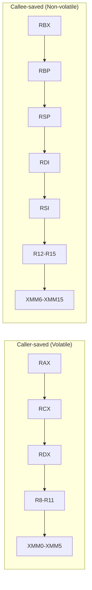
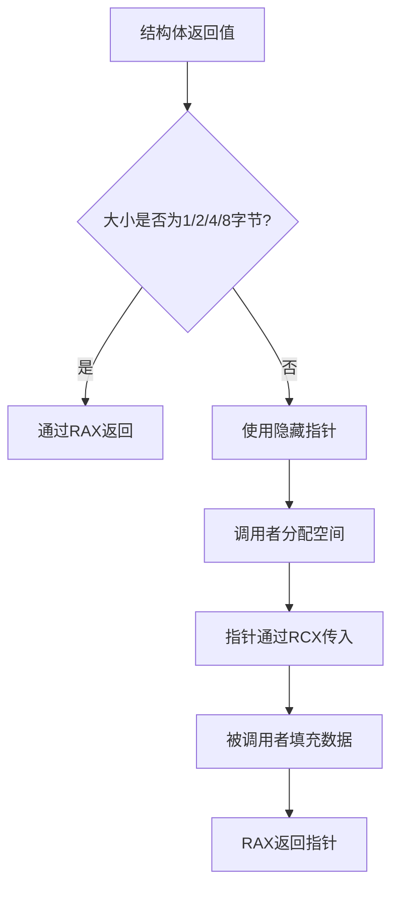
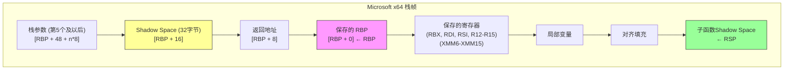

# Microsoft x64 调用约定详解

> Windows x64平台使用的调用约定完整规范，包含参数寄存器、Shadow Space、返回值、栈对齐和寄存器保存规则

## 概述

Microsoft x64调用约定（也称为Windows x64 ABI或x64 fastcall）是Windows操作系统在x86-64架构上使用的标准调用约定。该约定由Microsoft设计，与Unix-like系统使用的System V AMD64 ABI有显著差异。

### 适用平台

| 操作系统 | 使用Microsoft x64 ABI | 备注 |
|----------|----------------------|------|
| Windows 10/11 | ✓ | 原生支持 |
| Windows Server | ✓ | 所有x64版本 |
| Windows 7/8/8.1 | ✓ | x64版本 |
| Xbox (x64) | ✓ | 游戏开发 |
| UEFI | ✓ | 固件开发 |
| Linux | ✗ | 使用System V ABI |
| macOS | ✗ | 使用System V ABI |

### 核心特性概览

| 特性 | 规范 |
|------|------|
| **整数参数寄存器** | RCX, RDX, R8, R9（4个） |
| **浮点参数寄存器** | XMM0-XMM3（4个） |
| **整数返回值** | RAX |
| **浮点返回值** | XMM0 |
| **栈对齐** | 16字节（CALL前） |
| **Shadow Space** | 32字节（必须分配） |
| **Red Zone** | 无 |
| **栈清理** | 调用者（Caller） |
| **可变参数** | 支持（整数寄存器传递） |


### 与System V AMD64 ABI的主要差异

| 特性 | Microsoft x64 | System V AMD64 |
|------|---------------|----------------|
| 整数参数寄存器 | RCX, RDX, R8, R9 | RDI, RSI, RDX, RCX, R8, R9 |
| 寄存器参数数量 | 4个 | 6个 |
| 浮点参数寄存器 | XMM0-XMM3 | XMM0-XMM7 |
| Shadow Space | 32字节（必须） | 无 |
| Red Zone | 无 | 128字节 |
| 参数位置共享 | 整数/浮点共享位置 | 整数/浮点独立计数 |
| XMM寄存器保存 | XMM6-XMM15为callee-saved | 全部为caller-saved |


---

## 寄存器分类

### 调用者保存寄存器（Caller-saved / Volatile）

这些寄存器在函数调用后可能被修改，调用者如需保留其值必须自行保存。

| 寄存器 | 用途 | 说明 |
|--------|------|------|
| `RAX` | 返回值 / 临时 | 整数返回值 |
| `RCX` | 第1个整数参数 | 也用作循环计数器 |
| `RDX` | 第2个整数参数 | 数据寄存器 |
| `R8` | 第3个整数参数 | 扩展寄存器 |
| `R9` | 第4个整数参数 | 扩展寄存器 |
| `R10` | 临时 | 可自由使用 |
| `R11` | 临时 | 可自由使用 |
| `XMM0` | 第1个浮点参数/返回值 | 浮点返回值 |
| `XMM1` | 第2个浮点参数 | SSE寄存器 |
| `XMM2` | 第3个浮点参数 | SSE寄存器 |
| `XMM3` | 第4个浮点参数 | SSE寄存器 |
| `XMM4` | 临时 | SSE寄存器 |
| `XMM5` | 临时 | SSE寄存器 |

### 被调用者保存寄存器（Callee-saved / Non-volatile）

这些寄存器在函数调用后必须保持原值，被调用函数如需使用必须先保存再恢复。

| 寄存器 | 用途 | 说明 |
|--------|------|------|
| `RBX` | 基址 | 通用被保存寄存器 |
| `RBP` | 帧指针 | 可选的栈帧基址 |
| `RSP` | 栈指针 | 必须保持（调整后恢复） |
| `RDI` | 通用 | **注意：与System V不同** |
| `RSI` | 通用 | **注意：与System V不同** |
| `R12` | 通用 | 被保存寄存器 |
| `R13` | 通用 | 被保存寄存器 |
| `R14` | 通用 | 被保存寄存器 |
| `R15` | 通用 | 被保存寄存器 |
| `XMM6-XMM15` | SIMD | **注意：与System V不同** |


### 寄存器分类图示



### 重要差异说明

Microsoft x64与System V ABI在寄存器保存规则上有两个关键差异：

1. **RDI和RSI**：在Microsoft x64中是callee-saved，而在System V中是caller-saved（用于参数传递）
2. **XMM6-XMM15**：在Microsoft x64中是callee-saved，而在System V中全部XMM寄存器都是caller-saved


---

## 整数参数传递

### 参数寄存器顺序

Microsoft x64使用4个寄存器传递整数和指针参数，按以下顺序：

| 参数位置 | 寄存器 | 说明 |
|----------|--------|------|
| 第1个参数 | `RCX` | 计数寄存器 |
| 第2个参数 | `RDX` | 数据寄存器 |
| 第3个参数 | `R8` | 扩展寄存器 |
| 第4个参数 | `R9` | 扩展寄存器 |
| 第5个及以后 | 栈 | 通过Shadow Space之后的栈空间 |

### 参数传递规则

1. **整数和指针类型**：使用RCX、RDX、R8、R9
2. **小于64位的整数**：零扩展或符号扩展到64位
3. **超过4个参数**：第5个及以后的参数通过栈传递
4. **栈参数位置**：从Shadow Space之后开始（RSP + 40）
5. **参数位置共享**：整数和浮点参数共享同一位置（见下文）

### 参数位置共享机制

**关键概念**：在Microsoft x64中，整数参数和浮点参数共享相同的参数位置。

```
参数位置共享示例:

函数: void func(int a, double b, int c, float d)

参数分配:
┌─────────────────────────────────────────────────────────┐
│ 位置1: a (int)    → RCX                                │
│ 位置2: b (double) → XMM1 (不是XMM0！)                  │
│ 位置3: c (int)    → R8                                 │
│ 位置4: d (float)  → XMM3 (不是XMM2！)                  │
└─────────────────────────────────────────────────────────┘

注意：浮点参数使用与其位置对应的XMM寄存器
- 位置1 → XMM0
- 位置2 → XMM1
- 位置3 → XMM2
- 位置4 → XMM3
```


### 参数传递示例

```
函数: int func(int a, int b, int c, int d, int e, int f)

寄存器分配:
┌─────────────────────────────────────────────────────────┐
│ 参数 a → RCX    参数 b → RDX                           │
│ 参数 c → R8     参数 d → R9                            │
└─────────────────────────────────────────────────────────┘

栈布局（CALL之后）:
高地址
┌─────────────────┐
│    参数 f       │  [RSP + 48]
├─────────────────┤
│    参数 e       │  [RSP + 40]
├─────────────────┤
│  Shadow Space   │  [RSP + 32]  (R9的home)
├─────────────────┤
│  Shadow Space   │  [RSP + 24]  (R8的home)
├─────────────────┤
│  Shadow Space   │  [RSP + 16]  (RDX的home)
├─────────────────┤
│  Shadow Space   │  [RSP + 8]   (RCX的home)
├─────────────────┤
│   返回地址      │  [RSP + 0]   ← RSP
└─────────────────┘
低地址
```

### 代码示例

#### Intel/NASM 语法

```nasm
; 函数: int64_t sum_six(int64_t a, b, c, d, e, f)
; 参数: RCX=a, RDX=b, R8=c, R9=d, [rsp+40]=e, [rsp+48]=f
section .text
    global sum_six

sum_six:
    ; 寄存器参数
    mov     rax, rcx            ; rax = a
    add     rax, rdx            ; rax += b
    add     rax, r8             ; rax += c
    add     rax, r9             ; rax += d
    ; 栈参数（跳过Shadow Space和返回地址）
    add     rax, [rsp + 40]     ; rax += e
    add     rax, [rsp + 48]     ; rax += f
    ret

; 调用示例
caller_example:
    push    rbp
    mov     rbp, rsp
    
    ; 分配Shadow Space + 栈参数空间
    ; Shadow Space: 32字节
    ; 栈参数: 2个 × 8字节 = 16字节
    ; 总计: 48字节
    ; push rbp后RSP已是16字节对齐，48 % 16 == 0，无需额外对齐
    sub     rsp, 48             ; 48字节（已对齐到16字节）
    
    ; 调用 sum_six(1, 2, 3, 4, 5, 6)
    mov     qword [rsp + 40], 6 ; 参数 f
    mov     qword [rsp + 32], 5 ; 参数 e
    mov     r9, 4               ; 参数 d
    mov     r8, 3               ; 参数 c
    mov     rdx, 2              ; 参数 b
    mov     rcx, 1              ; 参数 a
    call    sum_six
    
    ; 结果在 RAX 中
    add     rsp, 48
    pop     rbp
    ret
```


#### AT&T/GAS 语法

```gas
# 函数: int64_t sum_six(int64_t a, b, c, d, e, f)
    .text
    .globl sum_six

sum_six:
    # 寄存器参数
    movq    %rcx, %rax          # rax = a
    addq    %rdx, %rax          # rax += b
    addq    %r8, %rax           # rax += c
    addq    %r9, %rax           # rax += d
    # 栈参数
    addq    40(%rsp), %rax      # rax += e
    addq    48(%rsp), %rax      # rax += f
    ret

# 调用示例
    .globl caller_example
caller_example:
    pushq   %rbp
    movq    %rsp, %rbp
    
    # 分配Shadow Space + 栈参数 + 对齐
    subq    $56, %rsp
    
    # 调用 sum_six(1, 2, 3, 4, 5, 6)
    movq    $6, 40(%rsp)        # 参数 f
    movq    $5, 32(%rsp)        # 参数 e
    movq    $4, %r9             # 参数 d
    movq    $3, %r8             # 参数 c
    movq    $2, %rdx            # 参数 b
    movq    $1, %rcx            # 参数 a
    call    sum_six
    
    addq    $56, %rsp
    popq    %rbp
    ret
```

#### Go Plan9 语法

```asm
#include "textflag.h"

// func SumSix(a, b, c, d, e, f int64) int64
// 注意：Go使用自己的调用约定，不是Microsoft x64
// 这里展示的是Go 1.17+的寄存器调用约定
TEXT ·SumSix(SB), NOSPLIT, $0-56
    MOVQ    a+0(FP), AX         // AX = a
    ADDQ    b+8(FP), AX         // AX += b
    ADDQ    c+16(FP), AX        // AX += c
    ADDQ    d+24(FP), AX        // AX += d
    ADDQ    e+32(FP), AX        // AX += e
    ADDQ    f+40(FP), AX        // AX += f
    MOVQ    AX, ret+48(FP)
    RET
```


---

## Shadow Space（影子空间）

### 什么是Shadow Space

Shadow Space（也称为Home Space或Register Parameter Area）是Microsoft x64调用约定的核心特性：**调用者必须在栈上为前4个寄存器参数预留32字节的空间**，即使这些参数通过寄存器传递。

```
Shadow Space 栈布局:

高地址
┌─────────────────────────────────────────┐
│           调用者的栈帧                   │
├─────────────────────────────────────────┤
│           第5个及以后的参数              │  [RSP + 40 + n*8]
├─────────────────────────────────────────┤
│           R9的Home Space                │  [RSP + 32]
├─────────────────────────────────────────┤
│           R8的Home Space                │  [RSP + 24]
├─────────────────────────────────────────┤
│           RDX的Home Space               │  [RSP + 16]
├─────────────────────────────────────────┤
│           RCX的Home Space               │  [RSP + 8]
├─────────────────────────────────────────┤
│           返回地址                       │  [RSP + 0]  ← RSP
└─────────────────────────────────────────┘
低地址
```


### Shadow Space的用途

1. **调试支持**：被调用函数可以将寄存器参数保存到Shadow Space，便于调试器检查
2. **可变参数函数**：va_list实现需要将所有参数放在连续的栈空间
3. **简化编译器实现**：统一的参数访问方式
4. **寄存器溢出**：被调用函数可以使用Shadow Space保存寄存器参数

### Shadow Space使用规则

| 规则 | 说明 |
|------|------|
| **必须分配** | 调用者必须分配32字节，即使函数没有参数 |
| **调用者分配** | 由调用者在CALL之前分配 |
| **被调用者可用** | 被调用函数可以自由使用这32字节 |
| **不初始化** | 调用者不需要初始化Shadow Space |
| **位置固定** | 紧邻返回地址之上 |

### Shadow Space代码示例

#### Intel/NASM 语法

```nasm
; 被调用函数：使用Shadow Space保存参数
; int64_t save_and_compute(int64_t a, int64_t b, int64_t c, int64_t d)
section .text
    global save_and_compute

save_and_compute:
    ; 将寄存器参数保存到Shadow Space
    mov     [rsp + 8], rcx      ; 保存 a
    mov     [rsp + 16], rdx     ; 保存 b
    mov     [rsp + 24], r8      ; 保存 c
    mov     [rsp + 32], r9      ; 保存 d
    
    ; 现在可以自由使用RCX, RDX, R8, R9
    ; 进行一些计算...
    mov     rax, [rsp + 8]      ; 从Shadow Space读取 a
    add     rax, [rsp + 16]     ; 加上 b
    add     rax, [rsp + 24]     ; 加上 c
    add     rax, [rsp + 32]     ; 加上 d
    
    ret

; 调用者：正确分配Shadow Space
    global caller_with_shadow

caller_with_shadow:
    push    rbp
    mov     rbp, rsp
    
    ; 分配Shadow Space（32字节）+ 对齐
    ; push rbp后RSP是16字节对齐的
    ; 需要分配32字节Shadow Space
    ; 32 % 16 == 0，所以不需要额外对齐
    sub     rsp, 32
    
    ; 调用 save_and_compute(10, 20, 30, 40)
    mov     r9, 40              ; 参数 d
    mov     r8, 30              ; 参数 c
    mov     rdx, 20             ; 参数 b
    mov     rcx, 10             ; 参数 a
    call    save_and_compute
    
    ; 清理Shadow Space
    add     rsp, 32
    
    pop     rbp
    ret

; 即使无参数函数也需要Shadow Space
    global call_no_params

call_no_params:
    push    rbp
    mov     rbp, rsp
    sub     rsp, 32             ; 仍然需要32字节Shadow Space
    
    call    some_function_no_params
    
    add     rsp, 32
    pop     rbp
    ret
```


#### AT&T/GAS 语法

```gas
# 被调用函数：使用Shadow Space
    .text
    .globl save_and_compute

save_and_compute:
    # 保存参数到Shadow Space
    movq    %rcx, 8(%rsp)       # 保存 a
    movq    %rdx, 16(%rsp)      # 保存 b
    movq    %r8, 24(%rsp)       # 保存 c
    movq    %r9, 32(%rsp)       # 保存 d
    
    # 计算
    movq    8(%rsp), %rax
    addq    16(%rsp), %rax
    addq    24(%rsp), %rax
    addq    32(%rsp), %rax
    
    ret

# 调用者
    .globl caller_with_shadow

caller_with_shadow:
    pushq   %rbp
    movq    %rsp, %rbp
    subq    $32, %rsp           # Shadow Space
    
    movq    $40, %r9
    movq    $30, %r8
    movq    $20, %rdx
    movq    $10, %rcx
    call    save_and_compute
    
    addq    $32, %rsp
    popq    %rbp
    ret
```

### Shadow Space与System V Red Zone对比

| 特性 | Microsoft Shadow Space | System V Red Zone |
|------|------------------------|-------------------|
| 大小 | 32字节 | 128字节 |
| 位置 | RSP之上（高地址） | RSP之下（低地址） |
| 分配责任 | 调用者 | 无需分配 |
| 是否必须 | 是 | 否（可选使用） |
| 用途 | 参数保存、调试 | 叶子函数临时存储 |
| 信号安全 | 是 | 是 |
| 内核代码 | 可用 | 通常禁用 |


---

## 浮点参数传递

### 浮点参数寄存器

Microsoft x64使用4个XMM寄存器传递浮点参数：

| 参数位置 | 寄存器 | 说明 |
|----------|--------|------|
| 第1个浮点参数 | `XMM0` | 与整数位置1共享 |
| 第2个浮点参数 | `XMM1` | 与整数位置2共享 |
| 第3个浮点参数 | `XMM2` | 与整数位置3共享 |
| 第4个浮点参数 | `XMM3` | 与整数位置4共享 |
| 第5个及以后 | 栈 | 通过栈传递 |

### 浮点参数传递规则

1. **float和double**：使用XMM0-XMM3的低32/64位
2. **__m128类型**：使用完整的XMM寄存器
3. **位置共享**：浮点参数使用与其位置对应的XMM寄存器
4. **超过4个参数**：通过栈传递

### 混合参数示例

```
函数: double mixed(int a, double b, int c, double d)

参数分配（位置共享）:
┌─────────────────────────────────────────────────────────┐
│ 位置1: a (int)    → RCX                                │
│ 位置2: b (double) → XMM1                               │
│ 位置3: c (int)    → R8                                 │
│ 位置4: d (double) → XMM3                               │
└─────────────────────────────────────────────────────────┘

注意：XMM0和XMM2未使用，因为位置1和3是整数参数
```


### 代码示例

#### Intel/NASM 语法

```nasm
; 函数: double sum_floats(double a, double b, double c, double d)
; 参数: XMM0=a, XMM1=b, XMM2=c, XMM3=d
section .text
    global sum_floats

sum_floats:
    ; XMM0 = a
    addsd   xmm0, xmm1          ; xmm0 = a + b
    addsd   xmm0, xmm2          ; xmm0 = a + b + c
    addsd   xmm0, xmm3          ; xmm0 = a + b + c + d
    ; 返回值在 XMM0 中
    ret

; 混合整数和浮点参数
; double mixed_params(int64_t n, double x, int64_t m, double y)
; 参数: RCX=n, XMM1=x, R8=m, XMM3=y
    global mixed_params

mixed_params:
    ; 将整数转换为浮点
    cvtsi2sd xmm0, rcx          ; xmm0 = (double)n
    cvtsi2sd xmm2, r8           ; xmm2 = (double)m
    
    ; 计算 n * x + m * y
    mulsd   xmm0, xmm1          ; xmm0 = n * x
    mulsd   xmm2, xmm3          ; xmm2 = m * y
    addsd   xmm0, xmm2          ; xmm0 = n*x + m*y
    
    ret

; 调用浮点函数示例
section .data
    val_a dq 1.5
    val_b dq 2.5
    val_c dq 3.5
    val_d dq 4.5

section .text
    global call_float_example

call_float_example:
    push    rbp
    mov     rbp, rsp
    sub     rsp, 32             ; Shadow Space
    
    ; 调用 sum_floats(1.5, 2.5, 3.5, 4.5)
    movsd   xmm0, [rel val_a]   ; 参数 a
    movsd   xmm1, [rel val_b]   ; 参数 b
    movsd   xmm2, [rel val_c]   ; 参数 c
    movsd   xmm3, [rel val_d]   ; 参数 d
    call    sum_floats
    ; 结果在 XMM0 中
    
    add     rsp, 32
    pop     rbp
    ret
```

#### AT&T/GAS 语法

```gas
# 函数: double sum_floats(double a, double b, double c, double d)
    .text
    .globl sum_floats

sum_floats:
    # xmm0 = a
    addsd   %xmm1, %xmm0        # xmm0 = a + b
    addsd   %xmm2, %xmm0        # xmm0 = a + b + c
    addsd   %xmm3, %xmm0        # xmm0 = a + b + c + d
    ret

# 混合整数和浮点参数
# double mixed_params(int64_t n, double x, int64_t m, double y)
    .globl mixed_params

mixed_params:
    cvtsi2sdq %rcx, %xmm0       # xmm0 = (double)n
    cvtsi2sdq %r8, %xmm2        # xmm2 = (double)m
    
    mulsd   %xmm1, %xmm0        # xmm0 = n * x
    mulsd   %xmm3, %xmm2        # xmm2 = m * y
    addsd   %xmm2, %xmm0        # xmm0 = n*x + m*y
    
    ret
```

### 单精度浮点（float）

```nasm
; float add_floats(float a, float b, float c, float d)
; 参数: XMM0=a (低32位), XMM1=b, XMM2=c, XMM3=d
add_floats_single:
    addss   xmm0, xmm1          ; 单精度加法
    addss   xmm0, xmm2
    addss   xmm0, xmm3
    ret                         ; 返回值在 XMM0 低32位
```


---

## 返回值规则

### 整数返回值

| 返回类型 | 寄存器 | 说明 |
|----------|--------|------|
| 8位整数 | `AL` | 零扩展到RAX |
| 16位整数 | `AX` | 零扩展到RAX |
| 32位整数 | `EAX` | 零扩展到RAX |
| 64位整数 | `RAX` | 完整64位 |
| 指针 | `RAX` | 64位地址 |
| 128位整数 | 隐藏指针 | 通过RCX传入的指针返回 |

### 浮点返回值

| 返回类型 | 寄存器 | 说明 |
|----------|--------|------|
| float | `XMM0` | 低32位 |
| double | `XMM0` | 低64位 |
| __m128 | `XMM0` | 完整128位 |
| __m256 | 隐藏指针 | 通过指针返回 |
| __m512 | 隐藏指针 | 通过指针返回 |

### 结构体返回值

Microsoft x64对结构体返回值的处理规则：

| 结构体大小 | 返回方式 | 说明 |
|------------|----------|------|
| 1, 2, 4, 8字节 | RAX | 直接在寄存器中返回 |
| 其他大小 | 隐藏指针 | 调用者分配空间，通过RCX传入指针 |

**重要**：与System V不同，Microsoft x64不会将小型结构体拆分到多个寄存器。只有1、2、4、8字节的结构体才能通过RAX返回。

### 返回值示例

#### Intel/NASM 语法

```nasm
; 返回64位整数
; int64_t get_value(void)
get_value:
    mov     rax, 0x123456789ABCDEF0
    ret

; 返回double
; double get_pi(void)
section .data
    pi_value dq 3.14159265358979

section .text
get_pi:
    movsd   xmm0, [rel pi_value]
    ret

; 返回小型结构体（8字节以内）
; struct Point { int32_t x, y; };  // 8字节
; Point get_point(void)
get_point:
    ; 将两个32位值打包到RAX
    mov     eax, 100            ; x = 100
    shl     rax, 32
    or      eax, 200            ; y = 200 (实际上是 x=200, y=100 取决于字节序)
    ; 或者更清晰的方式：
    mov     eax, 100            ; x
    mov     edx, 200            ; y
    shl     rdx, 32
    or      rax, rdx
    ret

; 返回大型结构体（通过隐藏指针）
; struct BigStruct { int64_t data[4]; };  // 32字节
; BigStruct get_big_struct(void)
; 隐藏指针在 RCX 中传入
get_big_struct:
    ; RCX 指向调用者分配的空间
    mov     qword [rcx + 0], 1
    mov     qword [rcx + 8], 2
    mov     qword [rcx + 16], 3
    mov     qword [rcx + 24], 4
    mov     rax, rcx            ; 返回指针
    ret

; 调用返回大型结构体的函数
    global call_big_struct

call_big_struct:
    push    rbp
    mov     rbp, rsp
    sub     rsp, 64             ; 32字节结构体 + 32字节Shadow Space
    
    ; 分配结构体空间并传递指针
    lea     rcx, [rsp + 32]     ; 结构体空间在Shadow Space之后
    call    get_big_struct
    
    ; 结果在 [rsp + 32] 处
    mov     rax, [rsp + 32]     ; 读取第一个成员
    
    add     rsp, 64
    pop     rbp
    ret
```


#### AT&T/GAS 语法

```gas
# 返回64位整数
get_value:
    movq    $0x123456789ABCDEF0, %rax
    ret

# 返回大型结构体
get_big_struct:
    movq    $1, 0(%rcx)
    movq    $2, 8(%rcx)
    movq    $3, 16(%rcx)
    movq    $4, 24(%rcx)
    movq    %rcx, %rax
    ret
```

### 结构体返回值流程图




---

## 栈对齐要求

### 16字节对齐规则

Microsoft x64要求**在执行CALL指令之前，栈指针RSP必须16字节对齐**。

```
CALL指令执行过程:

调用前 (RSP 16字节对齐):
┌─────────────────┐
│                 │
├─────────────────┤ ← RSP (地址 % 16 == 0)
│                 │
└─────────────────┘

CALL指令后 (RSP 8字节对齐):
┌─────────────────┐
│                 │
├─────────────────┤
│   返回地址      │  ← RSP (地址 % 16 == 8)
└─────────────────┘

函数序言后 (RSP 16字节对齐):
┌─────────────────┐
│                 │
├─────────────────┤
│   返回地址      │
├─────────────────┤
│   保存的RBP     │  ← RSP (地址 % 16 == 0)
└─────────────────┘
```

### 对齐规则详解

| 时机 | RSP对齐 | 说明 |
|------|---------|------|
| CALL之前 | 16字节 | 调用者责任 |
| CALL之后（函数入口） | 8字节 | 返回地址占8字节 |
| 函数序言后 | 16字节 | push rbp恢复对齐 |
| 调用子函数前 | 16字节 | 必须重新对齐 |


### 栈对齐计算

在Microsoft x64中，计算栈分配大小需要考虑：

1. **Shadow Space**：32字节（必须）
2. **栈参数**：第5个及以后的参数
3. **局部变量**：函数内部使用的变量
4. **保存的寄存器**：callee-saved寄存器
5. **对齐填充**：确保16字节对齐

```
栈分配计算公式:

总分配 = Shadow Space (32) + 栈参数 + 局部变量 + 保存的寄存器 + 对齐填充

对齐规则:
- 如果 (总分配 + 8) % 16 != 0，需要添加8字节填充
- 8字节是因为CALL指令会压入返回地址
```

### 栈对齐示例

#### Intel/NASM 语法

```nasm
; 正确的栈对齐示例
section .text
    global aligned_caller

aligned_caller:
    push    rbp                 ; RSP: 16n+8 → 16n (对齐)
    mov     rbp, rsp
    
    ; 计算需要的栈空间:
    ; - Shadow Space: 32字节
    ; - 局部变量: 16字节
    ; - 总计: 48字节
    ; - push rbp后RSP是16字节对齐的
    ; - 48 % 16 == 0，所以不需要额外对齐
    sub     rsp, 48
    
    ; 准备调用函数
    mov     rcx, 1
    mov     rdx, 2
    mov     r8, 3
    mov     r9, 4
    call    some_function       ; CALL前RSP是16字节对齐
    
    add     rsp, 48
    pop     rbp
    ret

; 需要额外对齐的情况
    global needs_alignment

needs_alignment:
    push    rbp
    mov     rbp, rsp
    
    ; 计算需要的栈空间:
    ; - Shadow Space: 32字节
    ; - 局部变量: 24字节
    ; - 总计: 56字节
    ; - 56 % 16 == 8，需要额外8字节对齐
    sub     rsp, 64             ; 56 + 8 = 64
    
    mov     rcx, 1
    call    some_function
    
    add     rsp, 64
    pop     rbp
    ret

; 使用AND指令强制对齐
    global force_align_example

force_align_example:
    push    rbp
    mov     rbp, rsp
    and     rsp, -16            ; 强制16字节对齐（向下取整）
    sub     rsp, 64             ; 分配对齐的空间
    
    ; 函数体...
    
    mov     rsp, rbp            ; 恢复原始RSP
    pop     rbp
    ret
```

#### AT&T/GAS 语法

```gas
# 正确的栈对齐示例
    .text
    .globl aligned_caller

aligned_caller:
    pushq   %rbp
    movq    %rsp, %rbp
    
    # 分配48字节（32 Shadow + 16局部变量）
    subq    $48, %rsp
    
    # 调用函数
    movq    $1, %rcx
    movq    $2, %rdx
    movq    $3, %r8
    movq    $4, %r9
    call    some_function
    
    addq    $48, %rsp
    popq    %rbp
    ret

# 强制对齐示例
force_align_example:
    pushq   %rbp
    movq    %rsp, %rbp
    andq    $-16, %rsp          # 强制16字节对齐
    subq    $64, %rsp
    
    # 函数体...
    
    movq    %rbp, %rsp
    popq    %rbp
    ret
```


### SSE/AVX对齐要求

某些SIMD指令需要更严格的对齐：

| 指令类型 | 对齐要求 | 示例指令 |
|----------|----------|----------|
| SSE对齐加载 | 16字节 | `movaps`, `movdqa` |
| AVX对齐加载 | 32字节 | `vmovaps` (YMM) |
| AVX-512对齐加载 | 64字节 | `vmovaps` (ZMM) |
| 非对齐加载 | 无要求 | `movups`, `movdqu` |

```nasm
; 对齐的SIMD操作
aligned_simd:
    push    rbp
    mov     rbp, rsp
    and     rsp, -32            ; 32字节对齐（AVX）
    sub     rsp, 96             ; 32 Shadow + 64 数据
    
    ; 使用对齐的加载指令
    vmovaps ymm0, [rsp + 32]    ; 需要32字节对齐
    
    mov     rsp, rbp
    pop     rbp
    ret
```


---

## 栈帧结构

### 标准栈帧布局

```
Microsoft x64 标准栈帧:

高地址
┌─────────────────────────────────────────┐
│         调用者的栈帧                     │
├─────────────────────────────────────────┤
│         栈参数 N                         │  [RBP + 16 + 32 + (N-5)*8]
├─────────────────────────────────────────┤
│         ...                             │
├─────────────────────────────────────────┤
│         栈参数 5                         │  [RBP + 16 + 32]
├─────────────────────────────────────────┤
│         R9 Home (Shadow)                │  [RBP + 16 + 24]
├─────────────────────────────────────────┤
│         R8 Home (Shadow)                │  [RBP + 16 + 16]
├─────────────────────────────────────────┤
│         RDX Home (Shadow)               │  [RBP + 16 + 8]
├─────────────────────────────────────────┤
│         RCX Home (Shadow)               │  [RBP + 16]
├─────────────────────────────────────────┤
│         返回地址                         │  [RBP + 8]
├─────────────────────────────────────────┤
│         保存的 RBP                       │  [RBP + 0]  ← RBP
├─────────────────────────────────────────┤
│         保存的被调用者寄存器             │  [RBP - 8] 等
│         (RBX, RDI, RSI, R12-R15)        │
│         (XMM6-XMM15)                    │
├─────────────────────────────────────────┤
│         局部变量                         │
├─────────────────────────────────────────┤
│         临时空间                         │
├─────────────────────────────────────────┤
│         子函数的Shadow Space            │  ← RSP (16字节对齐)
└─────────────────────────────────────────┘
低地址
```


### 栈帧结构图示



### 函数序言和尾声

#### 标准序言（Prologue）

```nasm
; Intel/NASM 语法
function_name:
    ; 保存帧指针
    push    rbp
    mov     rbp, rsp
    
    ; 保存被调用者保存寄存器（如果使用）
    push    rbx
    push    rdi                 ; Microsoft x64中是callee-saved
    push    rsi                 ; Microsoft x64中是callee-saved
    push    r12
    push    r13
    push    r14
    push    r15
    
    ; 保存XMM寄存器（如果使用）
    sub     rsp, 160            ; 10个XMM寄存器 × 16字节
    movaps  [rsp + 0], xmm6
    movaps  [rsp + 16], xmm7
    movaps  [rsp + 32], xmm8
    movaps  [rsp + 48], xmm9
    movaps  [rsp + 64], xmm10
    movaps  [rsp + 80], xmm11
    movaps  [rsp + 96], xmm12
    movaps  [rsp + 112], xmm13
    movaps  [rsp + 128], xmm14
    movaps  [rsp + 144], xmm15
    
    ; 分配局部变量空间 + Shadow Space
    sub     rsp, N              ; N为16的倍数
```

```gas
# AT&T/GAS 语法
function_name:
    pushq   %rbp
    movq    %rsp, %rbp
    
    # 保存被调用者保存寄存器
    pushq   %rbx
    pushq   %rdi
    pushq   %rsi
    pushq   %r12
    pushq   %r13
    pushq   %r14
    pushq   %r15
    
    # 保存XMM寄存器
    subq    $160, %rsp
    movaps  %xmm6, 0(%rsp)
    movaps  %xmm7, 16(%rsp)
    # ... 其他XMM寄存器
    
    # 分配局部变量空间
    subq    $N, %rsp
```


#### 标准尾声（Epilogue）

```nasm
; Intel/NASM 语法
    ; 恢复局部变量空间
    add     rsp, N
    
    ; 恢复XMM寄存器
    movaps  xmm6, [rsp + 0]
    movaps  xmm7, [rsp + 16]
    movaps  xmm8, [rsp + 32]
    movaps  xmm9, [rsp + 48]
    movaps  xmm10, [rsp + 64]
    movaps  xmm11, [rsp + 80]
    movaps  xmm12, [rsp + 96]
    movaps  xmm13, [rsp + 112]
    movaps  xmm14, [rsp + 128]
    movaps  xmm15, [rsp + 144]
    add     rsp, 160
    
    ; 恢复被调用者保存寄存器
    pop     r15
    pop     r14
    pop     r13
    pop     r12
    pop     rsi
    pop     rdi
    pop     rbx
    
    ; 恢复帧指针
    pop     rbp
    ret

; 或使用 leave 指令（简化版本）
    mov     rsp, rbp
    pop     rbp
    ret
```

### 无帧指针优化

现代编译器常常省略帧指针以获得额外的通用寄存器：

```nasm
; 无帧指针的函数
optimized_function:
    ; 直接分配栈空间（包含Shadow Space）
    sub     rsp, 56             ; 32 Shadow + 24 局部变量 + 对齐
    
    ; 使用RSP相对寻址访问局部变量
    mov     [rsp + 32], rcx     ; 保存参数到Shadow Space
    mov     [rsp + 40], rdx
    
    ; 函数体...
    
    add     rsp, 56             ; 恢复栈指针
    ret
```

编译选项：
```bash
# MSVC - 启用帧指针
cl /Oy- source.c

# MSVC - 省略帧指针（默认优化）
cl /Oy source.c

# GCC (MinGW) - 启用帧指针
gcc -fno-omit-frame-pointer -c source.c

# GCC (MinGW) - 省略帧指针
gcc -fomit-frame-pointer -c source.c
```


---

## 可变参数函数

### 可变参数调用约定

Microsoft x64对可变参数函数（variadic functions）有特殊规定：

1. **所有参数通过整数寄存器传递**：即使是浮点参数，也要同时放入整数寄存器
2. **Shadow Space必须分配**：被调用函数可以将所有参数保存到连续的栈空间
3. **无需AL寄存器**：与System V不同，不需要在AL中指定XMM寄存器数量

### 可变参数传递规则

```
可变参数函数调用:

函数: int printf(const char* fmt, ...)

调用 printf("%d %f", 42, 3.14):
┌─────────────────────────────────────────────────────────┐
│ RCX = fmt (指向格式字符串的指针)                        │
│ RDX = 42 (整数参数)                                     │
│ R8  = 3.14的位表示 (浮点参数也放入整数寄存器!)          │
│                                                         │
│ 同时:                                                   │
│ XMM2 = 3.14 (浮点参数也放入对应的XMM寄存器)            │
└─────────────────────────────────────────────────────────┘

注意：浮点参数必须同时放入整数寄存器和XMM寄存器！
```


### 可变参数函数示例

#### 调用printf

```nasm
; Intel/NASM 语法
section .data
    fmt_int db "Integer: %d", 10, 0
    fmt_float db "Float: %f", 10, 0
    fmt_mixed db "Int: %d, Float: %f, Int: %d", 10, 0

section .text
    extern printf
    global call_printf_examples

call_printf_examples:
    push    rbp
    mov     rbp, rsp
    sub     rsp, 32             ; Shadow Space
    
    ; 示例1: printf("Integer: %d\n", 42)
    lea     rcx, [rel fmt_int]  ; 格式字符串
    mov     rdx, 42             ; 整数参数
    call    printf
    
    ; 示例2: printf("Float: %f\n", 3.14)
    ; 浮点参数必须同时放入整数寄存器和XMM寄存器
    lea     rcx, [rel fmt_float]
    mov     rax, 0x40091EB851EB851F  ; 3.14的IEEE 754表示
    mov     rdx, rax            ; 放入整数寄存器RDX
    movq    xmm1, rax           ; 同时放入XMM1
    call    printf
    
    ; 示例3: printf("Int: %d, Float: %f, Int: %d\n", 10, 2.5, 20)
    lea     rcx, [rel fmt_mixed]
    mov     rdx, 10             ; 第1个可变参数（整数）
    mov     rax, 0x4004000000000000  ; 2.5
    mov     r8, rax             ; 第2个可变参数（浮点→整数寄存器）
    movq    xmm2, rax           ; 同时放入XMM2
    mov     r9, 20              ; 第3个可变参数（整数）
    call    printf
    
    add     rsp, 32
    pop     rbp
    ret
```

#### AT&T/GAS 语法

```gas
    .data
fmt_int:
    .asciz "Integer: %d\n"
fmt_float:
    .asciz "Float: %f\n"
fmt_mixed:
    .asciz "Int: %d, Float: %f, Int: %d\n"

    .text
    .globl call_printf_examples

call_printf_examples:
    pushq   %rbp
    movq    %rsp, %rbp
    subq    $32, %rsp           # Shadow Space
    
    # printf("Integer: %d\n", 42)
    leaq    fmt_int(%rip), %rcx
    movq    $42, %rdx
    call    printf
    
    # printf("Float: %f\n", 3.14)
    leaq    fmt_float(%rip), %rcx
    movq    $0x40091EB851EB851F, %rax
    movq    %rax, %rdx          # 整数寄存器
    movq    %rax, %xmm1         # XMM寄存器
    call    printf
    
    addq    $32, %rsp
    popq    %rbp
    ret
```


### 实现可变参数函数

```nasm
; 实现一个简单的可变参数函数
; int64_t sum_variadic(int count, ...)
section .text
    global sum_variadic

sum_variadic:
    push    rbp
    mov     rbp, rsp
    
    ; 将所有参数寄存器保存到Shadow Space
    ; 这样所有参数就在连续的栈空间中
    mov     [rbp + 16], rcx     ; count
    mov     [rbp + 24], rdx     ; 第1个可变参数
    mov     [rbp + 32], r8      ; 第2个可变参数
    mov     [rbp + 40], r9      ; 第3个可变参数
    
    ; RCX = count
    mov     rcx, [rbp + 16]
    xor     rax, rax            ; 累加器
    
    ; 指向第一个可变参数
    lea     rsi, [rbp + 24]
    
.loop:
    test    rcx, rcx
    jz      .done
    add     rax, [rsi]
    add     rsi, 8
    dec     rcx
    jmp     .loop
    
.done:
    pop     rbp
    ret
```

### va_list实现

Microsoft x64的va_list实现非常简单，只是一个指针：

```c
// Microsoft x64 va_list定义
typedef char* va_list;

// va_start: 指向第一个可变参数
#define va_start(ap, last) \
    ((ap) = (char*)&(last) + sizeof(last))

// va_arg: 获取下一个参数
#define va_arg(ap, type) \
    (*(type*)((ap) += sizeof(type)) - sizeof(type))

// va_end: 无操作
#define va_end(ap) ((void)0)
```

```
va_list 内存布局（参数保存到Shadow Space后）:

高地址
┌─────────────────────────────────────────┐
│         第N个可变参数                    │
├─────────────────────────────────────────┤
│         ...                             │
├─────────────────────────────────────────┤
│         第2个可变参数                    │  [RBP + 32]
├─────────────────────────────────────────┤
│         第1个可变参数                    │  [RBP + 24]  ← va_list指向这里
├─────────────────────────────────────────┤
│         固定参数 (count)                 │  [RBP + 16]
├─────────────────────────────────────────┤
│         返回地址                         │  [RBP + 8]
├─────────────────────────────────────────┤
│         保存的RBP                        │  [RBP]
└─────────────────────────────────────────┘
低地址
```


---

## 与System V AMD64 ABI的详细对比

### 参数传递对比

| 特性 | Microsoft x64 | System V AMD64 |
|------|---------------|----------------|
| 整数参数寄存器 | RCX, RDX, R8, R9 | RDI, RSI, RDX, RCX, R8, R9 |
| 整数参数数量 | 4个 | 6个 |
| 浮点参数寄存器 | XMM0-XMM3 | XMM0-XMM7 |
| 浮点参数数量 | 4个 | 8个 |
| 参数位置 | 整数/浮点共享 | 整数/浮点独立 |
| 可变参数浮点 | 同时放入整数和XMM | 只放入XMM，AL指示数量 |


### 寄存器保存对比

| 寄存器 | Microsoft x64 | System V AMD64 |
|--------|---------------|----------------|
| RAX | Volatile | Volatile |
| RBX | Non-volatile | Non-volatile |
| RCX | Volatile (参数1) | Volatile (参数4) |
| RDX | Volatile (参数2) | Volatile (参数3) |
| RSI | **Non-volatile** | Volatile (参数2) |
| RDI | **Non-volatile** | Volatile (参数1) |
| RBP | Non-volatile | Non-volatile |
| RSP | Non-volatile | Non-volatile |
| R8 | Volatile (参数3) | Volatile (参数5) |
| R9 | Volatile (参数4) | Volatile (参数6) |
| R10-R11 | Volatile | Volatile |
| R12-R15 | Non-volatile | Non-volatile |
| XMM0-XMM5 | Volatile | Volatile |
| XMM6-XMM15 | **Non-volatile** | Volatile |

### 栈空间对比

| 特性 | Microsoft x64 | System V AMD64 |
|------|---------------|----------------|
| Shadow Space | 32字节（必须） | 无 |
| Red Zone | 无 | 128字节 |
| 栈对齐 | 16字节 | 16字节 |
| 栈清理 | 调用者 | 调用者 |

### 结构体返回对比

| 结构体大小 | Microsoft x64 | System V AMD64 |
|------------|---------------|----------------|
| 1字节 | RAX | RAX |
| 2字节 | RAX | RAX |
| 4字节 | RAX | RAX |
| 8字节 | RAX | RAX |
| 9-16字节 | 隐藏指针 | RAX + RDX |
| >16字节 | 隐藏指针 | 隐藏指针 |

### 跨平台代码示例

以下示例展示如何编写同时支持两种ABI的代码：

```nasm
; 跨平台函数示例
; int64_t add_two(int64_t a, int64_t b)

%ifdef WIN64
    ; Microsoft x64: 参数在 RCX, RDX
    %define ARG1 rcx
    %define ARG2 rdx
%else
    ; System V: 参数在 RDI, RSI
    %define ARG1 rdi
    %define ARG2 rsi
%endif

section .text
    global add_two

add_two:
    mov     rax, ARG1
    add     rax, ARG2
    ret
```

```gas
# AT&T/GAS 跨平台示例
    .text
    .globl add_two

add_two:
#ifdef _WIN64
    # Microsoft x64
    movq    %rcx, %rax
    addq    %rdx, %rax
#else
    # System V
    movq    %rdi, %rax
    addq    %rsi, %rax
#endif
    ret
```


---

## 完整代码示例

### 示例1：基本函数调用

#### Intel/NASM 语法

```nasm
; 文件: msvc_example.asm
; 编译 (NASM): nasm -f win64 msvc_example.asm
; 链接 (MSVC): cl /c main.c && link main.obj msvc_example.obj

section .text
    global add_numbers
    global multiply_numbers
    global process_array

; int64_t add_numbers(int64_t a, int64_t b)
; 参数: RCX=a, RDX=b
; 返回: RAX=a+b
add_numbers:
    mov     rax, rcx
    add     rax, rdx
    ret

; int64_t multiply_numbers(int64_t a, int64_t b)
; 参数: RCX=a, RDX=b
; 返回: RAX=a*b
multiply_numbers:
    mov     rax, rcx
    imul    rax, rdx
    ret

; int64_t process_array(int64_t* arr, size_t len)
; 参数: RCX=arr, RDX=len
; 返回: RAX=数组元素之和
process_array:
    ; 保存被调用者保存寄存器
    push    rbx
    push    rsi                 ; Microsoft x64中是callee-saved
    
    mov     rbx, rcx            ; rbx = arr
    mov     rsi, rdx            ; rsi = len
    xor     rax, rax            ; rax = 0 (累加器)
    
    test    rsi, rsi            ; 检查长度是否为0
    jz      .done
    
.loop:
    add     rax, [rbx]          ; rax += *arr
    add     rbx, 8              ; arr++
    dec     rsi                 ; len--
    jnz     .loop
    
.done:
    pop     rsi                 ; 恢复寄存器
    pop     rbx
    ret
```

#### AT&T/GAS 语法

```gas
# 文件: msvc_example.s
# 编译: gcc -c msvc_example.s (MinGW-w64)

    .text
    .globl add_numbers

add_numbers:
    movq    %rcx, %rax
    addq    %rdx, %rax
    ret

    .globl multiply_numbers

multiply_numbers:
    movq    %rcx, %rax
    imulq   %rdx, %rax
    ret

    .globl process_array

process_array:
    pushq   %rbx
    pushq   %rsi
    
    movq    %rcx, %rbx          # rbx = arr
    movq    %rdx, %rsi          # rsi = len
    xorq    %rax, %rax          # rax = 0
    
    testq   %rsi, %rsi
    jz      .done
    
.loop:
    addq    (%rbx), %rax
    addq    $8, %rbx
    decq    %rsi
    jnz     .loop
    
.done:
    popq    %rsi
    popq    %rbx
    ret
```


### 示例2：浮点运算

```nasm
; Intel/NASM 语法
section .text
    global dot_product
    global vector_length

; double dot_product(double* a, double* b, size_t n)
; 计算两个向量的点积
; 参数: RCX=a, RDX=b, R8=n
dot_product:
    push    rbx
    push    rsi
    push    rdi
    
    mov     rbx, rcx            ; a
    mov     rsi, rdx            ; b
    mov     rdi, r8             ; n
    
    xorpd   xmm0, xmm0          ; 累加器清零
    
    test    rdi, rdi
    jz      .dp_done
    
.dp_loop:
    movsd   xmm1, [rbx]         ; xmm1 = a[i]
    mulsd   xmm1, [rsi]         ; xmm1 *= b[i]
    addsd   xmm0, xmm1          ; sum += xmm1
    
    add     rbx, 8
    add     rsi, 8
    dec     rdi
    jnz     .dp_loop
    
.dp_done:
    pop     rdi
    pop     rsi
    pop     rbx
    ret

; double vector_length(double* v, size_t n)
; 计算向量的欧几里得长度
; 参数: RCX=v, RDX=n
vector_length:
    push    rbx
    push    rsi
    sub     rsp, 40             ; Shadow Space + 对齐
    
    mov     rbx, rcx            ; v
    mov     rsi, rdx            ; n
    
    xorpd   xmm0, xmm0          ; 平方和
    
    test    rsi, rsi
    jz      .vl_sqrt
    
.vl_loop:
    movsd   xmm1, [rbx]         ; xmm1 = v[i]
    mulsd   xmm1, xmm1          ; xmm1 = v[i]^2
    addsd   xmm0, xmm1          ; sum += v[i]^2
    
    add     rbx, 8
    dec     rsi
    jnz     .vl_loop
    
.vl_sqrt:
    sqrtsd  xmm0, xmm0          ; sqrt(sum)
    
    add     rsp, 40
    pop     rsi
    pop     rbx
    ret
```

### 示例3：C语言互操作

#### C头文件

```c
// msvc_example.h
#ifndef MSVC_EXAMPLE_H
#define MSVC_EXAMPLE_H

#include <stdint.h>
#include <stddef.h>

#ifdef __cplusplus
extern "C" {
#endif

// 基本算术函数
int64_t add_numbers(int64_t a, int64_t b);
int64_t multiply_numbers(int64_t a, int64_t b);
int64_t process_array(int64_t* arr, size_t len);

// 浮点函数
double dot_product(double* a, double* b, size_t n);
double vector_length(double* v, size_t n);

#ifdef __cplusplus
}
#endif

#endif // MSVC_EXAMPLE_H
```

#### C测试程序

```c
// main.c
#include <stdio.h>
#include "msvc_example.h"

int main() {
    // 测试整数函数
    printf("add_numbers(10, 20) = %lld\n", add_numbers(10, 20));
    printf("multiply_numbers(6, 7) = %lld\n", multiply_numbers(6, 7));
    
    // 测试数组处理
    int64_t arr[] = {1, 2, 3, 4, 5};
    printf("process_array([1,2,3,4,5]) = %lld\n", 
           process_array(arr, 5));
    
    // 测试浮点函数
    double a[] = {1.0, 2.0, 3.0};
    double b[] = {4.0, 5.0, 6.0};
    printf("dot_product([1,2,3], [4,5,6]) = %f\n", 
           dot_product(a, b, 3));
    
    double v[] = {3.0, 4.0};
    printf("vector_length([3,4]) = %f\n", 
           vector_length(v, 2));
    
    return 0;
}
```


### 示例4：结构体参数和返回值

```nasm
; Intel/NASM 语法
section .text

; 小型结构体返回（8字节以内）
; struct Point { int32_t x, y; };
; Point make_point(int32_t x, int32_t y)
; 参数: ECX=x, EDX=y
; 返回: RAX（低32位=x，高32位=y）
    global make_point

make_point:
    mov     eax, ecx            ; 低32位 = x
    shl     rdx, 32             ; y移到高32位
    or      rax, rdx            ; 合并
    ret

; 大型结构体返回（通过隐藏指针）
; struct Rectangle { int64_t x, y, width, height; };
; Rectangle make_rectangle(int64_t x, int64_t y, int64_t w, int64_t h)
; 参数: RCX=隐藏指针, RDX=x, R8=y, R9=w, [rsp+40]=h
    global make_rectangle

make_rectangle:
    ; RCX 指向调用者分配的空间
    mov     [rcx + 0], rdx      ; x
    mov     [rcx + 8], r8       ; y
    mov     [rcx + 16], r9      ; width
    mov     rax, [rsp + 40]     ; 从栈获取 height
    mov     [rcx + 24], rax     ; height
    mov     rax, rcx            ; 返回指针
    ret

; 结构体参数（通过指针传递）
; int64_t rectangle_area(Rectangle* rect)
; 参数: RCX=rect指针
    global rectangle_area

rectangle_area:
    mov     rax, [rcx + 16]     ; width
    imul    rax, [rcx + 24]     ; width * height
    ret
```


---

## 异常处理和栈展开

### Windows x64异常处理

Windows x64使用结构化异常处理（SEH），需要特殊的栈展开信息：

```nasm
; 带有异常处理信息的函数
section .text
    global safe_divide

; int64_t safe_divide(int64_t a, int64_t b)
; 参数: RCX=a, RDX=b
safe_divide:
    ; 函数序言
    push    rbp
    .pushreg rbp                ; MASM伪指令，记录push
    mov     rbp, rsp
    .setframe rbp, 0            ; 设置帧指针
    sub     rsp, 32
    .allocstack 32              ; 记录栈分配
    .endprolog                  ; 序言结束
    
    ; 检查除数是否为0
    test    rdx, rdx
    jz      .div_by_zero
    
    ; 执行除法
    mov     rax, rcx
    cqo                         ; 符号扩展到RDX:RAX
    idiv    rdx                 ; RAX = RDX:RAX / RDX
    jmp     .done
    
.div_by_zero:
    xor     rax, rax            ; 返回0表示错误
    
.done:
    add     rsp, 32
    pop     rbp
    ret
```

### UNWIND_INFO结构

```
Windows x64 UNWIND_INFO:

┌─────────────────────────────────────────┐
│ Version (3位) | Flags (5位)             │
├─────────────────────────────────────────┤
│ Size of prolog                          │
├─────────────────────────────────────────┤
│ Count of unwind codes                   │
├─────────────────────────────────────────┤
│ Frame register (4位) | Offset (4位)     │
├─────────────────────────────────────────┤
│ Unwind codes array                      │
│ ...                                     │
└─────────────────────────────────────────┘
```


---

## 参考资料

### 官方文档

- [Microsoft x64 Calling Convention](https://docs.microsoft.com/en-us/cpp/build/x64-calling-convention)
- [x64 Software Conventions](https://docs.microsoft.com/en-us/cpp/build/x64-software-conventions)
- [x64 Stack Usage](https://docs.microsoft.com/en-us/cpp/build/stack-usage)
- [x64 Prolog and Epilog](https://docs.microsoft.com/en-us/cpp/build/prolog-and-epilog)

### 相关章节

- [System V AMD64 ABI详解](x64-sysv.md)
- [x86调用约定](x86-conventions.md)
- [x86/x64寄存器参考](registers.md)
- [操作系统差异对比](../05-os-differences/comparison.md)

### 工具和资源

- **NASM**: Netwide Assembler，支持Windows x64
- **MASM**: Microsoft Macro Assembler
- **MinGW-w64**: Windows上的GCC工具链
- **Visual Studio**: 集成开发环境，包含MASM
