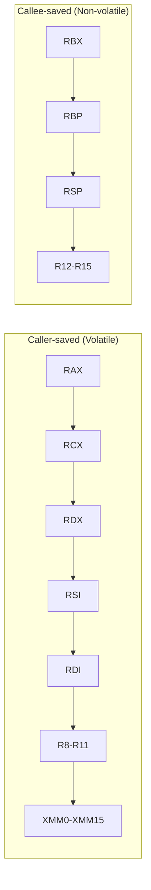
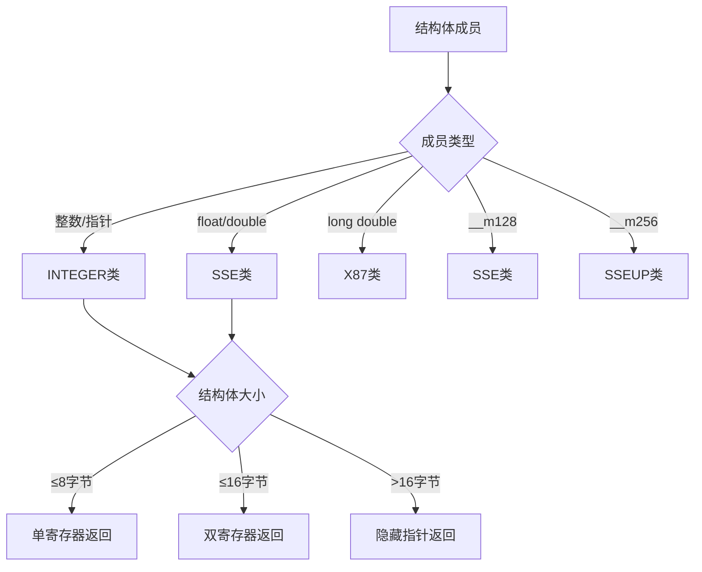
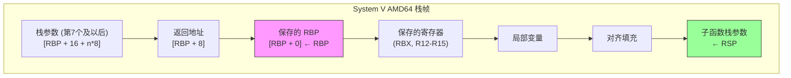
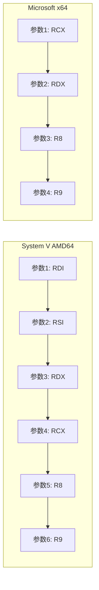

# System V AMD64 ABI 详解

> Linux、macOS、BSD等Unix-like系统使用的x64调用约定完整规范，包含参数寄存器、浮点参数、返回值、Red Zone和栈对齐要求

## 概述

System V AMD64 ABI（Application Binary Interface）是Unix-like操作系统（Linux、macOS、FreeBSD、OpenBSD等）在x86-64架构上使用的标准调用约定。该ABI由AMD在2000年代初期与x86-64架构一起设计，旨在充分利用64位架构的扩展寄存器集，实现高效的函数调用。

### 适用平台

| 操作系统 | 使用System V ABI | 备注 |
|----------|------------------|------|
| Linux | ✓ | 所有发行版 |
| macOS | ✓ | 有细微差异 |
| FreeBSD | ✓ | 完全兼容 |
| OpenBSD | ✓ | 完全兼容 |
| NetBSD | ✓ | 完全兼容 |
| Solaris | ✓ | x64版本 |
| Windows | ✗ | 使用Microsoft x64 ABI |

### 核心特性概览

| 特性 | 规范 |
|------|------|
| **整数参数寄存器** | RDI, RSI, RDX, RCX, R8, R9（6个） |
| **浮点参数寄存器** | XMM0-XMM7（8个） |
| **整数返回值** | RAX, RDX |
| **浮点返回值** | XMM0, XMM1 |
| **栈对齐** | 16字节（CALL前） |
| **Red Zone** | 128字节（RSP以下） |
| **栈清理** | 调用者（Caller） |
| **可变参数** | 支持（AL指示XMM数量） |


---

## 寄存器分类

### 调用者保存寄存器（Caller-saved / Volatile）

这些寄存器在函数调用后可能被修改，调用者如需保留其值必须自行保存。

| 寄存器 | 用途 | 说明 |
|--------|------|------|
| `RAX` | 返回值 / 临时 | 整数返回值低64位 |
| `RCX` | 第4个整数参数 | 也用作循环计数器 |
| `RDX` | 第3个整数参数 / 返回值 | 整数返回值高64位 |
| `RSI` | 第2个整数参数 | 字符串操作源 |
| `RDI` | 第1个整数参数 | 字符串操作目标 |
| `R8` | 第5个整数参数 | 扩展寄存器 |
| `R9` | 第6个整数参数 | 扩展寄存器 |
| `R10` | 临时 | 静态链指针（嵌套函数） |
| `R11` | 临时 | 可自由使用 |
| `XMM0-XMM15` | 浮点/SIMD | 全部为caller-saved |

### 被调用者保存寄存器（Callee-saved / Non-volatile）

这些寄存器在函数调用后必须保持原值，被调用函数如需使用必须先保存再恢复。

| 寄存器 | 用途 | 说明 |
|--------|------|------|
| `RBX` | 基址 | 通用被保存寄存器 |
| `RBP` | 帧指针 | 可选的栈帧基址 |
| `RSP` | 栈指针 | 必须保持（调整后恢复） |
| `R12` | 通用 | 被保存寄存器 |
| `R13` | 通用 | 被保存寄存器 |
| `R14` | 通用 | 被保存寄存器 |
| `R15` | 通用 | 被保存寄存器 |

### 寄存器分类图示




---

## 整数参数传递

### 参数寄存器顺序

System V AMD64 ABI使用6个寄存器传递整数和指针参数，按以下顺序：

| 参数位置 | 寄存器 | 说明 |
|----------|--------|------|
| 第1个参数 | `RDI` | 目标索引寄存器 |
| 第2个参数 | `RSI` | 源索引寄存器 |
| 第3个参数 | `RDX` | 数据寄存器 |
| 第4个参数 | `RCX` | 计数寄存器 |
| 第5个参数 | `R8` | 扩展寄存器 |
| 第6个参数 | `R9` | 扩展寄存器 |
| 第7个及以后 | 栈 | 从右到左入栈 |

### 参数传递规则

1. **整数和指针类型**：使用RDI、RSI、RDX、RCX、R8、R9
2. **小于64位的整数**：零扩展或符号扩展到64位
3. **超过6个参数**：第7个及以后的参数通过栈传递
4. **栈参数顺序**：从右到左入栈（第7个参数在栈顶）

### 参数传递示例

```
函数: int func(int a, int b, int c, int d, int e, int f, int g, int h)

寄存器分配:
┌─────────────────────────────────────────────────────────┐
│ 参数 a → RDI    参数 b → RSI    参数 c → RDX           │
│ 参数 d → RCX    参数 e → R8     参数 f → R9            │
└─────────────────────────────────────────────────────────┘

栈布局（CALL之后）:
高地址
┌─────────────────┐
│    参数 h       │  [RSP + 16]
├─────────────────┤
│    参数 g       │  [RSP + 8]
├─────────────────┤
│   返回地址      │  [RSP + 0]  ← RSP
└─────────────────┘
低地址
```

### 代码示例

#### Intel/NASM 语法

```nasm
; 函数: int64_t sum_eight(int64_t a, b, c, d, e, f, g, h)
; 参数: RDI=a, RSI=b, RDX=c, RCX=d, R8=e, R9=f, [rsp+8]=g, [rsp+16]=h
section .text
    global sum_eight

sum_eight:
    ; 寄存器参数
    mov     rax, rdi            ; rax = a
    add     rax, rsi            ; rax += b
    add     rax, rdx            ; rax += c
    add     rax, rcx            ; rax += d
    add     rax, r8             ; rax += e
    add     rax, r9             ; rax += f
    ; 栈参数
    add     rax, [rsp + 8]      ; rax += g
    add     rax, [rsp + 16]     ; rax += h
    ret

; 调用示例
caller_example:
    push    rbp
    mov     rbp, rsp
    
    ; 调用 sum_eight(1, 2, 3, 4, 5, 6, 7, 8)
    push    8                   ; 参数 h（最后入栈）
    push    7                   ; 参数 g
    mov     r9, 6               ; 参数 f
    mov     r8, 5               ; 参数 e
    mov     rcx, 4              ; 参数 d
    mov     rdx, 3              ; 参数 c
    mov     rsi, 2              ; 参数 b
    mov     rdi, 1              ; 参数 a
    call    sum_eight
    add     rsp, 16             ; 清理栈参数（调用者清理）
    
    ; 结果在 RAX 中
    pop     rbp
    ret
```

#### AT&T/GAS 语法

```gas
# 函数: int64_t sum_eight(int64_t a, b, c, d, e, f, g, h)
    .text
    .globl sum_eight
    .type sum_eight, @function

sum_eight:
    # 寄存器参数
    movq    %rdi, %rax          # rax = a
    addq    %rsi, %rax          # rax += b
    addq    %rdx, %rax          # rax += c
    addq    %rcx, %rax          # rax += d
    addq    %r8, %rax           # rax += e
    addq    %r9, %rax           # rax += f
    # 栈参数
    addq    8(%rsp), %rax       # rax += g
    addq    16(%rsp), %rax      # rax += h
    ret
.size sum_eight, .-sum_eight

# 调用示例
    .globl caller_example
caller_example:
    pushq   %rbp
    movq    %rsp, %rbp
    
    # 调用 sum_eight(1, 2, 3, 4, 5, 6, 7, 8)
    pushq   $8                  # 参数 h
    pushq   $7                  # 参数 g
    movq    $6, %r9             # 参数 f
    movq    $5, %r8             # 参数 e
    movq    $4, %rcx            # 参数 d
    movq    $3, %rdx            # 参数 c
    movq    $2, %rsi            # 参数 b
    movq    $1, %rdi            # 参数 a
    call    sum_eight
    addq    $16, %rsp           # 清理栈参数
    
    popq    %rbp
    ret
```

#### Go Plan9 语法

```asm
#include "textflag.h"

// func SumEight(a, b, c, d, e, f, g, h int64) int64
// Go 1.17+ 内部使用寄存器调用约定，但手写汇编通常仍使用基于栈的 ABI0
// 编译器会自动生成 ABIInternal 到 ABI0 的转换代码
TEXT ·SumEight(SB), NOSPLIT, $0-72
    MOVQ    a+0(FP), AX         // AX = a
    ADDQ    b+8(FP), AX         // AX += b
    ADDQ    c+16(FP), AX        // AX += c
    ADDQ    d+24(FP), AX        // AX += d
    ADDQ    e+32(FP), AX        // AX += e
    ADDQ    f+40(FP), AX        // AX += f
    ADDQ    g+48(FP), AX        // AX += g
    ADDQ    h+56(FP), AX        // AX += h
    MOVQ    AX, ret+64(FP)
    RET
```


---

## 浮点参数传递

### 浮点参数寄存器

System V AMD64 ABI使用8个XMM寄存器传递浮点参数：

| 参数位置 | 寄存器 | 说明 |
|----------|--------|------|
| 第1个浮点参数 | `XMM0` | 128位SSE寄存器 |
| 第2个浮点参数 | `XMM1` | 128位SSE寄存器 |
| 第3个浮点参数 | `XMM2` | 128位SSE寄存器 |
| 第4个浮点参数 | `XMM3` | 128位SSE寄存器 |
| 第5个浮点参数 | `XMM4` | 128位SSE寄存器 |
| 第6个浮点参数 | `XMM5` | 128位SSE寄存器 |
| 第7个浮点参数 | `XMM6` | 128位SSE寄存器 |
| 第8个浮点参数 | `XMM7` | 128位SSE寄存器 |
| 第9个及以后 | 栈 | 从右到左入栈 |

### 浮点参数传递规则

1. **float和double**：使用XMM0-XMM7的低32/64位
2. **__m128类型**：使用完整的XMM寄存器
3. **整数和浮点参数独立计数**：各自使用自己的寄存器序列
4. **超过8个浮点参数**：通过栈传递

### 混合参数示例

```
函数: double mixed(int a, double b, int c, double d, double e)

参数分配:
┌─────────────────────────────────────────────────────────┐
│ 整数参数:                                               │
│   a → RDI (第1个整数)                                   │
│   c → RSI (第2个整数)                                   │
├─────────────────────────────────────────────────────────┤
│ 浮点参数:                                               │
│   b → XMM0 (第1个浮点)                                  │
│   d → XMM1 (第2个浮点)                                  │
│   e → XMM2 (第3个浮点)                                  │
└─────────────────────────────────────────────────────────┘
```

### 代码示例

#### Intel/NASM 语法

```nasm
; 函数: double sum_floats(double a, double b, double c, double d)
; 参数: XMM0=a, XMM1=b, XMM2=c, XMM3=d
section .text
    global sum_floats

sum_floats:
    ; XMM0 = a
    addsd   xmm0, xmm1          ; xmm0 = a + b
    addsd   xmm0, xmm2          ; xmm0 = a + b + c
    addsd   xmm0, xmm3          ; xmm0 = a + b + c + d
    ; 返回值在 XMM0 中
    ret

; 混合整数和浮点参数
; double mixed_params(int64_t n, double x, int64_t m, double y)
; 参数: RDI=n, XMM0=x, RSI=m, XMM1=y
    global mixed_params

mixed_params:
    ; 将整数转换为浮点
    cvtsi2sd xmm2, rdi          ; xmm2 = (double)n
    cvtsi2sd xmm3, rsi          ; xmm3 = (double)m
    
    ; 计算 n * x + m * y
    mulsd   xmm2, xmm0          ; xmm2 = n * x
    mulsd   xmm3, xmm1          ; xmm3 = m * y
    addsd   xmm2, xmm3          ; xmm2 = n*x + m*y
    
    movsd   xmm0, xmm2          ; 返回值
    ret

; 调用浮点函数示例
section .data
    val_a dq 1.5
    val_b dq 2.5
    val_c dq 3.5
    val_d dq 4.5

section .text
    global call_float_example

call_float_example:
    push    rbp
    mov     rbp, rsp
    
    ; 调用 sum_floats(1.5, 2.5, 3.5, 4.5)
    movsd   xmm0, [rel val_a]   ; 参数 a
    movsd   xmm1, [rel val_b]   ; 参数 b
    movsd   xmm2, [rel val_c]   ; 参数 c
    movsd   xmm3, [rel val_d]   ; 参数 d
    call    sum_floats
    ; 结果在 XMM0 中
    
    pop     rbp
    ret
```

#### AT&T/GAS 语法

```gas
# 函数: double sum_floats(double a, double b, double c, double d)
    .text
    .globl sum_floats
    .type sum_floats, @function

sum_floats:
    # xmm0 = a
    addsd   %xmm1, %xmm0        # xmm0 = a + b
    addsd   %xmm2, %xmm0        # xmm0 = a + b + c
    addsd   %xmm3, %xmm0        # xmm0 = a + b + c + d
    ret
.size sum_floats, .-sum_floats

# 混合整数和浮点参数
# double mixed_params(int64_t n, double x, int64_t m, double y)
    .globl mixed_params
    .type mixed_params, @function

mixed_params:
    cvtsi2sdq %rdi, %xmm2       # xmm2 = (double)n
    cvtsi2sdq %rsi, %xmm3       # xmm3 = (double)m
    
    mulsd   %xmm0, %xmm2        # xmm2 = n * x
    mulsd   %xmm1, %xmm3        # xmm3 = m * y
    addsd   %xmm3, %xmm2        # xmm2 = n*x + m*y
    
    movsd   %xmm2, %xmm0        # 返回值
    ret
.size mixed_params, .-mixed_params
```

### 单精度浮点（float）

```nasm
; float add_floats(float a, float b)
; 参数: XMM0=a (低32位), XMM1=b (低32位)
add_floats:
    addss   xmm0, xmm1          ; 单精度加法
    ret                         ; 返回值在 XMM0 低32位
```


---

## 返回值规则

### 整数返回值

| 返回类型 | 寄存器 | 说明 |
|----------|--------|------|
| 8位整数 | `AL` | 零扩展到RAX |
| 16位整数 | `AX` | 零扩展到RAX |
| 32位整数 | `EAX` | 零扩展到RAX |
| 64位整数 | `RAX` | 完整64位 |
| 128位整数 | `RAX:RDX` | RAX=低64位，RDX=高64位 |
| 指针 | `RAX` | 64位地址 |

### 浮点返回值

| 返回类型 | 寄存器 | 说明 |
|----------|--------|------|
| float | `XMM0` | 低32位 |
| double | `XMM0` | 低64位 |
| long double | x87 ST(0) | 80位扩展精度 |
| __m128 | `XMM0` | 完整128位 |
| __m256 | `YMM0` | 完整256位 |
| 复数float | `XMM0` | 实部+虚部各32位 |
| 复数double | `XMM0:XMM1` | XMM0=实部，XMM1=虚部 |

### 结构体返回值

结构体返回值的处理取决于其大小和组成：

| 结构体类型 | 返回方式 | 说明 |
|------------|----------|------|
| ≤16字节（整数） | RAX, RDX | 按8字节分割 |
| ≤16字节（浮点） | XMM0, XMM1 | 按8字节分割 |
| ≤16字节（混合） | RAX/XMM0 | 根据成员类型 |
| >16字节 | 隐藏指针 | 调用者分配空间 |

### 返回值示例

#### Intel/NASM 语法

```nasm
; 返回64位整数
; int64_t get_value(void)
get_value:
    mov     rax, 0x123456789ABCDEF0
    ret

; 返回128位整数
; __int128 get_big_value(void)
get_big_value:
    mov     rax, 0xDEADBEEFCAFEBABE  ; 低64位
    mov     rdx, 0x1234567890ABCDEF  ; 高64位
    ret

; 返回double
; double get_pi(void)
section .data
    pi_value dq 3.14159265358979

section .text
get_pi:
    movsd   xmm0, [rel pi_value]
    ret

; 返回小型结构体（16字节以内）
; struct Point { int64_t x, y; };
; Point get_point(void)
get_point:
    mov     rax, 100                ; x 在 RAX
    mov     rdx, 200                ; y 在 RDX
    ret

; 返回大型结构体（通过隐藏指针）
; struct BigStruct { int64_t data[4]; };
; BigStruct get_big_struct(void)
; 隐藏指针在 RDI 中传入
get_big_struct:
    ; RDI 指向调用者分配的空间
    mov     qword [rdi + 0], 1
    mov     qword [rdi + 8], 2
    mov     qword [rdi + 16], 3
    mov     qword [rdi + 24], 4
    mov     rax, rdi                ; 返回指针
    ret
```

#### AT&T/GAS 语法

```gas
# 返回128位整数
get_big_value:
    movq    $0xDEADBEEFCAFEBABE, %rax  # 低64位
    movq    $0x1234567890ABCDEF, %rdx  # 高64位
    ret

# 返回小型结构体
get_point:
    movq    $100, %rax              # x
    movq    $200, %rdx              # y
    ret

# 返回大型结构体
get_big_struct:
    movq    $1, 0(%rdi)
    movq    $2, 8(%rdi)
    movq    $3, 16(%rdi)
    movq    $4, 24(%rdi)
    movq    %rdi, %rax
    ret
```

### 结构体分类规则

System V ABI将结构体成员分类为以下类型：




---

## Red Zone（红区）

### 什么是Red Zone

Red Zone是System V AMD64 ABI的一个重要特性：**RSP以下128字节的区域可以被叶子函数（不调用其他函数的函数）自由使用，而无需调整栈指针**。

```
栈布局（包含Red Zone）:

高地址
┌─────────────────────────────────────────┐
│           调用者的栈帧                   │
├─────────────────────────────────────────┤
│           返回地址                       │  [RSP + 0]
├─────────────────────────────────────────┤ ← RSP
│                                         │
│           Red Zone                      │  [RSP - 1] 到 [RSP - 128]
│           (128字节)                      │
│           可自由使用                     │
│                                         │
├─────────────────────────────────────────┤ ← RSP - 128
│           不可使用区域                   │
│           (可能被信号处理器覆盖)         │
└─────────────────────────────────────────┘
低地址
```

### Red Zone的优势

1. **性能优化**：叶子函数无需执行`sub rsp, N`和`add rsp, N`
2. **代码简化**：减少栈指针操作指令
3. **适用场景**：小型叶子函数、中断处理程序

### Red Zone使用规则

| 规则 | 说明 |
|------|------|
| **仅限叶子函数** | 调用其他函数会破坏Red Zone |
| **128字节限制** | 不能超过RSP-128 |
| **信号安全** | 操作系统保证信号处理不会覆盖Red Zone |
| **不适用于内核** | Linux内核代码禁用Red Zone |

### Red Zone代码示例

#### Intel/NASM 语法

```nasm
; 使用Red Zone的叶子函数
; int64_t leaf_function(int64_t a, int64_t b, int64_t c)
section .text
    global leaf_function

leaf_function:
    ; 不需要调整RSP，直接使用Red Zone
    mov     [rsp - 8], rdi      ; 保存 a 到 Red Zone
    mov     [rsp - 16], rsi     ; 保存 b 到 Red Zone
    mov     [rsp - 24], rdx     ; 保存 c 到 Red Zone
    
    ; 进行一些计算
    mov     rax, [rsp - 8]
    add     rax, [rsp - 16]
    add     rax, [rsp - 24]
    
    ; 直接返回，无需恢复RSP
    ret

; 不使用Red Zone的函数（调用其他函数）
; int64_t non_leaf_function(int64_t a, int64_t b)
    global non_leaf_function

non_leaf_function:
    ; 必须分配栈空间，因为要调用其他函数
    push    rbp
    mov     rbp, rsp
    sub     rsp, 32             ; 分配局部变量空间
    
    mov     [rbp - 8], rdi      ; 保存 a
    mov     [rbp - 16], rsi     ; 保存 b
    
    ; 调用其他函数（会破坏Red Zone）
    mov     rdi, [rbp - 8]
    mov     rsi, [rbp - 16]
    call    some_other_function
    
    ; 使用返回值
    add     rax, [rbp - 8]
    
    mov     rsp, rbp
    pop     rbp
    ret
```

#### AT&T/GAS 语法

```gas
# 使用Red Zone的叶子函数
    .text
    .globl leaf_function
    .type leaf_function, @function

leaf_function:
    # 直接使用Red Zone，无需调整RSP
    movq    %rdi, -8(%rsp)      # 保存 a
    movq    %rsi, -16(%rsp)     # 保存 b
    movq    %rdx, -24(%rsp)     # 保存 c
    
    movq    -8(%rsp), %rax
    addq    -16(%rsp), %rax
    addq    -24(%rsp), %rax
    
    ret
.size leaf_function, .-leaf_function
```

### 禁用Red Zone

在某些场景（如内核开发）需要禁用Red Zone：

```bash
# GCC编译选项
gcc -mno-red-zone -c kernel_code.c

# Clang编译选项
clang -mno-red-zone -c kernel_code.c
```

### Red Zone与Windows的对比

| 特性 | System V (Linux/macOS) | Microsoft (Windows) |
|------|------------------------|---------------------|
| Red Zone | 128字节 | 无 |
| Shadow Space | 无 | 32字节 |
| 叶子函数优化 | 可使用Red Zone | 必须分配Shadow Space |


---

## 栈对齐要求

### 16字节对齐规则

System V AMD64 ABI要求**在执行CALL指令之前，栈指针RSP必须16字节对齐**。

```
CALL指令执行过程:

调用前 (RSP 16字节对齐):
┌─────────────────┐
│                 │
├─────────────────┤ ← RSP (地址 % 16 == 0)
│                 │
└─────────────────┘

CALL指令后 (RSP 8字节对齐):
┌─────────────────┐
│                 │
├─────────────────┤
│   返回地址      │  ← RSP (地址 % 16 == 8)
└─────────────────┘

函数序言后 (RSP 16字节对齐):
┌─────────────────┐
│                 │
├─────────────────┤
│   返回地址      │
├─────────────────┤
│   保存的RBP     │  ← RSP (地址 % 16 == 0)
└─────────────────┘
```

### 对齐规则详解

| 时机 | RSP对齐 | 说明 |
|------|---------|------|
| CALL之前 | 16字节 | 调用者责任 |
| CALL之后（函数入口） | 8字节 | 返回地址占8字节 |
| 函数序言后 | 16字节 | push rbp恢复对齐 |
| 调用子函数前 | 16字节 | 必须重新对齐 |

### 栈对齐示例

#### Intel/NASM 语法

```nasm
; 正确的栈对齐示例
section .text
    global aligned_caller

aligned_caller:
    push    rbp                 ; RSP: 16n+8 → 16n (对齐)
    mov     rbp, rsp
    
    ; 分配局部变量空间（保持16字节对齐）
    sub     rsp, 32             ; 分配32字节（16的倍数）
    
    ; 准备调用函数
    ; 此时 RSP 已经16字节对齐
    mov     rdi, 1
    mov     rsi, 2
    call    some_function       ; CALL前RSP是16字节对齐
    
    mov     rsp, rbp
    pop     rbp
    ret

; 需要手动对齐的情况
    global manual_align_example

manual_align_example:
    push    rbp
    mov     rbp, rsp
    
    ; 分配奇数个8字节空间
    sub     rsp, 24             ; 24 = 3 * 8，不是16的倍数
    
    ; 调用函数前需要额外对齐
    sub     rsp, 8              ; 现在 RSP 是16字节对齐
    mov     rdi, 1
    call    some_function
    add     rsp, 8              ; 恢复
    
    mov     rsp, rbp
    pop     rbp
    ret

; 使用AND指令强制对齐
    global force_align_example

force_align_example:
    push    rbp
    mov     rbp, rsp
    and     rsp, -16            ; 强制16字节对齐（向下取整）
    sub     rsp, 64             ; 分配对齐的空间
    
    ; 函数体...
    
    mov     rsp, rbp            ; 恢复原始RSP
    pop     rbp
    ret
```

#### AT&T/GAS 语法

```gas
# 正确的栈对齐示例
    .text
    .globl aligned_caller

aligned_caller:
    pushq   %rbp
    movq    %rsp, %rbp
    
    # 分配16字节对齐的空间
    subq    $32, %rsp
    
    # 调用函数
    movq    $1, %rdi
    movq    $2, %rsi
    call    some_function
    
    movq    %rbp, %rsp
    popq    %rbp
    ret

# 强制对齐示例
force_align_example:
    pushq   %rbp
    movq    %rsp, %rbp
    andq    $-16, %rsp          # 强制16字节对齐
    subq    $64, %rsp
    
    # 函数体...
    
    movq    %rbp, %rsp
    popq    %rbp
    ret
```

### SSE/AVX对齐要求

某些SIMD指令需要更严格的对齐：

| 指令类型 | 对齐要求 | 示例指令 |
|----------|----------|----------|
| SSE对齐加载 | 16字节 | `movaps`, `movdqa` |
| AVX对齐加载 | 32字节 | `vmovaps` (YMM) |
| AVX-512对齐加载 | 64字节 | `vmovaps` (ZMM) |
| 非对齐加载 | 无要求 | `movups`, `movdqu` |

```nasm
; 对齐的SIMD操作
aligned_simd:
    push    rbp
    mov     rbp, rsp
    and     rsp, -32            ; 32字节对齐（AVX）
    sub     rsp, 64
    
    ; 使用对齐的加载指令
    vmovaps ymm0, [rsp]         ; 需要32字节对齐
    
    mov     rsp, rbp
    pop     rbp
    ret
```


---

## 栈帧结构

### 标准栈帧布局

```
System V AMD64 标准栈帧:

高地址
┌─────────────────────────────────────────┐
│         调用者的栈帧                     │
├─────────────────────────────────────────┤
│         栈参数 N                         │  [RBP + 16 + (N-7)*8]
├─────────────────────────────────────────┤
│         ...                             │
├─────────────────────────────────────────┤
│         栈参数 8                         │  [RBP + 24]
├─────────────────────────────────────────┤
│         栈参数 7                         │  [RBP + 16]
├─────────────────────────────────────────┤
│         返回地址                         │  [RBP + 8]
├─────────────────────────────────────────┤
│         保存的 RBP                       │  [RBP + 0]  ← RBP
├─────────────────────────────────────────┤
│         保存的被调用者寄存器             │  [RBP - 8] 等
│         (RBX, R12-R15)                  │
├─────────────────────────────────────────┤
│         局部变量                         │
├─────────────────────────────────────────┤
│         临时空间                         │
├─────────────────────────────────────────┤
│         子函数的栈参数                   │  ← RSP (16字节对齐)
└─────────────────────────────────────────┘
低地址
```

### 栈帧结构图示



### 函数序言和尾声

#### 标准序言（Prologue）

```nasm
; Intel/NASM 语法
function_name:
    push    rbp                 ; 保存调用者的帧指针
    mov     rbp, rsp            ; 建立新帧
    sub     rsp, N              ; 分配局部变量空间（N为16的倍数）
    
    ; 保存被调用者保存寄存器（如果使用）
    push    rbx
    push    r12
    push    r13
    push    r14
    push    r15
```

```gas
# AT&T/GAS 语法
function_name:
    pushq   %rbp
    movq    %rsp, %rbp
    subq    $N, %rsp
    
    # 保存被调用者保存寄存器
    pushq   %rbx
    pushq   %r12
    pushq   %r13
    pushq   %r14
    pushq   %r15
```

#### 标准尾声（Epilogue）

```nasm
; Intel/NASM 语法
    ; 恢复被调用者保存寄存器
    pop     r15
    pop     r14
    pop     r13
    pop     r12
    pop     rbx
    
    mov     rsp, rbp            ; 恢复栈指针
    pop     rbp                 ; 恢复帧指针
    ret

; 或使用 leave 指令
    pop     r15
    pop     r14
    pop     r13
    pop     r12
    pop     rbx
    leave                       ; 等价于 mov rsp, rbp; pop rbp
    ret
```

### 无帧指针优化

现代编译器常常省略帧指针以获得额外的通用寄存器：

```nasm
; 无帧指针的函数
optimized_function:
    sub     rsp, 40             ; 直接分配栈空间
    
    ; 使用RSP相对寻址访问局部变量
    mov     [rsp + 0], rdi      ; 局部变量1
    mov     [rsp + 8], rsi      ; 局部变量2
    
    ; 函数体...
    
    add     rsp, 40             ; 恢复栈指针
    ret
```

编译选项：
```bash
# 启用帧指针（调试友好）
gcc -fno-omit-frame-pointer -c source.c

# 省略帧指针（性能优化）
gcc -fomit-frame-pointer -c source.c
```


---

## 可变参数函数

### 可变参数调用约定

System V AMD64 ABI对可变参数函数（variadic functions）有特殊规定：

1. **AL寄存器**：必须包含使用的XMM寄存器数量（0-8）
2. **参数传递**：与普通函数相同（RDI, RSI, RDX, RCX, R8, R9, XMM0-XMM7）
3. **va_list实现**：需要保存所有可能的参数寄存器

### AL寄存器的作用

```
调用可变参数函数时:

┌─────────────────────────────────────────────────────────┐
│ AL = 使用的XMM寄存器数量                                │
│                                                         │
│ 例如: printf("%f %f", 1.0, 2.0)                        │
│       AL = 2 (使用了XMM0和XMM1)                         │
│                                                         │
│ 例如: printf("%d %d", 1, 2)                            │
│       AL = 0 (没有使用XMM寄存器)                        │
└─────────────────────────────────────────────────────────┘
```

### 可变参数函数示例

#### 调用printf

```nasm
; Intel/NASM 语法
section .data
    fmt_int db "Integer: %d", 10, 0
    fmt_float db "Float: %f", 10, 0
    fmt_mixed db "Int: %d, Float: %f, Int: %d", 10, 0

section .text
    extern printf
    global call_printf_examples

call_printf_examples:
    push    rbp
    mov     rbp, rsp
    
    ; 示例1: printf("Integer: %d\n", 42)
    ; 无浮点参数
    xor     eax, eax            ; AL = 0 (无XMM参数)
    lea     rdi, [rel fmt_int]  ; 格式字符串
    mov     rsi, 42             ; 整数参数
    call    printf
    
    ; 示例2: printf("Float: %f\n", 3.14)
    ; 1个浮点参数
    mov     eax, 1              ; AL = 1 (1个XMM参数)
    lea     rdi, [rel fmt_float]
    mov     rax, 0x40091EB851EB851F  ; 3.14的IEEE 754表示
    movq    xmm0, rax           ; 浮点参数在XMM0
    call    printf
    
    ; 示例3: printf("Int: %d, Float: %f, Int: %d\n", 10, 2.5, 20)
    ; 混合参数
    mov     eax, 1              ; AL = 1 (1个XMM参数)
    lea     rdi, [rel fmt_mixed]
    mov     rsi, 10             ; 第1个整数参数
    mov     rax, 0x4004000000000000  ; 2.5
    movq    xmm0, rax           ; 浮点参数
    mov     rdx, 20             ; 第2个整数参数
    call    printf
    
    pop     rbp
    ret
```

#### AT&T/GAS 语法

```gas
    .data
fmt_int:
    .asciz "Integer: %d\n"
fmt_float:
    .asciz "Float: %f\n"
fmt_mixed:
    .asciz "Int: %d, Float: %f, Int: %d\n"

    .text
    .globl call_printf_examples

call_printf_examples:
    pushq   %rbp
    movq    %rsp, %rbp
    
    # printf("Integer: %d\n", 42)
    xorl    %eax, %eax          # AL = 0
    leaq    fmt_int(%rip), %rdi
    movq    $42, %rsi
    call    printf@PLT
    
    # printf("Float: %f\n", 3.14)
    movl    $1, %eax            # AL = 1
    leaq    fmt_float(%rip), %rdi
    movq    $0x40091EB851EB851F, %rax
    movq    %rax, %xmm0
    call    printf@PLT
    
    popq    %rbp
    ret
```

### 实现可变参数函数

```nasm
; 实现一个简单的可变参数函数
; int64_t sum_variadic(int count, ...)
section .text
    global sum_variadic

sum_variadic:
    push    rbp
    mov     rbp, rsp
    
    ; 保存参数寄存器到栈上（va_list需要）
    sub     rsp, 48
    mov     [rbp - 8], rsi      ; 第2个参数
    mov     [rbp - 16], rdx     ; 第3个参数
    mov     [rbp - 24], rcx     ; 第4个参数
    mov     [rbp - 32], r8      ; 第5个参数
    mov     [rbp - 40], r9      ; 第6个参数
    
    ; RDI = count
    mov     rcx, rdi            ; 循环计数
    xor     rax, rax            ; 累加器
    
    ; 指向第一个可变参数
    lea     rsi, [rbp - 8]
    
.loop:
    test    rcx, rcx
    jz      .done
    add     rax, [rsi]
    add     rsi, 8
    dec     rcx
    jmp     .loop
    
.done:
    mov     rsp, rbp
    pop     rbp
    ret
```

### va_list结构

System V AMD64 ABI定义的va_list结构：

```c
typedef struct {
    unsigned int gp_offset;     // 下一个整数参数的偏移
    unsigned int fp_offset;     // 下一个浮点参数的偏移
    void *overflow_arg_area;    // 栈参数区域指针
    void *reg_save_area;        // 寄存器保存区域指针
} va_list[1];
```

```
va_list 内存布局:

寄存器保存区域 (reg_save_area):
┌─────────────────────────────────────────┐
│ RDI (第1个整数参数)                      │  偏移 0
├─────────────────────────────────────────┤
│ RSI (第2个整数参数)                      │  偏移 8
├─────────────────────────────────────────┤
│ RDX (第3个整数参数)                      │  偏移 16
├─────────────────────────────────────────┤
│ RCX (第4个整数参数)                      │  偏移 24
├─────────────────────────────────────────┤
│ R8 (第5个整数参数)                       │  偏移 32
├─────────────────────────────────────────┤
│ R9 (第6个整数参数)                       │  偏移 40
├─────────────────────────────────────────┤
│ XMM0 (第1个浮点参数)                     │  偏移 48
├─────────────────────────────────────────┤
│ XMM1 (第2个浮点参数)                     │  偏移 64
├─────────────────────────────────────────┤
│ ... (XMM2-XMM7)                         │
└─────────────────────────────────────────┘
```


---

## 完整代码示例

### 示例1：基本函数调用

#### Intel/NASM 语法

```nasm
; 文件: sysv_example.asm
; 编译: nasm -f elf64 sysv_example.asm
; 链接: gcc -o sysv_example sysv_example.o main.c

section .text
    global add_numbers
    global multiply_numbers
    global process_array

; int64_t add_numbers(int64_t a, int64_t b)
; 参数: RDI=a, RSI=b
; 返回: RAX=a+b
add_numbers:
    mov     rax, rdi
    add     rax, rsi
    ret

; int64_t multiply_numbers(int64_t a, int64_t b)
; 参数: RDI=a, RSI=b
; 返回: RAX=a*b
multiply_numbers:
    mov     rax, rdi
    imul    rax, rsi
    ret

; int64_t process_array(int64_t* arr, size_t len)
; 参数: RDI=arr, RSI=len
; 返回: RAX=数组元素之和
process_array:
    push    rbx                 ; 保存被调用者保存寄存器
    push    r12
    
    mov     rbx, rdi            ; rbx = arr
    mov     r12, rsi            ; r12 = len
    xor     rax, rax            ; rax = 0 (累加器)
    
    test    r12, r12            ; 检查长度是否为0
    jz      .done
    
.loop:
    add     rax, [rbx]          ; rax += *arr
    add     rbx, 8              ; arr++
    dec     r12                 ; len--
    jnz     .loop
    
.done:
    pop     r12                 ; 恢复寄存器
    pop     rbx
    ret
```

#### AT&T/GAS 语法

```gas
# 文件: sysv_example.s
# 编译: gcc -c sysv_example.s
# 链接: gcc -o sysv_example sysv_example.o main.c

    .text
    .globl add_numbers
    .type add_numbers, @function

add_numbers:
    movq    %rdi, %rax
    addq    %rsi, %rax
    ret
.size add_numbers, .-add_numbers

    .globl multiply_numbers
    .type multiply_numbers, @function

multiply_numbers:
    movq    %rdi, %rax
    imulq   %rsi, %rax
    ret
.size multiply_numbers, .-multiply_numbers

    .globl process_array
    .type process_array, @function

process_array:
    pushq   %rbx
    pushq   %r12
    
    movq    %rdi, %rbx          # rbx = arr
    movq    %rsi, %r12          # r12 = len
    xorq    %rax, %rax          # rax = 0
    
    testq   %r12, %r12
    jz      .done
    
.loop:
    addq    (%rbx), %rax
    addq    $8, %rbx
    decq    %r12
    jnz     .loop
    
.done:
    popq    %r12
    popq    %rbx
    ret
.size process_array, .-process_array
```

#### Go Plan9 语法

```asm
#include "textflag.h"

// func AddNumbers(a, b int64) int64
TEXT ·AddNumbers(SB), NOSPLIT, $0-24
    MOVQ    a+0(FP), AX
    ADDQ    b+8(FP), AX
    MOVQ    AX, ret+16(FP)
    RET

// func MultiplyNumbers(a, b int64) int64
TEXT ·MultiplyNumbers(SB), NOSPLIT, $0-24
    MOVQ    a+0(FP), AX
    IMULQ   b+8(FP), AX
    MOVQ    AX, ret+16(FP)
    RET

// func ProcessArray(arr []int64) int64
TEXT ·ProcessArray(SB), NOSPLIT, $0-32
    MOVQ    arr_base+0(FP), BX  // 数组基址
    MOVQ    arr_len+8(FP), CX   // 数组长度
    XORQ    AX, AX              // 累加器
    
    TESTQ   CX, CX
    JZ      done
    
loop:
    ADDQ    (BX), AX
    ADDQ    $8, BX
    DECQ    CX
    JNZ     loop
    
done:
    MOVQ    AX, ret+24(FP)
    RET
```

### 示例2：浮点运算

```nasm
; Intel/NASM 语法
section .text
    global dot_product
    global vector_length

; double dot_product(double* a, double* b, size_t n)
; 计算两个向量的点积
; 参数: RDI=a, RSI=b, RDX=n
dot_product:
    push    rbx
    push    r12
    push    r13
    
    mov     rbx, rdi            ; a
    mov     r12, rsi            ; b
    mov     r13, rdx            ; n
    
    xorpd   xmm0, xmm0          ; 累加器清零
    
    test    r13, r13
    jz      .dp_done
    
.dp_loop:
    movsd   xmm1, [rbx]         ; xmm1 = a[i]
    mulsd   xmm1, [r12]         ; xmm1 *= b[i]
    addsd   xmm0, xmm1          ; sum += xmm1
    
    add     rbx, 8
    add     r12, 8
    dec     r13
    jnz     .dp_loop
    
.dp_done:
    pop     r13
    pop     r12
    pop     rbx
    ret

; double vector_length(double* v, size_t n)
; 计算向量的欧几里得长度
; 参数: RDI=v, RDX=n
vector_length:
    push    rbx
    push    r12
    
    mov     rbx, rdi            ; v
    mov     r12, rsi            ; n
    
    xorpd   xmm0, xmm0          ; sum = 0
    
    test    r12, r12
    jz      .vl_sqrt
    
.vl_loop:
    movsd   xmm1, [rbx]         ; xmm1 = v[i]
    mulsd   xmm1, xmm1          ; xmm1 = v[i]^2
    addsd   xmm0, xmm1          ; sum += v[i]^2
    
    add     rbx, 8
    dec     r12
    jnz     .vl_loop
    
.vl_sqrt:
    sqrtsd  xmm0, xmm0          ; sqrt(sum)
    
    pop     r12
    pop     rbx
    ret
```

### 示例3：调用C库函数

```nasm
; Intel/NASM 语法
section .data
    hello_msg db "Hello, System V ABI!", 10, 0
    format_str db "Result: %ld", 10, 0

section .text
    extern puts
    extern printf
    extern malloc
    extern free
    
    global main

main:
    push    rbp
    mov     rbp, rsp
    sub     rsp, 16             ; 保持16字节对齐
    
    ; 调用 puts("Hello, System V ABI!")
    lea     rdi, [rel hello_msg]
    call    puts
    
    ; 调用 malloc(100)
    mov     rdi, 100
    call    malloc
    mov     [rbp - 8], rax      ; 保存指针
    
    ; 调用 printf("Result: %ld\n", 42)
    xor     eax, eax            ; AL = 0 (无浮点参数)
    lea     rdi, [rel format_str]
    mov     rsi, 42
    call    printf
    
    ; 调用 free(ptr)
    mov     rdi, [rbp - 8]
    call    free
    
    ; 返回 0
    xor     eax, eax
    
    mov     rsp, rbp
    pop     rbp
    ret
```


---

## 与Microsoft x64 ABI的对比

### 主要差异对比表

| 特性 | System V AMD64 | Microsoft x64 |
|------|----------------|---------------|
| **整数参数寄存器** | RDI, RSI, RDX, RCX, R8, R9 | RCX, RDX, R8, R9 |
| **整数参数数量** | 6个 | 4个 |
| **浮点参数寄存器** | XMM0-XMM7 | XMM0-XMM3 |
| **浮点参数数量** | 8个 | 4个 |
| **Red Zone** | 128字节 | 无 |
| **Shadow Space** | 无 | 32字节（必需） |
| **XMM寄存器保存** | 全部caller-saved | XMM6-XMM15 callee-saved |
| **可变参数AL** | 指示XMM数量 | 不使用 |
| **栈对齐** | 16字节 | 16字节 |

### 参数寄存器对比图



### 跨平台代码示例

```nasm
; 条件编译示例：同时支持Linux和Windows
%ifdef WINDOWS
    ; Microsoft x64 ABI
    %define ARG1 rcx
    %define ARG2 rdx
    %define ARG3 r8
    %define ARG4 r9
%else
    ; System V AMD64 ABI
    %define ARG1 rdi
    %define ARG2 rsi
    %define ARG3 rdx
    %define ARG4 rcx
%endif

section .text
    global portable_add

; int64_t portable_add(int64_t a, int64_t b)
portable_add:
%ifdef WINDOWS
    ; Windows: 分配Shadow Space
    sub     rsp, 40
%endif
    
    mov     rax, ARG1
    add     rax, ARG2
    
%ifdef WINDOWS
    add     rsp, 40
%endif
    ret
```

### 调用约定转换

当需要在不同ABI之间调用时，需要进行参数转换：

```nasm
; 从System V调用Windows函数
; 假设 windows_func(int a, int b, int c, int d) 使用Microsoft ABI
call_windows_from_linux:
    push    rbp
    mov     rbp, rsp
    sub     rsp, 48             ; Shadow Space + 对齐
    
    ; System V参数: RDI, RSI, RDX, RCX
    ; 转换为Microsoft: RCX, RDX, R8, R9
    mov     r9, rcx             ; 第4个参数
    mov     r8, rdx             ; 第3个参数
    mov     rdx, rsi            ; 第2个参数
    mov     rcx, rdi            ; 第1个参数
    
    call    windows_func
    
    mov     rsp, rbp
    pop     rbp
    ret
```


---

## 特殊情况处理

### 结构体参数传递

结构体参数的传递方式取决于其大小和成员类型：

| 结构体大小 | 传递方式 | 说明 |
|------------|----------|------|
| ≤8字节 | 单个寄存器 | 整数用GPR，浮点用XMM |
| 9-16字节 | 两个寄存器 | 根据成员类型分配 |
| >16字节 | 通过指针 | 调用者分配空间 |

```nasm
; 小型结构体（8字节）通过寄存器传递
; struct Point { int32_t x, y; };
; void process_point(Point p)
; 参数: RDI = {x, y} 打包在一起
process_point:
    mov     eax, edi            ; x = 低32位
    shr     rdi, 32
    mov     edx, edi            ; y = 高32位
    ; 处理 x 和 y
    ret

; 中型结构体（16字节）通过两个寄存器传递
; struct Rect { int64_t x, y; };
; void process_rect(Rect r)
; 参数: RDI = x, RSI = y
process_rect:
    ; RDI = r.x, RSI = r.y
    add     rdi, rsi
    mov     rax, rdi
    ret

; 大型结构体通过指针传递
; struct BigData { int64_t data[4]; };
; void process_big(BigData d)
; 参数: RDI = 指向结构体的指针
process_big:
    mov     rax, [rdi + 0]      ; data[0]
    add     rax, [rdi + 8]      ; data[1]
    add     rax, [rdi + 16]     ; data[2]
    add     rax, [rdi + 24]     ; data[3]
    ret
```

### 联合体和位域

```nasm
; 联合体按最大成员大小处理
; union Value { int64_t i; double d; };
; 通过RDI或XMM0传递，取决于实际使用的成员

; 位域按整数处理
; struct Flags { unsigned a:4; unsigned b:4; unsigned c:8; };
; 打包为单个整数通过RDI传递
```

### 对齐参数

某些类型需要特殊对齐：

```nasm
; __m128 类型需要16字节对齐
; void process_m128(__m128 v)
; 参数: XMM0 = v
process_m128:
    ; 直接使用XMM0
    movaps  xmm1, xmm0
    ; ...
    ret

; __m256 类型需要32字节对齐
; void process_m256(__m256 v)
; 参数: 通过栈传递（对齐到32字节）
process_m256:
    ; 从栈上加载
    vmovaps ymm0, [rsp + 8]     ; 跳过返回地址
    ; ...
    ret
```

### 异常处理和栈展开

System V ABI使用DWARF格式的调试信息进行栈展开：

```gas
# GAS语法：添加CFI指令用于栈展开
    .text
    .globl function_with_cfi
    .type function_with_cfi, @function

function_with_cfi:
    .cfi_startproc
    pushq   %rbp
    .cfi_def_cfa_offset 16
    .cfi_offset 6, -16
    movq    %rsp, %rbp
    .cfi_def_cfa_register 6
    
    subq    $32, %rsp
    
    # 函数体...
    
    movq    %rbp, %rsp
    popq    %rbp
    .cfi_def_cfa 7, 8
    ret
    .cfi_endproc
.size function_with_cfi, .-function_with_cfi
```


---

## 快速参考表

### 参数传递速查

| 参数类型 | 第1个 | 第2个 | 第3个 | 第4个 | 第5个 | 第6个 | 第7个+ |
|----------|-------|-------|-------|-------|-------|-------|--------|
| 整数/指针 | RDI | RSI | RDX | RCX | R8 | R9 | 栈 |
| 浮点 | XMM0 | XMM1 | XMM2 | XMM3 | XMM4 | XMM5 | XMM6/XMM7/栈 |

### 返回值速查

| 返回类型 | 寄存器 |
|----------|--------|
| 整数 ≤64位 | RAX |
| 整数 128位 | RAX:RDX |
| 浮点 | XMM0 |
| 复数浮点 | XMM0:XMM1 |
| 小结构体 | RAX/RDX 或 XMM0/XMM1 |
| 大结构体 | 隐藏指针（RDI） |

### 寄存器保存责任速查

| 寄存器 | 保存责任 | 用途 |
|--------|----------|------|
| RAX | Caller | 返回值 |
| RBX | **Callee** | 通用 |
| RCX | Caller | 参数4 |
| RDX | Caller | 参数3/返回值 |
| RSI | Caller | 参数2 |
| RDI | Caller | 参数1 |
| RBP | **Callee** | 帧指针 |
| RSP | **Callee** | 栈指针 |
| R8-R9 | Caller | 参数5-6 |
| R10-R11 | Caller | 临时 |
| R12-R15 | **Callee** | 通用 |
| XMM0-XMM15 | Caller | 浮点/SIMD |

### 栈帧偏移速查

| 位置 | 内容 |
|------|------|
| `[RBP + 16 + n*8]` | 栈参数 (n ≥ 0) |
| `[RBP + 8]` | 返回地址 |
| `[RBP + 0]` | 保存的RBP |
| `[RBP - 8]` | 第1个局部变量/保存的寄存器 |
| `[RSP - 1]` 到 `[RSP - 128]` | Red Zone |

### 常用指令速查

| 操作 | Intel语法 | AT&T语法 |
|------|-----------|----------|
| 函数调用 | `call func` | `call func` |
| 函数返回 | `ret` | `ret` |
| 压栈 | `push rax` | `pushq %rax` |
| 出栈 | `pop rax` | `popq %rax` |
| 加载参数1 | `mov rax, rdi` | `movq %rdi, %rax` |
| 设置返回值 | `mov rax, value` | `movq $value, %rax` |
| 栈对齐 | `and rsp, -16` | `andq $-16, %rsp` |

---

## 参考资料

### 官方文档

- [System V Application Binary Interface - AMD64 Architecture Processor Supplement](https://gitlab.com/x86-psABIs/x86-64-ABI) - 官方ABI规范
- [AMD64 Architecture Programmer's Manual](https://www.amd.com/en/support/tech-docs) - AMD官方手册
- [Intel® 64 and IA-32 Architectures Software Developer Manuals](https://www.intel.com/content/www/us/en/developer/articles/technical/intel-sdm.html) - Intel官方手册

### 相关章节

- [x86/x64 概述](./overview.md) - 架构概述
- [x86 调用约定](./x86-conventions.md) - 32位调用约定
- [Microsoft x64 调用约定](./x64-microsoft.md) - Windows x64 ABI
- [x86/x64 寄存器参考](./registers.md) - 寄存器详细说明
- [栈帧结构](../07-stack-frames/x86-x64-frames.md) - 栈帧详解
- [操作系统差异](../05-os-differences/linux.md) - Linux特定内容

### 工具和资源

- **GCC**: `gcc -S -masm=intel source.c` - 生成Intel语法汇编
- **Clang**: `clang -S source.c` - 生成AT&T语法汇编
- **objdump**: `objdump -d -M intel binary` - 反汇编
- **GDB**: `disassemble /r function` - 调试时反汇编

---

## 附录：System V ABI 检查清单

### 函数实现检查清单

- [ ] 正确保存被调用者保存寄存器（RBX, RBP, R12-R15）
- [ ] 正确恢复被调用者保存寄存器
- [ ] 返回值放在正确的寄存器（RAX/XMM0）
- [ ] 大型结构体返回使用隐藏指针

### 函数调用检查清单

- [ ] 参数放在正确的寄存器（RDI, RSI, RDX, RCX, R8, R9）
- [ ] 浮点参数放在XMM0-XMM7
- [ ] 超过6个整数参数通过栈传递
- [ ] CALL前栈16字节对齐
- [ ] 可变参数函数设置AL为XMM寄存器数量
- [ ] 调用后清理栈参数（如有）

### 栈帧检查清单

- [ ] 函数序言正确建立栈帧
- [ ] 局部变量空间正确分配
- [ ] 栈保持16字节对齐
- [ ] 函数尾声正确恢复栈帧
- [ ] 叶子函数可使用Red Zone优化

---

*上一节: [x86 调用约定](./x86-conventions.md)*
*下一节: [Microsoft x64 调用约定](./x64-microsoft.md)*
*返回: [x86/x64 概述](./overview.md)*

