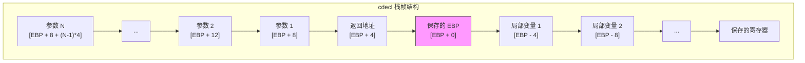
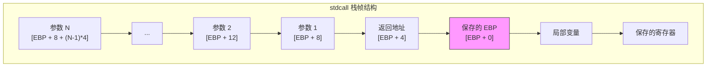
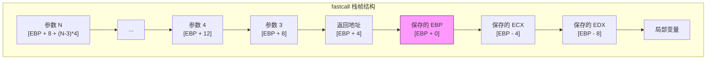

# x86 (32位) 调用约定详解

> x86架构下cdecl、stdcall、fastcall调用约定的完整规范，包含参数传递、返回值处理和栈清理规则

## 概述

x86（32位）架构由于寄存器数量有限，主要依赖栈来传递函数参数。不同的调用约定定义了参数入栈顺序、栈清理责任和寄存器使用规则。理解这些约定对于编写正确的汇编代码和实现语言互操作至关重要。

### 三种主要调用约定对比

| 特性 | cdecl | stdcall | fastcall |
|------|-------|---------|----------|
| **参数传递** | 全部通过栈 | 全部通过栈 | 前2个通过寄存器，其余通过栈 |
| **参数入栈顺序** | 从右到左 | 从右到左 | 从右到左 |
| **栈清理责任** | 调用者（Caller） | 被调用者（Callee） | 被调用者（Callee） |
| **名称修饰** | `_name` | `_name@N` | `@name@N` |
| **可变参数支持** | ✓ 支持 | ✗ 不支持 | ✗ 不支持 |
| **主要用途** | C语言默认 | Windows API | 性能优化 |

### 通用寄存器约定

在所有x86调用约定中，寄存器分为两类：

**调用者保存寄存器（Caller-saved / Volatile）**：
- `EAX` - 返回值，可自由使用
- `ECX` - 计数器，可自由使用
- `EDX` - 数据，可自由使用

**被调用者保存寄存器（Callee-saved / Non-volatile）**：
- `EBX` - 基址寄存器
- `ESI` - 源索引
- `EDI` - 目标索引
- `EBP` - 帧指针
- `ESP` - 栈指针（必须保持）

---

## cdecl 调用约定

### 基本规范

**cdecl**（C Declaration）是C语言的默认调用约定，也是最常用的x86调用约定。其核心特点是**调用者负责清理栈**，这使得它能够支持可变参数函数。

| 属性 | 规范 |
|------|------|
| **全称** | C Declaration |
| **参数传递** | 全部通过栈，从右到左入栈 |
| **返回值** | EAX（32位整数/指针），EDX:EAX（64位整数），ST(0)（浮点） |
| **栈清理** | 调用者（Caller）负责 |
| **栈对齐** | 4字节（某些编译器要求16字节对齐） |
| **名称修饰** | 函数名前加下划线：`_function_name` |

### 参数传递规则

参数按照**从右到左**的顺序压入栈中，这样第一个参数位于栈顶（最低地址）。

```
调用 func(arg1, arg2, arg3) 时的栈布局：

高地址
┌─────────────────┐
│      arg3       │  [ESP + 8]   最后入栈
├─────────────────┤
│      arg2       │  [ESP + 4]
├─────────────────┤
│      arg1       │  [ESP + 0]   最先入栈（栈顶）
├─────────────────┤
│   返回地址      │  ← CALL指令压入
└─────────────────┘
低地址
```

### 栈帧结构



### 代码示例

#### Intel/NASM 语法

```nasm
; cdecl 函数实现示例
; int add_three(int a, int b, int c)
section .text
    global _add_three

_add_three:
    ; 函数序言
    push ebp                ; 保存旧帧指针
    mov ebp, esp            ; 建立新帧
    
    ; 访问参数
    ; [ebp + 0]  = 保存的 EBP
    ; [ebp + 4]  = 返回地址
    ; [ebp + 8]  = 参数 a (第一个参数)
    ; [ebp + 12] = 参数 b (第二个参数)
    ; [ebp + 16] = 参数 c (第三个参数)
    
    mov eax, [ebp + 8]      ; eax = a
    add eax, [ebp + 12]     ; eax = a + b
    add eax, [ebp + 16]     ; eax = a + b + c
    
    ; 函数尾声
    pop ebp                 ; 恢复旧帧指针
    ret                     ; 返回（不清理栈）

; 调用 cdecl 函数
section .text
    global _call_example

_call_example:
    push ebp
    mov ebp, esp
    
    ; 调用 add_three(10, 20, 30)
    push dword 30           ; 参数 c（最后入栈）
    push dword 20           ; 参数 b
    push dword 10           ; 参数 a（最先入栈）
    call _add_three
    add esp, 12             ; 调用者清理栈（3个参数 × 4字节）
    
    ; 结果在 EAX 中
    
    pop ebp
    ret
```

#### AT&T/GAS 语法

```gas
# cdecl 函数实现示例
# int add_three(int a, int b, int c)
    .text
    .globl add_three

add_three:
    # 函数序言
    pushl %ebp              # 保存旧帧指针
    movl %esp, %ebp         # 建立新帧
    
    # 访问参数
    movl 8(%ebp), %eax      # eax = a
    addl 12(%ebp), %eax     # eax = a + b
    addl 16(%ebp), %eax     # eax = a + b + c
    
    # 函数尾声
    popl %ebp               # 恢复旧帧指针
    ret                     # 返回

# 调用 cdecl 函数
    .globl call_example

call_example:
    pushl %ebp
    movl %esp, %ebp
    
    # 调用 add_three(10, 20, 30)
    pushl $30               # 参数 c
    pushl $20               # 参数 b
    pushl $10               # 参数 a
    call add_three
    addl $12, %esp          # 调用者清理栈
    
    popl %ebp
    ret
```

### 返回值规则

| 返回类型 | 寄存器 | 说明 |
|----------|--------|------|
| 8位整数 | AL | 符号扩展到EAX |
| 16位整数 | AX | 符号扩展到EAX |
| 32位整数/指针 | EAX | 直接返回 |
| 64位整数 | EDX:EAX | EDX=高32位，EAX=低32位 |
| 单精度浮点 | ST(0) | x87浮点栈顶 |
| 双精度浮点 | ST(0) | x87浮点栈顶 |
| 结构体（小） | EAX 或 EDX:EAX | 取决于大小 |
| 结构体（大） | 通过隐藏指针 | 调用者分配空间 |

```nasm
; 64位返回值示例
; int64_t multiply_64(int32_t a, int32_t b)
_multiply_64:
    push ebp
    mov ebp, esp
    
    mov eax, [ebp + 8]      ; a
    imul dword [ebp + 12]   ; EDX:EAX = a * b (有符号乘法)
    
    ; 结果已在 EDX:EAX 中
    pop ebp
    ret
```

### 可变参数函数

cdecl 支持可变参数函数（如 `printf`），因为调用者知道传递了多少参数并负责清理栈。

```nasm
; 调用 printf("%d + %d = %d\n", 10, 20, 30)
section .data
    fmt db "%d + %d = %d", 10, 0

section .text
    extern _printf

_print_sum:
    push ebp
    mov ebp, esp
    
    ; 从右到左压入参数
    push dword 30           ; 第4个参数
    push dword 20           ; 第3个参数
    push dword 10           ; 第2个参数
    push dword fmt          ; 第1个参数（格式字符串）
    call _printf
    add esp, 16             ; 清理4个参数
    
    pop ebp
    ret
```

---

## stdcall 调用约定

### 基本规范

**stdcall**（Standard Call）是Windows API的标准调用约定。其核心特点是**被调用者负责清理栈**，这可以减少代码大小，因为栈清理代码只在函数内部出现一次。

| 属性 | 规范 |
|------|------|
| **全称** | Standard Call |
| **参数传递** | 全部通过栈，从右到左入栈 |
| **返回值** | EAX（32位整数/指针），EDX:EAX（64位整数），ST(0)（浮点） |
| **栈清理** | 被调用者（Callee）负责 |
| **栈对齐** | 4字节 |
| **名称修饰** | `_function_name@N`（N为参数字节数） |
| **可变参数** | 不支持 |

### 参数传递规则

与cdecl相同，参数从右到左入栈。区别在于函数返回时使用 `ret N` 指令清理栈。

```
调用 func(arg1, arg2, arg3) 时的栈布局：

高地址
┌─────────────────┐
│      arg3       │  [ESP + 8]
├─────────────────┤
│      arg2       │  [ESP + 4]
├─────────────────┤
│      arg1       │  [ESP + 0]
├─────────────────┤
│   返回地址      │  ← CALL指令压入
└─────────────────┘
低地址

函数返回时执行 ret 12，自动清理12字节参数
```

### 栈帧结构



### 代码示例

#### Intel/NASM 语法

```nasm
; stdcall 函数实现示例
; int __stdcall add_three(int a, int b, int c)
section .text
    global _add_three@12    ; 名称修饰：@12 表示12字节参数

_add_three@12:
    ; 函数序言
    push ebp
    mov ebp, esp
    
    ; 访问参数（与cdecl相同）
    mov eax, [ebp + 8]      ; a
    add eax, [ebp + 12]     ; b
    add eax, [ebp + 16]     ; c
    
    ; 函数尾声
    pop ebp
    ret 12                  ; 返回并清理12字节参数（被调用者清理）

; 调用 stdcall 函数
section .text
    global _call_stdcall_example

_call_stdcall_example:
    push ebp
    mov ebp, esp
    
    ; 调用 add_three(10, 20, 30)
    push dword 30           ; 参数 c
    push dword 20           ; 参数 b
    push dword 10           ; 参数 a
    call _add_three@12
    ; 注意：不需要 add esp, 12，函数已清理栈
    
    ; 结果在 EAX 中
    
    pop ebp
    ret
```

#### AT&T/GAS 语法

```gas
# stdcall 函数实现示例
# int __stdcall add_three(int a, int b, int c)
    .text
    .globl _add_three@12

_add_three@12:
    # 函数序言
    pushl %ebp
    movl %esp, %ebp
    
    # 访问参数
    movl 8(%ebp), %eax      # a
    addl 12(%ebp), %eax     # b
    addl 16(%ebp), %eax     # c
    
    # 函数尾声
    popl %ebp
    ret $12                 # 返回并清理12字节

# 调用 stdcall 函数
    .globl call_stdcall_example

call_stdcall_example:
    pushl %ebp
    movl %esp, %ebp
    
    # 调用 add_three(10, 20, 30)
    pushl $30
    pushl $20
    pushl $10
    call _add_three@12
    # 栈已被函数清理
    
    popl %ebp
    ret
```

### Windows API 调用示例

Windows API 使用 stdcall 约定。以下是调用 `MessageBoxA` 的示例：

```nasm
; 调用 Windows MessageBoxA
; int MessageBoxA(HWND hWnd, LPCSTR lpText, LPCSTR lpCaption, UINT uType)
section .data
    title db "Title", 0
    message db "Hello, Windows!", 0

section .text
    extern _MessageBoxA@16  ; 4个参数 × 4字节 = 16

_show_message:
    push ebp
    mov ebp, esp
    
    ; MessageBoxA(NULL, message, title, MB_OK)
    push dword 0            ; uType = MB_OK (0)
    push dword title        ; lpCaption
    push dword message      ; lpText
    push dword 0            ; hWnd = NULL
    call _MessageBoxA@16
    ; 栈已被 MessageBoxA 清理
    
    pop ebp
    ret
```

### 名称修饰规则

stdcall 使用特定的名称修饰（Name Decoration）规则：

| 原始名称 | 修饰后名称 | 说明 |
|----------|------------|------|
| `func()` | `_func@0` | 无参数 |
| `func(int)` | `_func@4` | 1个4字节参数 |
| `func(int, int)` | `_func@8` | 2个4字节参数 |
| `func(int, double)` | `_func@12` | int(4) + double(8) = 12 |
| `func(char)` | `_func@4` | char提升为4字节 |

**注意**：参数大小按照栈上实际占用计算，小于4字节的类型会被提升到4字节。

---

## fastcall 调用约定

### 基本规范

**fastcall** 是一种优化的调用约定，通过寄存器传递前两个参数来提高性能。不同编译器的实现略有差异，这里主要介绍 Microsoft fastcall。

| 属性 | 规范 |
|------|------|
| **全称** | Fast Call |
| **参数传递** | 前2个整数参数通过 ECX、EDX，其余通过栈 |
| **返回值** | EAX（32位整数/指针），EDX:EAX（64位整数），ST(0)（浮点） |
| **栈清理** | 被调用者（Callee）负责 |
| **栈对齐** | 4字节 |
| **名称修饰** | `@function_name@N`（N为参数字节数） |
| **可变参数** | 不支持 |

### 参数传递规则

```
参数传递规则：
┌─────────────────────────────────────────────────────┐
│ 参数位置    │ 传递方式                              │
├─────────────────────────────────────────────────────┤
│ 第1个参数   │ ECX 寄存器                            │
│ 第2个参数   │ EDX 寄存器                            │
│ 第3个及以后 │ 栈（从右到左入栈）                    │
└─────────────────────────────────────────────────────┘

注意：
- 只有整数和指针类型使用寄存器传递
- 浮点参数、结构体参数通过栈传递
- 如果前两个参数是浮点或结构体，则跳过对应寄存器
```

### 栈帧结构



**注意**：参数1和参数2通过ECX和EDX传递，不在栈上。如果函数需要保存这些参数，通常会将它们存储到局部变量区域。

### 代码示例

#### Intel/NASM 语法

```nasm
; fastcall 函数实现示例
; int __fastcall add_four(int a, int b, int c, int d)
; 参数: ECX=a, EDX=b, [esp+4]=c, [esp+8]=d
section .text
    global @add_four@16     ; 名称修饰：@开头，@16结尾

@add_four@16:
    ; 函数序言
    push ebp
    mov ebp, esp
    
    ; 参数位置：
    ; ECX = a (第1个参数，通过寄存器)
    ; EDX = b (第2个参数，通过寄存器)
    ; [ebp + 8]  = c (第3个参数，通过栈)
    ; [ebp + 12] = d (第4个参数，通过栈)
    
    ; 计算 a + b + c + d
    mov eax, ecx            ; eax = a
    add eax, edx            ; eax = a + b
    add eax, [ebp + 8]      ; eax = a + b + c
    add eax, [ebp + 12]     ; eax = a + b + c + d
    
    ; 函数尾声
    pop ebp
    ret 8                   ; 清理栈上的2个参数（c和d）

; 只有两个参数的 fastcall 函数
; int __fastcall add_two(int a, int b)
section .text
    global @add_two@8

@add_two@8:
    ; 不需要栈帧，参数全在寄存器中
    mov eax, ecx            ; eax = a
    add eax, edx            ; eax = a + b
    ret                     ; 无栈参数，直接返回

; 调用 fastcall 函数
section .text
    global _call_fastcall_example

_call_fastcall_example:
    push ebp
    mov ebp, esp
    
    ; 调用 add_four(10, 20, 30, 40)
    push dword 40           ; 参数 d（通过栈）
    push dword 30           ; 参数 c（通过栈）
    mov edx, 20             ; 参数 b（通过 EDX）
    mov ecx, 10             ; 参数 a（通过 ECX）
    call @add_four@16
    ; 栈已被函数清理
    
    ; 调用 add_two(100, 200)
    mov edx, 200            ; 参数 b
    mov ecx, 100            ; 参数 a
    call @add_two@8
    
    pop ebp
    ret
```

#### AT&T/GAS 语法

```gas
# fastcall 函数实现示例
# int __fastcall add_four(int a, int b, int c, int d)
    .text
    .globl @add_four@16

@add_four@16:
    # 函数序言
    pushl %ebp
    movl %esp, %ebp
    
    # ECX = a, EDX = b, 8(%ebp) = c, 12(%ebp) = d
    movl %ecx, %eax         # eax = a
    addl %edx, %eax         # eax = a + b
    addl 8(%ebp), %eax      # eax = a + b + c
    addl 12(%ebp), %eax     # eax = a + b + c + d
    
    # 函数尾声
    popl %ebp
    ret $8                  # 清理8字节栈参数

# 调用 fastcall 函数
    .globl call_fastcall_example

call_fastcall_example:
    pushl %ebp
    movl %esp, %ebp
    
    # 调用 add_four(10, 20, 30, 40)
    pushl $40               # d
    pushl $30               # c
    movl $20, %edx          # b
    movl $10, %ecx          # a
    call @add_four@16
    
    popl %ebp
    ret
```

### 保存寄存器参数

如果函数需要在调用其他函数后继续使用参数，必须先保存ECX和EDX：

```nasm
; 需要保存寄存器参数的示例
@complex_function@8:
    push ebp
    mov ebp, esp
    sub esp, 8              ; 为保存参数分配空间
    
    ; 保存寄存器参数到局部变量
    mov [ebp - 4], ecx      ; 保存参数 a
    mov [ebp - 8], edx      ; 保存参数 b
    
    ; 调用其他函数（会破坏 ECX、EDX）
    push dword [ebp - 8]    ; 传递 b
    push dword [ebp - 4]    ; 传递 a
    call _some_cdecl_func
    add esp, 8
    
    ; 从局部变量恢复参数
    mov ecx, [ebp - 4]      ; 恢复 a
    mov edx, [ebp - 8]      ; 恢复 b
    
    ; 继续使用参数...
    mov eax, ecx
    add eax, edx
    
    mov esp, ebp
    pop ebp
    ret

### 名称修饰规则

fastcall 使用特定的名称修饰规则：

| 原始名称 | 修饰后名称 | 说明 |
|----------|------------|------|
| `func()` | `@func@0` | 无参数 |
| `func(int)` | `@func@4` | 1个4字节参数 |
| `func(int, int)` | `@func@8` | 2个4字节参数 |
| `func(int, int, int)` | `@func@12` | 3个4字节参数 |
| `func(int, double)` | `@func@12` | int(4) + double(8) = 12 |

**注意**：名称修饰中的字节数包括所有参数，不仅仅是栈上的参数。

### 不同编译器的 fastcall 差异

| 特性 | Microsoft | Borland | GCC |
|------|-----------|---------|-----|
| **寄存器参数** | ECX, EDX | EAX, EDX, ECX | ECX, EDX |
| **参数顺序** | 从左到右填充寄存器 | 从左到右填充寄存器 | 从左到右填充寄存器 |
| **栈清理** | 被调用者 | 被调用者 | 被调用者 |
| **名称修饰** | `@name@N` | `@name$qN` | 无标准修饰 |

---

## 调用约定对比详解

### 栈清理对比

```nasm
; cdecl - 调用者清理栈
    push dword 30
    push dword 20
    push dword 10
    call _cdecl_func
    add esp, 12             ; 调用者清理

; stdcall - 被调用者清理栈
    push dword 30
    push dword 20
    push dword 10
    call _stdcall_func@12
    ; 无需清理，函数已处理

; fastcall - 被调用者清理栈上参数
    push dword 30           ; 第3个参数
    mov edx, 20             ; 第2个参数
    mov ecx, 10             ; 第1个参数
    call @fastcall_func@12
    ; 无需清理，函数已处理
```

### 代码大小对比

**cdecl 的代码膨胀**：
```nasm
; 多次调用同一函数
    push dword 1
    call _func
    add esp, 4              ; 每次调用都需要清理

    push dword 2
    call _func
    add esp, 4              ; 重复的清理代码

    push dword 3
    call _func
    add esp, 4              ; 代码膨胀
```

**stdcall 的代码紧凑**：
```nasm
; 多次调用同一函数
    push dword 1
    call _func@4            ; 函数内部清理

    push dword 2
    call _func@4            ; 无需额外代码

    push dword 3
    call _func@4            ; 更紧凑
```

### 性能对比

| 约定 | 优势 | 劣势 |
|------|------|------|
| **cdecl** | 支持可变参数；调试简单 | 代码较大；每次调用都需清理栈 |
| **stdcall** | 代码紧凑；Windows API标准 | 不支持可变参数 |
| **fastcall** | 参数传递快（使用寄存器） | 实现复杂；编译器差异大 |

---

## 返回值处理详解

### 整数返回值

```nasm
; 8位返回值
; char get_char(void)
_get_char:
    mov al, 'A'             ; 返回值在 AL
    ret

; 16位返回值
; short get_short(void)
_get_short:
    mov ax, 1234h           ; 返回值在 AX
    ret

; 32位返回值
; int get_int(void)
_get_int:
    mov eax, 12345678h      ; 返回值在 EAX
    ret

; 64位返回值
; long long get_int64(void)
_get_int64:
    mov eax, 0DEADBEEFh     ; 低32位在 EAX
    mov edx, 0CAFEBABEh     ; 高32位在 EDX
    ret
```

### 浮点返回值

```nasm
; 单精度浮点返回值
; float get_float(void)
section .data
    float_val dd 3.14159

section .text
_get_float:
    fld dword [float_val]   ; 加载到 ST(0)
    ret                     ; 返回值在 ST(0)

; 双精度浮点返回值
; double get_double(void)
section .data
    double_val dq 3.14159265358979

section .text
_get_double:
    fld qword [double_val]  ; 加载到 ST(0)
    ret                     ; 返回值在 ST(0)
```

### 结构体返回值

对于大型结构体，调用者分配空间并传递隐藏指针：

```nasm
; 返回大型结构体
; struct BigStruct { int data[10]; };
; BigStruct get_big_struct(void)

; 调用者代码
_caller:
    push ebp
    mov ebp, esp
    sub esp, 40             ; 为结构体分配40字节空间
    
    ; 传递隐藏指针作为第一个参数
    lea eax, [ebp - 40]     ; 结构体地址
    push eax                ; 隐藏指针参数
    call _get_big_struct
    add esp, 4              ; cdecl清理
    
    ; 结构体数据现在在 [ebp - 40]
    
    mov esp, ebp
    pop ebp
    ret

; 被调用者代码
_get_big_struct:
    push ebp
    mov ebp, esp
    push edi
    
    mov edi, [ebp + 8]      ; 获取隐藏指针（目标地址）
    
    ; 填充结构体
    mov dword [edi + 0], 1
    mov dword [edi + 4], 2
    ; ... 填充其他字段
    
    mov eax, edi            ; 返回结构体指针
    
    pop edi
    pop ebp
    ret

; 小型结构体可以通过寄存器返回
; struct Point { int x, y; };  // 8字节
; Point get_point(void)
_get_point:
    mov eax, 100            ; x 在 EAX
    mov edx, 200            ; y 在 EDX
    ret
```

---

## 混合调用约定

### 在同一程序中使用多种约定

```nasm
section .text
    global _main
    extern _printf          ; cdecl
    extern _MessageBoxA@16  ; stdcall

_main:
    push ebp
    mov ebp, esp
    
    ; 调用 cdecl 函数
    push dword 42
    push dword fmt
    call _printf
    add esp, 8              ; cdecl: 调用者清理
    
    ; 调用 stdcall 函数
    push dword 0            ; MB_OK
    push dword title
    push dword message
    push dword 0            ; NULL
    call _MessageBoxA@16    ; stdcall: 函数清理
    
    xor eax, eax
    pop ebp
    ret

section .data
    fmt db "Value: %d", 10, 0
    title db "Test", 0
    message db "Hello!", 0
```

### C语言中指定调用约定

```c
// 声明不同调用约定的函数
int __cdecl cdecl_func(int a, int b);
int __stdcall stdcall_func(int a, int b);
int __fastcall fastcall_func(int a, int b);

// 函数指针与调用约定
typedef int (__cdecl *CDECL_FUNC)(int, int);
typedef int (__stdcall *STDCALL_FUNC)(int, int);
typedef int (__fastcall *FASTCALL_FUNC)(int, int);

// 回调函数示例
int __stdcall WindowProc(HWND hwnd, UINT msg, WPARAM wParam, LPARAM lParam);
```

---

## 栈对齐要求

### 基本对齐规则

| 约定 | 最小对齐 | 推荐对齐 | 说明 |
|------|----------|----------|------|
| cdecl | 4字节 | 16字节 | 现代编译器常用16字节对齐 |
| stdcall | 4字节 | 4字节 | Windows API标准 |
| fastcall | 4字节 | 4字节 | 与stdcall相同 |

### 16字节对齐示例

某些SSE指令要求16字节对齐的栈：

```nasm
; 确保16字节栈对齐
_aligned_function:
    push ebp
    mov ebp, esp
    and esp, 0FFFFFFF0h     ; 对齐到16字节边界
    sub esp, 32             ; 分配对齐的局部空间
    
    ; 使用SSE指令
    movaps xmm0, [esp]      ; 需要16字节对齐
    
    mov esp, ebp
    pop ebp
    ret
```

---

## 调试与诊断

### 栈帧遍历

```nasm
; 遍历调用栈
_walk_stack:
    push ebp
    mov ebp, esp
    push ebx
    push esi
    
    mov ebx, ebp            ; 当前帧指针
    
.loop:
    test ebx, ebx           ; 检查是否到达栈底
    jz .done
    
    ; [ebx + 0] = 保存的 EBP（上一帧）
    ; [ebx + 4] = 返回地址
    mov eax, [ebx + 4]      ; 获取返回地址
    ; ... 处理返回地址（如打印）
    
    mov ebx, [ebx]          ; 移动到上一帧
    jmp .loop
    
.done:
    pop esi
    pop ebx
    pop ebp
    ret
```

### 常见错误

1. **栈不平衡**：调用约定不匹配导致栈指针错误
2. **参数顺序错误**：忘记从右到左入栈
3. **名称修饰错误**：链接时找不到符号
4. **寄存器破坏**：未保存被调用者保存寄存器

```nasm
; 错误示例：栈不平衡
_bad_example:
    push dword 10
    push dword 20
    call _stdcall_func@8    ; stdcall函数清理8字节
    add esp, 8              ; 错误！栈已被清理，这会破坏栈
    ret

; 正确示例
_good_example:
    push dword 10
    push dword 20
    call _stdcall_func@8    ; stdcall函数清理8字节
    ; 不需要 add esp
    ret
```

---

## 与C/C++互操作

### 从C调用汇编函数

**C代码**：
```c
// 声明汇编函数
extern int __cdecl asm_add(int a, int b);
extern int __stdcall asm_multiply(int a, int b);
extern int __fastcall asm_subtract(int a, int b);

int main() {
    int sum = asm_add(10, 20);           // cdecl
    int product = asm_multiply(10, 20);  // stdcall
    int diff = asm_subtract(20, 10);     // fastcall
    return 0;
}
```

**汇编代码（NASM）**：
```nasm
section .text
    global _asm_add
    global _asm_multiply@8
    global @asm_subtract@8

; cdecl
_asm_add:
    mov eax, [esp + 4]
    add eax, [esp + 8]
    ret

; stdcall
_asm_multiply@8:
    mov eax, [esp + 4]
    imul eax, [esp + 8]
    ret 8

; fastcall
@asm_subtract@8:
    mov eax, ecx
    sub eax, edx
    ret
```

### 从汇编调用C函数

```nasm
section .text
    extern _printf          ; cdecl C函数
    extern _qsort           ; cdecl C函数

_call_printf:
    push ebp
    mov ebp, esp
    
    ; printf("Result: %d\n", 42)
    push dword 42
    push dword fmt_str
    call _printf
    add esp, 8              ; cdecl: 调用者清理
    
    pop ebp
    ret

section .data
    fmt_str db "Result: %d", 10, 0
```

---

## 参考资料

### 官方文档

- [Microsoft x86 Calling Conventions](https://docs.microsoft.com/en-us/cpp/cpp/calling-conventions)
- [System V ABI - i386 Supplement](https://www.uclibc.org/docs/psABI-i386.pdf)
- [Intel® 64 and IA-32 Architectures Software Developer Manuals](https://www.intel.com/content/www/us/en/developer/articles/technical/intel-sdm.html)

### 相关章节

- [x86/x64 概述](./overview.md)
- [x64 System V ABI](./x64-sysv.md)
- [x64 Microsoft 调用约定](./x64-microsoft.md)
- [x86/x64 寄存器参考](./registers.md)
- [栈帧结构](../07-stack-frames/x86-x64-frames.md)

---

## 附录：快速参考表

### 调用约定速查

| 约定 | 参数传递 | 栈清理 | 名称修饰 | 可变参数 |
|------|----------|--------|----------|----------|
| cdecl | 栈（右→左） | 调用者 | `_name` | ✓ |
| stdcall | 栈（右→左） | 被调用者 | `_name@N` | ✗ |
| fastcall | ECX,EDX+栈 | 被调用者 | `@name@N` | ✗ |

### 寄存器使用速查

| 寄存器 | 调用者保存 | 被调用者保存 | 特殊用途 |
|--------|------------|--------------|----------|
| EAX | ✓ | | 返回值 |
| EBX | | ✓ | 基址 |
| ECX | ✓ | | fastcall参数1 |
| EDX | ✓ | | fastcall参数2/返回值高位 |
| ESI | | ✓ | 源索引 |
| EDI | | ✓ | 目标索引 |
| EBP | | ✓ | 帧指针 |
| ESP | | ✓ | 栈指针 |

### 参数偏移速查（标准栈帧）

| 位置 | 内容 |
|------|------|
| `[EBP + 8]` | 第1个参数 |
| `[EBP + 12]` | 第2个参数 |
| `[EBP + 16]` | 第3个参数 |
| `[EBP + 4]` | 返回地址 |
| `[EBP + 0]` | 保存的EBP |
| `[EBP - 4]` | 第1个局部变量 |
| `[EBP - 8]` | 第2个局部变量 |
