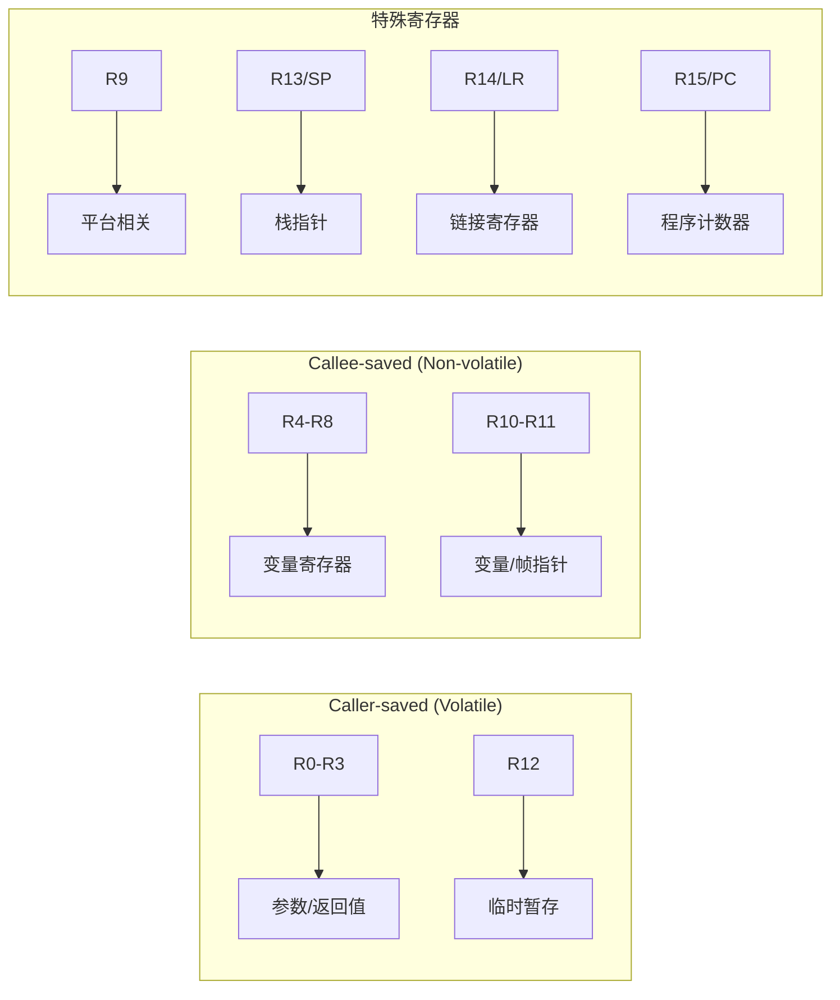
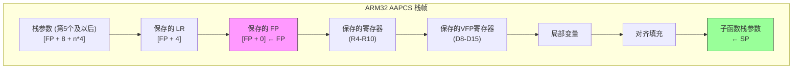

# ARM32 AAPCS 详解

> ARM32架构过程调用标准（AAPCS）完整规范，包含R0-R3参数传递、R0-R1返回值、栈帧结构和对齐要求

## 概述

AAPCS（ARM Architecture Procedure Call Standard）是ARM32架构的标准过程调用约定，定义了函数调用时参数传递、返回值处理、寄存器使用和栈管理的规则。该标准确保了不同编译器生成的代码能够正确互操作。

### 适用范围

| 架构版本 | 处理器系列 | 适用性 |
|----------|------------|--------|
| ARMv4T | ARM7TDMI | ✓ |
| ARMv5TE | ARM9E, ARM10E | ✓ |
| ARMv6 | ARM11 | ✓ |
| ARMv7-A | Cortex-A5/A7/A8/A9/A15/A17 | ✓ |
| ARMv7-R | Cortex-R4/R5/R7/R8 | ✓ |
| ARMv7-M | Cortex-M0/M3/M4/M7 | ✓（有变体） |

### 核心特性概览

| 特性 | 规范 |
|------|------|
| **整数参数寄存器** | R0, R1, R2, R3（4个） |
| **浮点参数寄存器** | S0-S15 / D0-D7（VFP硬浮点） |
| **整数返回值** | R0（32位）/ R0-R1（64位） |
| **浮点返回值** | S0 / D0 |
| **栈对齐** | 8字节（公共接口） |
| **栈清理** | 调用者（Caller） |
| **帧指针** | R11（可选） |
| **链接寄存器** | R14（LR） |

---

## 寄存器分类

### 通用寄存器概览

ARM32提供16个32位通用寄存器，AAPCS对每个寄存器定义了特定用途：

| 寄存器 | AAPCS别名 | 用途 | 保存责任 |
|--------|-----------|------|----------|
| R0 | a1 | 参数1 / 返回值 | Caller-saved |
| R1 | a2 | 参数2 / 返回值高位 | Caller-saved |
| R2 | a3 | 参数3 | Caller-saved |
| R3 | a4 | 参数4 | Caller-saved |
| R4 | v1 | 变量寄存器1 | Callee-saved |
| R5 | v2 | 变量寄存器2 | Callee-saved |
| R6 | v3 | 变量寄存器3 | Callee-saved |
| R7 | v4 | 变量寄存器4 / Thumb帧指针 | Callee-saved |
| R8 | v5 | 变量寄存器5 | Callee-saved |
| R9 | v6/SB/TR | 平台相关 | 平台定义 |
| R10 | v7 | 变量寄存器7 | Callee-saved |
| R11 | v8/FP | 帧指针（ARM状态） | Callee-saved |
| R12 | IP | 过程内调用暂存 | Caller-saved |
| R13 | SP | 栈指针 | 特殊 |
| R14 | LR | 链接寄存器 | 特殊 |
| R15 | PC | 程序计数器 | 特殊 |

### 调用者保存寄存器（Caller-saved / Volatile）

这些寄存器在函数调用后可能被修改，调用者如需保留其值必须自行保存：

```
Caller-saved 寄存器:
┌─────────────────────────────────────────────────────────┐
│  R0 (a1)  │  R1 (a2)  │  R2 (a3)  │  R3 (a4)  │  R12 (IP)  │
│  参数/返回 │  参数/返回 │   参数    │   参数    │   临时     │
└─────────────────────────────────────────────────────────┘
```

| 寄存器 | 说明 |
|--------|------|
| R0-R3 | 参数传递和返回值，函数可自由修改 |
| R12 (IP) | 过程内调用暂存，链接器可能使用 |

### 被调用者保存寄存器（Callee-saved / Non-volatile）

这些寄存器在函数调用后必须保持原值，被调用函数如需使用必须先保存再恢复：

```
Callee-saved 寄存器:
┌─────────────────────────────────────────────────────────────────────┐
│  R4 (v1)  │  R5 (v2)  │  R6 (v3)  │  R7 (v4)  │  R8 (v5)  │        │
├───────────┼───────────┼───────────┼───────────┼───────────┤        │
│  R10 (v7) │  R11 (FP) │                                    │        │
└─────────────────────────────────────────────────────────────────────┘
```

| 寄存器 | 说明 |
|--------|------|
| R4-R8 | 通用变量寄存器，函数必须保存和恢复 |
| R10-R11 | 变量寄存器和帧指针 |

### 特殊寄存器

| 寄存器 | 说明 |
|--------|------|
| R9 | 平台相关，可能是静态基址(SB)、线程寄存器(TR)或通用寄存器 |
| R13 (SP) | 栈指针，必须保持8字节对齐 |
| R14 (LR) | 链接寄存器，保存返回地址 |
| R15 (PC) | 程序计数器，不可直接作为通用寄存器使用 |

### 寄存器分类图示



---

## 整数参数传递

### 参数寄存器顺序

AAPCS使用4个寄存器传递整数和指针参数：

| 参数位置 | 寄存器 | 别名 | 说明 |
|----------|--------|------|------|
| 第1个参数 | R0 | a1 | 第一个字（32位） |
| 第2个参数 | R1 | a2 | 第二个字 |
| 第3个参数 | R2 | a3 | 第三个字 |
| 第4个参数 | R3 | a4 | 第四个字 |
| 第5个及以后 | 栈 | - | 从左到右入栈 |

### 参数传递规则

#### 基本规则

1. **整数和指针类型**：使用R0-R3传递前4个字（32位）参数
2. **小于32位的整数**：零扩展或符号扩展到32位
3. **超过4个参数**：第5个及以后的参数通过栈传递
4. **栈参数顺序**：按声明顺序入栈（第5个参数在最低地址）

#### 64位参数对齐规则

**重要**：64位参数（如`long long`、`double`）必须在偶数寄存器对开始：

| 情况 | 分配方式 |
|------|----------|
| 第1个64位参数 | R0-R1 |
| 第2个64位参数（如果R2-R3可用） | R2-R3 |
| 64位参数在R1时 | 跳过R1，使用R2-R3 |
| 寄存器不足 | 通过栈传递（8字节对齐） |

### 参数传递示例

```
函数: int func(int a, int b, int c, int d, int e, int f)

寄存器分配:
┌─────────────────────────────────────────────────────────┐
│ 参数 a → R0    参数 b → R1    参数 c → R2    参数 d → R3 │
└─────────────────────────────────────────────────────────┘

栈布局（函数入口时）:
高地址
┌─────────────────┐
│    参数 f       │  [SP + 4]
├─────────────────┤
│    参数 e       │  [SP + 0]  ← SP
└─────────────────┘
低地址
```

### 64位参数对齐示例

```
函数: void func(int a, long long b, int c)

参数分配:
┌─────────────────────────────────────────────────────────┐
│ a → R0                                                  │
│ b → R2-R3 (跳过R1以保持64位对齐)                        │
│ c → 栈 [SP + 0]                                         │
│ R1 → 未使用（填充）                                     │
└─────────────────────────────────────────────────────────┘

函数: void func(long long a, long long b, int c)

参数分配:
┌─────────────────────────────────────────────────────────┐
│ a → R0-R1                                               │
│ b → R2-R3                                               │
│ c → 栈 [SP + 0]                                         │
└─────────────────────────────────────────────────────────┘
```

### 代码示例

#### ARM汇编语法

```arm
@ 函数: int sum_six(int a, int b, int c, int d, int e, int f)
@ 参数: R0=a, R1=b, R2=c, R3=d, [SP]=e, [SP+4]=f
@ 返回: R0=a+b+c+d+e+f

    .text
    .global sum_six
    .type sum_six, %function

sum_six:
    @ 寄存器参数相加
    ADD     R0, R0, R1          @ R0 = a + b
    ADD     R0, R0, R2          @ R0 += c
    ADD     R0, R0, R3          @ R0 += d
    
    @ 栈参数相加
    LDR     R1, [SP, #0]        @ R1 = e
    ADD     R0, R0, R1          @ R0 += e
    LDR     R1, [SP, #4]        @ R1 = f
    ADD     R0, R0, R1          @ R0 += f
    
    BX      LR                  @ 返回

    .size sum_six, .-sum_six
```

#### 调用示例

```arm
@ 调用 sum_six(1, 2, 3, 4, 5, 6)

    .text
    .global caller_example
    .type caller_example, %function

caller_example:
    PUSH    {LR}                @ 保存返回地址
    SUB     SP, SP, #8          @ 分配栈参数空间（8字节对齐）
    
    @ 设置栈参数
    MOV     R0, #5
    STR     R0, [SP, #0]        @ 参数 e = 5
    MOV     R0, #6
    STR     R0, [SP, #4]        @ 参数 f = 6
    
    @ 设置寄存器参数
    MOV     R0, #1              @ 参数 a = 1
    MOV     R1, #2              @ 参数 b = 2
    MOV     R2, #3              @ 参数 c = 3
    MOV     R3, #4              @ 参数 d = 4
    
    BL      sum_six             @ 调用函数
    
    @ 清理栈（调用者清理）
    ADD     SP, SP, #8
    
    @ 结果在 R0 中
    POP     {PC}                @ 返回

    .size caller_example, .-caller_example
```

#### 64位参数示例

```arm
@ 函数: long long add64(int a, long long b, int c)
@ 参数: R0=a, R2-R3=b (R1跳过), [SP]=c
@ 返回: R0-R1

    .text
    .global add64
    .type add64, %function

add64:
    @ 将32位参数a符号扩展到64位
    MOV     R1, R0, ASR #31     @ R1 = 符号扩展
    
    @ 64位加法: (R0,R1) + (R2,R3)
    ADDS    R0, R0, R2          @ 低32位相加
    ADC     R1, R1, R3          @ 高32位相加（带进位）
    
    @ 加上栈参数c
    LDR     R2, [SP, #0]        @ R2 = c
    MOV     R3, R2, ASR #31     @ R3 = 符号扩展
    ADDS    R0, R0, R2          @ 低32位相加
    ADC     R1, R1, R3          @ 高32位相加
    
    BX      LR

    .size add64, .-add64
```

---

## 返回值规则

### 整数返回值

| 返回类型 | 寄存器 | 说明 |
|----------|--------|------|
| 8位整数 | R0 | 零扩展或符号扩展到32位 |
| 16位整数 | R0 | 零扩展或符号扩展到32位 |
| 32位整数 | R0 | 完整32位 |
| 64位整数 | R0-R1 | R0=低32位，R1=高32位 |
| 指针 | R0 | 32位地址 |

### 返回值寄存器布局

```
32位返回值:
┌─────────────────────────────────────────┐
│                  R0                     │
│              (32位返回值)               │
└─────────────────────────────────────────┘

64位返回值:
┌─────────────────────────────────────────┐
│        R1 (高32位)  │  R0 (低32位)      │
│                     │                   │
│  bits 63-32         │  bits 31-0        │
└─────────────────────────────────────────┘
```

### 浮点返回值（VFP硬浮点）

| 返回类型 | 寄存器 | 说明 |
|----------|--------|------|
| float | S0 | 单精度浮点 |
| double | D0 | 双精度浮点 |

### 结构体返回值

结构体返回值的处理取决于其大小：

| 结构体大小 | 返回方式 | 说明 |
|------------|----------|------|
| ≤4字节 | R0 | 直接在寄存器中返回 |
| ≤8字节 | R0-R1 | 使用两个寄存器 |
| >8字节 | 隐藏指针 | 调用者分配空间，地址通过R0传入 |

### 返回值代码示例

```arm
@ 返回32位整数
@ int get_value(void)
get_value:
    MOV     R0, #42             @ 返回值 = 42
    BX      LR

@ 返回64位整数
@ long long get_big_value(void)
get_big_value:
    LDR     R0, =0xDEADBEEF     @ 低32位
    LDR     R1, =0x12345678     @ 高32位
    BX      LR

@ 返回小型结构体（8字节以内）
@ struct Point { int x, y; };
@ Point get_point(void)
get_point:
    MOV     R0, #100            @ x = 100
    MOV     R1, #200            @ y = 200
    BX      LR

@ 返回大型结构体（通过隐藏指针）
@ struct BigStruct { int data[4]; };
@ BigStruct get_big_struct(void)
@ 隐藏指针在 R0 中传入
get_big_struct:
    @ R0 指向调用者分配的空间
    MOV     R1, #1
    STR     R1, [R0, #0]        @ data[0] = 1
    MOV     R1, #2
    STR     R1, [R0, #4]        @ data[1] = 2
    MOV     R1, #3
    STR     R1, [R0, #8]        @ data[2] = 3
    MOV     R1, #4
    STR     R1, [R0, #12]       @ data[3] = 4
    @ R0 保持不变，作为返回值
    BX      LR
```

### 调用返回大型结构体的函数

```arm
@ 调用返回大型结构体的函数
caller_big_struct:
    PUSH    {R4, LR}
    SUB     SP, SP, #24         @ 分配空间：16字节结构体 + 8字节对齐
    
    @ 设置隐藏指针参数
    MOV     R0, SP              @ R0 = 结构体存储地址
    BL      get_big_struct      @ 调用函数
    
    @ 现在 [SP] 到 [SP+12] 包含返回的结构体
    LDR     R4, [SP, #0]        @ 读取 data[0]
    
    ADD     SP, SP, #24
    POP     {R4, PC}
```

---

## 浮点参数传递（VFP/NEON）

### 浮点调用约定变体

ARM32有两种主要的浮点调用约定：

| 变体 | 名称 | 浮点参数传递 | 使用场景 |
|------|------|--------------|----------|
| **软浮点** | soft-float / softfp | 通过R0-R3和栈 | 无FPU或兼容性需求 |
| **硬浮点** | hard-float / hardfp | 通过S0-S15/D0-D7 | 有VFP/NEON硬件 |

### 硬浮点参数寄存器

| 参数类型 | 寄存器 | 说明 |
|----------|--------|------|
| float (前16个) | S0-S15 | 单精度浮点寄存器 |
| double (前8个) | D0-D7 | 双精度浮点寄存器 |
| 超出数量 | 栈 | 按8字节对齐入栈 |

### VFP寄存器布局

```
VFP/NEON 寄存器组织:

128位 Q寄存器:
┌────────────────────────────────────────────────────────────────────────────┐
│                              Q0 (128位)                                    │
├────────────────────────────────────────┬───────────────────────────────────┤
│              D1 (64位)                 │            D0 (64位)              │
├────────────────────┬───────────────────┼───────────────────┬───────────────┤
│    S3 (32位)       │    S2 (32位)      │    S1 (32位)      │   S0 (32位)   │
└────────────────────┴───────────────────┴───────────────────┴───────────────┘

参数寄存器分配:
┌─────────────────────────────────────────────────────────────────────────────┐
│ 单精度参数: S0, S1, S2, S3, S4, S5, S6, S7, S8, S9, S10, S11, S12, S13, S14, S15 │
├─────────────────────────────────────────────────────────────────────────────┤
│ 双精度参数: D0, D1, D2, D3, D4, D5, D6, D7                                  │
└─────────────────────────────────────────────────────────────────────────────┘
```

### VFP寄存器保存规则

| 寄存器 | 保存责任 | 说明 |
|--------|----------|------|
| S0-S15 / D0-D7 | Caller-saved | 参数和临时寄存器 |
| S16-S31 / D8-D15 | Callee-saved | 被调用者必须保存 |
| D16-D31 | Caller-saved | 仅NEON可用 |

### 浮点参数传递规则

#### 硬浮点（VFP）规则

1. **float参数**：按顺序分配到S0-S15
2. **double参数**：按顺序分配到D0-D7
3. **混合参数**：float和double独立计数，但共享寄存器空间
4. **回填规则**：如果double占用了D寄存器，之前跳过的S寄存器可用于后续float参数

#### 软浮点规则

1. **float参数**：作为32位整数通过R0-R3传递
2. **double参数**：作为64位整数通过R0-R1或R2-R3传递（需对齐）
3. **超出寄存器**：通过栈传递

### 浮点代码示例

#### 硬浮点示例

```arm
@ 函数: float add_floats(float a, float b, float c, float d)
@ 参数: S0=a, S1=b, S2=c, S3=d (硬浮点)
@ 返回: S0

    .text
    .global add_floats
    .type add_floats, %function
    .fpu vfpv3

add_floats:
    VADD.F32 S0, S0, S1         @ S0 = a + b
    VADD.F32 S0, S0, S2         @ S0 += c
    VADD.F32 S0, S0, S3         @ S0 += d
    BX      LR

    .size add_floats, .-add_floats

@ 函数: double add_doubles(double a, double b)
@ 参数: D0=a, D1=b (硬浮点)
@ 返回: D0

    .global add_doubles
    .type add_doubles, %function

add_doubles:
    VADD.F64 D0, D0, D1         @ D0 = a + b
    BX      LR

    .size add_doubles, .-add_doubles
```

#### 混合整数和浮点参数

```arm
@ 函数: double mixed_params(int n, double x, int m, double y)
@ 硬浮点: R0=n, D0=x, R1=m, D1=y
@ 返回: D0 = n*x + m*y

    .text
    .global mixed_params
    .type mixed_params, %function
    .fpu vfpv3

mixed_params:
    @ 将整数转换为双精度浮点
    VMOV    S4, R0              @ S4 = n (作为整数)
    VCVT.F64.S32 D2, S4         @ D2 = (double)n
    
    VMOV    S4, R1              @ S4 = m (作为整数)
    VCVT.F64.S32 D3, S4         @ D3 = (double)m
    
    @ 计算 n*x + m*y
    VMUL.F64 D2, D2, D0         @ D2 = n * x
    VMUL.F64 D3, D3, D1         @ D3 = m * y
    VADD.F64 D0, D2, D3         @ D0 = n*x + m*y
    
    BX      LR

    .size mixed_params, .-mixed_params
```

#### 软浮点示例

```arm
@ 函数: float add_floats_soft(float a, float b)
@ 软浮点: R0=a, R1=b (IEEE 754格式)
@ 返回: R0

    .text
    .global add_floats_soft
    .type add_floats_soft, %function
    .fpu vfpv3

add_floats_soft:
    @ 将整数寄存器中的浮点值移到VFP寄存器
    VMOV    S0, R0              @ S0 = a
    VMOV    S1, R1              @ S1 = b
    
    @ 执行浮点加法
    VADD.F32 S0, S0, S1         @ S0 = a + b
    
    @ 将结果移回整数寄存器
    VMOV    R0, S0              @ R0 = 结果
    
    BX      LR

    .size add_floats_soft, .-add_floats_soft
```

### 保存VFP寄存器

```arm
@ 保存和恢复VFP callee-saved寄存器
function_using_vfp:
    PUSH    {R4-R11, LR}        @ 保存整数寄存器
    VPUSH   {D8-D15}            @ 保存VFP callee-saved寄存器
    
    @ 函数体，可以自由使用D0-D7和D8-D15
    
    VPOP    {D8-D15}            @ 恢复VFP寄存器
    POP     {R4-R11, PC}        @ 恢复整数寄存器并返回
```

---

## 栈帧结构

### 标准栈帧布局

```
ARM32 AAPCS 标准栈帧:

高地址
┌─────────────────────────────────────────┐
│         调用者的栈帧                     │
├─────────────────────────────────────────┤
│         栈参数 N                         │  [FP + 8 + (N-5)*4]
├─────────────────────────────────────────┤
│         ...                             │
├─────────────────────────────────────────┤
│         栈参数 6                         │  [FP + 12]
├─────────────────────────────────────────┤
│         栈参数 5                         │  [FP + 8]
├─────────────────────────────────────────┤ ← 函数入口时的SP
│         保存的 LR (R14)                  │  [FP + 4]
├─────────────────────────────────────────┤
│         保存的 FP (R11)                  │  [FP + 0]  ← FP (R11)
├─────────────────────────────────────────┤
│         保存的寄存器                     │  [FP - 4] 等
│         (R4-R10, 可能还有R9)             │
├─────────────────────────────────────────┤
│         保存的VFP寄存器                  │
│         (D8-D15, 如果使用)               │
├─────────────────────────────────────────┤
│         局部变量                         │
├─────────────────────────────────────────┤
│         临时空间                         │
├─────────────────────────────────────────┤
│         子函数的栈参数                   │  ← SP (8字节对齐)
└─────────────────────────────────────────┘
低地址

栈增长方向: 向低地址增长 ↓
```

### 栈帧结构图示



### 栈对齐要求

| 场景 | 对齐要求 | 说明 |
|------|----------|------|
| **公共接口** | 8字节 | 函数入口和出口时SP必须8字节对齐 |
| **私有接口** | 4字节 | 内部函数可以使用4字节对齐 |
| **64位数据** | 8字节 | long long、double等需要8字节对齐 |
| **NEON向量** | 8字节 | 64位向量需要8字节对齐 |

### 栈对齐示例

```
8字节对齐检查:

正确对齐 (SP % 8 == 0):
┌─────────────────┐
│                 │  地址: 0x1000 (8字节对齐)
├─────────────────┤
│                 │  地址: 0x0FF8 (8字节对齐)
└─────────────────┘ ← SP

错误对齐 (SP % 8 == 4):
┌─────────────────┐
│                 │  地址: 0x0FFC (未对齐!)
└─────────────────┘ ← SP
```

### 函数序言和尾声

#### 标准序言（Prologue）

```arm
@ 标准函数序言
function_name:
    @ 保存寄存器（包括LR）
    PUSH    {R4-R11, LR}        @ 保存callee-saved寄存器和返回地址
    
    @ 建立帧指针（可选但推荐用于调试）
    ADD     R11, SP, #28        @ FP指向保存的R11位置
                                @ 28 = 7个寄存器 * 4字节 - 4
    
    @ 分配局部变量空间
    SUB     SP, SP, #16         @ 分配16字节局部变量空间
    
    @ 确保8字节对齐
    BIC     SP, SP, #7          @ 清除低3位，强制8字节对齐
```

#### 简化序言（无帧指针）

```arm
@ 简化函数序言（叶子函数或优化代码）
leaf_function:
    PUSH    {R4-R7, LR}         @ 只保存需要的寄存器
    SUB     SP, SP, #12         @ 分配局部变量空间
    @ 注意：PUSH了5个寄存器(20字节)，再减12字节，总共32字节，8字节对齐
```

#### 标准尾声（Epilogue）

```arm
@ 标准函数尾声
    @ 恢复栈指针
    SUB     R11, R11, #28       @ 或使用保存的值
    MOV     SP, R11
    
    @ 恢复寄存器并返回
    POP     {R4-R11, PC}        @ 恢复寄存器，PC=LR实现返回

@ 或者使用简化形式
    ADD     SP, SP, #16         @ 释放局部变量空间
    POP     {R4-R11, PC}        @ 恢复并返回
```

### 完整函数示例

```arm
@ 完整的函数示例
@ int process_data(int* data, int len, int multiplier)
@ 参数: R0=data, R1=len, R2=multiplier
@ 返回: R0=处理后的数据之和

    .text
    .global process_data
    .type process_data, %function

process_data:
    @ === 序言 ===
    PUSH    {R4-R8, LR}         @ 保存寄存器（6个 = 24字节，8字节对齐）
    
    @ 保存参数到callee-saved寄存器
    MOV     R4, R0              @ R4 = data
    MOV     R5, R1              @ R5 = len
    MOV     R6, R2              @ R6 = multiplier
    MOV     R7, #0              @ R7 = sum = 0
    
    @ === 函数体 ===
    CMP     R5, #0              @ 检查长度
    BLE     .done               @ 如果 len <= 0，跳到结束
    
.loop:
    LDR     R8, [R4], #4        @ R8 = *data++
    MUL     R8, R8, R6          @ R8 *= multiplier
    ADD     R7, R7, R8          @ sum += R8
    SUBS    R5, R5, #1          @ len--
    BNE     .loop               @ 如果 len != 0，继续循环
    
.done:
    MOV     R0, R7              @ 返回值 = sum
    
    @ === 尾声 ===
    POP     {R4-R8, PC}         @ 恢复寄存器并返回

    .size process_data, .-process_data
```

### Thumb模式栈帧

在Thumb模式下，栈帧结构略有不同：

```arm
@ Thumb模式函数
    .thumb
    .thumb_func
    .global thumb_function
    .type thumb_function, %function

thumb_function:
    PUSH    {R4-R7, LR}         @ Thumb PUSH只能使用R0-R7和LR
    
    @ 如果需要保存R8-R11，需要特殊处理
    MOV     R4, R8              @ 将R8移到低寄存器
    MOV     R5, R9
    MOV     R6, R10
    MOV     R7, R11
    PUSH    {R4-R7}             @ 保存高寄存器
    
    @ 函数体...
    
    @ 恢复高寄存器
    POP     {R4-R7}
    MOV     R8, R4
    MOV     R9, R5
    MOV     R10, R6
    MOV     R11, R7
    
    POP     {R4-R7, PC}         @ 恢复并返回

    .size thumb_function, .-thumb_function
```

---

## 函数调用示例

### 示例1：简单函数调用

```arm
@ 被调用函数: int add(int a, int b)
    .text
    .global add
    .type add, %function

add:
    ADD     R0, R0, R1          @ R0 = a + b
    BX      LR                  @ 返回

    .size add, .-add

@ 调用者函数
    .global caller
    .type caller, %function

caller:
    PUSH    {LR}                @ 保存返回地址
    
    MOV     R0, #10             @ 参数 a = 10
    MOV     R1, #20             @ 参数 b = 20
    BL      add                 @ 调用 add(10, 20)
    
    @ 结果在 R0 中 (= 30)
    
    POP     {PC}                @ 返回

    .size caller, .-caller
```

### 示例2：调用C库函数

```arm
@ 调用 printf 函数
    .data
format_str:
    .asciz "Result: %d\n"

    .text
    .global print_result
    .type print_result, %function

print_result:
    @ 参数: R0 = 要打印的值
    PUSH    {R4, LR}            @ 保存寄存器（8字节对齐）
    
    MOV     R1, R0              @ R1 = 值（printf的第2个参数）
    LDR     R0, =format_str     @ R0 = 格式字符串（printf的第1个参数）
    BL      printf              @ 调用 printf
    
    POP     {R4, PC}            @ 恢复并返回

    .size print_result, .-print_result
```

### 示例3：递归函数

```arm
@ 递归计算阶乘: int factorial(int n)
    .text
    .global factorial
    .type factorial, %function

factorial:
    PUSH    {R4, LR}            @ 保存寄存器
    
    CMP     R0, #1              @ 比较 n 和 1
    BLE     .base_case          @ 如果 n <= 1，返回1
    
    @ 递归情况: n * factorial(n-1)
    MOV     R4, R0              @ R4 = n（保存到callee-saved寄存器）
    SUB     R0, R0, #1          @ R0 = n - 1
    BL      factorial           @ 递归调用 factorial(n-1)
    MUL     R0, R4, R0          @ R0 = n * factorial(n-1)
    B       .return
    
.base_case:
    MOV     R0, #1              @ 返回 1
    
.return:
    POP     {R4, PC}            @ 恢复并返回

    .size factorial, .-factorial
```

### 示例4：数组处理

```arm
@ 计算数组元素之和: int sum_array(int* arr, int len)
    .text
    .global sum_array
    .type sum_array, %function

sum_array:
    PUSH    {R4-R6, LR}         @ 保存寄存器
    
    MOV     R4, R0              @ R4 = arr
    MOV     R5, R1              @ R5 = len
    MOV     R6, #0              @ R6 = sum = 0
    
    CMP     R5, #0              @ 检查长度
    BLE     .sum_done           @ 如果 len <= 0，返回0
    
.sum_loop:
    LDR     R0, [R4], #4        @ R0 = *arr++
    ADD     R6, R6, R0          @ sum += R0
    SUBS    R5, R5, #1          @ len--
    BNE     .sum_loop           @ 如果 len != 0，继续
    
.sum_done:
    MOV     R0, R6              @ 返回 sum
    POP     {R4-R6, PC}         @ 恢复并返回

    .size sum_array, .-sum_array
```

### 示例5：结构体参数

```arm
@ 结构体定义:
@ struct Point {
@     int x;  @ 偏移 0
@     int y;  @ 偏移 4
@ };

@ 函数: int distance_squared(struct Point p1, struct Point p2)
@ 小结构体通过寄存器传递:
@ p1.x = R0, p1.y = R1
@ p2.x = R2, p2.y = R3

    .text
    .global distance_squared
    .type distance_squared, %function

distance_squared:
    @ 计算 (p2.x - p1.x)^2 + (p2.y - p1.y)^2
    SUB     R2, R2, R0          @ R2 = p2.x - p1.x
    SUB     R3, R3, R1          @ R3 = p2.y - p1.y
    
    MUL     R2, R2, R2          @ R2 = (p2.x - p1.x)^2
    MUL     R3, R3, R3          @ R3 = (p2.y - p1.y)^2
    
    ADD     R0, R2, R3          @ R0 = dx^2 + dy^2
    BX      LR

    .size distance_squared, .-distance_squared

@ 大结构体通过指针传递
@ struct BigStruct { int data[8]; };
@ int sum_big_struct(struct BigStruct* s)

    .global sum_big_struct
    .type sum_big_struct, %function

sum_big_struct:
    PUSH    {R4-R5, LR}
    
    MOV     R4, R0              @ R4 = s
    MOV     R5, #0              @ R5 = sum
    MOV     R1, #8              @ R1 = 计数器
    
.big_loop:
    LDR     R0, [R4], #4        @ R0 = *s++
    ADD     R5, R5, R0          @ sum += R0
    SUBS    R1, R1, #1
    BNE     .big_loop
    
    MOV     R0, R5              @ 返回 sum
    POP     {R4-R5, PC}

    .size sum_big_struct, .-sum_big_struct
```

---

## 与C语言互操作

### 从C调用汇编函数

#### C代码

```c
// main.c
#include <stdio.h>

// 声明汇编函数
extern int add(int a, int b);
extern int sum_array(int* arr, int len);
extern long long multiply64(int a, int b);

int main() {
    // 调用简单函数
    int result = add(10, 20);
    printf("add(10, 20) = %d\n", result);
    
    // 调用数组处理函数
    int arr[] = {1, 2, 3, 4, 5};
    int sum = sum_array(arr, 5);
    printf("sum_array = %d\n", sum);
    
    // 调用返回64位值的函数
    long long product = multiply64(100000, 200000);
    printf("multiply64 = %lld\n", product);
    
    return 0;
}
```

#### 汇编代码

```arm
@ asm_functions.s
    .text
    .global add
    .global sum_array
    .global multiply64

@ int add(int a, int b)
add:
    ADD     R0, R0, R1
    BX      LR

@ int sum_array(int* arr, int len)
sum_array:
    PUSH    {R4-R5, LR}
    MOV     R4, R0              @ arr
    MOV     R5, #0              @ sum
    
.loop:
    CMP     R1, #0
    BLE     .done
    LDR     R0, [R4], #4
    ADD     R5, R5, R0
    SUB     R1, R1, #1
    B       .loop
    
.done:
    MOV     R0, R5
    POP     {R4-R5, PC}

@ long long multiply64(int a, int b)
@ 返回: R0=低32位, R1=高32位
multiply64:
    SMULL   R0, R1, R0, R1      @ 有符号64位乘法
    BX      LR
```

#### 编译命令

```bash
# 编译汇编文件
arm-linux-gnueabihf-as -o asm_functions.o asm_functions.s

# 编译C文件并链接
arm-linux-gnueabihf-gcc -o program main.c asm_functions.o
```

### 从汇编调用C函数

```arm
@ 从汇编调用C函数
    .data
message:
    .asciz "Hello from assembly!\n"
format_int:
    .asciz "Value: %d\n"

    .text
    .global asm_main
    .type asm_main, %function

asm_main:
    PUSH    {R4, LR}            @ 保存寄存器（8字节对齐）
    
    @ 调用 puts(message)
    LDR     R0, =message
    BL      puts
    
    @ 调用 printf(format_int, 42)
    LDR     R0, =format_int
    MOV     R1, #42
    BL      printf
    
    @ 调用 malloc(100)
    MOV     R0, #100
    BL      malloc
    MOV     R4, R0              @ 保存返回的指针
    
    @ 使用分配的内存...
    
    @ 调用 free(ptr)
    MOV     R0, R4
    BL      free
    
    MOV     R0, #0              @ 返回 0
    POP     {R4, PC}

    .size asm_main, .-asm_main
```

### 内联汇编（GCC）

```c
// GCC ARM内联汇编示例

// 基本内联汇编
int add_inline(int a, int b) {
    int result;
    __asm__ (
        "ADD %0, %1, %2"
        : "=r" (result)         // 输出操作数
        : "r" (a), "r" (b)      // 输入操作数
    );
    return result;
}

// 带有clobber列表的内联汇编
int multiply_inline(int a, int b) {
    int result;
    __asm__ __volatile__ (
        "MUL %0, %1, %2"
        : "=r" (result)
        : "r" (a), "r" (b)
        : "cc"                  // 修改条件码
    );
    return result;
}

// 64位乘法
long long multiply64_inline(int a, int b) {
    int lo, hi;
    __asm__ (
        "SMULL %0, %1, %2, %3"
        : "=r" (lo), "=r" (hi)
        : "r" (a), "r" (b)
    );
    return ((long long)hi << 32) | (unsigned int)lo;
}

// 原子操作
int atomic_add(int* ptr, int value) {
    int result, tmp;
    __asm__ __volatile__ (
        "1:\n"
        "   LDREX   %0, [%2]\n"     // 独占加载
        "   ADD     %0, %0, %3\n"   // 加法
        "   STREX   %1, %0, [%2]\n" // 独占存储
        "   CMP     %1, #0\n"       // 检查是否成功
        "   BNE     1b\n"           // 如果失败，重试
        : "=&r" (result), "=&r" (tmp)
        : "r" (ptr), "r" (value)
        : "cc", "memory"
    );
    return result;
}
```

---

## 特殊情况处理

### 可变参数函数

```arm
@ 实现可变参数函数
@ int sum_variadic(int count, ...)

    .text
    .global sum_variadic
    .type sum_variadic, %function

sum_variadic:
    PUSH    {R4-R7, LR}
    SUB     SP, SP, #20         @ 分配空间保存参数寄存器
    
    @ 保存可能的参数寄存器到栈
    STR     R1, [SP, #0]        @ 第2个参数
    STR     R2, [SP, #4]        @ 第3个参数
    STR     R3, [SP, #8]        @ 第4个参数
    @ 第5个及以后的参数已经在栈上
    
    MOV     R4, R0              @ R4 = count
    MOV     R5, #0              @ R5 = sum
    MOV     R6, SP              @ R6 = 参数指针
    
    CMP     R4, #0
    BLE     .var_done
    
.var_loop:
    LDR     R7, [R6], #4        @ 加载下一个参数
    ADD     R5, R5, R7          @ sum += 参数
    SUBS    R4, R4, #1
    BNE     .var_loop
    
.var_done:
    MOV     R0, R5              @ 返回 sum
    ADD     SP, SP, #20
    POP     {R4-R7, PC}

    .size sum_variadic, .-sum_variadic
```

### 位置无关代码（PIC）

```arm
@ 位置无关代码示例
    .text
    .global pic_function
    .type pic_function, %function

pic_function:
    PUSH    {R4, LR}
    
    @ 获取PC相对地址
    LDR     R4, .Lgot           @ 加载GOT偏移
.Lpic:
    ADD     R4, PC, R4          @ R4 = GOT基址
    
    @ 通过GOT访问全局变量
    LDR     R0, .Lglobal_var    @ 加载变量在GOT中的偏移
    LDR     R0, [R4, R0]        @ 获取变量地址
    LDR     R0, [R0]            @ 加载变量值
    
    POP     {R4, PC}

.Lgot:
    .word   _GLOBAL_OFFSET_TABLE_ - (.Lpic + 8)
.Lglobal_var:
    .word   global_var(GOT)

    .size pic_function, .-pic_function
```

### 异常处理和栈展开

```arm
@ 带有异常处理信息的函数
    .text
    .global function_with_unwind
    .type function_with_unwind, %function
    .fnstart                    @ 开始展开信息

function_with_unwind:
    .save   {R4-R11, LR}        @ 声明保存的寄存器
    PUSH    {R4-R11, LR}
    
    .pad    #16                 @ 声明栈调整
    SUB     SP, SP, #16
    
    @ 函数体...
    
    ADD     SP, SP, #16
    POP     {R4-R11, PC}
    
    .fnend                      @ 结束展开信息

    .size function_with_unwind, .-function_with_unwind
```

### ARM/Thumb互操作

```arm
@ ARM和Thumb代码互操作
    .text
    
@ ARM模式函数
    .arm
    .global arm_function
    .type arm_function, %function

arm_function:
    PUSH    {LR}
    
    @ 调用Thumb函数
    BLX     thumb_function      @ BLX自动切换模式
    
    POP     {PC}

    .size arm_function, .-arm_function

@ Thumb模式函数
    .thumb
    .thumb_func
    .global thumb_function
    .type thumb_function, %function

thumb_function:
    PUSH    {LR}
    
    @ 调用ARM函数
    BLX     arm_helper          @ BLX自动切换模式
    
    POP     {PC}

    .size thumb_function, .-thumb_function
```

---

## 平台特定变体

### R9寄存器的平台特定用途

R9寄存器在不同平台上有不同用途：

| 平台 | R9用途 | 说明 |
|------|--------|------|
| **Linux (通用)** | v6 | 通用callee-saved寄存器 |
| **Linux (PIC)** | SB | 静态基址寄存器 |
| **iOS** | 保留 | 系统保留 |
| **Windows CE** | 保留 | 系统保留 |
| **RTOS** | TR | 线程寄存器 |

### Cortex-M系列变体

Cortex-M系列处理器使用简化的AAPCS变体：

| 特性 | Cortex-A/R | Cortex-M |
|------|------------|----------|
| **执行模式** | ARM + Thumb | 仅Thumb-2 |
| **帧指针** | R11 | R7 |
| **异常处理** | 软件管理 | 硬件自动保存 |
| **栈对齐** | 8字节 | 8字节 |

#### Cortex-M异常栈帧

```
Cortex-M 异常自动保存的栈帧:

高地址
┌─────────────────────────────────────────┐
│         xPSR                            │  [SP + 28]
├─────────────────────────────────────────┤
│         PC (返回地址)                    │  [SP + 24]
├─────────────────────────────────────────┤
│         LR (R14)                        │  [SP + 20]
├─────────────────────────────────────────┤
│         R12                             │  [SP + 16]
├─────────────────────────────────────────┤
│         R3                              │  [SP + 12]
├─────────────────────────────────────────┤
│         R2                              │  [SP + 8]
├─────────────────────────────────────────┤
│         R1                              │  [SP + 4]
├─────────────────────────────────────────┤
│         R0                              │  [SP + 0]  ← SP
└─────────────────────────────────────────┘
低地址

注意: 硬件自动保存R0-R3, R12, LR, PC, xPSR
      软件需要保存R4-R11（如果使用）
```

#### Cortex-M中断处理示例

```arm
@ Cortex-M 中断处理函数
    .thumb
    .thumb_func
    .global SysTick_Handler
    .type SysTick_Handler, %function

SysTick_Handler:
    @ R0-R3, R12, LR, PC, xPSR 已由硬件自动保存
    
    @ 如果需要使用R4-R11，手动保存
    PUSH    {R4-R7}
    
    @ 中断处理代码...
    LDR     R4, =tick_count
    LDR     R5, [R4]
    ADD     R5, R5, #1
    STR     R5, [R4]
    
    @ 恢复寄存器
    POP     {R4-R7}
    
    @ 返回（硬件自动恢复其他寄存器）
    BX      LR

    .size SysTick_Handler, .-SysTick_Handler
```

### Linux系统调用

```arm
@ Linux ARM32 系统调用
@ 系统调用号通过 R7 传递
@ 参数通过 R0-R6 传递
@ 返回值在 R0

    .text
    .global sys_write
    .type sys_write, %function

@ ssize_t sys_write(int fd, const void* buf, size_t count)
sys_write:
    PUSH    {R7, LR}
    
    @ 参数已经在正确的寄存器中
    @ R0 = fd, R1 = buf, R2 = count
    
    MOV     R7, #4              @ __NR_write = 4
    SVC     #0                  @ 系统调用
    
    POP     {R7, PC}

    .size sys_write, .-sys_write

@ void sys_exit(int status)
    .global sys_exit
    .type sys_exit, %function

sys_exit:
    MOV     R7, #1              @ __NR_exit = 1
    SVC     #0                  @ 系统调用
    @ 不会返回

    .size sys_exit, .-sys_exit
```

---

## 调试和验证

### 使用GDB调试

```bash
# 启动GDB调试ARM程序
arm-linux-gnueabihf-gdb ./program

# 常用调试命令
(gdb) break function_name      # 设置断点
(gdb) info registers           # 查看所有寄存器
(gdb) info registers r0 r1 r2 r3  # 查看特定寄存器
(gdb) x/10x $sp                # 查看栈内容
(gdb) disassemble              # 反汇编当前函数
(gdb) stepi                    # 单步执行指令
(gdb) nexti                    # 单步执行（跳过函数调用）
```

### 验证栈对齐

```arm
@ 运行时栈对齐检查
    .text
    .global check_stack_alignment
    .type check_stack_alignment, %function

check_stack_alignment:
    @ 检查SP是否8字节对齐
    TST     SP, #7              @ 测试低3位
    BNE     .alignment_error    @ 如果非零，未对齐
    
    MOV     R0, #1              @ 返回1表示对齐正确
    BX      LR
    
.alignment_error:
    MOV     R0, #0              @ 返回0表示对齐错误
    BX      LR

    .size check_stack_alignment, .-check_stack_alignment
```

### 编译器生成代码分析

```bash
# 查看编译器生成的汇编代码
arm-linux-gnueabihf-gcc -S -O2 source.c -o source.s

# 查看带有C源码注释的汇编
arm-linux-gnueabihf-gcc -S -O2 -fverbose-asm source.c -o source.s

# 查看目标文件的反汇编
arm-linux-gnueabihf-objdump -d object.o

# 查看调用约定信息
arm-linux-gnueabihf-readelf -A object.o
```

---

## 常见错误和最佳实践

### 常见错误

| 错误类型 | 描述 | 解决方案 |
|----------|------|----------|
| **栈未对齐** | SP不是8字节对齐 | 确保PUSH/POP成对，或手动对齐 |
| **寄存器未保存** | 修改了callee-saved寄存器但未保存 | 在序言中保存，尾声中恢复 |
| **64位参数未对齐** | 64位参数未从偶数寄存器开始 | 跳过奇数寄存器 |
| **LR被覆盖** | 调用函数前未保存LR | 在序言中PUSH {LR} |
| **栈参数偏移错误** | 计算栈参数偏移时出错 | 考虑PUSH的寄存器数量 |

### 最佳实践

#### 1. 始终保持栈对齐

```arm
@ 好的做法：保持8字节对齐
function:
    PUSH    {R4-R7, LR}         @ 5个寄存器 = 20字节
    SUB     SP, SP, #4          @ 额外4字节，总共24字节（8的倍数）
    
    @ 函数体...
    
    ADD     SP, SP, #4
    POP     {R4-R7, PC}
```

#### 2. 使用帧指针便于调试

```arm
@ 使用帧指针的函数
function_with_fp:
    PUSH    {R4-R11, LR}
    ADD     R11, SP, #28        @ 建立帧指针
    SUB     SP, SP, #16
    
    @ 通过FP访问参数和局部变量
    @ 参数: [R11 + 8], [R11 + 12], ...
    @ 局部变量: [R11 - 32], [R11 - 36], ...
    
    SUB     SP, R11, #28
    POP     {R4-R11, PC}
```

#### 3. 正确处理64位值

```arm
@ 正确的64位加法
add64_correct:
    @ 输入: R0-R1 = a, R2-R3 = b
    @ 输出: R0-R1 = a + b
    ADDS    R0, R0, R2          @ 低32位相加，设置进位
    ADC     R1, R1, R3          @ 高32位相加，加上进位
    BX      LR
```

#### 4. 使用条件执行优化

```arm
@ 使用条件执行避免分支
@ int abs(int x)
abs_optimized:
    CMP     R0, #0
    RSBLT   R0, R0, #0          @ 如果 x < 0，R0 = -R0
    BX      LR
```

---

## 参考资料

### 官方文档

- [Procedure Call Standard for the ARM Architecture (AAPCS)](https://github.com/ARM-software/abi-aa/blob/main/aapcs32/aapcs32.rst) - ARM官方AAPCS规范
- [ARM Architecture Reference Manual ARMv7-A and ARMv7-R edition](https://developer.arm.com/documentation/ddi0406/latest) - ARMv7架构参考手册
- [ARM Compiler armasm User Guide](https://developer.arm.com/documentation/dui0473/latest) - ARM汇编器用户指南

### 扩展阅读

- [ARM Developer Documentation](https://developer.arm.com/documentation) - ARM开发者文档中心
- [ARM Cortex-A Series Programmer's Guide](https://developer.arm.com/documentation/den0013/latest) - Cortex-A编程指南
- [ARM Cortex-M Programming Guide](https://developer.arm.com/documentation/dui0552/latest) - Cortex-M编程指南

### 相关章节

- [ARM架构概述](overview.md) - ARM32和ARM64架构对比
- [ARM64 AAPCS64](arm64-aapcs64.md) - ARM64调用约定详解
- [ARM寄存器参考](registers.md) - ARM寄存器完整说明

---

## 快速参考卡

### 寄存器用途速查

| 寄存器 | 用途 | 保存责任 |
|--------|------|----------|
| R0-R3 | 参数/返回值 | Caller |
| R4-R11 | 变量 | Callee |
| R12 | 临时 | Caller |
| R13/SP | 栈指针 | - |
| R14/LR | 链接寄存器 | - |
| R15/PC | 程序计数器 | - |

### 参数传递速查

| 参数类型 | 位置 |
|----------|------|
| 前4个32位参数 | R0-R3 |
| 64位参数 | R0-R1 或 R2-R3（偶数对齐） |
| 第5个及以后 | 栈 |
| 浮点（硬浮点） | S0-S15 / D0-D7 |

### 返回值速查

| 返回类型 | 位置 |
|----------|------|
| 32位整数 | R0 |
| 64位整数 | R0-R1 |
| float | S0 |
| double | D0 |
| 大结构体 | 通过R0传入的指针 |

---

*上一节: [ARM架构概述](overview.md)*
*下一节: [ARM64 AAPCS64](arm64-aapcs64.md)*
