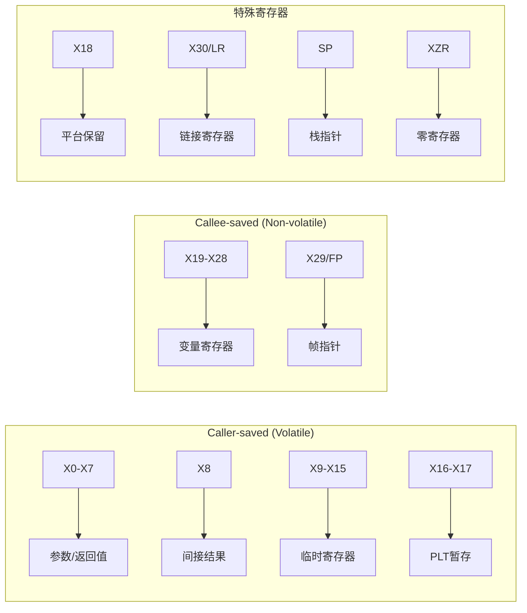
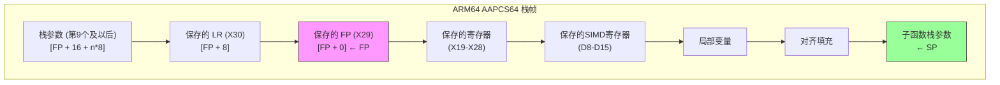

# ARM64 AAPCS64 详解

> ARM64架构过程调用标准（AAPCS64）完整规范，包含X0-X7参数传递、X0返回值、SIMD/FP寄存器使用规范和栈帧结构

## 概述

AAPCS64（ARM Architecture Procedure Call Standard for 64-bit）是ARM64（AArch64）架构的标准过程调用约定，定义了函数调用时参数传递、返回值处理、寄存器使用和栈管理的规则。该标准确保了不同编译器生成的代码能够正确互操作。

### 适用范围

| 架构版本 | 处理器系列 | 适用性 |
|----------|------------|--------|
| ARMv8-A | Cortex-A32/A35/A53/A55/A57/A72/A73/A75/A76/A77/A78/X1 | ✓ |
| ARMv8.1-A | Cortex-A75/A76 | ✓ |
| ARMv8.2-A | Cortex-A55/A75/A76/A77 | ✓ |
| ARMv9-A | Cortex-A510/A710/A715/X2/X3 | ✓ |
| Apple Silicon | M1/M2/M3系列 | ✓ |
| AWS Graviton | Graviton2/3 | ✓ |

### 核心特性概览

| 特性 | 规范 |
|------|------|
| **整数参数寄存器** | X0-X7（8个） |
| **浮点/SIMD参数寄存器** | V0-V7（8个） |
| **整数返回值** | X0（64位）/ X0-X1（128位） |
| **浮点返回值** | V0 |
| **栈对齐** | 16字节（强制） |
| **栈清理** | 调用者（Caller） |
| **帧指针** | X29（FP） |
| **链接寄存器** | X30（LR） |
| **间接结果寄存器** | X8 |

---

## 寄存器分类

### 通用寄存器概览

ARM64提供31个64位通用寄存器，AAPCS64对每个寄存器定义了特定用途：

| 寄存器 | 32位视图 | 用途 | 保存责任 |
|--------|----------|------|----------|
| X0 | W0 | 参数1 / 返回值 | Caller-saved |
| X1 | W1 | 参数2 / 返回值扩展 | Caller-saved |
| X2 | W2 | 参数3 | Caller-saved |
| X3 | W3 | 参数4 | Caller-saved |
| X4 | W4 | 参数5 | Caller-saved |
| X5 | W5 | 参数6 | Caller-saved |
| X6 | W6 | 参数7 | Caller-saved |
| X7 | W7 | 参数8 | Caller-saved |
| X8 | W8 | 间接结果位置寄存器 | Caller-saved |
| X9-X15 | W9-W15 | 临时寄存器 | Caller-saved |
| X16 | W16 (IP0) | 过程内调用暂存1 | Caller-saved |
| X17 | W17 (IP1) | 过程内调用暂存2 | Caller-saved |
| X18 | W18 | 平台寄存器 | 平台定义 |
| X19-X28 | W19-W28 | 被调用者保存寄存器 | Callee-saved |
| X29 | W29 (FP) | 帧指针 | Callee-saved |
| X30 | W30 (LR) | 链接寄存器 | 特殊 |
| SP | WSP | 栈指针 | 特殊 |
| XZR | WZR | 零寄存器 | 特殊 |

### 调用者保存寄存器（Caller-saved / Volatile）

这些寄存器在函数调用后可能被修改，调用者如需保留其值必须自行保存：

```
Caller-saved 寄存器:
┌─────────────────────────────────────────────────────────────────────────────────┐
│  X0-X7   │  X8      │  X9-X15  │  X16 (IP0) │  X17 (IP1) │  X18 (平台)         │
│  参数/返回│  间接结果 │  临时    │  PLT暂存   │  PLT暂存   │  平台保留           │
└─────────────────────────────────────────────────────────────────────────────────┘
```

| 寄存器 | 说明 |
|--------|------|
| X0-X7 | 参数传递和返回值，函数可自由修改 |
| X8 | 间接结果位置寄存器，用于大结构体返回 |
| X9-X15 | 临时寄存器，函数可自由使用 |
| X16-X17 | 过程内调用暂存，链接器和PLT使用 |
| X18 | 平台保留，不同操作系统用途不同 |

### 被调用者保存寄存器（Callee-saved / Non-volatile）

这些寄存器在函数调用后必须保持原值，被调用函数如需使用必须先保存再恢复：

```
Callee-saved 寄存器:
┌─────────────────────────────────────────────────────────────────────────────────┐
│  X19  │  X20  │  X21  │  X22  │  X23  │  X24  │  X25  │  X26  │  X27  │  X28  │
│  变量  │  变量  │  变量  │  变量  │  变量  │  变量  │  变量  │  变量  │  变量  │  变量  │
├───────┴───────┴───────┴───────┴───────┴───────┴───────┴───────┴───────┴───────┤
│  X29 (FP)  │  帧指针                                                           │
└─────────────────────────────────────────────────────────────────────────────────┘
```

| 寄存器 | 说明 |
|--------|------|
| X19-X28 | 通用变量寄存器，函数必须保存和恢复 |
| X29 (FP) | 帧指针，用于栈帧链接 |

### 特殊寄存器

| 寄存器 | 说明 |
|--------|------|
| X30 (LR) | 链接寄存器，保存返回地址 |
| SP | 栈指针，必须保持16字节对齐 |
| XZR/WZR | 零寄存器，读取返回0，写入丢弃 |
| PC | 程序计数器，不可直接访问 |

### 寄存器分类图示



### 寄存器位布局

```
ARM64 通用寄存器 (64位):

位:  63                              32 31                               0
     ┌────────────────────────────────┬────────────────────────────────────┐
X0:  │            高32位              │        低32位 (W0)                 │
     └────────────────────────────────┴────────────────────────────────────┘
     │◄─────────────────────────── X0 (64位) ─────────────────────────────►│
                                      │◄────────── W0 (32位) ─────────────►│

重要: 写入W寄存器会将高32位清零！
例如: MOV W0, #1  会使 X0 = 0x0000000000000001

PSTATE (处理器状态):
┌──────────────────────────────────────────────────────────────────────────┐
│  NZCV (条件标志)  │  DAIF (中断掩码)  │  CurrentEL  │  SPSel  │  其他   │
│  N=负数 Z=零      │  D=调试 A=SError  │  异常级别   │  SP选择 │         │
│  C=进位 V=溢出    │  I=IRQ F=FIQ      │             │         │         │
└──────────────────────────────────────────────────────────────────────────┘
```

---

## 整数参数传递

### 参数寄存器顺序

AAPCS64使用8个寄存器传递整数和指针参数：

| 参数位置 | 寄存器 | 说明 |
|----------|--------|------|
| 第1个参数 | X0 | 第一个64位参数 |
| 第2个参数 | X1 | 第二个64位参数 |
| 第3个参数 | X2 | 第三个64位参数 |
| 第4个参数 | X3 | 第四个64位参数 |
| 第5个参数 | X4 | 第五个64位参数 |
| 第6个参数 | X5 | 第六个64位参数 |
| 第7个参数 | X6 | 第七个64位参数 |
| 第8个参数 | X7 | 第八个64位参数 |
| 第9个及以后 | 栈 | 从左到右入栈 |

### 参数传递规则

#### 基本规则

1. **整数和指针类型**：使用X0-X7传递前8个参数
2. **小于64位的整数**：零扩展或符号扩展到64位（或32位使用W寄存器）
3. **超过8个参数**：第9个及以后的参数通过栈传递
4. **栈参数顺序**：按声明顺序入栈（第9个参数在最低地址）
5. **栈参数对齐**：每个栈参数按8字节对齐

#### 128位参数规则

128位参数（如`__int128`）使用连续的两个寄存器：

| 情况 | 分配方式 |
|------|----------|
| 第1个128位参数 | X0-X1 |
| 第2个128位参数 | X2-X3 |
| 寄存器不足 | 通过栈传递（16字节对齐） |

### 参数传递示例

```
函数: long func(long a, long b, long c, long d, long e, long f, long g, long h, long i, long j)

寄存器分配:
┌─────────────────────────────────────────────────────────────────────────────────┐
│ a → X0   b → X1   c → X2   d → X3   e → X4   f → X5   g → X6   h → X7         │
└─────────────────────────────────────────────────────────────────────────────────┘

栈布局（函数入口时）:
高地址
┌─────────────────┐
│    参数 j       │  [SP + 8]
├─────────────────┤
│    参数 i       │  [SP + 0]  ← SP (16字节对齐)
└─────────────────┘
低地址
```

### 代码示例

#### ARM64汇编语法

```asm
// 函数: long sum_ten(long a, long b, long c, long d, long e, long f, long g, long h, long i, long j)
// 参数: X0=a, X1=b, X2=c, X3=d, X4=e, X5=f, X6=g, X7=h, [SP]=i, [SP+8]=j
// 返回: X0=a+b+c+d+e+f+g+h+i+j

    .text
    .global sum_ten
    .type sum_ten, %function

sum_ten:
    // 寄存器参数相加
    ADD     X0, X0, X1          // X0 = a + b
    ADD     X0, X0, X2          // X0 += c
    ADD     X0, X0, X3          // X0 += d
    ADD     X0, X0, X4          // X0 += e
    ADD     X0, X0, X5          // X0 += f
    ADD     X0, X0, X6          // X0 += g
    ADD     X0, X0, X7          // X0 += h
    
    // 栈参数相加
    LDR     X1, [SP, #0]        // X1 = i
    ADD     X0, X0, X1          // X0 += i
    LDR     X1, [SP, #8]        // X1 = j
    ADD     X0, X0, X1          // X0 += j
    
    RET                         // 返回

    .size sum_ten, .-sum_ten
```

#### 调用示例

```asm
// 调用 sum_ten(1, 2, 3, 4, 5, 6, 7, 8, 9, 10)

    .text
    .global caller_example
    .type caller_example, %function

caller_example:
    // 分配栈空间：16字节用于保存FP/LR，16字节用于传递栈参数
    // 栈参数必须位于SP指向的位置，供被调用函数通过[SP]访问
    SUB     SP, SP, #32             // 分配32字节栈空间
    STP     X29, X30, [SP, #16]     // 保存FP/LR到高地址 [SP+16]
    ADD     X29, SP, #16            // 建立帧指针
    
    // 设置栈参数（第9和第10个参数）
    // 栈参数必须放在SP指向的位置，被调用函数通过[SP+0]和[SP+8]访问
    MOV     X9, #9
    STR     X9, [SP, #0]            // 参数 i = 9 (位于SP)
    MOV     X9, #10
    STR     X9, [SP, #8]            // 参数 j = 10 (位于SP+8)
    
    // 设置寄存器参数
    MOV     X0, #1                  // 参数 a = 1
    MOV     X1, #2                  // 参数 b = 2
    MOV     X2, #3                  // 参数 c = 3
    MOV     X3, #4                  // 参数 d = 4
    MOV     X4, #5                  // 参数 e = 5
    MOV     X5, #6                  // 参数 f = 6
    MOV     X6, #7                  // 参数 g = 7
    MOV     X7, #8                  // 参数 h = 8
    
    BL      sum_ten                 // 调用函数
    
    // 结果在 X0 中 (= 55)
    
    LDP     X29, X30, [SP, #16]     // 恢复FP/LR
    ADD     SP, SP, #32             // 释放栈空间
    RET                             // 返回

    .size caller_example, .-caller_example
```

#### 32位参数示例

```asm
// 函数: int add_ints(int a, int b, int c, int d)
// 使用32位寄存器视图
// 参数: W0=a, W1=b, W2=c, W3=d
// 返回: W0

    .text
    .global add_ints
    .type add_ints, %function

add_ints:
    ADD     W0, W0, W1          // W0 = a + b
    ADD     W0, W0, W2          // W0 += c
    ADD     W0, W0, W3          // W0 += d
    RET                         // 返回

    .size add_ints, .-add_ints
```

---

## 返回值规则

### 整数返回值

| 返回类型 | 寄存器 | 说明 |
|----------|--------|------|
| 8位整数 | X0 (W0) | 零扩展或符号扩展 |
| 16位整数 | X0 (W0) | 零扩展或符号扩展 |
| 32位整数 | X0 (W0) | 使用W0，高32位清零 |
| 64位整数 | X0 | 完整64位 |
| 128位整数 | X0-X1 | X0=低64位，X1=高64位 |
| 指针 | X0 | 64位地址 |

### 返回值寄存器布局

```
64位返回值:
┌─────────────────────────────────────────────────────────────────────────────────┐
│                                    X0                                           │
│                              (64位返回值)                                        │
└─────────────────────────────────────────────────────────────────────────────────┘

128位返回值:
┌─────────────────────────────────────────────────────────────────────────────────┐
│              X1 (高64位)              │              X0 (低64位)                │
│                                       │                                         │
│           bits 127-64                 │            bits 63-0                    │
└─────────────────────────────────────────────────────────────────────────────────┘
```

### 结构体返回值

结构体返回值的处理取决于其大小和组成：

| 结构体类型 | 返回方式 | 说明 |
|------------|----------|------|
| ≤16字节（同质浮点聚合） | V0-V3 | 最多4个浮点成员 |
| ≤16字节（其他） | X0-X1 | 使用1-2个寄存器 |
| >16字节 | 通过X8指针 | 调用者分配空间，地址通过X8传入 |

### 间接结果寄存器（X8）

当返回值太大无法通过寄存器返回时，使用X8传递结果存储地址：

```
大结构体返回机制:

调用者:
1. 分配足够空间存储返回值
2. 将空间地址放入X8
3. 调用函数

被调用者:
1. 通过X8获取存储地址
2. 将结果写入该地址
3. 返回（X8保持不变）
```

### 返回值代码示例

```asm
// 返回64位整数
// long get_value(void)
get_value:
    MOV     X0, #42             // 返回值 = 42
    RET

// 返回128位整数
// __int128 get_big_value(void)
get_big_value:
    MOV     X0, #0xDEADBEEF     // 低64位
    MOVK    X0, #0xCAFE, LSL #48
    MOV     X1, #0x12345678     // 高64位
    RET

// 返回小型结构体（16字节以内）
// struct Point { long x, y; };
// Point get_point(void)
get_point:
    MOV     X0, #100            // x = 100
    MOV     X1, #200            // y = 200
    RET

// 返回大型结构体（通过X8指针）
// struct BigStruct { long data[4]; };
// BigStruct get_big_struct(void)
// X8 指向调用者分配的空间
get_big_struct:
    MOV     X9, #1
    STR     X9, [X8, #0]        // data[0] = 1
    MOV     X9, #2
    STR     X9, [X8, #8]        // data[1] = 2
    MOV     X9, #3
    STR     X9, [X8, #16]       // data[2] = 3
    MOV     X9, #4
    STR     X9, [X8, #24]       // data[3] = 4
    // X8 是调用者保存寄存器，仅作为输入使用
    RET
```

### 调用返回大型结构体的函数

```asm
// 调用返回大型结构体的函数
caller_big_struct:
    STP     X29, X30, [SP, #-48]!   // 保存FP/LR，分配空间
    MOV     X29, SP
    
    // 设置X8指向结构体存储位置
    ADD     X8, SP, #16             // X8 = 结构体存储地址
    BL      get_big_struct          // 调用函数
    
    // 现在 [SP+16] 到 [SP+48] 包含返回的结构体
    LDR     X0, [SP, #16]           // 读取 data[0]
    
    LDP     X29, X30, [SP], #48
    RET
```

---

## 浮点和SIMD参数传递

### SIMD/FP寄存器概览

ARM64提供32个128位SIMD/FP寄存器：

| 寄存器 | 用途 | 保存责任 |
|--------|------|----------|
| V0-V7 | 参数传递 / 返回值 | Caller-saved |
| V8-V15 | 被调用者保存（低64位） | Callee-saved (低64位) |
| V16-V31 | 临时寄存器 | Caller-saved |

### SIMD/FP寄存器布局

```
ARM64 SIMD/FP 寄存器组织:

128位 V寄存器:
┌────────────────────────────────────────────────────────────────────────────────┐
│                              V0 (128位 / Q0)                                   │
├────────────────────────────────────────┬───────────────────────────────────────┤
│              高64位                    │            D0 (64位)                  │
├────────────────────────────────────────┼───────────────────────────────────────┤
│                                        │            S0 (32位)                  │
├────────────────────────────────────────┼───────────────────────────────────────┤
│                                        │            H0 (16位)                  │
├────────────────────────────────────────┼───────────────────────────────────────┤
│                                        │            B0 (8位)                   │
└────────────────────────────────────────┴───────────────────────────────────────┘

寄存器视图别名:
- Bn: 8位 (字节)
- Hn: 16位 (半精度浮点)
- Sn: 32位 (单精度浮点)
- Dn: 64位 (双精度浮点)
- Qn: 128位 (四字)
- Vn: 128位向量
```

### SIMD/FP寄存器保存规则

| 寄存器 | 保存责任 | 说明 |
|--------|----------|------|
| V0-V7 | Caller-saved | 参数和返回值寄存器 |
| V8-V15 | Callee-saved | **仅低64位**需要保存 |
| V16-V31 | Caller-saved | 临时寄存器 |

**重要**：V8-V15的callee-saved规则仅适用于低64位（D8-D15），高64位不需要保存。

```
V8-V15 保存规则:

┌────────────────────────────────────────┬───────────────────────────────────────┐
│         高64位 (不需要保存)            │      低64位 D8-D15 (必须保存)         │
└────────────────────────────────────────┴───────────────────────────────────────┘
```

### 浮点参数传递规则

#### 基本规则

1. **float参数**：使用S0-S7（V0-V7的低32位）
2. **double参数**：使用D0-D7（V0-V7的低64位）
3. **128位向量**：使用V0-V7
4. **独立计数**：浮点参数和整数参数独立计数
5. **超出数量**：通过栈传递

#### 同质浮点聚合（HFA）

同质浮点聚合是指仅包含相同浮点类型成员的结构体：

| HFA类型 | 成员数量 | 传递方式 |
|---------|----------|----------|
| 1-4个float | 1-4 | S0-S3 |
| 1-4个double | 1-4 | D0-D3 |
| 1-4个128位向量 | 1-4 | V0-V3 |

### 浮点代码示例

#### 单精度浮点

```asm
// 函数: float add_floats(float a, float b, float c, float d)
// 参数: S0=a, S1=b, S2=c, S3=d
// 返回: S0

    .text
    .global add_floats
    .type add_floats, %function

add_floats:
    FADD    S0, S0, S1          // S0 = a + b
    FADD    S0, S0, S2          // S0 += c
    FADD    S0, S0, S3          // S0 += d
    RET

    .size add_floats, .-add_floats
```

#### 双精度浮点

```asm
// 函数: double add_doubles(double a, double b)
// 参数: D0=a, D1=b
// 返回: D0

    .text
    .global add_doubles
    .type add_doubles, %function

add_doubles:
    FADD    D0, D0, D1          // D0 = a + b
    RET

    .size add_doubles, .-add_doubles
```

#### 混合整数和浮点参数

```asm
// 函数: double mixed_params(long n, double x, long m, double y)
// 整数参数: X0=n, X1=m
// 浮点参数: D0=x, D1=y (独立计数)
// 返回: D0 = n*x + m*y

    .text
    .global mixed_params
    .type mixed_params, %function

mixed_params:
    // 将整数转换为双精度浮点
    SCVTF   D2, X0              // D2 = (double)n
    SCVTF   D3, X1              // D3 = (double)m
    
    // 计算 n*x + m*y
    FMUL    D2, D2, D0          // D2 = n * x
    FMUL    D3, D3, D1          // D3 = m * y
    FADD    D0, D2, D3          // D0 = n*x + m*y
    
    RET

    .size mixed_params, .-mixed_params
```

#### SIMD向量操作

```asm
// 函数: void vadd_f32(float* dst, float* a, float* b, long n)
// 参数: X0=dst, X1=a, X2=b, X3=n
// 使用SIMD进行向量加法

    .text
    .global vadd_f32
    .type vadd_f32, %function

vadd_f32:
.loop:
    CMP     X3, #4
    B.LT    .scalar
    
    // 向量处理（4个float一次）
    LD1     {V0.4S}, [X1], #16  // 加载4个float从a
    LD1     {V1.4S}, [X2], #16  // 加载4个float从b
    FADD    V0.4S, V0.4S, V1.4S // 向量加法
    ST1     {V0.4S}, [X0], #16  // 存储结果到dst
    SUB     X3, X3, #4
    B       .loop

.scalar:
    CBZ     X3, .done
    
    // 标量处理（剩余元素）
    LDR     S0, [X1], #4
    LDR     S1, [X2], #4
    FADD    S0, S0, S1
    STR     S0, [X0], #4
    SUB     X3, X3, #1
    B       .scalar

.done:
    RET

    .size vadd_f32, .-vadd_f32
```

### 保存SIMD/FP寄存器

```asm
// 保存和恢复SIMD callee-saved寄存器
function_using_simd:
    STP     X29, X30, [SP, #-96]!   // 保存FP和LR
    MOV     X29, SP
    
    // 保存callee-saved整数寄存器
    STP     X19, X20, [SP, #16]
    STP     X21, X22, [SP, #32]
    
    // 保存SIMD callee-saved寄存器（仅低64位）
    STP     D8, D9, [SP, #48]
    STP     D10, D11, [SP, #64]
    STP     D12, D13, [SP, #80]
    // D14, D15 如果需要也要保存
    
    // 函数体，可以自由使用V0-V31
    
    // 恢复SIMD寄存器
    LDP     D8, D9, [SP, #48]
    LDP     D10, D11, [SP, #64]
    LDP     D12, D13, [SP, #80]
    
    // 恢复整数寄存器
    LDP     X19, X20, [SP, #16]
    LDP     X21, X22, [SP, #32]
    
    LDP     X29, X30, [SP], #96
    RET
```

---

## 栈帧结构

### 标准栈帧布局

```
ARM64 AAPCS64 标准栈帧:

高地址
┌─────────────────────────────────────────┐
│         调用者的栈帧                     │
├─────────────────────────────────────────┤
│         栈参数 N                         │  [FP + 16 + (N-9)*8]
├─────────────────────────────────────────┤
│         ...                             │
├─────────────────────────────────────────┤
│         栈参数 10                        │  [FP + 24]
├─────────────────────────────────────────┤
│         栈参数 9                         │  [FP + 16]
├─────────────────────────────────────────┤ ← 函数入口时的SP (16字节对齐)
│         保存的 LR (X30)                  │  [FP + 8]
├─────────────────────────────────────────┤
│         保存的 FP (X29)                  │  [FP + 0]  ← FP (X29)
├─────────────────────────────────────────┤
│         保存的寄存器                     │  [FP - 16] 等
│         (X19-X28, 成对保存)              │
├─────────────────────────────────────────┤
│         保存的SIMD寄存器                 │
│         (D8-D15, 如果使用)               │
├─────────────────────────────────────────┤
│         局部变量                         │
├─────────────────────────────────────────┤
│         动态分配空间                     │
├─────────────────────────────────────────┤
│         子函数的栈参数                   │  ← SP (16字节对齐)
└─────────────────────────────────────────┘
低地址

栈增长方向: 向低地址增长 ↓
重要: SP必须始终保持16字节对齐！
```

### 栈帧结构图示



### 栈对齐要求

| 场景 | 对齐要求 | 说明 |
|------|----------|------|
| **SP对齐** | 16字节 | SP必须始终16字节对齐 |
| **栈参数** | 8字节 | 每个栈参数按8字节对齐 |
| **128位数据** | 16字节 | __int128、向量等需要16字节对齐 |
| **函数入口/出口** | 16字节 | 调用和返回时SP必须16字节对齐 |

### 栈对齐示例

```
16字节对齐检查:

正确对齐 (SP % 16 == 0):
┌─────────────────┐
│                 │  地址: 0x1000 (16字节对齐)
├─────────────────┤
│                 │  地址: 0x0FF0 (16字节对齐)
└─────────────────┘ ← SP

错误对齐 (SP % 16 != 0):
┌─────────────────┐
│                 │  地址: 0x0FF8 (未对齐!)
└─────────────────┘ ← SP  ❌ 违反AAPCS64！
```

### 函数序言和尾声

#### 标准序言（Prologue）

```asm
// 标准函数序言
function_name:
    // 保存FP和LR，分配栈空间
    STP     X29, X30, [SP, #-64]!   // 保存FP/LR，分配64字节
    MOV     X29, SP                  // 建立帧指针
    
    // 保存callee-saved寄存器
    STP     X19, X20, [SP, #16]
    STP     X21, X22, [SP, #32]
    
    // 保存SIMD callee-saved寄存器（如果使用）
    STP     D8, D9, [SP, #48]
    
    // 分配额外局部变量空间（如果需要）
    SUB     SP, SP, #32             // 额外32字节
```

#### 简化序言（叶子函数）

```asm
// 叶子函数序言（不调用其他函数）
leaf_function:
    // 如果不需要保存寄存器，可以直接使用
    // 不需要保存LR，因为不会调用其他函数
    
    // 函数体...
    
    RET
```

#### 标准尾声（Epilogue）

```asm
// 标准函数尾声
    // 释放额外局部变量空间
    ADD     SP, SP, #32
    
    // 恢复SIMD寄存器
    LDP     D8, D9, [SP, #48]
    
    // 恢复callee-saved寄存器
    LDP     X19, X20, [SP, #16]
    LDP     X21, X22, [SP, #32]
    
    // 恢复FP和LR，释放栈空间
    LDP     X29, X30, [SP], #64
    
    RET                             // 返回
```

### 完整函数示例

```asm
// 完整的函数示例
// long process_data(long* data, long len, long multiplier)
// 参数: X0=data, X1=len, X2=multiplier
// 返回: X0=处理后的数据之和

    .text
    .global process_data
    .type process_data, %function

process_data:
    // === 序言 ===
    STP     X29, X30, [SP, #-48]!   // 保存FP/LR，分配栈空间
    MOV     X29, SP                  // 建立帧指针
    STP     X19, X20, [SP, #16]      // 保存callee-saved寄存器
    STP     X21, X22, [SP, #32]
    
    // 保存参数到callee-saved寄存器
    MOV     X19, X0                  // X19 = data
    MOV     X20, X1                  // X20 = len
    MOV     X21, X2                  // X21 = multiplier
    MOV     X22, #0                  // X22 = sum = 0
    
    // === 函数体 ===
    CMP     X20, #0                  // 检查长度
    B.LE    .done                    // 如果 len <= 0，跳到结束
    
.loop:
    LDR     X0, [X19], #8            // X0 = *data++
    MUL     X0, X0, X21              // X0 *= multiplier
    ADD     X22, X22, X0             // sum += X0
    SUBS    X20, X20, #1             // len--
    B.NE    .loop                    // 如果 len != 0，继续循环
    
.done:
    MOV     X0, X22                  // 返回值 = sum
    
    // === 尾声 ===
    LDP     X19, X20, [SP, #16]      // 恢复寄存器
    LDP     X21, X22, [SP, #32]
    LDP     X29, X30, [SP], #48      // 恢复FP/LR
    RET                              // 返回

    .size process_data, .-process_data
```

### 使用STP/LDP优化

ARM64推荐使用STP（Store Pair）和LDP（Load Pair）指令成对保存/恢复寄存器：

```asm
// 推荐：使用STP/LDP成对操作
function_optimized:
    STP     X29, X30, [SP, #-64]!   // 一条指令保存两个寄存器
    MOV     X29, SP
    STP     X19, X20, [SP, #16]
    STP     X21, X22, [SP, #32]
    STP     X23, X24, [SP, #48]
    
    // 函数体...
    
    LDP     X23, X24, [SP, #48]
    LDP     X21, X22, [SP, #32]
    LDP     X19, X20, [SP, #16]
    LDP     X29, X30, [SP], #64
    RET

// 不推荐：单独保存每个寄存器
function_not_optimized:
    STR     X29, [SP, #-8]!         // 效率较低
    STR     X30, [SP, #-8]!
    STR     X19, [SP, #-8]!
    // ...
```

---

## 可变参数函数

### 可变参数传递规则

可变参数函数（variadic functions）的参数传递规则：

1. **命名参数**：按正常规则传递
2. **匿名参数**：
   - 整数参数通过X0-X7传递，超出部分通过栈
   - 浮点参数通过V0-V7传递，超出部分通过栈
3. **va_list结构**：需要保存所有可能的参数寄存器

### va_list结构

```c
// ARM64 va_list 结构
typedef struct {
    void *__stack;           // 栈参数指针
    void *__gr_top;          // 通用寄存器保存区顶部
    void *__vr_top;          // 向量寄存器保存区顶部
    int __gr_offs;           // 通用寄存器偏移
    int __vr_offs;           // 向量寄存器偏移
} va_list;
```

### 可变参数函数示例

```asm
// 实现可变参数函数
// long sum_variadic(long count, ...)

    .text
    .global sum_variadic
    .type sum_variadic, %function

sum_variadic:
    STP     X29, X30, [SP, #-80]!
    MOV     X29, SP
    
    // 保存可能的参数寄存器到栈
    STP     X1, X2, [SP, #16]       // 保存X1-X2
    STP     X3, X4, [SP, #32]       // 保存X3-X4
    STP     X5, X6, [SP, #48]       // 保存X5-X6
    STR     X7, [SP, #64]           // 保存X7
    
    MOV     X9, X0                  // X9 = count
    MOV     X10, #0                 // X10 = sum
    ADD     X11, SP, #16            // X11 = 参数指针（从X1开始）
    
    CBZ     X9, .var_done           // 如果count == 0，结束
    
.var_loop:
    LDR     X12, [X11], #8          // 加载下一个参数
    ADD     X10, X10, X12           // sum += 参数
    SUBS    X9, X9, #1              // count--
    B.NE    .var_loop               // 如果count != 0，继续
    
.var_done:
    MOV     X0, X10                 // 返回sum
    LDP     X29, X30, [SP], #80
    RET

    .size sum_variadic, .-sum_variadic
```

### 调用printf示例

```asm
// 调用 printf 函数
    .data
format_str:
    .asciz "Values: %ld, %ld, %f\n"

    .text
    .global print_values
    .type print_values, %function

print_values:
    STP     X29, X30, [SP, #-16]!
    MOV     X29, SP
    
    // 准备参数
    ADRP    X0, format_str          // X0 = 格式字符串
    ADD     X0, X0, :lo12:format_str
    MOV     X1, #42                 // X1 = 第一个整数
    MOV     X2, #100                // X2 = 第二个整数
    FMOV    D0, #3.14               // D0 = 浮点数
    
    BL      printf                  // 调用printf
    
    LDP     X29, X30, [SP], #16
    RET

    .size print_values, .-print_values
```

---

## 函数调用示例

### 示例1：简单函数调用

```asm
// 被调用函数: long add(long a, long b)
    .text
    .global add
    .type add, %function

add:
    ADD     X0, X0, X1          // X0 = a + b
    RET                         // 返回

    .size add, .-add

// 调用者函数
    .global caller
    .type caller, %function

caller:
    STP     X29, X30, [SP, #-16]!
    MOV     X29, SP
    
    MOV     X0, #10             // 参数 a = 10
    MOV     X1, #20             // 参数 b = 20
    BL      add                 // 调用 add(10, 20)
    
    // 结果在 X0 中 (= 30)
    
    LDP     X29, X30, [SP], #16
    RET

    .size caller, .-caller
```

### 示例2：调用C库函数

```asm
// 调用 printf 函数
    .data
format_str:
    .asciz "Result: %ld\n"

    .text
    .global print_result
    .type print_result, %function

print_result:
    // 参数: X0 = 要打印的值
    STP     X29, X30, [SP, #-16]!
    MOV     X29, SP
    
    MOV     X1, X0                  // X1 = 值（printf的第2个参数）
    ADRP    X0, format_str          // 加载格式字符串地址
    ADD     X0, X0, :lo12:format_str
    BL      printf                  // 调用 printf
    
    LDP     X29, X30, [SP], #16
    RET

    .size print_result, .-print_result
```

### 示例3：递归函数

```asm
// 递归计算阶乘: long factorial(long n)
    .text
    .global factorial
    .type factorial, %function

factorial:
    STP     X29, X30, [SP, #-32]!
    MOV     X29, SP
    STR     X19, [SP, #16]          // 保存X19
    
    CMP     X0, #1                  // 比较 n 和 1
    B.LE    .base_case              // 如果 n <= 1，返回1
    
    // 递归情况: n * factorial(n-1)
    MOV     X19, X0                 // X19 = n（保存到callee-saved寄存器）
    SUB     X0, X0, #1              // X0 = n - 1
    BL      factorial               // 递归调用 factorial(n-1)
    MUL     X0, X19, X0             // X0 = n * factorial(n-1)
    B       .return
    
.base_case:
    MOV     X0, #1                  // 返回 1
    
.return:
    LDR     X19, [SP, #16]          // 恢复X19
    LDP     X29, X30, [SP], #32
    RET

    .size factorial, .-factorial
```

### 示例4：数组处理

```asm
// 计算数组元素之和: long sum_array(long* arr, long len)
    .text
    .global sum_array
    .type sum_array, %function

sum_array:
    MOV     X2, X0                  // X2 = arr
    MOV     X3, X1                  // X3 = len
    MOV     X0, #0                  // X0 = sum = 0
    
    CBZ     X3, .sum_done           // 如果 len == 0，返回0
    
.sum_loop:
    LDR     X4, [X2], #8            // X4 = *arr++
    ADD     X0, X0, X4              // sum += X4
    SUBS    X3, X3, #1              // len--
    B.NE    .sum_loop               // 如果 len != 0，继续
    
.sum_done:
    RET

    .size sum_array, .-sum_array
```

### 示例5：结构体参数

```asm
// 结构体定义:
// struct Point {
//     long x;  // 偏移 0
//     long y;  // 偏移 8
// };

// 函数: long distance_squared(struct Point p1, struct Point p2)
// 小结构体通过寄存器传递:
// p1.x = X0, p1.y = X1
// p2.x = X2, p2.y = X3

    .text
    .global distance_squared
    .type distance_squared, %function

distance_squared:
    // 计算 (p2.x - p1.x)^2 + (p2.y - p1.y)^2
    SUB     X2, X2, X0              // X2 = p2.x - p1.x
    SUB     X3, X3, X1              // X3 = p2.y - p1.y
    
    MUL     X2, X2, X2              // X2 = (p2.x - p1.x)^2
    MUL     X3, X3, X3              // X3 = (p2.y - p1.y)^2
    
    ADD     X0, X2, X3              // X0 = dx^2 + dy^2
    RET

    .size distance_squared, .-distance_squared

// 大结构体通过指针传递
// struct BigStruct { long data[8]; };
// long sum_big_struct(struct BigStruct* s)

    .global sum_big_struct
    .type sum_big_struct, %function

sum_big_struct:
    MOV     X1, X0                  // X1 = s
    MOV     X0, #0                  // X0 = sum
    MOV     X2, #8                  // X2 = 计数器
    
.big_loop:
    LDR     X3, [X1], #8            // X3 = *s++
    ADD     X0, X0, X3              // sum += X3
    SUBS    X2, X2, #1
    B.NE    .big_loop
    
    RET

    .size sum_big_struct, .-sum_big_struct
```

---

## 与C语言互操作

### 从C调用汇编函数

#### C代码

```c
// main.c
#include <stdio.h>

// 声明汇编函数
extern long add(long a, long b);
extern long sum_array(long* arr, long len);
extern __int128 multiply128(long a, long b);

int main() {
    // 调用简单函数
    long result = add(10, 20);
    printf("add(10, 20) = %ld\n", result);
    
    // 调用数组处理函数
    long arr[] = {1, 2, 3, 4, 5};
    long sum = sum_array(arr, 5);
    printf("sum_array = %ld\n", sum);
    
    // 调用返回128位值的函数
    __int128 product = multiply128(1000000000LL, 2000000000LL);
    printf("multiply128 = %lld (low)\n", (long long)product);
    
    return 0;
}
```

#### 汇编代码

```asm
// asm_functions.s
    .text
    .global add
    .global sum_array
    .global multiply128

// long add(long a, long b)
add:
    ADD     X0, X0, X1
    RET

// long sum_array(long* arr, long len)
sum_array:
    MOV     X2, X0              // arr
    MOV     X0, #0              // sum
    
.loop:
    CBZ     X1, .done
    LDR     X3, [X2], #8
    ADD     X0, X0, X3
    SUB     X1, X1, #1
    B       .loop
    
.done:
    RET

// __int128 multiply128(long a, long b)
// 返回: X0=低64位, X1=高64位
multiply128:
    MUL     X0, X0, X1          // 低64位
    SMULH   X1, X0, X1          // 高64位（有符号）
    RET
```

#### 编译命令

```bash
# 编译汇编文件
aarch64-linux-gnu-as -o asm_functions.o asm_functions.s

# 编译C文件并链接
aarch64-linux-gnu-gcc -o program main.c asm_functions.o
```

### 从汇编调用C函数

```asm
// 从汇编调用C函数
    .data
message:
    .asciz "Hello from assembly!\n"
format_int:
    .asciz "Value: %ld\n"

    .text
    .global asm_main
    .type asm_main, %function

asm_main:
    STP     X29, X30, [SP, #-32]!
    MOV     X29, SP
    STR     X19, [SP, #16]
    
    // 调用 puts(message)
    ADRP    X0, message
    ADD     X0, X0, :lo12:message
    BL      puts
    
    // 调用 printf(format_int, 42)
    ADRP    X0, format_int
    ADD     X0, X0, :lo12:format_int
    MOV     X1, #42
    BL      printf
    
    // 调用 malloc(100)
    MOV     X0, #100
    BL      malloc
    MOV     X19, X0             // 保存返回的指针
    
    // 使用分配的内存...
    
    // 调用 free(ptr)
    MOV     X0, X19
    BL      free
    
    MOV     X0, #0              // 返回 0
    LDR     X19, [SP, #16]
    LDP     X29, X30, [SP], #32
    RET

    .size asm_main, .-asm_main
```

### 内联汇编（GCC）

```c
// GCC ARM64内联汇编示例

// 基本内联汇编
long add_inline(long a, long b) {
    long result;
    __asm__ (
        "ADD %0, %1, %2"
        : "=r" (result)         // 输出操作数
        : "r" (a), "r" (b)      // 输入操作数
    );
    return result;
}

// 带有clobber列表的内联汇编
long multiply_inline(long a, long b) {
    long result;
    __asm__ __volatile__ (
        "MUL %0, %1, %2"
        : "=r" (result)
        : "r" (a), "r" (b)
        : "cc"                  // 修改条件码
    );
    return result;
}

// 128位乘法
__int128 multiply128_inline(long a, long b) {
    long lo, hi;
    __asm__ (
        "MUL %0, %2, %3\n\t"
        "SMULH %1, %2, %3"
        : "=&r" (lo), "=r" (hi)
        : "r" (a), "r" (b)
    );
    return ((__int128)hi << 64) | (unsigned long)lo;
}

// 原子操作
long atomic_add(long* ptr, long value) {
    long result, tmp;
    __asm__ __volatile__ (
        "1:\n\t"
        "LDXR   %0, [%2]\n\t"       // 独占加载
        "ADD    %0, %0, %3\n\t"     // 加法
        "STXR   %w1, %0, [%2]\n\t"  // 独占存储
        "CBNZ   %w1, 1b"            // 如果失败，重试
        : "=&r" (result), "=&r" (tmp)
        : "r" (ptr), "r" (value)
        : "memory"
    );
    return result;
}

// 读取系统寄存器
unsigned long read_cntpct(void) {
    unsigned long val;
    __asm__ __volatile__ (
        "MRS %0, CNTPCT_EL0"
        : "=r" (val)
    );
    return val;
}
```

---

## 平台特定变体

### X18寄存器的平台特定用途

X18寄存器在不同平台上有不同用途：

| 平台 | X18用途 | 说明 |
|------|---------|------|
| **Linux (通用)** | 临时寄存器 | 可自由使用 |
| **macOS/iOS** | 保留 | 系统保留，不可使用 |
| **Windows** | TEB指针 | 线程环境块指针 |
| **Android** | ShadowCallStack | 影子调用栈指针 |
| **Fuchsia** | 保留 | 系统保留 |

### Apple平台变体

Apple Silicon（M1/M2/M3）使用的调用约定与标准AAPCS64略有不同：

| 特性 | 标准AAPCS64 | Apple ARM64 |
|------|-------------|-------------|
| **X18** | 临时寄存器 | 平台保留 |
| **栈对齐** | 16字节 | 16字节 |
| **帧指针** | 推荐使用 | 强制使用 |
| **PAC** | 可选 | 默认启用 |

#### Apple ARM64特殊要求

```asm
// Apple平台函数示例
// 必须使用帧指针，不能使用X18

    .text
    .global apple_function
    .type apple_function, %function

apple_function:
    // 必须建立帧指针链
    STP     X29, X30, [SP, #-16]!
    MOV     X29, SP
    
    // 不要使用X18！
    // MOV X18, #0  // 错误！
    
    // 函数体...
    
    LDP     X29, X30, [SP], #16
    RET

    .size apple_function, .-apple_function
```

### Linux系统调用

```asm
// Linux ARM64 系统调用
// 系统调用号通过 X8 传递
// 参数通过 X0-X5 传递
// 返回值在 X0

    .text
    .global sys_write
    .type sys_write, %function

// ssize_t sys_write(int fd, const void* buf, size_t count)
sys_write:
    // 参数已经在正确的寄存器中
    // X0 = fd, X1 = buf, X2 = count
    
    MOV     X8, #64             // __NR_write = 64
    SVC     #0                  // 系统调用
    
    RET

    .size sys_write, .-sys_write

// void sys_exit(int status)
    .global sys_exit
    .type sys_exit, %function

sys_exit:
    MOV     X8, #93             // __NR_exit = 93
    SVC     #0                  // 系统调用
    // 不会返回

    .size sys_exit, .-sys_exit

// 完整的Hello World示例
    .data
hello_msg:
    .asciz "Hello, ARM64!\n"
    .equ hello_len, . - hello_msg

    .text
    .global _start
_start:
    // write(1, hello_msg, hello_len)
    MOV     X0, #1              // fd = stdout
    ADRP    X1, hello_msg
    ADD     X1, X1, :lo12:hello_msg
    MOV     X2, #hello_len      // count
    MOV     X8, #64             // __NR_write
    SVC     #0
    
    // exit(0)
    MOV     X0, #0              // status = 0
    MOV     X8, #93             // __NR_exit
    SVC     #0
```

---

## 特殊情况处理

### 位置无关代码（PIC）

```asm
// 位置无关代码示例
    .text
    .global pic_function
    .type pic_function, %function

pic_function:
    STP     X29, X30, [SP, #-16]!
    MOV     X29, SP
    
    // 使用ADRP/ADD加载地址（PC相对）
    ADRP    X0, global_var
    ADD     X0, X0, :lo12:global_var
    LDR     X0, [X0]            // 加载全局变量
    
    // 通过GOT访问外部符号
    ADRP    X1, :got:external_func
    LDR     X1, [X1, :got_lo12:external_func]
    BLR     X1                  // 调用外部函数
    
    LDP     X29, X30, [SP], #16
    RET

    .size pic_function, .-pic_function
```

### 异常处理和栈展开

```asm
// 带有异常处理信息的函数
    .text
    .global function_with_unwind
    .type function_with_unwind, %function

function_with_unwind:
    .cfi_startproc              // 开始CFI信息
    
    STP     X29, X30, [SP, #-32]!
    .cfi_def_cfa_offset 32
    .cfi_offset 30, -8          // LR保存位置
    .cfi_offset 29, -16         // FP保存位置
    
    MOV     X29, SP
    .cfi_def_cfa_register 29
    
    STP     X19, X20, [SP, #16]
    .cfi_offset 19, -24
    .cfi_offset 20, -32
    
    // 函数体...
    
    LDP     X19, X20, [SP, #16]
    LDP     X29, X30, [SP], #32
    .cfi_restore 30
    .cfi_restore 29
    .cfi_def_cfa 31, 0
    
    RET
    
    .cfi_endproc                // 结束CFI信息

    .size function_with_unwind, .-function_with_unwind
```

### 指针认证（PAC）

ARM64支持指针认证码（Pointer Authentication Code）来防止ROP攻击：

```asm
// 使用PAC的函数
    .text
    .global pac_function
    .type pac_function, %function

pac_function:
    // 使用PACIASP签名返回地址
    PACIASP                     // 签名LR
    STP     X29, X30, [SP, #-16]!
    MOV     X29, SP
    
    // 函数体...
    
    LDP     X29, X30, [SP], #16
    // 使用AUTIASP验证返回地址
    AUTIASP                     // 验证LR
    RET

    .size pac_function, .-pac_function

// 或使用RETAA直接返回
pac_function_v2:
    PACIASP
    STP     X29, X30, [SP, #-16]!
    MOV     X29, SP
    
    // 函数体...
    
    LDP     X29, X30, [SP], #16
    RETAA                       // 验证并返回

    .size pac_function_v2, .-pac_function_v2
```

### 分支目标识别（BTI）

```asm
// 使用BTI的函数
    .text
    .global bti_function
    .type bti_function, %function

bti_function:
    BTI     C                   // 标记为有效的调用目标
    STP     X29, X30, [SP, #-16]!
    MOV     X29, SP
    
    // 函数体...
    
    LDP     X29, X30, [SP], #16
    RET

    .size bti_function, .-bti_function

// 间接跳转目标
jump_target:
    BTI     J                   // 标记为有效的跳转目标
    // 代码...
    RET
```

---

## 调试和验证

### 使用GDB调试

```bash
# 启动GDB调试ARM64程序
aarch64-linux-gnu-gdb ./program

# 常用调试命令
(gdb) break function_name      # 设置断点
(gdb) info registers           # 查看所有寄存器
(gdb) info registers x0 x1 x2  # 查看特定寄存器
(gdb) x/10gx $sp               # 查看栈内容（64位）
(gdb) disassemble              # 反汇编当前函数
(gdb) stepi                    # 单步执行指令
(gdb) nexti                    # 单步执行（跳过函数调用）
(gdb) info frame               # 查看栈帧信息
```

### 验证栈对齐

```asm
// 运行时栈对齐检查
    .text
    .global check_stack_alignment
    .type check_stack_alignment, %function

check_stack_alignment:
    // 检查SP是否16字节对齐
    MOV     X0, SP
    AND     X0, X0, #15         // 测试低4位
    CMP     X0, #0
    CSET    X0, EQ              // 如果对齐，X0=1；否则X0=0
    RET

    .size check_stack_alignment, .-check_stack_alignment
```

### 编译器生成代码分析

```bash
# 查看编译器生成的汇编代码
aarch64-linux-gnu-gcc -S -O2 source.c -o source.s

# 查看带有C源码注释的汇编
aarch64-linux-gnu-gcc -S -O2 -fverbose-asm source.c -o source.s

# 查看目标文件的反汇编
aarch64-linux-gnu-objdump -d object.o

# 查看调用约定信息
aarch64-linux-gnu-readelf -A object.o
```

---

## 常见错误和最佳实践

### 常见错误

| 错误类型 | 描述 | 解决方案 |
|----------|------|----------|
| **栈未对齐** | SP不是16字节对齐 | 确保分配的栈空间是16的倍数 |
| **寄存器未保存** | 修改了callee-saved寄存器但未保存 | 在序言中保存，尾声中恢复 |
| **X18使用错误** | 在Apple/Android平台使用X18 | 避免使用X18，或检查平台要求 |
| **LR被覆盖** | 调用函数前未保存LR | 在序言中STP X29, X30 |
| **SIMD寄存器保存不完整** | 只保存了V8-V15的部分 | 保存完整的D8-D15（低64位） |
| **栈参数偏移错误** | 计算栈参数偏移时出错 | 考虑STP保存的寄存器数量 |

### 最佳实践

#### 1. 始终保持栈16字节对齐

```asm
// 好的做法：保持16字节对齐
function:
    STP     X29, X30, [SP, #-32]!   // 32字节（16的倍数）
    MOV     X29, SP
    STP     X19, X20, [SP, #16]
    
    // 函数体...
    
    LDP     X19, X20, [SP, #16]
    LDP     X29, X30, [SP], #32
    RET

// 不好的做法：可能导致未对齐
bad_function:
    STR     X30, [SP, #-8]!         // 只分配8字节，未对齐！
    // ...
```

#### 2. 使用STP/LDP成对操作

```asm
// 推荐：使用STP/LDP
function_good:
    STP     X29, X30, [SP, #-48]!
    STP     X19, X20, [SP, #16]
    STP     X21, X22, [SP, #32]
    // ...
    LDP     X21, X22, [SP, #32]
    LDP     X19, X20, [SP, #16]
    LDP     X29, X30, [SP], #48
    RET

// 不推荐：单独操作
function_bad:
    SUB     SP, SP, #48
    STR     X29, [SP, #0]
    STR     X30, [SP, #8]
    STR     X19, [SP, #16]
    // 效率较低...
```

#### 3. 正确建立帧指针链

```asm
// 推荐：建立完整的帧指针链
function_with_fp:
    STP     X29, X30, [SP, #-32]!
    MOV     X29, SP                 // 建立帧指针
    STP     X19, X20, [SP, #16]
    
    // 通过FP访问参数和局部变量
    // 栈参数: [X29 + 32], [X29 + 40], ...
    
    LDP     X19, X20, [SP, #16]
    LDP     X29, X30, [SP], #32
    RET
```

#### 4. 使用条件选择替代分支

```asm
// 推荐：使用条件选择
// int abs(long x)
abs_optimized:
    CMP     X0, #0
    CNEG    X0, X0, MI          // 如果负数，取反
    RET

// 或者
abs_v2:
    CMP     X0, #0
    NEG     X1, X0
    CSEL    X0, X1, X0, MI      // 选择正确的值
    RET

// 不推荐：使用分支
abs_slow:
    CMP     X0, #0
    B.GE    .positive
    NEG     X0, X0
.positive:
    RET
```

#### 5. 利用零寄存器

```asm
// 使用XZR/WZR简化代码
clear_register:
    MOV     X0, XZR             // X0 = 0
    MOV     X0, #0              // 等效，但XZR更清晰

compare_with_zero:
    CMP     X0, XZR             // 比较X0和0
    CMP     X0, #0              // 等效

store_zero:
    STR     XZR, [X1]           // 存储0到内存
    MOV     X0, #0
    STR     X0, [X1]            // 等效，但需要额外寄存器
```

---

## 与ARM32 AAPCS对比

### 主要差异对比表

| 特性 | ARM32 AAPCS | ARM64 AAPCS64 |
|------|-------------|---------------|
| **通用寄存器数量** | 16个 (R0-R15) | 31个 (X0-X30) + SP + XZR |
| **寄存器位宽** | 32位 | 64位 (可用32位视图W0-W30) |
| **参数寄存器** | R0-R3 (4个) | X0-X7 (8个) |
| **浮点参数寄存器** | S0-S15/D0-D7 | V0-V7 |
| **返回值寄存器** | R0 (R0-R1 for 64位) | X0 (X0-X1 for 128位) |
| **间接结果寄存器** | R0 | X8 |
| **Caller-saved整数** | R0-R3, R12 | X0-X17 |
| **Callee-saved整数** | R4-R11 | X19-X28 |
| **Caller-saved浮点** | S0-S15/D0-D7 | V0-V7, V16-V31 |
| **Callee-saved浮点** | D8-D15 | V8-V15 (仅低64位) |
| **栈对齐** | 8字节 | 16字节 |
| **链接寄存器** | R14 (LR) | X30 (LR) |
| **帧指针** | R11 (可选) | X29 (推荐) |
| **零寄存器** | 无 | XZR/WZR |
| **PC访问** | 可直接访问 | 不可直接访问 |
| **条件执行** | 几乎所有指令 | 仅条件分支和选择 |

### 迁移注意事项

从ARM32迁移到ARM64时需要注意：

1. **数据类型大小变化**：`long`和指针从32位变为64位
2. **更多参数寄存器**：可以减少栈参数使用
3. **栈对齐要求更严格**：必须16字节对齐
4. **条件执行方式改变**：使用条件选择指令替代
5. **PC不可直接访问**：使用ADR/ADRP指令

---

## 参考资料

### 官方文档

- [Procedure Call Standard for the ARM 64-bit Architecture (AAPCS64)](https://github.com/ARM-software/abi-aa/blob/main/aapcs64/aapcs64.rst) - ARM官方AAPCS64规范
- [ARM Architecture Reference Manual ARMv8-A](https://developer.arm.com/documentation/ddi0487/latest) - ARMv8架构参考手册
- [ARM Compiler armasm User Guide](https://developer.arm.com/documentation/dui0801/latest) - ARM汇编器用户指南

### 扩展阅读

- [ARM Developer Documentation](https://developer.arm.com/documentation) - ARM开发者文档中心
- [Learn the Architecture - AArch64](https://developer.arm.com/documentation/102374/latest) - AArch64架构学习指南
- [ARM Cortex-A Series Programmer's Guide for ARMv8-A](https://developer.arm.com/documentation/den0024/latest) - Cortex-A编程指南
- [ARM NEON Intrinsics Reference](https://developer.arm.com/architectures/instruction-sets/intrinsics) - NEON内联函数参考

### 相关章节

- [ARM架构概述](overview.md) - ARM32和ARM64架构对比
- [ARM32 AAPCS](arm32-aapcs.md) - ARM32调用约定详解
- [ARM寄存器参考](registers.md) - ARM寄存器完整说明

---

## 快速参考卡

### 寄存器用途速查

| 寄存器 | 用途 | 保存责任 |
|--------|------|----------|
| X0-X7 | 参数/返回值 | Caller |
| X8 | 间接结果 | Caller |
| X9-X15 | 临时 | Caller |
| X16-X17 | PLT暂存 | Caller |
| X18 | 平台保留 | 平台定义 |
| X19-X28 | 变量 | Callee |
| X29/FP | 帧指针 | Callee |
| X30/LR | 链接寄存器 | - |
| SP | 栈指针 | - |
| XZR | 零寄存器 | - |

### 参数传递速查

| 参数类型 | 位置 |
|----------|------|
| 前8个整数/指针参数 | X0-X7 |
| 128位整数 | X0-X1, X2-X3, ... |
| 第9个及以后 | 栈 |
| 前8个浮点参数 | V0-V7 (D0-D7/S0-S7) |
| HFA (1-4个成员) | V0-V3 |

### 返回值速查

| 返回类型 | 位置 |
|----------|------|
| 64位整数 | X0 |
| 128位整数 | X0-X1 |
| float | S0 |
| double | D0 |
| 小结构体 (≤16字节) | X0-X1 或 V0-V3 |
| 大结构体 | 通过X8传入的指针 |

### 栈帧速查

| 项目 | 要求 |
|------|------|
| SP对齐 | 16字节 |
| 帧指针 | X29 |
| 返回地址 | X30 (LR) |
| 保存方式 | STP/LDP成对 |

---

*上一节: [ARM32 AAPCS](arm32-aapcs.md)*
*下一节: [ARM寄存器参考](registers.md)*
