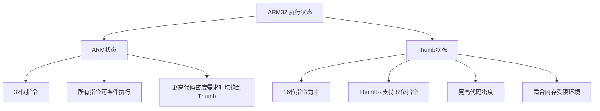
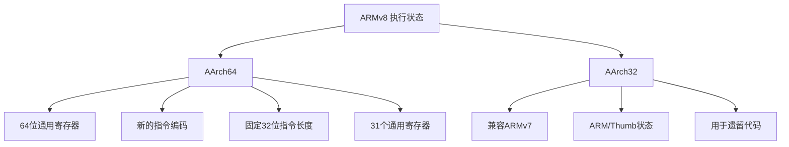
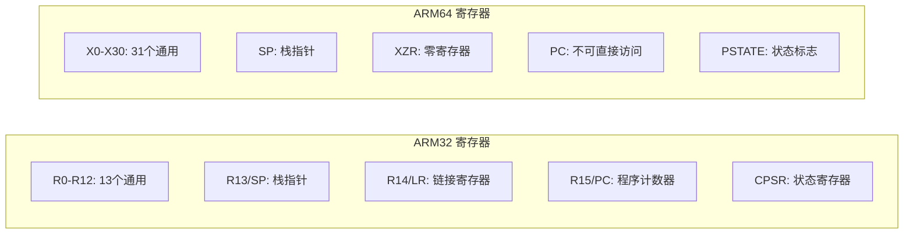
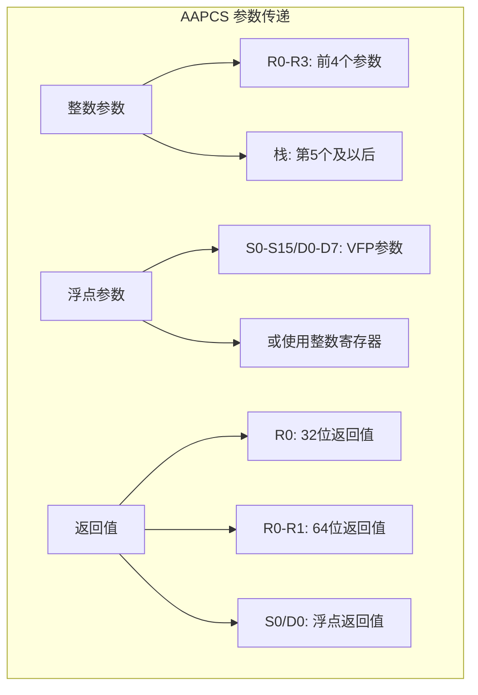
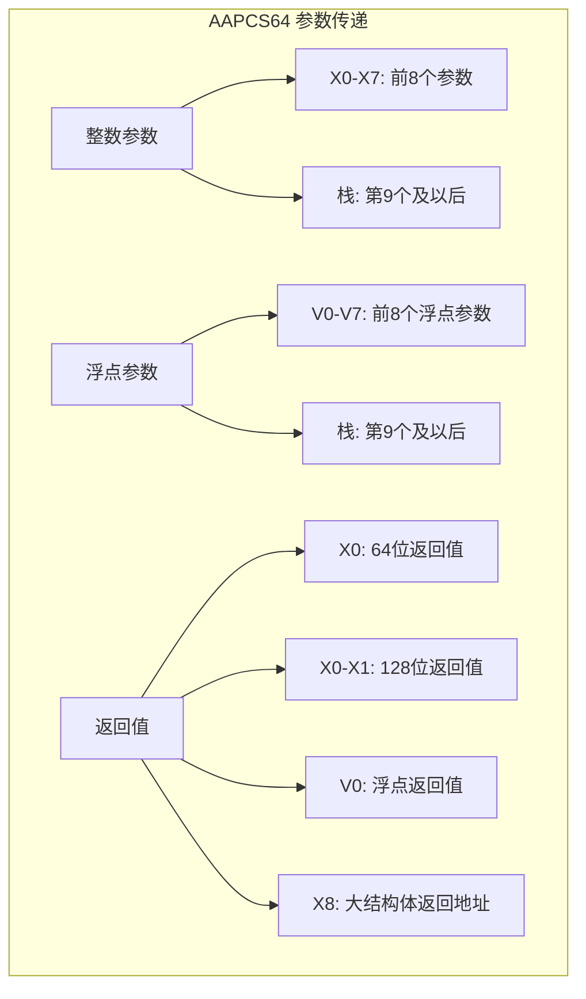

# ARM架构概述

> ARM32（AArch32）和ARM64（AArch64）架构的全面对比，包括寄存器、指令集和调用约定差异

## 引言

ARM（Advanced RISC Machines）是当今世界上使用最广泛的处理器架构之一。从智能手机、平板电脑到服务器和超级计算机，ARM架构无处不在。本章节将深入介绍ARM架构的两个主要版本：ARM32（也称为AArch32）和ARM64（也称为AArch64），帮助汇编语言开发者理解两者之间的关键差异。

### ARM架构的市场地位

| 应用领域 | 典型设备 | 主要架构版本 |
|----------|----------|--------------|
| **移动设备** | iPhone、Android手机、iPad | ARM64 (AArch64) |
| **嵌入式系统** | IoT设备、微控制器、工业控制 | ARM32 (Cortex-M/R) |
| **服务器** | AWS Graviton、Ampere Altra | ARM64 (AArch64) |
| **桌面/笔记本** | Apple M系列、Windows on ARM | ARM64 (AArch64) |
| **网络设备** | 路由器、交换机 | ARM32/ARM64 |
| **汽车电子** | 车载系统、ADAS | ARM32/ARM64 |

---

## ARM架构发展历史

### 时间线

```
ARM架构演进历史:

1985年 ─── ARM1 ─────────────────── 第一款ARM处理器（Acorn）
   │
1987年 ─── ARM2 ─────────────────── 首款商用ARM处理器
   │
1991年 ─── ARM6 ─────────────────── ARM公司成立
   │
1995年 ─── ARM7TDMI ──────────────── 嵌入式市场突破
   │
2002年 ─── ARM11 ────────────────── 首款智能手机处理器
   │
2004年 ─── ARMv7 (Cortex) ────────── Cortex-A/R/M系列
   │
2011年 ─── ARMv8 (AArch64) ────────── 64位架构诞生
   │
2016年 ─── ARMv8.1-A ────────────── 原子操作增强
   │
2019年 ─── ARMv8.5-A ────────────── 内存标签扩展
   │
2021年 ─── ARMv9 ─────────────────── SVE2、安全增强
   │
2023年 ─── ARMv9.2-A ────────────── 最新架构版本
```


### 架构版本与处理器系列

| 架构版本 | 处理器系列 | 位宽 | 主要特性 |
|----------|------------|------|----------|
| ARMv6 | ARM11 | 32位 | SIMD、Thumb-2 |
| ARMv7-A | Cortex-A5/A7/A8/A9/A15/A17 | 32位 | NEON、虚拟化 |
| ARMv7-R | Cortex-R4/R5/R7/R8 | 32位 | 实时处理、MPU |
| ARMv7-M | Cortex-M0/M3/M4/M7 | 32位 | 微控制器优化 |
| ARMv8-A | Cortex-A32/A35/A53/A55/A57/A72/A73/A75/A76/A77/A78/X1 | 32/64位 | AArch64、加密扩展 |
| ARMv8-R | Cortex-R52/R82 | 32/64位 | 实时64位 |
| ARMv9-A | Cortex-A510/A710/A715/X2/X3 | 64位 | SVE2、MTE |

---

## ARM32 (AArch32) 架构概述

### 执行状态

ARM32架构支持两种主要的执行状态：



### ARM32寄存器概览

ARM32提供16个32位通用寄存器和一组状态/控制寄存器：

| 寄存器 | 别名 | 用途 | AAPCS角色 |
|--------|------|------|-----------|
| R0 | a1 | 参数1/返回值 | Caller-saved |
| R1 | a2 | 参数2/返回值高位 | Caller-saved |
| R2 | a3 | 参数3 | Caller-saved |
| R3 | a4 | 参数4 | Caller-saved |
| R4 | v1 | 变量寄存器1 | Callee-saved |
| R5 | v2 | 变量寄存器2 | Callee-saved |
| R6 | v3 | 变量寄存器3 | Callee-saved |
| R7 | v4 | 变量寄存器4/帧指针(Thumb) | Callee-saved |
| R8 | v5 | 变量寄存器5 | Callee-saved |
| R9 | v6/SB/TR | 平台相关 | 平台定义 |
| R10 | v7 | 变量寄存器7 | Callee-saved |
| R11 | v8/FP | 帧指针(ARM) | Callee-saved |
| R12 | IP | 过程内调用暂存 | Caller-saved |
| R13 | SP | 栈指针 | 特殊 |
| R14 | LR | 链接寄存器 | 特殊 |
| R15 | PC | 程序计数器 | 特殊 |

### ARM32寄存器位布局

```
ARM32 通用寄存器 (32位):

位:  31                              16 15                               0
     ┌────────────────────────────────┬────────────────────────────────────┐
R0:  │            高16位              │             低16位                 │
     └────────────────────────────────┴────────────────────────────────────┘
     │◄─────────────────────────── 32位 ──────────────────────────────────►│

CPSR (当前程序状态寄存器):

位:  31 30 29 28 27 26 25 24 23      20 19      16 15      10 9  8  7  6  5  4  0
     ┌──┬──┬──┬──┬──┬──┬──┬──┬────────┬──────────┬──────────┬──┬──┬──┬──┬──┬─────┐
     │N │Z │C │V │Q │IT│J │ │  GE    │          │    IT    │E │A │I │F │T │Mode │
     └──┴──┴──┴──┴──┴──┴──┴──┴────────┴──────────┴──────────┴──┴──┴──┴──┴──┴─────┘
      │  │  │  │  │                                          │  │  │  │  │
      │  │  │  │  └─ 饱和标志                                 │  │  │  │  └─ Thumb状态
      │  │  │  └──── 溢出标志                                 │  │  │  └──── FIQ禁用
      │  │  └─────── 进位标志                                 │  │  └─────── IRQ禁用
      │  └────────── 零标志                                   │  └────────── 异步中止禁用
      └───────────── 负数标志                                 └───────────── 大端模式
```


### ARM32指令集特点

#### 条件执行

ARM32的一个独特特性是几乎所有指令都可以条件执行：

```arm
; ARM32 条件执行示例
CMP     R0, #0          ; 比较R0和0
MOVEQ   R1, #1          ; 如果相等(Z=1)，R1 = 1
MOVNE   R1, #0          ; 如果不等(Z=0)，R1 = 0
ADDGT   R2, R2, #1      ; 如果大于，R2 += 1
```

条件码后缀：

| 后缀 | 含义 | 标志条件 |
|------|------|----------|
| EQ | 等于 | Z = 1 |
| NE | 不等于 | Z = 0 |
| CS/HS | 进位/无符号高于等于 | C = 1 |
| CC/LO | 无进位/无符号低于 | C = 0 |
| MI | 负数 | N = 1 |
| PL | 正数或零 | N = 0 |
| VS | 溢出 | V = 1 |
| VC | 无溢出 | V = 0 |
| HI | 无符号高于 | C = 1 且 Z = 0 |
| LS | 无符号低于等于 | C = 0 或 Z = 1 |
| GE | 有符号大于等于 | N = V |
| LT | 有符号小于 | N ≠ V |
| GT | 有符号大于 | Z = 0 且 N = V |
| LE | 有符号小于等于 | Z = 1 或 N ≠ V |
| AL | 总是（默认） | 无条件 |

#### 桶形移位器

ARM32的另一个强大特性是集成的桶形移位器，允许在单条指令中完成移位操作：

```arm
; 桶形移位器示例
ADD     R0, R1, R2, LSL #2      ; R0 = R1 + (R2 << 2)
MOV     R0, R1, ROR #8          ; R0 = R1循环右移8位
SUB     R0, R1, R2, ASR R3      ; R0 = R1 - (R2算术右移R3位)
```

移位类型：

| 类型 | 含义 | 示例 |
|------|------|------|
| LSL | 逻辑左移 | `LSL #n` 或 `LSL Rm` |
| LSR | 逻辑右移 | `LSR #n` 或 `LSR Rm` |
| ASR | 算术右移 | `ASR #n` 或 `ASR Rm` |
| ROR | 循环右移 | `ROR #n` 或 `ROR Rm` |
| RRX | 带进位循环右移1位 | `RRX` |

---

## ARM64 (AArch64) 架构概述

### 执行状态

ARM64是一个全新的64位架构，与ARM32有显著不同：



### ARM64寄存器概览

ARM64提供31个64位通用寄存器，大幅增加了可用寄存器数量：

| 寄存器 | 32位视图 | 用途 | AAPCS64角色 |
|--------|----------|------|-------------|
| X0 | W0 | 参数1/返回值 | Caller-saved |
| X1 | W1 | 参数2/返回值扩展 | Caller-saved |
| X2 | W2 | 参数3 | Caller-saved |
| X3 | W3 | 参数4 | Caller-saved |
| X4 | W4 | 参数5 | Caller-saved |
| X5 | W5 | 参数6 | Caller-saved |
| X6 | W6 | 参数7 | Caller-saved |
| X7 | W7 | 参数8 | Caller-saved |
| X8 | W8 | 间接结果位置 | Caller-saved |
| X9-X15 | W9-W15 | 临时寄存器 | Caller-saved |
| X16 | W16 (IP0) | 过程内调用暂存1 | Caller-saved |
| X17 | W17 (IP1) | 过程内调用暂存2 | Caller-saved |
| X18 | W18 | 平台寄存器 | 平台定义 |
| X19-X28 | W19-W28 | 被调用者保存 | Callee-saved |
| X29 | W29 (FP) | 帧指针 | Callee-saved |
| X30 | W30 (LR) | 链接寄存器 | 特殊 |
| SP | WSP | 栈指针 | 特殊 |
| XZR | WZR | 零寄存器 | 特殊 |


### ARM64寄存器位布局

```
ARM64 通用寄存器 (64位):

位:  63                              32 31                               0
     ┌────────────────────────────────┬────────────────────────────────────┐
X0:  │            高32位              │        低32位 (W0)                 │
     └────────────────────────────────┴────────────────────────────────────┘
     │◄─────────────────────────── X0 (64位) ─────────────────────────────►│
                                      │◄────────── W0 (32位) ─────────────►│

注意：写入W寄存器会将高32位清零（与x64行为相同）

PSTATE (处理器状态):

ARM64使用PSTATE替代CPSR，通过特殊寄存器访问：
- NZCV: 条件标志 (N, Z, C, V)
- DAIF: 中断掩码 (D, A, I, F)
- CurrentEL: 当前异常级别
- SPSel: 栈指针选择
```

### ARM64指令集特点

#### 固定长度指令

与ARM32不同，ARM64使用固定的32位指令长度，简化了指令解码：

```arm
// ARM64 指令示例
ADD     X0, X1, X2              // X0 = X1 + X2
ADD     W0, W1, W2              // W0 = W1 + W2 (32位操作)
ADD     X0, X1, X2, LSL #3      // X0 = X1 + (X2 << 3)
MADD    X0, X1, X2, X3          // X0 = X3 + (X1 * X2)
```

#### 条件选择替代条件执行

ARM64移除了通用的条件执行，改用条件选择指令：

```arm
// ARM64 条件选择
CMP     X0, #0
CSEL    X1, X2, X3, EQ          // if (Z==1) X1=X2 else X1=X3
CSINC   X1, X2, X3, NE          // if (Z==0) X1=X2 else X1=X3+1
CSET    X1, EQ                  // if (Z==1) X1=1 else X1=0
```

#### 零寄存器

ARM64引入了零寄存器（XZR/WZR），读取时返回0，写入时丢弃：

```arm
// 零寄存器使用
MOV     X0, XZR                 // X0 = 0
ADD     X0, X1, XZR             // X0 = X1 + 0 = X1
CMP     X0, XZR                 // 比较X0和0
STR     XZR, [X1]               // 存储0到内存
```

---

## ARM32与ARM64关键差异对比

### 寄存器对比



### 详细对比表

| 特性 | ARM32 (AArch32) | ARM64 (AArch64) |
|------|-----------------|-----------------|
| **通用寄存器数量** | 16个 (R0-R15) | 31个 (X0-X30) + SP + XZR |
| **寄存器位宽** | 32位 | 64位 (可用32位视图W0-W30) |
| **参数寄存器** | R0-R3 (4个) | X0-X7 (8个) |
| **返回值寄存器** | R0-R1 | X0-X1 (可扩展到X0-X7) |
| **被调用者保存** | R4-R11 | X19-X28 |
| **链接寄存器** | R14 (LR) | X30 (LR) |
| **帧指针** | R11 (FP) | X29 (FP) |
| **栈指针** | R13 (SP) | SP (独立寄存器) |
| **程序计数器** | R15 (PC，可直接访问) | PC (不可直接访问) |
| **零寄存器** | 无 | XZR/WZR |
| **指令长度** | 32位(ARM)/16位(Thumb) | 固定32位 |
| **条件执行** | 几乎所有指令 | 仅条件分支和选择指令 |
| **栈对齐** | 8字节 | 16字节 |
| **地址空间** | 4GB (32位) | 256TB+ (48-52位) |


### 浮点和SIMD寄存器对比

| 特性 | ARM32 (VFP/NEON) | ARM64 (SIMD/FP) |
|------|------------------|-----------------|
| **寄存器数量** | 32个64位 (D0-D31) 或 16个128位 (Q0-Q15) | 32个128位 (V0-V31) |
| **最大向量宽度** | 128位 | 128位 (SVE可达2048位) |
| **浮点参数** | S0-S15/D0-D7 | V0-V7 |
| **浮点返回值** | S0/D0 | V0 |
| **被调用者保存** | D8-D15 | V8-V15 (低64位) |

```
ARM32 VFP/NEON 寄存器布局:

128位 Q寄存器:
┌────────────────────────────────────────────────────────────────────────────┐
│                              Q0 (128位)                                    │
├────────────────────────────────────────┬───────────────────────────────────┤
│              D1 (64位)                 │            D0 (64位)              │
├────────────────────┬───────────────────┼───────────────────┬───────────────┤
│    S3 (32位)       │    S2 (32位)      │    S1 (32位)      │   S0 (32位)   │
└────────────────────┴───────────────────┴───────────────────┴───────────────┘

ARM64 SIMD/FP 寄存器布局:

128位 V寄存器:
┌────────────────────────────────────────────────────────────────────────────┐
│                              V0 (128位)                                    │
├────────────────────────────────────────┬───────────────────────────────────┤
│              高64位                    │            D0 (64位)              │
├────────────────────────────────────────┼───────────────────────────────────┤
│                                        │            S0 (32位)              │
├────────────────────────────────────────┼───────────────────────────────────┤
│                                        │            H0 (16位)              │
├────────────────────────────────────────┼───────────────────────────────────┤
│                                        │            B0 (8位)               │
└────────────────────────────────────────┴───────────────────────────────────┘
```

---

## 调用约定概述

### AAPCS (ARM32) 调用约定

ARM32使用AAPCS（ARM Architecture Procedure Call Standard）：



#### AAPCS关键规则

| 规则 | 说明 |
|------|------|
| **参数传递** | R0-R3传递前4个字（32位）参数 |
| **64位参数** | 必须在偶数寄存器对开始（R0-R1或R2-R3） |
| **栈对齐** | 公共接口要求8字节对齐 |
| **栈清理** | 调用者负责清理栈参数 |
| **帧指针** | R11可选作为帧指针 |

```arm
; ARM32 AAPCS 函数调用示例
; int add(int a, int b, int c, int d, int e)
; 参数: a=R0, b=R1, c=R2, d=R3, e=[SP]

add:
    PUSH    {R4, LR}            ; 保存寄存器
    LDR     R4, [SP, #8]        ; 加载第5个参数e
    ADD     R0, R0, R1          ; a + b
    ADD     R0, R0, R2          ; + c
    ADD     R0, R0, R3          ; + d
    ADD     R0, R0, R4          ; + e
    POP     {R4, PC}            ; 恢复并返回
```

### AAPCS64 (ARM64) 调用约定

ARM64使用AAPCS64，提供更多寄存器用于参数传递：




#### AAPCS64关键规则

| 规则 | 说明 |
|------|------|
| **参数传递** | X0-X7传递前8个整数/指针参数 |
| **浮点参数** | V0-V7传递前8个浮点参数（独立计数） |
| **栈对齐** | 必须16字节对齐 |
| **栈清理** | 调用者负责清理栈参数 |
| **帧指针** | X29作为帧指针 |
| **间接返回** | X8传递大结构体返回值的地址 |

```arm
// ARM64 AAPCS64 函数调用示例
// long add(long a, long b, long c, long d, long e, long f, long g, long h, long i)
// 参数: a=X0, b=X1, c=X2, d=X3, e=X4, f=X5, g=X6, h=X7, i=[SP]

add:
    LDR     X9, [SP]            // 加载第9个参数i
    ADD     X0, X0, X1          // a + b
    ADD     X0, X0, X2          // + c
    ADD     X0, X0, X3          // + d
    ADD     X0, X0, X4          // + e
    ADD     X0, X0, X5          // + f
    ADD     X0, X0, X6          // + g
    ADD     X0, X0, X7          // + h
    ADD     X0, X0, X9          // + i
    RET                         // 返回
```

### 调用约定对比表

| 特性 | AAPCS (ARM32) | AAPCS64 (ARM64) |
|------|---------------|-----------------|
| **整数参数寄存器** | R0-R3 (4个) | X0-X7 (8个) |
| **浮点参数寄存器** | S0-S15/D0-D7 | V0-V7 |
| **整数返回值** | R0 (R0-R1 for 64位) | X0 (X0-X1 for 128位) |
| **浮点返回值** | S0/D0 | V0 |
| **Caller-saved整数** | R0-R3, R12 | X0-X17 |
| **Callee-saved整数** | R4-R11 | X19-X28 |
| **Caller-saved浮点** | S0-S15/D0-D7 | V0-V7, V16-V31 |
| **Callee-saved浮点** | D8-D15 | V8-V15 (低64位) |
| **栈对齐** | 8字节 | 16字节 |
| **Red Zone** | 无 | 无 |
| **链接寄存器** | R14 (LR) | X30 (LR) |
| **帧指针** | R11 (可选) | X29 (推荐) |

---

## 指令集差异详解

### 数据处理指令对比

| 操作 | ARM32 | ARM64 |
|------|-------|-------|
| 加法 | `ADD R0, R1, R2` | `ADD X0, X1, X2` |
| 带进位加法 | `ADC R0, R1, R2` | `ADC X0, X1, X2` |
| 减法 | `SUB R0, R1, R2` | `SUB X0, X1, X2` |
| 乘法 | `MUL R0, R1, R2` | `MUL X0, X1, X2` |
| 乘加 | `MLA R0, R1, R2, R3` | `MADD X0, X1, X2, X3` |
| 除法 | `SDIV R0, R1, R2` (ARMv7) | `SDIV X0, X1, X2` |
| 逻辑与 | `AND R0, R1, R2` | `AND X0, X1, X2` |
| 逻辑或 | `ORR R0, R1, R2` | `ORR X0, X1, X2` |
| 逻辑异或 | `EOR R0, R1, R2` | `EOR X0, X1, X2` |
| 移动 | `MOV R0, R1` | `MOV X0, X1` |
| 取反移动 | `MVN R0, R1` | `MVN X0, X1` |

### 内存访问指令对比

| 操作 | ARM32 | ARM64 |
|------|-------|-------|
| 加载字 | `LDR R0, [R1]` | `LDR X0, [X1]` |
| 存储字 | `STR R0, [R1]` | `STR X0, [X1]` |
| 加载字节 | `LDRB R0, [R1]` | `LDRB W0, [X1]` |
| 加载半字 | `LDRH R0, [R1]` | `LDRH W0, [X1]` |
| 加载有符号字节 | `LDRSB R0, [R1]` | `LDRSB X0, [X1]` |
| 前索引 | `LDR R0, [R1, #4]!` | `LDR X0, [X1, #8]!` |
| 后索引 | `LDR R0, [R1], #4` | `LDR X0, [X1], #8` |
| 多寄存器加载 | `LDM R0, {R1-R4}` | `LDP X1, X2, [X0]` |
| 多寄存器存储 | `STM R0, {R1-R4}` | `STP X1, X2, [X0]` |

### 分支指令对比

| 操作 | ARM32 | ARM64 |
|------|-------|-------|
| 无条件分支 | `B label` | `B label` |
| 带链接分支 | `BL func` | `BL func` |
| 寄存器分支 | `BX R0` | `BR X0` |
| 带链接寄存器分支 | `BLX R0` | `BLR X0` |
| 返回 | `BX LR` 或 `POP {PC}` | `RET` |
| 条件分支 | `BEQ label` | `B.EQ label` |
| 比较并分支 | 无 | `CBZ X0, label` |
| 测试并分支 | 无 | `TBZ X0, #5, label` |


---

## 栈帧结构对比

### ARM32栈帧

```
ARM32 标准栈帧布局:

高地址
┌─────────────────────────────────────┐
│         调用者的栈帧                │
├─────────────────────────────────────┤
│         栈参数 (第5个及以后)        │  ← 调用者分配
├─────────────────────────────────────┤ ← 函数入口时的SP
│         保存的LR (R14)              │
├─────────────────────────────────────┤
│         保存的FP (R11)              │  ← 新的FP指向这里
├─────────────────────────────────────┤
│         保存的寄存器 (R4-R10)       │
├─────────────────────────────────────┤
│         局部变量                    │
├─────────────────────────────────────┤
│         临时空间                    │  ← SP指向这里
└─────────────────────────────────────┘
低地址

栈增长方向: 向低地址增长 ↓
```

### ARM64栈帧

```
ARM64 标准栈帧布局:

高地址
┌─────────────────────────────────────┐
│         调用者的栈帧                │
├─────────────────────────────────────┤
│         栈参数 (第9个及以后)        │  ← 调用者分配
├─────────────────────────────────────┤ ← 函数入口时的SP (16字节对齐)
│         保存的LR (X30)              │
├─────────────────────────────────────┤
│         保存的FP (X29)              │  ← 新的FP指向这里
├─────────────────────────────────────┤
│         保存的寄存器 (X19-X28)      │
├─────────────────────────────────────┤
│         保存的SIMD寄存器 (V8-V15)   │
├─────────────────────────────────────┤
│         局部变量                    │
├─────────────────────────────────────┤
│         临时空间                    │  ← SP指向这里 (16字节对齐)
└─────────────────────────────────────┘
低地址

栈增长方向: 向低地址增长 ↓
注意: SP必须始终保持16字节对齐
```

### 函数序言/尾声对比

#### ARM32函数序言/尾声

```arm
; ARM32 标准函数序言
func:
    PUSH    {R4-R11, LR}        ; 保存callee-saved寄存器和LR
    SUB     SP, SP, #16         ; 分配局部变量空间
    ; 可选: 建立帧指针
    ADD     R11, SP, #16        ; FP = SP + 局部变量大小

    ; ... 函数体 ...

; ARM32 标准函数尾声
    ADD     SP, SP, #16         ; 释放局部变量空间
    POP     {R4-R11, PC}        ; 恢复寄存器并返回
```

#### ARM64函数序言/尾声

```arm
// ARM64 标准函数序言
func:
    STP     X29, X30, [SP, #-32]!   // 保存FP和LR，分配栈空间
    MOV     X29, SP                  // 建立帧指针
    STP     X19, X20, [SP, #16]      // 保存callee-saved寄存器

    // ... 函数体 ...

// ARM64 标准函数尾声
    LDP     X19, X20, [SP, #16]      // 恢复callee-saved寄存器
    LDP     X29, X30, [SP], #32      // 恢复FP和LR，释放栈空间
    RET                              // 返回
```

---

## 常见使用场景和平台

### ARM32典型应用

| 平台/设备 | 处理器示例 | 操作系统 |
|-----------|------------|----------|
| **树莓派 (早期)** | BCM2835 (ARM11) | Raspbian |
| **Arduino Due** | SAM3X8E (Cortex-M3) | 裸机/RTOS |
| **STM32系列** | Cortex-M0/M3/M4/M7 | FreeRTOS/裸机 |
| **旧款Android** | Cortex-A7/A9 | Android 4.x-7.x |
| **工业控制器** | 各种Cortex-M/R | 实时操作系统 |

### ARM64典型应用

| 平台/设备 | 处理器示例 | 操作系统 |
|-----------|------------|----------|
| **iPhone/iPad** | Apple A系列 | iOS/iPadOS |
| **Mac** | Apple M1/M2/M3 | macOS |
| **Android手机** | Snapdragon/Exynos/Dimensity | Android |
| **树莓派 4/5** | BCM2711/BCM2712 | Raspberry Pi OS |
| **AWS Graviton** | Graviton2/3 | Linux |
| **Windows on ARM** | Snapdragon 8cx | Windows 11 |
| **NVIDIA Jetson** | Carmel/Cortex-A78 | Linux |

### 开发工具链

| 工具 | ARM32支持 | ARM64支持 | 说明 |
|------|-----------|-----------|------|
| **GCC** | arm-none-eabi-gcc | aarch64-linux-gnu-gcc | GNU工具链 |
| **Clang/LLVM** | --target=arm | --target=aarch64 | LLVM工具链 |
| **ARM Compiler** | armcc | armclang | ARM官方编译器 |
| **Keil MDK** | ✓ | ✓ | 嵌入式开发 |
| **IAR** | ✓ | ✓ | 嵌入式开发 |


---

## 代码示例

### 示例1：简单函数对比

#### ARM32版本

```arm
; ARM32: 计算两个整数的和
; int add(int a, int b)
; 参数: a=R0, b=R1
; 返回: R0

    .text
    .global add
    .type add, %function

add:
    ADD     R0, R0, R1          ; R0 = a + b
    BX      LR                  ; 返回

    .size add, .-add
```

#### ARM64版本

```arm
// ARM64: 计算两个整数的和
// long add(long a, long b)
// 参数: a=X0, b=X1
// 返回: X0

    .text
    .global add
    .type add, %function

add:
    ADD     X0, X0, X1          // X0 = a + b
    RET                         // 返回

    .size add, .-add
```

### 示例2：带局部变量的函数

#### ARM32版本

```arm
; ARM32: 计算数组元素之和
; int sum_array(int* arr, int len)
; 参数: arr=R0, len=R1

    .text
    .global sum_array
    .type sum_array, %function

sum_array:
    PUSH    {R4-R6, LR}         ; 保存寄存器
    MOV     R4, R0              ; R4 = arr
    MOV     R5, R1              ; R5 = len
    MOV     R6, #0              ; R6 = sum = 0

.loop:
    CMP     R5, #0              ; if (len == 0)
    BEQ     .done               ;     goto done
    
    LDR     R0, [R4], #4        ; R0 = *arr++
    ADD     R6, R6, R0          ; sum += R0
    SUB     R5, R5, #1          ; len--
    B       .loop

.done:
    MOV     R0, R6              ; 返回sum
    POP     {R4-R6, PC}         ; 恢复并返回

    .size sum_array, .-sum_array
```

#### ARM64版本

```arm
// ARM64: 计算数组元素之和
// long sum_array(long* arr, long len)
// 参数: arr=X0, len=X1

    .text
    .global sum_array
    .type sum_array, %function

sum_array:
    MOV     X2, X0              // X2 = arr
    MOV     X3, X1              // X3 = len
    MOV     X0, #0              // X0 = sum = 0

.loop:
    CBZ     X3, .done           // if (len == 0) goto done
    
    LDR     X4, [X2], #8        // X4 = *arr++
    ADD     X0, X0, X4          // sum += X4
    SUB     X3, X3, #1          // len--
    B       .loop

.done:
    RET                         // 返回sum

    .size sum_array, .-sum_array
```

### 示例3：调用其他函数

#### ARM32版本

```arm
; ARM32: 调用printf
; void print_number(int n)

    .text
    .global print_number
    .type print_number, %function

print_number:
    PUSH    {LR}                ; 保存返回地址
    SUB     SP, SP, #4          ; 8字节对齐
    
    MOV     R1, R0              ; R1 = n (第二个参数)
    LDR     R0, =format_str     ; R0 = 格式字符串 (第一个参数)
    BL      printf              ; 调用printf
    
    ADD     SP, SP, #4          ; 恢复栈
    POP     {PC}                ; 返回

    .section .rodata
format_str:
    .asciz "Number: %d\n"

    .size print_number, .-print_number
```

#### ARM64版本

```arm
// ARM64: 调用printf
// void print_number(long n)

    .text
    .global print_number
    .type print_number, %function

print_number:
    STP     X29, X30, [SP, #-16]!   // 保存FP和LR
    MOV     X29, SP                  // 建立帧指针
    
    MOV     X1, X0                   // X1 = n (第二个参数)
    ADRP    X0, format_str           // 加载格式字符串地址
    ADD     X0, X0, :lo12:format_str
    BL      printf                   // 调用printf
    
    LDP     X29, X30, [SP], #16      // 恢复FP和LR
    RET                              // 返回

    .section .rodata
format_str:
    .asciz "Number: %ld\n"

    .size print_number, .-print_number
```

### 示例4：浮点运算

#### ARM32版本 (VFP)

```arm
; ARM32: 计算两个浮点数的和
; float fadd(float a, float b)
; 参数: a=S0, b=S1 (VFP调用约定)

    .text
    .global fadd
    .type fadd, %function
    .fpu vfpv3

fadd:
    VADD.F32 S0, S0, S1         ; S0 = a + b
    BX      LR                  ; 返回

    .size fadd, .-fadd
```

#### ARM64版本

```arm
// ARM64: 计算两个浮点数的和
// float fadd(float a, float b)
// 参数: a=S0, b=S1

    .text
    .global fadd
    .type fadd, %function

fadd:
    FADD    S0, S0, S1          // S0 = a + b
    RET                         // 返回

    .size fadd, .-fadd
```


---

## ARM架构扩展

### 常见ARM扩展

| 扩展 | ARM32 | ARM64 | 说明 |
|------|-------|-------|------|
| **NEON** | ✓ | ✓ | SIMD向量处理 |
| **VFP** | ✓ | - | 浮点单元（ARM64集成） |
| **TrustZone** | ✓ | ✓ | 安全扩展 |
| **Virtualization** | ✓ | ✓ | 虚拟化扩展 |
| **SVE** | - | ✓ | 可伸缩向量扩展 |
| **SVE2** | - | ✓ | SVE第二版 |
| **MTE** | - | ✓ | 内存标签扩展 |
| **PAC** | - | ✓ | 指针认证 |
| **BTI** | - | ✓ | 分支目标识别 |

### NEON/SIMD示例

#### ARM32 NEON

```arm
; ARM32 NEON: 向量加法
; void vadd_f32(float* dst, float* a, float* b, int n)

    .text
    .global vadd_f32
    .type vadd_f32, %function
    .fpu neon

vadd_f32:
    PUSH    {R4, LR}

.loop:
    CMP     R3, #4
    BLT     .scalar
    
    VLD1.32 {Q0}, [R1]!         ; 加载4个float从a
    VLD1.32 {Q1}, [R2]!         ; 加载4个float从b
    VADD.F32 Q0, Q0, Q1         ; 向量加法
    VST1.32 {Q0}, [R0]!         ; 存储结果到dst
    SUB     R3, R3, #4
    B       .loop

.scalar:
    CMP     R3, #0
    BEQ     .done
    VLD1.32 {D0[0]}, [R1]!
    VLD1.32 {D1[0]}, [R2]!
    VADD.F32 S0, S0, S2
    VST1.32 {D0[0]}, [R0]!
    SUB     R3, R3, #1
    B       .scalar

.done:
    POP     {R4, PC}

    .size vadd_f32, .-vadd_f32
```

#### ARM64 SIMD

```arm
// ARM64 SIMD: 向量加法
// void vadd_f32(float* dst, float* a, float* b, long n)

    .text
    .global vadd_f32
    .type vadd_f32, %function

vadd_f32:
.loop:
    CMP     X3, #4
    B.LT    .scalar
    
    LD1     {V0.4S}, [X1], #16  // 加载4个float从a
    LD1     {V1.4S}, [X2], #16  // 加载4个float从b
    FADD    V0.4S, V0.4S, V1.4S // 向量加法
    ST1     {V0.4S}, [X0], #16  // 存储结果到dst
    SUB     X3, X3, #4
    B       .loop

.scalar:
    CBZ     X3, .done
    LDR     S0, [X1], #4
    LDR     S1, [X2], #4
    FADD    S0, S0, S1
    STR     S0, [X0], #4
    SUB     X3, X3, #1
    B       .scalar

.done:
    RET

    .size vadd_f32, .-vadd_f32
```

---

## 迁移指南：ARM32到ARM64

### 主要迁移考虑

| 方面 | ARM32 | ARM64 | 迁移建议 |
|------|-------|-------|----------|
| **数据类型** | int=32位, long=32位, 指针=32位 | int=32位, long=64位, 指针=64位 | 使用固定宽度类型 |
| **对齐** | 4/8字节 | 8/16字节 | 检查结构体布局 |
| **寄存器** | R0-R15 | X0-X30 | 更新寄存器名称 |
| **参数传递** | 4个寄存器 | 8个寄存器 | 减少栈使用 |
| **条件执行** | 广泛使用 | 条件选择 | 重写条件代码 |
| **PC访问** | 可直接访问 | 不可直接访问 | 使用ADR/ADRP |

### 寄存器映射建议

| ARM32 | ARM64 | 说明 |
|-------|-------|------|
| R0-R3 | X0-X3 | 参数/返回值 |
| R4-R10 | X19-X25 | Callee-saved |
| R11 (FP) | X29 (FP) | 帧指针 |
| R12 (IP) | X16/X17 | 临时寄存器 |
| R13 (SP) | SP | 栈指针 |
| R14 (LR) | X30 (LR) | 链接寄存器 |
| R15 (PC) | - | 使用ADR/BL |

### 常见迁移模式

#### 条件执行迁移

```arm
; ARM32: 条件执行
CMP     R0, #0
MOVEQ   R1, #1
MOVNE   R1, #0

// ARM64: 使用条件选择
CMP     X0, #0
MOV     X2, #1
MOV     X3, #0
CSEL    X1, X2, X3, EQ
// 或更简洁:
CMP     X0, #0
CSET    X1, EQ
```

#### PC相对寻址迁移

```arm
; ARM32: 直接使用PC
LDR     R0, [PC, #offset]
ADD     R0, PC, #offset

// ARM64: 使用ADR/ADRP
ADR     X0, label           // 小范围 (±1MB)
ADRP    X0, label           // 大范围 (±4GB)
ADD     X0, X0, :lo12:label
```

---

## 后续章节

深入了解ARM调用约定的详细规范：

- **[ARM32 AAPCS](arm32-aapcs.md)**: ARM32过程调用标准完整规范
- **[ARM64 AAPCS64](arm64-aapcs64.md)**: ARM64过程调用标准完整规范
- **[ARM寄存器参考](registers.md)**: ARM寄存器完整说明

---

## 参考资料

### 官方文档

- [ARM Architecture Reference Manual (ARMv7-A/R)](https://developer.arm.com/documentation/ddi0406/latest) - ARM32架构参考手册
- [ARM Architecture Reference Manual (ARMv8-A)](https://developer.arm.com/documentation/ddi0487/latest) - ARM64架构参考手册
- [Procedure Call Standard for the ARM Architecture (AAPCS)](https://github.com/ARM-software/abi-aa/blob/main/aapcs32/aapcs32.rst) - ARM32调用约定
- [Procedure Call Standard for the ARM 64-bit Architecture (AAPCS64)](https://github.com/ARM-software/abi-aa/blob/main/aapcs64/aapcs64.rst) - ARM64调用约定

### 扩展阅读

- [ARM Developer Documentation](https://developer.arm.com/documentation) - ARM开发者文档中心
- [ARM Cortex-A Series Programmer's Guide](https://developer.arm.com/documentation/den0013/latest) - Cortex-A编程指南
- [ARM NEON Programmer's Guide](https://developer.arm.com/documentation/den0018/latest) - NEON编程指南
- [Learn the Architecture - AArch64](https://developer.arm.com/documentation/102374/latest) - AArch64架构学习指南

---

*下一节: [ARM32 AAPCS](arm32-aapcs.md)*
