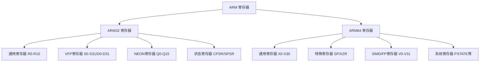
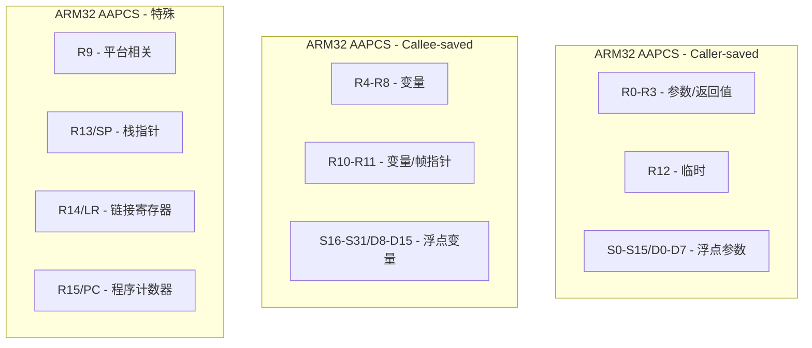
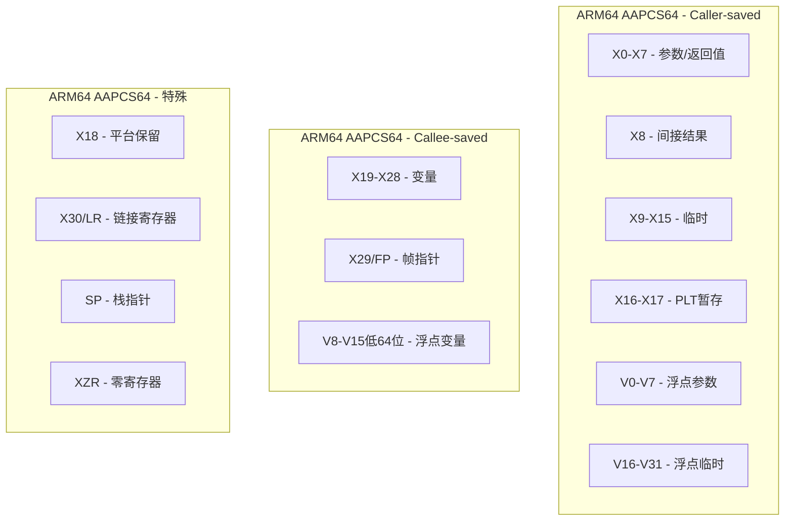

# ARM 寄存器参考

> ARM32和ARM64架构寄存器的完整参考，包含通用寄存器、浮点/SIMD寄存器、特殊寄存器，以及不同调用约定下的寄存器分类

## 概述

ARM架构提供了丰富的寄存器集合，从ARM32的16个32位通用寄存器发展到ARM64的31个64位通用寄存器。理解这些寄存器的用途、命名规范和在不同调用约定下的分类，是编写高效ARM汇编代码的基础。

### 寄存器演进历史

| 架构 | 年代 | 通用寄存器 | 位宽 | 浮点/SIMD寄存器 |
|------|------|------------|------|-----------------|
| ARMv4 | 1994 | R0-R15 | 32位 | 无 |
| ARMv5TE | 1999 | R0-R15 | 32位 | 无 |
| ARMv6 | 2002 | R0-R15 | 32位 | VFP (可选) |
| ARMv7-A | 2005 | R0-R15 | 32位 | VFP + NEON |
| ARMv8-A (AArch64) | 2011 | X0-X30 + SP + XZR | 64位 | V0-V31 (128位) |
| ARMv9-A | 2021 | X0-X30 + SP + XZR | 64位 | V0-V31 + SVE2 |

### 寄存器分类概览




---

## ARM32 通用寄存器（R0-R15）

### 寄存器概览

ARM32提供16个32位通用寄存器，每个寄存器都有特定的用途和别名：

| 寄存器 | AAPCS别名 | 用途 | 保存责任 |
|--------|-----------|------|----------|
| R0 | a1 | 参数1 / 返回值 | Caller-saved |
| R1 | a2 | 参数2 / 返回值高位 | Caller-saved |
| R2 | a3 | 参数3 | Caller-saved |
| R3 | a4 | 参数4 | Caller-saved |
| R4 | v1 | 变量寄存器1 | Callee-saved |
| R5 | v2 | 变量寄存器2 | Callee-saved |
| R6 | v3 | 变量寄存器3 | Callee-saved |
| R7 | v4 | 变量寄存器4 / Thumb帧指针 | Callee-saved |
| R8 | v5 | 变量寄存器5 | Callee-saved |
| R9 | v6/SB/TR | 平台相关 | 平台定义 |
| R10 | v7 | 变量寄存器7 | Callee-saved |
| R11 | v8/FP | 帧指针（ARM状态） | Callee-saved |
| R12 | IP | 过程内调用暂存 | Caller-saved |
| R13 | SP | 栈指针 | 特殊 |
| R14 | LR | 链接寄存器 | 特殊 |
| R15 | PC | 程序计数器 | 特殊 |

### 寄存器位布局

```
ARM32 通用寄存器 (32位):

位:  31                              16 15                               0
     ┌────────────────────────────────┬────────────────────────────────────┐
R0:  │            高16位              │             低16位                 │
     └────────────────────────────────┴────────────────────────────────────┘
     │◄─────────────────────────── 32位 ──────────────────────────────────►│

注意：ARM32没有子寄存器访问，必须使用完整的32位寄存器
```

### 参数和返回值寄存器

```
ARM32 参数传递:

┌─────────────────────────────────────────────────────────────────────────────┐
│  参数1    参数2    参数3    参数4    参数5+                                │
│   R0       R1       R2       R3      栈传递                                │
└─────────────────────────────────────────────────────────────────────────────┘

ARM32 返回值:

┌─────────────────────────────────────────────────────────────────────────────┐
│  32位返回值: R0                                                             │
│  64位返回值: R0 (低32位) + R1 (高32位)                                      │
└─────────────────────────────────────────────────────────────────────────────┘
```

### 64位参数对齐规则

**重要**：64位参数（如`long long`、`double`）必须在偶数寄存器对开始：

| 情况 | 分配方式 |
|------|----------|
| 第1个64位参数 | R0-R1 |
| 第2个64位参数（如果R2-R3可用） | R2-R3 |
| 64位参数在R1时 | 跳过R1，使用R2-R3 |
| 寄存器不足 | 通过栈传递（8字节对齐） |

### 特殊用途寄存器详解

#### R13 - 栈指针（SP）

| 特性 | 说明 |
|------|------|
| **用途** | 指向栈顶（最后压入的数据） |
| **增长方向** | 向低地址增长（PUSH减小SP，POP增加SP） |
| **对齐要求** | 公共接口要求8字节对齐 |
| **保存规则** | 被调用者必须保持（调整后恢复） |

```arm
@ 栈操作示例
PUSH    {R0-R3}         @ SP -= 16, 保存R0-R3
POP     {R0-R3}         @ 恢复R0-R3, SP += 16

SUB     SP, SP, #16     @ 分配16字节栈空间
ADD     SP, SP, #16     @ 释放16字节栈空间
```

#### R14 - 链接寄存器（LR）

| 特性 | 说明 |
|------|------|
| **用途** | 保存函数返回地址 |
| **BL指令** | 自动将返回地址存入LR |
| **返回** | 通过`BX LR`或`POP {PC}`返回 |
| **嵌套调用** | 必须保存LR到栈 |

```arm
@ 函数调用和返回
BL      function        @ LR = 返回地址, 跳转到function
BX      LR              @ 返回到LR指向的地址

@ 嵌套调用时保存LR
PUSH    {LR}            @ 保存返回地址
BL      other_func      @ 调用其他函数
POP     {PC}            @ 恢复返回地址并返回
```

#### R15 - 程序计数器（PC）

| 特性 | 说明 |
|------|------|
| **用途** | 指向当前执行指令+8（ARM）或+4（Thumb） |
| **读取** | 可以直接读取，返回当前指令地址+8 |
| **写入** | 写入PC相当于跳转 |
| **特殊性** | ARM32独有，ARM64不可直接访问PC |

```arm
@ PC相对寻址
LDR     R0, [PC, #offset]   @ 从PC相对地址加载
ADR     R0, label           @ 获取label的地址

@ 通过PC实现跳转
MOV     PC, LR              @ 等效于 BX LR
LDR     PC, [SP], #4        @ 从栈弹出地址并跳转
```


---

## ARM64 通用寄存器（X0-X30, SP, XZR）

### 寄存器概览

ARM64提供31个64位通用寄存器，外加栈指针和零寄存器：

| 寄存器 | 32位视图 | 用途 | 保存责任 |
|--------|----------|------|----------|
| X0 | W0 | 参数1 / 返回值 | Caller-saved |
| X1 | W1 | 参数2 / 返回值扩展 | Caller-saved |
| X2 | W2 | 参数3 | Caller-saved |
| X3 | W3 | 参数4 | Caller-saved |
| X4 | W4 | 参数5 | Caller-saved |
| X5 | W5 | 参数6 | Caller-saved |
| X6 | W6 | 参数7 | Caller-saved |
| X7 | W7 | 参数8 | Caller-saved |
| X8 | W8 | 间接结果位置寄存器 | Caller-saved |
| X9-X15 | W9-W15 | 临时寄存器 | Caller-saved |
| X16 | W16 (IP0) | 过程内调用暂存1 | Caller-saved |
| X17 | W17 (IP1) | 过程内调用暂存2 | Caller-saved |
| X18 | W18 | 平台寄存器 | 平台定义 |
| X19-X28 | W19-W28 | 被调用者保存寄存器 | Callee-saved |
| X29 | W29 (FP) | 帧指针 | Callee-saved |
| X30 | W30 (LR) | 链接寄存器 | 特殊 |
| SP | WSP | 栈指针 | 特殊 |
| XZR | WZR | 零寄存器 | 特殊 |

### 寄存器位布局

```
ARM64 通用寄存器 (64位):

位:  63                              32 31                               0
     ┌────────────────────────────────┬────────────────────────────────────┐
X0:  │            高32位              │        低32位 (W0)                 │
     └────────────────────────────────┴────────────────────────────────────┘
     │◄─────────────────────────── X0 (64位) ─────────────────────────────►│
                                      │◄────────── W0 (32位) ─────────────►│

重要规则: 写入W寄存器会将高32位清零！

示例:
MOV     X0, #0xFFFFFFFFFFFFFFFF  @ X0 = 0xFFFFFFFFFFFFFFFF
MOV     W0, #1                   @ X0 = 0x0000000000000001 (高32位被清零)
```

### 参数和返回值寄存器

```
ARM64 参数传递:

┌─────────────────────────────────────────────────────────────────────────────────┐
│  参数1  参数2  参数3  参数4  参数5  参数6  参数7  参数8  参数9+                 │
│   X0     X1     X2     X3     X4     X5     X6     X7    栈传递                 │
└─────────────────────────────────────────────────────────────────────────────────┘

ARM64 返回值:

┌─────────────────────────────────────────────────────────────────────────────────┐
│  64位返回值: X0                                                                 │
│  128位返回值: X0 (低64位) + X1 (高64位)                                         │
│  大结构体: 通过X8指针返回                                                       │
└─────────────────────────────────────────────────────────────────────────────────┘
```

### 特殊用途寄存器详解

#### SP - 栈指针

| 特性 | 说明 |
|------|------|
| **用途** | 指向栈顶 |
| **增长方向** | 向低地址增长 |
| **对齐要求** | **必须16字节对齐**（强制） |
| **访问限制** | 只能用于特定指令（如LDR/STR的基址） |

```asm
// 栈操作示例
STP     X29, X30, [SP, #-16]!   // 保存FP和LR，SP -= 16
LDP     X29, X30, [SP], #16     // 恢复FP和LR，SP += 16

SUB     SP, SP, #32             // 分配32字节栈空间
ADD     SP, SP, #32             // 释放32字节栈空间
```

#### XZR/WZR - 零寄存器

| 特性 | 说明 |
|------|------|
| **读取** | 始终返回0 |
| **写入** | 丢弃写入的值 |
| **用途** | 简化代码，避免显式清零 |

```asm
// 零寄存器使用示例
MOV     X0, XZR                 // X0 = 0
ADD     X0, X1, XZR             // X0 = X1 + 0 = X1
CMP     X0, XZR                 // 比较X0和0
STR     XZR, [X1]               // 存储0到内存
SUBS    XZR, X0, X1             // 比较X0和X1，丢弃结果（等效于CMP）
```

#### X29 - 帧指针（FP）

| 特性 | 说明 |
|------|------|
| **用途** | 指向当前栈帧的基址 |
| **推荐使用** | AAPCS64推荐使用帧指针 |
| **调试支持** | 便于栈回溯和调试 |

```asm
// 标准函数序言
STP     X29, X30, [SP, #-32]!   // 保存FP和LR
MOV     X29, SP                  // 建立新帧指针

// 访问局部变量和参数
LDR     X0, [X29, #-8]          // 局部变量
LDR     X1, [X29, #16]          // 栈参数

// 标准函数尾声
LDP     X29, X30, [SP], #32     // 恢复FP和LR
RET
```

#### X30 - 链接寄存器（LR）

| 特性 | 说明 |
|------|------|
| **用途** | 保存函数返回地址 |
| **BL指令** | 自动将返回地址存入X30 |
| **RET指令** | 默认跳转到X30 |

```asm
// 函数调用和返回
BL      function                // X30 = 返回地址, 跳转到function
RET                             // 返回到X30指向的地址

// 嵌套调用时保存LR
STP     X29, X30, [SP, #-16]!   // 保存FP和LR
BL      other_func              // 调用其他函数
LDP     X29, X30, [SP], #16     // 恢复FP和LR
RET
```

#### X8 - 间接结果寄存器

| 特性 | 说明 |
|------|------|
| **用途** | 传递大结构体返回值的存储地址 |
| **使用场景** | 返回值超过16字节时 |
| **调用者责任** | 分配空间并将地址放入X8 |

```asm
// 返回大结构体的函数
// struct BigStruct { long data[4]; };
// BigStruct get_big_struct(void)
get_big_struct:
    // X8 指向调用者分配的空间
    MOV     X9, #1
    STR     X9, [X8, #0]        // data[0] = 1
    MOV     X9, #2
    STR     X9, [X8, #8]        // data[1] = 2
    MOV     X9, #3
    STR     X9, [X8, #16]       // data[2] = 3
    MOV     X9, #4
    STR     X9, [X8, #24]       // data[3] = 4
    RET
```


---

## ARM32 浮点寄存器（VFP/NEON）

### VFP寄存器概览

ARM32的VFP（Vector Floating Point）提供浮点运算支持：

| 寄存器类型 | 数量 | 位宽 | 说明 |
|------------|------|------|------|
| S0-S31 | 32个 | 32位 | 单精度浮点 |
| D0-D31 | 32个 | 64位 | 双精度浮点 |
| Q0-Q15 | 16个 | 128位 | NEON四字向量 |

### VFP寄存器布局

```
ARM32 VFP/NEON 寄存器组织:

128位 Q寄存器:
┌────────────────────────────────────────────────────────────────────────────────┐
│                              Q0 (128位)                                        │
├────────────────────────────────────────┬───────────────────────────────────────┤
│              D1 (64位)                 │            D0 (64位)                  │
├────────────────────┬───────────────────┼───────────────────┬───────────────────┤
│    S3 (32位)       │    S2 (32位)      │    S1 (32位)      │   S0 (32位)       │
└────────────────────┴───────────────────┴───────────────────┴───────────────────┘

寄存器别名关系:
- Q0 = D1:D0 = S3:S2:S1:S0
- Q1 = D3:D2 = S7:S6:S5:S4
- ...
- Q15 = D31:D30 = S63:S62:S61:S60 (注: S32-S63仅在某些实现中可用)
```

### VFP寄存器保存规则（AAPCS）

| 寄存器 | 保存责任 | 说明 |
|--------|----------|------|
| S0-S15 / D0-D7 | Caller-saved | 参数和临时寄存器 |
| S16-S31 / D8-D15 | Callee-saved | 被调用者必须保存 |
| D16-D31 | Caller-saved | 仅NEON可用，VFPv3-D32 |

```
VFP 寄存器分类:

Caller-saved (参数/临时):
┌─────────────────────────────────────────────────────────────────────────────────┐
│  S0-S15 / D0-D7 / Q0-Q3                                                         │
│  用于浮点参数传递和临时计算                                                     │
└─────────────────────────────────────────────────────────────────────────────────┘

Callee-saved (必须保存):
┌─────────────────────────────────────────────────────────────────────────────────┐
│  S16-S31 / D8-D15 / Q4-Q7                                                       │
│  函数必须保存和恢复这些寄存器                                                   │
└─────────────────────────────────────────────────────────────────────────────────┘

Caller-saved (NEON扩展):
┌─────────────────────────────────────────────────────────────────────────────────┐
│  D16-D31 / Q8-Q15                                                               │
│  仅在VFPv3-D32/NEON中可用                                                       │
└─────────────────────────────────────────────────────────────────────────────────┘
```

### 浮点参数传递（硬浮点）

| 参数类型 | 寄存器 | 说明 |
|----------|--------|------|
| float (前16个) | S0-S15 | 单精度浮点寄存器 |
| double (前8个) | D0-D7 | 双精度浮点寄存器 |
| 超出数量 | 栈 | 按8字节对齐入栈 |

```arm
@ 硬浮点参数传递示例
@ float add_floats(float a, float b, float c, float d)
@ 参数: S0=a, S1=b, S2=c, S3=d
@ 返回: S0

add_floats:
    VADD.F32 S0, S0, S1         @ S0 = a + b
    VADD.F32 S0, S0, S2         @ S0 += c
    VADD.F32 S0, S0, S3         @ S0 += d
    BX      LR

@ double add_doubles(double a, double b)
@ 参数: D0=a, D1=b
@ 返回: D0

add_doubles:
    VADD.F64 D0, D0, D1         @ D0 = a + b
    BX      LR
```

### 保存VFP寄存器

```arm
@ 保存和恢复VFP callee-saved寄存器
function_using_vfp:
    PUSH    {R4-R11, LR}        @ 保存整数寄存器
    VPUSH   {D8-D15}            @ 保存VFP callee-saved寄存器 (64字节)
    
    @ 函数体，可以自由使用D0-D7和D8-D15
    
    VPOP    {D8-D15}            @ 恢复VFP寄存器
    POP     {R4-R11, PC}        @ 恢复整数寄存器并返回
```


---

## ARM64 SIMD/FP寄存器（V0-V31）

### SIMD/FP寄存器概览

ARM64提供32个128位SIMD/FP寄存器，支持多种数据视图：

| 寄存器视图 | 位宽 | 说明 |
|------------|------|------|
| Bn (B0-B31) | 8位 | 字节 |
| Hn (H0-H31) | 16位 | 半精度浮点 |
| Sn (S0-S31) | 32位 | 单精度浮点 |
| Dn (D0-D31) | 64位 | 双精度浮点 |
| Qn (Q0-Q31) | 128位 | 四字 |
| Vn (V0-V31) | 128位 | 向量（带元素访问） |

### SIMD/FP寄存器位布局

```
ARM64 SIMD/FP 寄存器组织:

128位 V寄存器:
┌────────────────────────────────────────────────────────────────────────────────┐
│                              V0 (128位 / Q0)                                   │
├────────────────────────────────────────┬───────────────────────────────────────┤
│              高64位                    │            D0 (64位)                  │
├────────────────────────────────────────┼───────────────────────────────────────┤
│                                        │            S0 (32位)                  │
├────────────────────────────────────────┼───────────────────────────────────────┤
│                                        │            H0 (16位)                  │
├────────────────────────────────────────┼───────────────────────────────────────┤
│                                        │            B0 (8位)                   │
└────────────────────────────────────────┴───────────────────────────────────────┘

向量元素访问:
V0.16B = 16个8位元素
V0.8H  = 8个16位元素
V0.4S  = 4个32位元素
V0.2D  = 2个64位元素

V0.8B  = 低64位的8个8位元素
V0.4H  = 低64位的4个16位元素
V0.2S  = 低64位的2个32位元素
V0.1D  = 低64位的1个64位元素
```

### SIMD/FP寄存器保存规则（AAPCS64）

| 寄存器 | 保存责任 | 说明 |
|--------|----------|------|
| V0-V7 | Caller-saved | 参数和返回值寄存器 |
| V8-V15 | Callee-saved | **仅低64位**需要保存 |
| V16-V31 | Caller-saved | 临时寄存器 |

**重要**：V8-V15的callee-saved规则仅适用于低64位（D8-D15），高64位不需要保存。

```
ARM64 SIMD/FP 寄存器分类:

Caller-saved (参数/返回值):
┌─────────────────────────────────────────────────────────────────────────────────┐
│  V0-V7 (完整128位)                                                              │
│  用于浮点/SIMD参数传递和返回值                                                  │
└─────────────────────────────────────────────────────────────────────────────────┘

Callee-saved (仅低64位):
┌─────────────────────────────────────────────────────────────────────────────────┐
│  V8-V15 的低64位 (D8-D15)                                                       │
│  函数必须保存和恢复这些寄存器的低64位                                           │
│  高64位不需要保存！                                                             │
└─────────────────────────────────────────────────────────────────────────────────┘

Caller-saved (临时):
┌─────────────────────────────────────────────────────────────────────────────────┐
│  V16-V31 (完整128位)                                                            │
│  临时寄存器，函数可自由使用                                                     │
└─────────────────────────────────────────────────────────────────────────────────┘
```

### 浮点参数传递

| 参数类型 | 寄存器 | 说明 |
|----------|--------|------|
| float | S0-S7 | 单精度浮点 |
| double | D0-D7 | 双精度浮点 |
| 128位向量 | V0-V7 | SIMD向量 |
| 超出数量 | 栈 | 按自然对齐入栈 |

**注意**：浮点参数和整数参数独立计数！

```asm
// 混合参数示例
// double mixed(long n, double x, long m, double y)
// 整数参数: X0=n, X1=m
// 浮点参数: D0=x, D1=y (独立计数)

mixed:
    SCVTF   D2, X0              // D2 = (double)n
    SCVTF   D3, X1              // D3 = (double)m
    FMUL    D2, D2, D0          // D2 = n * x
    FMUL    D3, D3, D1          // D3 = m * y
    FADD    D0, D2, D3          // D0 = n*x + m*y
    RET
```

### 保存SIMD/FP寄存器

```asm
// 保存和恢复SIMD callee-saved寄存器
function_using_simd:
    STP     X29, X30, [SP, #-80]!   // 保存FP和LR
    MOV     X29, SP
    
    // 保存SIMD callee-saved寄存器（仅低64位）
    STP     D8, D9, [SP, #16]
    STP     D10, D11, [SP, #32]
    STP     D12, D13, [SP, #48]
    STP     D14, D15, [SP, #64]
    
    // 函数体，可以自由使用V0-V31
    
    // 恢复SIMD寄存器
    LDP     D8, D9, [SP, #16]
    LDP     D10, D11, [SP, #32]
    LDP     D12, D13, [SP, #48]
    LDP     D14, D15, [SP, #64]
    
    LDP     X29, X30, [SP], #80
    RET
```

### SIMD向量操作示例

```asm
// 向量加法: void vadd_f32(float* dst, float* a, float* b, long n)
vadd_f32:
.loop:
    CMP     X3, #4
    B.LT    .scalar
    
    // 向量处理（4个float一次）
    LD1     {V0.4S}, [X1], #16      // 加载4个float从a
    LD1     {V1.4S}, [X2], #16      // 加载4个float从b
    FADD    V0.4S, V0.4S, V1.4S     // 向量加法
    ST1     {V0.4S}, [X0], #16      // 存储结果到dst
    SUB     X3, X3, #4
    B       .loop

.scalar:
    CBZ     X3, .done
    LDR     S0, [X1], #4
    LDR     S1, [X2], #4
    FADD    S0, S0, S1
    STR     S0, [X0], #4
    SUB     X3, X3, #1
    B       .scalar

.done:
    RET
```


---

## 状态寄存器

### ARM32 CPSR（当前程序状态寄存器）

CPSR是ARM32的主要状态寄存器，包含条件标志、控制位和模式信息：

```
ARM32 CPSR 寄存器位布局:

位:  31 30 29 28 27 26 25 24 23      20 19      16 15      10 9  8  7  6  5  4  0
     ┌──┬──┬──┬──┬──┬──┬──┬──┬────────┬──────────┬──────────┬──┬──┬──┬──┬──┬─────┐
     │N │Z │C │V │Q │IT│J │ │  GE    │          │    IT    │E │A │I │F │T │Mode │
     └──┴──┴──┴──┴──┴──┴──┴──┴────────┴──────────┴──────────┴──┴──┴──┴──┴──┴─────┘
```

#### 条件标志（Condition Flags）

| 位 | 标志 | 名称 | 说明 |
|----|------|------|------|
| 31 | N | 负数标志（Negative） | 结果为负数（最高位为1） |
| 30 | Z | 零标志（Zero） | 结果为零 |
| 29 | C | 进位标志（Carry） | 无符号运算产生进位/借位 |
| 28 | V | 溢出标志（Overflow） | 有符号运算溢出 |
| 27 | Q | 饱和标志（Saturation） | 饱和运算发生饱和 |

#### 控制位

| 位 | 标志 | 名称 | 说明 |
|----|------|------|------|
| 9 | E | 大端模式（Endianness） | 0=小端，1=大端 |
| 8 | A | 异步中止禁用 | 禁用异步中止 |
| 7 | I | IRQ禁用 | 禁用IRQ中断 |
| 6 | F | FIQ禁用 | 禁用FIQ中断 |
| 5 | T | Thumb状态 | 0=ARM状态，1=Thumb状态 |
| 4-0 | Mode | 处理器模式 | User/FIQ/IRQ/SVC/ABT/UND/SYS |

#### 条件码与标志关系

| 条件码 | 后缀 | 含义 | 测试的标志 |
|--------|------|------|------------|
| 0000 | EQ | 等于 | Z = 1 |
| 0001 | NE | 不等于 | Z = 0 |
| 0010 | CS/HS | 进位/无符号高于等于 | C = 1 |
| 0011 | CC/LO | 无进位/无符号低于 | C = 0 |
| 0100 | MI | 负数 | N = 1 |
| 0101 | PL | 正数或零 | N = 0 |
| 0110 | VS | 溢出 | V = 1 |
| 0111 | VC | 无溢出 | V = 0 |
| 1000 | HI | 无符号高于 | C = 1 且 Z = 0 |
| 1001 | LS | 无符号低于等于 | C = 0 或 Z = 1 |
| 1010 | GE | 有符号大于等于 | N = V |
| 1011 | LT | 有符号小于 | N ≠ V |
| 1100 | GT | 有符号大于 | Z = 0 且 N = V |
| 1101 | LE | 有符号小于等于 | Z = 1 或 N ≠ V |
| 1110 | AL | 总是（默认） | 无条件 |

### ARM64 PSTATE（处理器状态）

ARM64使用PSTATE替代CPSR，通过特殊寄存器访问：

```
ARM64 PSTATE 组成:

┌─────────────────────────────────────────────────────────────────────────────────┐
│  NZCV        │  条件标志 (N, Z, C, V)                                          │
├──────────────┼──────────────────────────────────────────────────────────────────┤
│  DAIF        │  中断掩码 (D=调试, A=SError, I=IRQ, F=FIQ)                       │
├──────────────┼──────────────────────────────────────────────────────────────────┤
│  CurrentEL   │  当前异常级别 (EL0/EL1/EL2/EL3)                                  │
├──────────────┼──────────────────────────────────────────────────────────────────┤
│  SPSel       │  栈指针选择 (SP_EL0 或 SP_ELx)                                   │
├──────────────┼──────────────────────────────────────────────────────────────────┤
│  PAN         │  特权访问禁止                                                    │
├──────────────┼──────────────────────────────────────────────────────────────────┤
│  UAO         │  用户访问覆盖                                                    │
└─────────────────────────────────────────────────────────────────────────────────┘
```

#### NZCV寄存器

| 位 | 标志 | 说明 |
|----|------|------|
| 31 | N | 负数标志 |
| 30 | Z | 零标志 |
| 29 | C | 进位标志 |
| 28 | V | 溢出标志 |

```asm
// 读取和设置条件标志
MRS     X0, NZCV                // 读取NZCV到X0
MSR     NZCV, X0                // 设置NZCV从X0

// 条件分支
CMP     X0, X1                  // 设置条件标志
B.EQ    equal                   // 如果相等则跳转
B.NE    not_equal               // 如果不等则跳转
B.GT    greater                 // 如果大于则跳转
B.LT    less                    // 如果小于则跳转
```


---

## 调用约定中的寄存器分类

### ARM32 AAPCS 寄存器分类

#### Caller-saved（调用者保存/易失性）寄存器

函数调用后可能被修改，调用者需要保存：

| 类别 | 寄存器 | 用途 |
|------|--------|------|
| **参数寄存器** | R0, R1, R2, R3 | 整数/指针参数 |
| **返回值** | R0, R1 | 整数返回值 |
| **临时寄存器** | R12 (IP) | 过程内调用暂存 |
| **浮点参数** | S0-S15 / D0-D7 | 浮点参数（硬浮点） |
| **浮点返回值** | S0 / D0 | 浮点返回值 |

#### Callee-saved（被调用者保存/非易失性）寄存器

函数必须保持这些寄存器的值不变：

| 类别 | 寄存器 | 用途 |
|------|--------|------|
| **变量寄存器** | R4-R8, R10-R11 | 通用变量寄存器 |
| **帧指针** | R11 (FP) | 栈帧基址（ARM状态） |
| **Thumb帧指针** | R7 | 栈帧基址（Thumb状态） |
| **浮点** | S16-S31 / D8-D15 | 浮点变量寄存器 |



### ARM64 AAPCS64 寄存器分类

#### Caller-saved（调用者保存/易失性）寄存器

| 类别 | 寄存器 | 用途 |
|------|--------|------|
| **参数寄存器** | X0-X7 | 整数/指针参数 |
| **返回值** | X0, X1 | 整数返回值 |
| **间接结果** | X8 | 大结构体返回地址 |
| **临时寄存器** | X9-X15 | 可自由使用 |
| **PLT暂存** | X16, X17 | 过程链接表使用 |
| **浮点参数** | V0-V7 | 浮点/SIMD参数 |
| **浮点返回值** | V0 | 浮点返回值 |
| **浮点临时** | V16-V31 | 可自由使用 |

#### Callee-saved（被调用者保存/非易失性）寄存器

| 类别 | 寄存器 | 用途 |
|------|--------|------|
| **变量寄存器** | X19-X28 | 通用变量寄存器 |
| **帧指针** | X29 (FP) | 栈帧基址 |
| **浮点** | V8-V15 (低64位) | **仅低64位需要保存** |




---

## ARM32与ARM64寄存器对比

### 通用寄存器对比

| 特性 | ARM32 | ARM64 |
|------|-------|-------|
| **通用寄存器数量** | 16个 (R0-R15) | 31个 (X0-X30) + SP + XZR |
| **寄存器位宽** | 32位 | 64位 (可用32位视图W0-W30) |
| **参数寄存器** | R0-R3 (4个) | X0-X7 (8个) |
| **返回值寄存器** | R0-R1 | X0-X1 |
| **被调用者保存** | R4-R11 | X19-X28 |
| **链接寄存器** | R14 (LR) | X30 (LR) |
| **帧指针** | R11 (FP) | X29 (FP) |
| **栈指针** | R13 (SP) | SP (独立寄存器) |
| **程序计数器** | R15 (PC，可直接访问) | PC (不可直接访问) |
| **零寄存器** | 无 | XZR/WZR |
| **栈对齐** | 8字节 | 16字节 |

### 寄存器映射建议（ARM32到ARM64迁移）

| ARM32 | ARM64 | 说明 |
|-------|-------|------|
| R0-R3 | X0-X3 | 参数/返回值 |
| R4-R10 | X19-X25 | Callee-saved |
| R11 (FP) | X29 (FP) | 帧指针 |
| R12 (IP) | X16/X17 | 临时寄存器 |
| R13 (SP) | SP | 栈指针 |
| R14 (LR) | X30 (LR) | 链接寄存器 |
| R15 (PC) | - | 使用ADR/BL |

### 浮点/SIMD寄存器对比

| 特性 | ARM32 (VFP/NEON) | ARM64 (SIMD/FP) |
|------|------------------|-----------------|
| **寄存器数量** | 32个64位 (D0-D31) 或 16个128位 (Q0-Q15) | 32个128位 (V0-V31) |
| **最大向量宽度** | 128位 | 128位 (SVE可达2048位) |
| **浮点参数** | S0-S15/D0-D7 | V0-V7 |
| **浮点返回值** | S0/D0 | V0 |
| **被调用者保存** | D8-D15 | V8-V15 (仅低64位) |
| **寄存器视图** | S/D/Q | B/H/S/D/Q/V |

```
寄存器视图对比:

ARM32:
┌────────────────────────────────────────────────────────────────────────────────┐
│                              Q0 (128位)                                        │
├────────────────────────────────────────┬───────────────────────────────────────┤
│              D1 (64位)                 │            D0 (64位)                  │
├────────────────────┬───────────────────┼───────────────────┬───────────────────┤
│    S3 (32位)       │    S2 (32位)      │    S1 (32位)      │   S0 (32位)       │
└────────────────────┴───────────────────┴───────────────────┴───────────────────┘

ARM64:
┌────────────────────────────────────────────────────────────────────────────────┐
│                              V0 / Q0 (128位)                                   │
├────────────────────────────────────────┬───────────────────────────────────────┤
│              高64位                    │            D0 (64位)                  │
├────────────────────────────────────────┼───────────────────────────────────────┤
│                                        │            S0 (32位)                  │
├────────────────────────────────────────┼───────────────────────────────────────┤
│                                        │            H0 (16位)                  │
├────────────────────────────────────────┼───────────────────────────────────────┤
│                                        │            B0 (8位)                   │
└────────────────────────────────────────┴───────────────────────────────────────┘
```


---

## 寄存器使用最佳实践

### ARM32函数序言中的寄存器保存

```arm
@ 需要使用R4-R8的函数
my_function:
    @ 保存callee-saved寄存器和LR
    PUSH    {R4-R8, LR}         @ 保存6个寄存器 (24字节)
    
    @ 如果需要VFP寄存器
    VPUSH   {D8-D11}            @ 保存4个双精度寄存器 (32字节)
    
    @ 分配局部变量空间（保持8字节对齐）
    SUB     SP, SP, #16
    
    @ 函数体...
    @ 可以自由使用 R4-R8, D8-D11
    
    @ 释放局部变量空间
    ADD     SP, SP, #16
    
    @ 恢复VFP寄存器
    VPOP    {D8-D11}
    
    @ 恢复寄存器并返回
    POP     {R4-R8, PC}
```

### ARM64函数序言中的寄存器保存

```asm
// 需要使用X19-X22和D8-D9的函数
my_function:
    // 保存FP和LR，分配栈空间
    STP     X29, X30, [SP, #-64]!
    MOV     X29, SP
    
    // 保存callee-saved整数寄存器
    STP     X19, X20, [SP, #16]
    STP     X21, X22, [SP, #32]
    
    // 保存SIMD callee-saved寄存器（仅低64位）
    STP     D8, D9, [SP, #48]
    
    // 函数体...
    // 可以自由使用 X19-X22, D8-D9
    
    // 恢复SIMD寄存器
    LDP     D8, D9, [SP, #48]
    
    // 恢复整数寄存器
    LDP     X19, X20, [SP, #16]
    LDP     X21, X22, [SP, #32]
    
    // 恢复FP和LR
    LDP     X29, X30, [SP], #64
    RET
```

### 寄存器选择建议

| 场景 | ARM32推荐 | ARM64推荐 | 原因 |
|------|-----------|-----------|------|
| 循环计数器 | R4-R6 | X19-X21 | Callee-saved，跨调用保持 |
| 数组指针 | R4-R6 | X19-X21 | Callee-saved，跨调用保持 |
| 临时计算 | R0-R3, R12 | X0-X15 | Caller-saved，无需保存 |
| 长期保存值 | R4-R11 | X19-X28 | Callee-saved |
| 浮点计算 | S0-S15/D0-D7 | V0-V7, V16-V31 | Caller-saved |
| 浮点长期值 | D8-D15 | D8-D15 | Callee-saved |


---

## 寄存器快速参考表

### ARM32通用寄存器速查

| 寄存器 | 别名 | AAPCS用途 | 保存规则 |
|--------|------|-----------|----------|
| R0 | a1 | 参数1/返回值 | Caller |
| R1 | a2 | 参数2/返回值高位 | Caller |
| R2 | a3 | 参数3 | Caller |
| R3 | a4 | 参数4 | Caller |
| R4 | v1 | 变量寄存器 | Callee |
| R5 | v2 | 变量寄存器 | Callee |
| R6 | v3 | 变量寄存器 | Callee |
| R7 | v4 | 变量/Thumb FP | Callee |
| R8 | v5 | 变量寄存器 | Callee |
| R9 | v6/SB/TR | 平台相关 | 平台定义 |
| R10 | v7 | 变量寄存器 | Callee |
| R11 | v8/FP | 帧指针 | Callee |
| R12 | IP | 临时暂存 | Caller |
| R13 | SP | 栈指针 | 特殊 |
| R14 | LR | 链接寄存器 | 特殊 |
| R15 | PC | 程序计数器 | 特殊 |

### ARM64通用寄存器速查

| 寄存器 | 32位视图 | AAPCS64用途 | 保存规则 |
|--------|----------|-------------|----------|
| X0 | W0 | 参数1/返回值 | Caller |
| X1 | W1 | 参数2/返回值扩展 | Caller |
| X2 | W2 | 参数3 | Caller |
| X3 | W3 | 参数4 | Caller |
| X4 | W4 | 参数5 | Caller |
| X5 | W5 | 参数6 | Caller |
| X6 | W6 | 参数7 | Caller |
| X7 | W7 | 参数8 | Caller |
| X8 | W8 | 间接结果 | Caller |
| X9-X15 | W9-W15 | 临时寄存器 | Caller |
| X16 | W16 (IP0) | PLT暂存1 | Caller |
| X17 | W17 (IP1) | PLT暂存2 | Caller |
| X18 | W18 | 平台保留 | 平台定义 |
| X19-X28 | W19-W28 | 变量寄存器 | Callee |
| X29 | W29 (FP) | 帧指针 | Callee |
| X30 | W30 (LR) | 链接寄存器 | 特殊 |
| SP | WSP | 栈指针 | 特殊 |
| XZR | WZR | 零寄存器 | 特殊 |

### ARM32 VFP寄存器速查

| 寄存器 | 别名 | 用途 | 保存规则 |
|--------|------|------|----------|
| S0-S15 | D0-D7 | 浮点参数/返回值 | Caller |
| S16-S31 | D8-D15 | 浮点变量 | Callee |
| D16-D31 | Q8-Q15 | NEON临时 | Caller |

### ARM64 SIMD/FP寄存器速查

| 寄存器 | 用途 | 保存规则 |
|--------|------|----------|
| V0-V7 | 浮点参数/返回值 | Caller |
| V8-V15 | 浮点变量 | Callee (仅低64位) |
| V16-V31 | 临时寄存器 | Caller |


---

## 代码示例

### 示例1：ARM32寄存器保存和恢复

```arm
@ 使用多个callee-saved寄存器的函数
@ int compute(int* data, int len)
    .text
    .global compute

compute:
    @ 函数序言 - 保存callee-saved寄存器
    PUSH    {R4-R7, LR}         @ 保存5个寄存器 (20字节)
    SUB     SP, SP, #4          @ 对齐到8字节 (24字节总计)
    
    @ 参数: R0 = data, R1 = len
    MOV     R4, R0              @ R4 = data指针
    MOV     R5, R1              @ R5 = 长度
    MOV     R6, #0              @ R6 = 索引
    MOV     R7, #0              @ R7 = 累加器
    
.loop:
    CMP     R6, R5
    BGE     .done
    
    LDR     R0, [R4, R6, LSL #2]  @ R0 = data[i]
    ADD     R7, R7, R0            @ 累加
    ADD     R6, R6, #1            @ i++
    B       .loop
    
.done:
    MOV     R0, R7              @ 返回累加结果
    
    @ 函数尾声 - 恢复callee-saved寄存器
    ADD     SP, SP, #4
    POP     {R4-R7, PC}

    .size compute, .-compute
```

### 示例2：ARM64寄存器保存和恢复

```asm
// 使用多个callee-saved寄存器的函数
// long compute(long* data, long len)
    .text
    .global compute

compute:
    // 函数序言 - 保存callee-saved寄存器
    STP     X29, X30, [SP, #-48]!
    MOV     X29, SP
    STP     X19, X20, [SP, #16]
    STP     X21, X22, [SP, #32]
    
    // 参数: X0 = data, X1 = len
    MOV     X19, X0             // X19 = data指针
    MOV     X20, X1             // X20 = 长度
    MOV     X21, #0             // X21 = 索引
    MOV     X22, #0             // X22 = 累加器
    
.loop:
    CMP     X21, X20
    B.GE    .done
    
    LDR     X0, [X19, X21, LSL #3]  // X0 = data[i]
    ADD     X22, X22, X0            // 累加
    ADD     X21, X21, #1            // i++
    B       .loop
    
.done:
    MOV     X0, X22             // 返回累加结果
    
    // 函数尾声 - 恢复callee-saved寄存器
    LDP     X19, X20, [SP, #16]
    LDP     X21, X22, [SP, #32]
    LDP     X29, X30, [SP], #48
    RET

    .size compute, .-compute
```

### 示例3：ARM32 VFP浮点运算

```arm
@ 向量点积计算（使用VFP）
@ float dot_product(float* a, float* b, int n)
    .text
    .global dot_product
    .fpu vfpv3

dot_product:
    PUSH    {R4-R6, LR}
    VPUSH   {D8}                @ 保存D8用于累加
    
    MOV     R4, R0              @ R4 = a
    MOV     R5, R1              @ R5 = b
    MOV     R6, R2              @ R6 = n
    
    VMOV.F32 S16, #0.0          @ S16 = 累加器 = 0
    
.loop:
    CMP     R6, #0
    BLE     .done
    
    VLD1.32 {D0[0]}, [R4]!      @ 加载a[i]到S0
    VLD1.32 {D1[0]}, [R5]!      @ 加载b[i]到S2
    VMUL.F32 S0, S0, S2         @ S0 = a[i] * b[i]
    VADD.F32 S16, S16, S0       @ 累加
    
    SUB     R6, R6, #1
    B       .loop
    
.done:
    VMOV.F32 S0, S16            @ 返回值在S0
    
    VPOP    {D8}
    POP     {R4-R6, PC}

    .size dot_product, .-dot_product
```

### 示例4：ARM64 SIMD向量运算

```asm
// 向量点积计算（使用SIMD）
// double dot_product(double* a, double* b, long n)
    .text
    .global dot_product

dot_product:
    STP     X29, X30, [SP, #-32]!
    MOV     X29, SP
    STP     D8, D9, [SP, #16]   // 保存D8-D9
    
    MOV     X3, X0              // X3 = a
    MOV     X4, X1              // X4 = b
    MOV     X5, X2              // X5 = n
    
    MOVI    D8, #0              // D8 = 累加器 = 0
    
.loop_vec:
    CMP     X5, #2
    B.LT    .loop_scalar
    
    // 向量处理（2个double一次）
    LD1     {V0.2D}, [X3], #16  // 加载2个double从a
    LD1     {V1.2D}, [X4], #16  // 加载2个double从b
    FMUL    V0.2D, V0.2D, V1.2D // 向量乘法
    FADDP   D9, V0.2D           // 水平加法
    FADD    D8, D8, D9          // 累加
    SUB     X5, X5, #2
    B       .loop_vec

.loop_scalar:
    CBZ     X5, .done
    
    // 标量处理
    LDR     D0, [X3], #8
    LDR     D1, [X4], #8
    FMUL    D0, D0, D1
    FADD    D8, D8, D0
    SUB     X5, X5, #1
    B       .loop_scalar
    
.done:
    FMOV    D0, D8              // 返回值在D0
    
    LDP     D8, D9, [SP, #16]
    LDP     X29, X30, [SP], #32
    RET

    .size dot_product, .-dot_product
```

### 示例5：混合整数和浮点参数

```asm
// ARM64: 混合参数函数
// double calculate(long n, double x, long m, double y, long k)
// 整数参数: X0=n, X1=m, X2=k
// 浮点参数: D0=x, D1=y (独立计数)
// 返回: D0 = n*x + m*y + k

    .text
    .global calculate

calculate:
    // 将整数转换为双精度浮点
    SCVTF   D2, X0              // D2 = (double)n
    SCVTF   D3, X1              // D3 = (double)m
    SCVTF   D4, X2              // D4 = (double)k
    
    // 计算 n*x + m*y + k
    FMUL    D2, D2, D0          // D2 = n * x
    FMUL    D3, D3, D1          // D3 = m * y
    FADD    D0, D2, D3          // D0 = n*x + m*y
    FADD    D0, D0, D4          // D0 += k
    
    RET

    .size calculate, .-calculate
```


---

## 平台特定寄存器用途

### R9/X18 平台寄存器

R9（ARM32）和X18（ARM64）是平台保留寄存器，不同操作系统有不同用途：

| 平台 | ARM32 R9 | ARM64 X18 | 说明 |
|------|----------|-----------|------|
| **Linux (通用)** | v6 (通用) | 通用 | 可作为通用寄存器使用 |
| **Linux (PIC)** | SB (静态基址) | - | 位置无关代码使用 |
| **iOS/macOS** | 保留 | 保留 | 系统保留，不可使用 |
| **Windows on ARM** | 保留 | TEB指针 | 线程环境块 |
| **Android** | 通用 | 通用 | 可作为通用寄存器使用 |
| **RTOS** | TR (线程寄存器) | 线程指针 | 线程本地存储 |

### Apple平台特殊规则

Apple平台（iOS、macOS、watchOS、tvOS）对ARM寄存器有额外限制：

| 寄存器 | Apple规则 | 说明 |
|--------|-----------|------|
| X18 | **禁止使用** | 系统保留 |
| X29 (FP) | **必须使用** | 帧指针必须有效 |
| X30 (LR) | 标准 | 链接寄存器 |

```asm
// Apple平台函数示例
// 必须建立有效的帧指针链
apple_function:
    STP     X29, X30, [SP, #-16]!   // 必须保存FP和LR
    MOV     X29, SP                  // 必须建立帧指针
    
    // 函数体...
    // 注意：不要使用X18！
    
    LDP     X29, X30, [SP], #16
    RET
```

### Linux平台TLS访问

```asm
// ARM64 Linux: 通过TPIDR_EL0访问线程本地存储
    MRS     X0, TPIDR_EL0           // 读取TLS基址
    LDR     X1, [X0, #offset]       // 访问TLS变量

// ARM32 Linux: 通过协处理器访问TLS
    MRC     p15, 0, R0, c13, c0, 3  // 读取TLS基址
    LDR     R1, [R0, #offset]       // 访问TLS变量
```

---

## 参考资料

### 官方规范文档

- [Procedure Call Standard for the ARM Architecture (AAPCS)](https://github.com/ARM-software/abi-aa/blob/main/aapcs32/aapcs32.rst) - ARM32调用约定
- [Procedure Call Standard for the ARM 64-bit Architecture (AAPCS64)](https://github.com/ARM-software/abi-aa/blob/main/aapcs64/aapcs64.rst) - ARM64调用约定
- [ARM Architecture Reference Manual (ARMv7-A/R)](https://developer.arm.com/documentation/ddi0406/latest) - ARM32架构参考手册
- [ARM Architecture Reference Manual (ARMv8-A)](https://developer.arm.com/documentation/ddi0487/latest) - ARM64架构参考手册

### 相关章节

- [ARM架构概述](overview.md) - ARM32和ARM64架构对比
- [ARM32 AAPCS详解](arm32-aapcs.md) - 完整的ARM32调用约定说明
- [ARM64 AAPCS64详解](arm64-aapcs64.md) - 完整的ARM64调用约定说明

### 扩展阅读

- [ARM Developer Documentation](https://developer.arm.com/documentation) - ARM开发者文档中心
- [ARM Cortex-A Series Programmer's Guide](https://developer.arm.com/documentation/den0013/latest) - Cortex-A编程指南
- [ARM NEON Programmer's Guide](https://developer.arm.com/documentation/den0018/latest) - NEON编程指南
- [Learn the Architecture - AArch64](https://developer.arm.com/documentation/102374/latest) - AArch64架构学习指南
- [ARM Compiler armasm User Guide](https://developer.arm.com/documentation/dui0473/latest) - ARM汇编器用户指南

---

*上一节: [ARM64 AAPCS64](arm64-aapcs64.md)*

*返回: [ARM架构概述](overview.md)*
