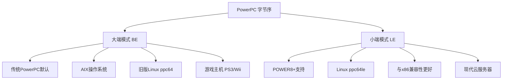
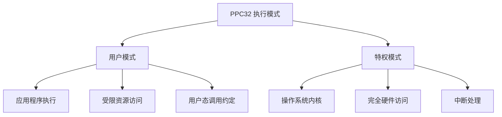
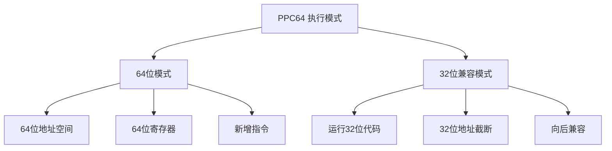
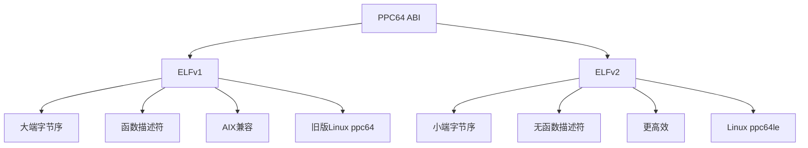
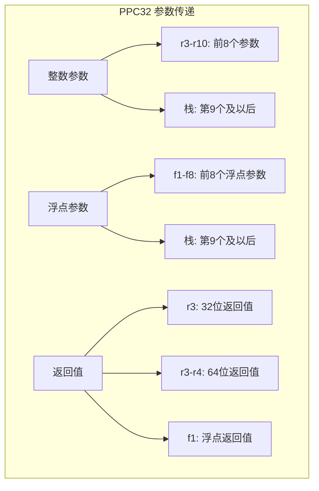
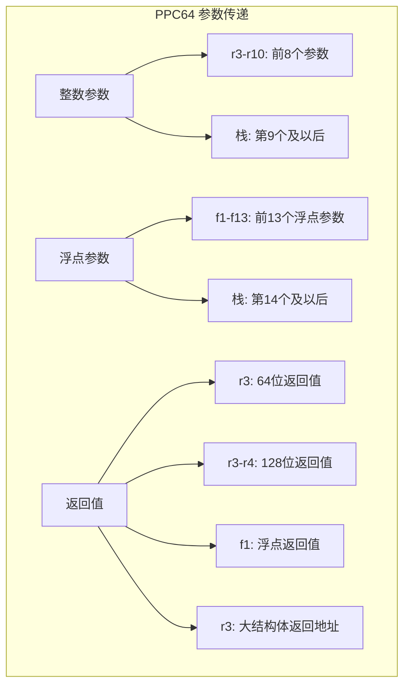
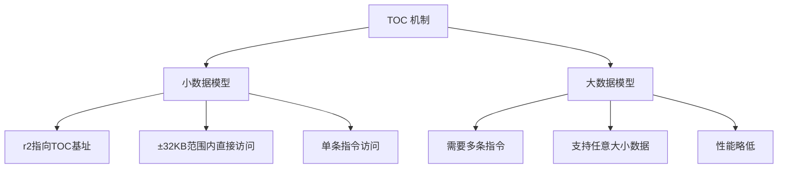
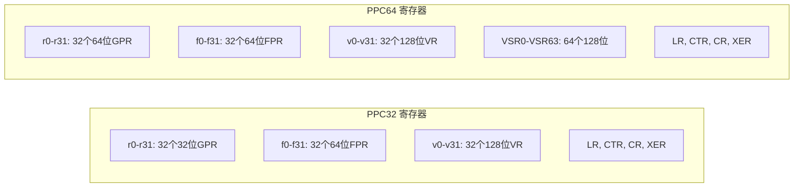

# PowerPC架构概述

> PPC32和PPC64架构的全面对比，包括ELFv1/ELFv2 ABI、寄存器、指令集和调用约定差异

## 引言

PowerPC（Performance Optimization With Enhanced RISC - Performance Computing）是一种精简指令集计算（RISC）架构，由Apple、IBM和Motorola联盟（AIM联盟）于1991年开发。PowerPC架构在服务器、嵌入式系统和游戏主机等领域有着广泛的应用。本章节将深入介绍PowerPC架构的两个主要版本：PPC32（32位）和PPC64（64位），帮助汇编语言开发者理解两者之间的关键差异。

### PowerPC架构的市场地位

| 应用领域 | 典型设备 | 主要架构版本 |
|----------|----------|--------------|
| **高性能服务器** | IBM POWER系列服务器 | PPC64 (POWER9/10) |
| **超级计算机** | Summit、Sierra | PPC64 (POWER9) |
| **游戏主机** | PlayStation 3、Xbox 360 | PPC64/PPC32 (Cell BE/Xenon) |
| **家用游戏机** | Nintendo Wii/Wii U、GameCube | PPC32 (Broadway/Espresso) |
| **嵌入式系统** | 网络设备、汽车电子 | PPC32 (e500/e600) |
| **早期Mac电脑** | Power Mac G3/G4/G5 | PPC32/PPC64 |
| **网络设备** | 路由器、交换机 | PPC32/PPC64 |

---

## PowerPC架构发展历史

### 时间线

```
PowerPC架构演进历史:

1991年 ─── PowerPC联盟成立 ────────── Apple、IBM、Motorola (AIM)
   │
1993年 ─── PowerPC 601 ───────────── 首款PowerPC处理器
   │
1994年 ─── PowerPC 603/604 ────────── 低功耗/高性能版本
   │
1997年 ─── PowerPC 750 (G3) ────────── Apple Power Mac G3
   │
1999年 ─── PowerPC 7400 (G4) ────────── AltiVec SIMD扩展
   │
2002年 ─── PowerPC 970 (G5) ────────── 64位架构，Apple Power Mac G5
   │
2006年 ─── Cell Broadband Engine ───── PlayStation 3、超级计算机
   │
2007年 ─── POWER6 ────────────────── 高频率设计 (4.7GHz)
   │
2010年 ─── POWER7 ────────────────── 多核心、SMT4
   │
2013年 ─── OpenPOWER联盟 ──────────── 开放架构授权
   │
2014年 ─── POWER8 ────────────────── ELFv2 ABI、NVLink
   │
2017年 ─── POWER9 ────────────────── PCIe 4.0、OpenCAPI
   │
2021年 ─── POWER10 ───────────────── 最新一代，7nm工艺
```

### 架构版本与处理器系列

| 架构版本 | 处理器系列 | 位宽 | 主要特性 |
|----------|------------|------|----------|
| PowerPC 1.0 | 601 | 32位 | 首款PowerPC |
| PowerPC 2.0 | 603/604/750 | 32位 | 分支预测、超标量 |
| PowerPC 2.01 | 7400/7450 (G4) | 32位 | AltiVec SIMD |
| PowerPC 2.02 | 970 (G5) | 64位 | 64位扩展 |
| POWER4 | POWER4/4+ | 64位 | 双核心、SMT |
| POWER5 | POWER5/5+ | 64位 | SMT2、虚拟化 |
| POWER6 | POWER6/6+ | 64位 | 高频率设计 |
| POWER7 | POWER7/7+ | 64位 | SMT4、VSX |
| POWER8 | POWER8 | 64位 | ELFv2、NVLink |
| POWER9 | POWER9 | 64位 | PCIe 4.0、OpenCAPI |
| POWER10 | POWER10 | 64位 | MMA、PCIe 5.0 |

---

## 大端与小端字节序

### 字节序概述

PowerPC架构传统上使用**大端字节序（Big-Endian）**，但现代POWER处理器支持双端模式：



### 字节序对比

| 特性 | 大端 (BE) | 小端 (LE) |
|------|-----------|-----------|
| **内存布局** | 高位字节在低地址 | 低位字节在低地址 |
| **操作系统** | AIX、旧版Linux | 现代Linux (ppc64le) |
| **ABI** | ELFv1 | ELFv2 |
| **兼容性** | 传统PowerPC | 与x86更兼容 |
| **主要平台** | PS3、Wii、旧服务器 | POWER8+云服务器 |

### 字节序示例

```
32位整数 0x12345678 在内存中的存储:

大端模式 (Big-Endian):
地址:    0x00   0x01   0x02   0x03
内容:    0x12   0x34   0x56   0x78
         ↑最高有效字节在最低地址

小端模式 (Little-Endian):
地址:    0x00   0x01   0x02   0x03
内容:    0x78   0x56   0x34   0x12
         ↑最低有效字节在最低地址
```

---

## PPC32 (32位) 架构概述

### 执行模式

PPC32架构支持多种执行模式：



### PPC32寄存器概览

PPC32提供32个32位通用寄存器和多组特殊寄存器：

| 寄存器 | 别名 | 用途 | 调用约定角色 |
|--------|------|------|--------------|
| GPR0 | r0 | 特殊用途（不可用于寻址） | Volatile |
| GPR1 | r1/SP | 栈指针 | 专用 |
| GPR2 | r2/TOC | TOC指针（小数据区） | 专用 |
| GPR3 | r3 | 参数1/返回值 | Volatile |
| GPR4 | r4 | 参数2/返回值扩展 | Volatile |
| GPR5 | r5 | 参数3 | Volatile |
| GPR6 | r6 | 参数4 | Volatile |
| GPR7 | r7 | 参数5 | Volatile |
| GPR8 | r8 | 参数6 | Volatile |
| GPR9 | r9 | 参数7 | Volatile |
| GPR10 | r10 | 参数8 | Volatile |
| GPR11 | r11 | 环境指针 | Volatile |
| GPR12 | r12 | 临时/函数入口地址 | Volatile |
| GPR13 | r13 | 小数据区指针 | 专用 |
| GPR14-GPR31 | r14-r31 | 被调用者保存 | Non-volatile |


### PPC32寄存器位布局

```
PPC32 通用寄存器 (32位):

位:  31                              16 15                               0
     ┌────────────────────────────────┬────────────────────────────────────┐
GPR: │            高16位              │             低16位                 │
     └────────────────────────────────┴────────────────────────────────────┘
     │◄─────────────────────────── 32位 ──────────────────────────────────►│

条件寄存器 CR (32位，分为8个4位字段):

位:  31    28 27    24 23    20 19    16 15    12 11     8 7      4 3      0
     ┌───────┬───────┬───────┬───────┬───────┬───────┬───────┬───────┐
CR:  │  CR0  │  CR1  │  CR2  │  CR3  │  CR4  │  CR5  │  CR6  │  CR7  │
     └───────┴───────┴───────┴───────┴───────┴───────┴───────┴───────┘
       │
       └─ 每个CRn字段包含: LT(小于), GT(大于), EQ(等于), SO(溢出摘要)

XER 寄存器 (异常寄存器):

位:  31 30 29 28    25 24                                               0
     ┌──┬──┬──┬──────┬─────────────────────────────────────────────────────┐
XER: │SO│OV│CA│ 保留 │              字节计数 (用于字符串指令)              │
     └──┴──┴──┴──────┴─────────────────────────────────────────────────────┘
      │  │  │
      │  │  └─ 进位标志 (Carry)
      │  └──── 溢出标志 (Overflow)
      └─────── 溢出摘要 (Summary Overflow)
```

### PPC32特殊寄存器

| 寄存器 | 全称 | 用途 |
|--------|------|------|
| **LR** | Link Register | 存储函数返回地址 |
| **CTR** | Count Register | 循环计数/间接分支目标 |
| **CR** | Condition Register | 条件码（8个4位字段） |
| **XER** | Fixed-Point Exception Register | 溢出和进位标志 |
| **FPSCR** | FP Status and Control Register | 浮点状态和控制 |
| **MSR** | Machine State Register | 处理器状态（特权） |

---

## PPC64 (64位) 架构概述

### 执行模式

PPC64扩展了地址空间和寄存器宽度：



### PPC64寄存器概览

PPC64将所有通用寄存器扩展到64位：

| 寄存器 | 用途 | ELFv1角色 | ELFv2角色 |
|--------|------|-----------|-----------|
| GPR0 | 特殊用途 | Volatile | Volatile |
| GPR1 | 栈指针 (SP) | 专用 | 专用 |
| GPR2 | TOC指针 | 专用 | 专用 |
| GPR3 | 参数1/返回值 | Volatile | Volatile |
| GPR4 | 参数2 | Volatile | Volatile |
| GPR5 | 参数3 | Volatile | Volatile |
| GPR6 | 参数4 | Volatile | Volatile |
| GPR7 | 参数5 | Volatile | Volatile |
| GPR8 | 参数6 | Volatile | Volatile |
| GPR9 | 参数7 | Volatile | Volatile |
| GPR10 | 参数8 | Volatile | Volatile |
| GPR11 | 环境指针 | Volatile | Volatile |
| GPR12 | 函数入口地址 | Volatile | Volatile |
| GPR13 | 线程指针 | 专用 | 专用 |
| GPR14-GPR31 | 被调用者保存 | Non-volatile | Non-volatile |

### PPC64寄存器位布局

```
PPC64 通用寄存器 (64位):

位:  63                              32 31                               0
     ┌────────────────────────────────┬────────────────────────────────────┐
GPR: │            高32位              │             低32位                 │
     └────────────────────────────────┴────────────────────────────────────┘
     │◄─────────────────────────── 64位 ──────────────────────────────────►│

注意：32位操作会影响整个64位寄存器（与x64不同）

PPC64 浮点寄存器 (64位):

位:  63                                                                   0
     ┌────────────────────────────────────────────────────────────────────┐
FPR: │                        64位 IEEE 754 双精度                        │
     └────────────────────────────────────────────────────────────────────┘

VSX 向量寄存器 (128位):

位:  127                             64 63                                0
     ┌────────────────────────────────┬────────────────────────────────────┐
VSR: │              高64位            │              低64位                │
     └────────────────────────────────┴────────────────────────────────────┘
     │◄─────────────────────────── 128位 ─────────────────────────────────►│
```

---

## ELFv1与ELFv2 ABI对比

### ABI概述

PowerPC 64位有两种主要的ABI：ELFv1（传统）和ELFv2（现代）：




### ELFv1与ELFv2详细对比

| 特性 | ELFv1 | ELFv2 |
|------|-------|-------|
| **字节序** | 大端 (BE) | 小端 (LE) |
| **函数描述符** | 需要（3个双字） | 不需要 |
| **函数入口** | 通过描述符间接 | 直接调用 |
| **TOC指针** | 每次调用可能改变 | 调用者保存 |
| **参数保存区** | 必须分配 | 可选 |
| **栈帧最小大小** | 112字节 | 32字节 |
| **局部入口点** | 不支持 | 支持 |
| **主要平台** | AIX、旧Linux | 现代Linux ppc64le |

### 函数描述符（ELFv1）

ELFv1使用函数描述符来支持跨模块调用：

```
ELFv1 函数描述符结构 (24字节):

偏移:    0                8               16              24
         ┌────────────────┬────────────────┬────────────────┐
         │   函数入口地址  │    TOC值       │   环境指针     │
         │   (8字节)      │   (8字节)      │   (8字节)      │
         └────────────────┴────────────────┴────────────────┘
              ↓                 ↓                ↓
         加载到CTR/LR      加载到r2         加载到r11

调用流程:
1. 加载函数描述符地址
2. 从描述符加载入口地址到CTR
3. 从描述符加载TOC到r2
4. 分支到CTR
```

### 局部入口点（ELFv2）

ELFv2引入了局部入口点优化：

```
ELFv2 函数入口点:

全局入口点 (GEP):              局部入口点 (LEP):
┌─────────────────────┐        ┌─────────────────────┐
│ addis r2,r12,X@ha   │        │                     │
│ addi  r2,r2,X@l     │        │ (跳过TOC设置)       │
│ .localentry func,.-func      │                     │
├─────────────────────┤ ◄──────┤                     │
│ 函数体开始          │        │ 函数体开始          │
│ ...                 │        │ ...                 │
└─────────────────────┘        └─────────────────────┘

- 全局入口点: 跨模块调用使用，需要设置TOC
- 局部入口点: 同模块调用使用，跳过TOC设置
```

---

## 调用约定概述

### PPC32调用约定

PPC32使用System V ABI for PowerPC：



#### PPC32关键规则

| 规则 | 说明 |
|------|------|
| **参数传递** | r3-r10传递前8个字（32位）参数 |
| **浮点参数** | f1-f8传递前8个浮点参数 |
| **栈对齐** | 16字节对齐 |
| **栈清理** | 调用者负责 |
| **链接区** | 栈帧顶部保留链接区 |
| **返回地址** | 存储在LR寄存器 |

```asm
# PPC32 函数调用示例
# int add(int a, int b, int c, int d, int e, int f, int g, int h, int i)
# 参数: a=r3, b=r4, c=r5, d=r6, e=r7, f=r8, g=r9, h=r10, i=[栈]

add:
    stwu    r1, -16(r1)         # 分配栈帧
    mflr    r0                  # 保存LR
    stw     r0, 20(r1)          # 存储到栈
    
    lwz     r11, 32(r1)         # 加载第9个参数i
    add     r3, r3, r4          # a + b
    add     r3, r3, r5          # + c
    add     r3, r3, r6          # + d
    add     r3, r3, r7          # + e
    add     r3, r3, r8          # + f
    add     r3, r3, r9          # + g
    add     r3, r3, r10         # + h
    add     r3, r3, r11         # + i
    
    lwz     r0, 20(r1)          # 恢复LR
    mtlr    r0
    addi    r1, r1, 16          # 释放栈帧
    blr                         # 返回
```

### PPC64调用约定

PPC64调用约定根据ABI版本有所不同：



#### PPC64关键规则

| 规则 | ELFv1 | ELFv2 |
|------|-------|-------|
| **参数传递** | r3-r10 (8个) | r3-r10 (8个) |
| **浮点参数** | f1-f13 (13个) | f1-f13 (13个) |
| **栈对齐** | 16字节 | 16字节 |
| **最小栈帧** | 112字节 | 32字节 |
| **参数保存区** | 必须 (64字节) | 可选 |
| **TOC保存** | 调用者保存 | 调用者保存 |
| **函数入口** | 通过描述符 | 直接/局部入口 |


```asm
# PPC64 ELFv2 函数调用示例
# long add(long a, long b, long c, long d, long e, long f, long g, long h, long i)
# 参数: a=r3, b=r4, c=r5, d=r6, e=r7, f=r8, g=r9, h=r10, i=[栈]

    .globl add
    .type add, @function
add:
    .localentry add, .-add
    ld      r11, 96(r1)         # 加载第9个参数i (ELFv2栈布局)
    add     r3, r3, r4          # a + b
    add     r3, r3, r5          # + c
    add     r3, r3, r6          # + d
    add     r3, r3, r7          # + e
    add     r3, r3, r8          # + f
    add     r3, r3, r9          # + g
    add     r3, r3, r10         # + h
    add     r3, r3, r11         # + i
    blr                         # 返回
```

### 调用约定对比表

| 特性 | PPC32 | PPC64 ELFv1 | PPC64 ELFv2 |
|------|-------|-------------|-------------|
| **整数参数寄存器** | r3-r10 (8个) | r3-r10 (8个) | r3-r10 (8个) |
| **浮点参数寄存器** | f1-f8 (8个) | f1-f13 (13个) | f1-f13 (13个) |
| **整数返回值** | r3 (r3-r4 for 64位) | r3 (r3-r4 for 128位) | r3 (r3-r4 for 128位) |
| **浮点返回值** | f1 | f1 | f1 |
| **Volatile整数** | r0, r3-r12 | r0, r3-r12 | r0, r3-r12 |
| **Non-volatile整数** | r14-r31 | r14-r31 | r14-r31 |
| **Volatile浮点** | f0-f13 | f0-f13 | f0-f13 |
| **Non-volatile浮点** | f14-f31 | f14-f31 | f14-f31 |
| **栈对齐** | 16字节 | 16字节 | 16字节 |
| **最小栈帧** | 8字节 | 112字节 | 32字节 |
| **链接寄存器** | LR | LR | LR |
| **TOC指针** | r2 (可选) | r2 (必须) | r2 (必须) |

---

## 栈帧结构对比

### PPC32栈帧

```
PPC32 标准栈帧布局:

高地址
┌─────────────────────────────────────┐
│         调用者的栈帧                │
├─────────────────────────────────────┤
│         参数保存区                  │  ← 调用者分配 (可选)
│         (第9个及以后的参数)         │
├─────────────────────────────────────┤
│         链接区                      │
│         ┌─────────────────────────┐ │
│         │ 保存的LR (4字节)        │ │  ← 偏移 +4
│         ├─────────────────────────┤ │
│         │ 保存的CR (4字节)        │ │  ← 偏移 +0 (可选)
│         └─────────────────────────┘ │
├─────────────────────────────────────┤ ← 调用时的SP
│         Back Chain (4字节)          │  ← 指向调用者栈帧
├─────────────────────────────────────┤
│         保存的寄存器 (r14-r31)      │
├─────────────────────────────────────┤
│         局部变量                    │
├─────────────────────────────────────┤
│         参数构建区                  │  ← 为被调用函数准备参数
├─────────────────────────────────────┤ ← 当前SP (16字节对齐)
低地址

栈增长方向: 向低地址增长 ↓
```

### PPC64 ELFv1栈帧

```
PPC64 ELFv1 标准栈帧布局:

高地址
┌─────────────────────────────────────┐
│         调用者的栈帧                │
├─────────────────────────────────────┤
│         浮点参数保存区              │  ← 最多13个 (f1-f13)
│         (104字节)                   │
├─────────────────────────────────────┤
│         整数参数保存区              │  ← 8个参数 (r3-r10)
│         (64字节)                    │
├─────────────────────────────────────┤
│         TOC保存区 (8字节)           │  ← 偏移 +40
├─────────────────────────────────────┤
│         链接编辑器区 (8字节)        │  ← 偏移 +32
├─────────────────────────────────────┤
│         编译器区 (8字节)            │  ← 偏移 +24
├─────────────────────────────────────┤
│         保存的LR (8字节)            │  ← 偏移 +16
├─────────────────────────────────────┤
│         保存的CR (8字节)            │  ← 偏移 +8
├─────────────────────────────────────┤ ← 调用时的SP
│         Back Chain (8字节)          │  ← 偏移 +0
├─────────────────────────────────────┤
│         保存的寄存器                │
├─────────────────────────────────────┤
│         局部变量                    │
├─────────────────────────────────────┤
│         参数构建区                  │
├─────────────────────────────────────┤ ← 当前SP (16字节对齐)
低地址

最小栈帧大小: 112字节
```

### PPC64 ELFv2栈帧

```
PPC64 ELFv2 标准栈帧布局:

高地址
┌─────────────────────────────────────┐
│         调用者的栈帧                │
├─────────────────────────────────────┤
│         可选参数保存区              │  ← 仅当需要时分配
├─────────────────────────────────────┤
│         TOC保存区 (8字节)           │  ← 偏移 +24
├─────────────────────────────────────┤
│         保存的LR (8字节)            │  ← 偏移 +16
├─────────────────────────────────────┤
│         保存的CR (8字节)            │  ← 偏移 +8 (可选)
├─────────────────────────────────────┤ ← 调用时的SP
│         Back Chain (8字节)          │  ← 偏移 +0
├─────────────────────────────────────┤
│         保存的寄存器                │
├─────────────────────────────────────┤
│         局部变量                    │
├─────────────────────────────────────┤
│         参数构建区                  │
├─────────────────────────────────────┤ ← 当前SP (16字节对齐)
低地址

最小栈帧大小: 32字节 (无局部变量时可为0)
```


### 函数序言/尾声对比

#### PPC32函数序言/尾声

```asm
# PPC32 标准函数序言
func:
    stwu    r1, -32(r1)         # 分配栈帧，保存back chain
    mflr    r0                  # 获取LR
    stw     r0, 36(r1)          # 保存LR到链接区
    stmw    r30, 24(r1)         # 保存r30-r31

    # ... 函数体 ...

# PPC32 标准函数尾声
    lmw     r30, 24(r1)         # 恢复r30-r31
    lwz     r0, 36(r1)          # 加载保存的LR
    mtlr    r0                  # 恢复LR
    addi    r1, r1, 32          # 释放栈帧
    blr                         # 返回
```

#### PPC64 ELFv2函数序言/尾声

```asm
# PPC64 ELFv2 标准函数序言
    .globl func
    .type func, @function
func:
    .localentry func, .-func    # 局部入口点
    mflr    r0                  # 获取LR
    std     r0, 16(r1)          # 保存LR
    stdu    r1, -64(r1)         # 分配栈帧
    std     r30, 48(r1)         # 保存non-volatile寄存器
    std     r31, 56(r1)

    # ... 函数体 ...

# PPC64 ELFv2 标准函数尾声
    ld      r30, 48(r1)         # 恢复寄存器
    ld      r31, 56(r1)
    addi    r1, r1, 64          # 释放栈帧
    ld      r0, 16(r1)          # 加载保存的LR
    mtlr    r0                  # 恢复LR
    blr                         # 返回
```

---

## TOC (Table of Contents) 机制

### TOC概述

TOC是PowerPC架构中用于访问全局数据和函数的机制：



### TOC访问示例

```asm
# 通过TOC访问全局变量
# 假设 global_var 在TOC范围内

# PPC64 ELFv2 - 访问全局变量
    addis   r3, r2, global_var@toc@ha    # 加载高位
    ld      r3, global_var@toc@l(r3)     # 加载变量值

# 或使用单条指令（如果在±32KB范围内）
    ld      r3, global_var@toc(r2)       # 直接从TOC加载

# 调用外部函数时保存/恢复TOC
    std     r2, 24(r1)          # 保存TOC到栈
    bl      external_func       # 调用外部函数
    nop                         # 链接器可能插入TOC恢复
    ld      r2, 24(r1)          # 恢复TOC
```

---

## 常见使用场景和平台

### 服务器和高性能计算

| 平台/设备 | 处理器 | 操作系统 | ABI |
|-----------|--------|----------|-----|
| **IBM Power Systems** | POWER9/10 | AIX、Linux | ELFv1/ELFv2 |
| **Summit超级计算机** | POWER9 + V100 | Linux | ELFv2 |
| **Sierra超级计算机** | POWER9 + V100 | Linux | ELFv2 |
| **IBM Cloud** | POWER9 | Linux | ELFv2 |

### 游戏主机

| 平台 | 处理器 | 架构 | 特点 |
|------|--------|------|------|
| **PlayStation 3** | Cell BE | PPC64 | 1 PPE + 8 SPE |
| **Xbox 360** | Xenon | PPC64 | 3核心，VMX128 |
| **Nintendo Wii** | Broadway | PPC32 | 729MHz，基于750CL |
| **Nintendo Wii U** | Espresso | PPC32 | 3核心，1.24GHz |
| **Nintendo GameCube** | Gekko | PPC32 | 485MHz，基于750CXe |

### 嵌入式系统

| 应用领域 | 处理器系列 | 架构 | 特点 |
|----------|------------|------|------|
| **网络设备** | QorIQ (e500/e6500) | PPC32/64 | 多核心、硬件加速 |
| **汽车电子** | MPC5xxx | PPC32 | 实时性、功能安全 |
| **工业控制** | MPC8xxx | PPC32 | 可靠性、长生命周期 |
| **航空航天** | RAD750 | PPC32 | 抗辐射、高可靠 |

### 历史平台

| 平台 | 处理器 | 时期 | 说明 |
|------|--------|------|------|
| **Power Mac G3** | PowerPC 750 | 1997-1999 | 首款G3 Mac |
| **Power Mac G4** | PowerPC 7400/7450 | 1999-2004 | AltiVec支持 |
| **Power Mac G5** | PowerPC 970 | 2003-2006 | 64位Mac |
| **iBook/PowerBook** | G3/G4 | 1999-2006 | 便携式Mac |

---

## 开发工具链

### 编译器支持

| 工具 | PPC32支持 | PPC64支持 | 说明 |
|------|-----------|-----------|------|
| **GCC** | ✓ | ✓ | 完整支持，主流选择 |
| **Clang/LLVM** | ✓ | ✓ | 良好支持 |
| **IBM XL C/C++** | ✓ | ✓ | IBM官方编译器 |
| **IBM Open XL** | - | ✓ | 基于LLVM的新编译器 |

### 交叉编译

```bash
# 安装PPC64LE交叉编译工具链 (Ubuntu/Debian)
sudo apt-get install gcc-powerpc64le-linux-gnu

# 编译PPC64LE程序
powerpc64le-linux-gnu-gcc -o hello hello.c

# 使用QEMU运行
qemu-ppc64le ./hello
```

### 调试工具

| 工具 | 说明 |
|------|------|
| **GDB** | 支持PPC32/PPC64调试 |
| **LLDB** | LLVM调试器 |
| **IBM Debugger** | AIX平台调试器 |
| **Valgrind** | 内存调试（ppc64le支持） |


---

## 代码示例

### 示例1：简单函数对比

#### PPC32版本

```asm
# PPC32: 计算两个整数的和
# int add(int a, int b)
# 参数: a=r3, b=r4
# 返回: r3

    .text
    .globl add
    .type add, @function

add:
    add     r3, r3, r4          # r3 = a + b
    blr                         # 返回

    .size add, .-add
```

#### PPC64 ELFv2版本

```asm
# PPC64 ELFv2: 计算两个整数的和
# long add(long a, long b)
# 参数: a=r3, b=r4
# 返回: r3

    .text
    .globl add
    .type add, @function

add:
    .localentry add, .-add
    add     r3, r3, r4          # r3 = a + b
    blr                         # 返回

    .size add, .-add
```

### 示例2：带局部变量的函数

#### PPC32版本

```asm
# PPC32: 计算数组元素之和
# int sum_array(int* arr, int len)
# 参数: arr=r3, len=r4

    .text
    .globl sum_array
    .type sum_array, @function

sum_array:
    stwu    r1, -32(r1)         # 分配栈帧
    mflr    r0                  # 保存LR
    stw     r0, 36(r1)
    stw     r30, 24(r1)         # 保存r30
    stw     r31, 28(r1)         # 保存r31

    mr      r30, r3             # r30 = arr
    mr      r31, r4             # r31 = len
    li      r3, 0               # sum = 0

.loop:
    cmpwi   r31, 0              # if (len == 0)
    beq     .done               #     goto done
    
    lwz     r0, 0(r30)          # r0 = *arr
    add     r3, r3, r0          # sum += r0
    addi    r30, r30, 4         # arr++
    addi    r31, r31, -1        # len--
    b       .loop

.done:
    lwz     r30, 24(r1)         # 恢复r30
    lwz     r31, 28(r1)         # 恢复r31
    lwz     r0, 36(r1)          # 恢复LR
    mtlr    r0
    addi    r1, r1, 32          # 释放栈帧
    blr                         # 返回

    .size sum_array, .-sum_array
```

#### PPC64 ELFv2版本

```asm
# PPC64 ELFv2: 计算数组元素之和
# long sum_array(long* arr, long len)
# 参数: arr=r3, len=r4

    .text
    .globl sum_array
    .type sum_array, @function

sum_array:
    .localentry sum_array, .-sum_array
    mflr    r0                  # 保存LR
    std     r0, 16(r1)
    stdu    r1, -48(r1)         # 分配栈帧
    std     r30, 32(r1)         # 保存r30
    std     r31, 40(r1)         # 保存r31

    mr      r30, r3             # r30 = arr
    mr      r31, r4             # r31 = len
    li      r3, 0               # sum = 0

.loop:
    cmpdi   r31, 0              # if (len == 0)
    beq     .done               #     goto done
    
    ld      r0, 0(r30)          # r0 = *arr
    add     r3, r3, r0          # sum += r0
    addi    r30, r30, 8         # arr++
    addi    r31, r31, -1        # len--
    b       .loop

.done:
    ld      r30, 32(r1)         # 恢复r30
    ld      r31, 40(r1)         # 恢复r31
    addi    r1, r1, 48          # 释放栈帧
    ld      r0, 16(r1)          # 恢复LR
    mtlr    r0
    blr                         # 返回

    .size sum_array, .-sum_array
```

### 示例3：调用其他函数

#### PPC64 ELFv2版本

```asm
# PPC64 ELFv2: 调用printf
# void print_number(long n)

    .text
    .globl print_number
    .type print_number, @function

print_number:
    .localentry print_number, .-print_number
    mflr    r0                  # 保存LR
    std     r0, 16(r1)
    stdu    r1, -48(r1)         # 分配栈帧
    std     r2, 24(r1)          # 保存TOC

    mr      r4, r3              # r4 = n (第二个参数)
    addis   r3, r2, format_str@toc@ha
    addi    r3, r3, format_str@toc@l  # r3 = 格式字符串
    bl      printf              # 调用printf
    nop                         # TOC恢复点

    ld      r2, 24(r1)          # 恢复TOC
    addi    r1, r1, 48          # 释放栈帧
    ld      r0, 16(r1)          # 恢复LR
    mtlr    r0
    blr                         # 返回

    .section .rodata
format_str:
    .asciz "Number: %ld\n"

    .size print_number, .-print_number
```

### 示例4：浮点运算

```asm
# PPC64 ELFv2: 计算两个浮点数的和
# double fadd(double a, double b)
# 参数: a=f1, b=f2
# 返回: f1

    .text
    .globl fadd
    .type fadd, @function

fadd:
    .localentry fadd, .-fadd
    fadd    f1, f1, f2          # f1 = a + b
    blr                         # 返回

    .size fadd, .-fadd
```

---

## PowerPC指令集特点

### 指令格式

PowerPC使用固定的32位指令长度，主要指令格式包括：

| 格式 | 用途 | 示例 |
|------|------|------|
| **I-Form** | 分支指令 | `b`, `bl` |
| **B-Form** | 条件分支 | `bc`, `bclr` |
| **D-Form** | 加载/存储、立即数运算 | `lwz`, `addi` |
| **X-Form** | 寄存器运算 | `add`, `and` |
| **XO-Form** | 扩展运算 | `mullw`, `divw` |
| **M-Form** | 旋转/掩码 | `rlwinm`, `rlwimi` |

### 条件分支

PowerPC使用条件寄存器（CR）进行条件分支：

```asm
# 条件分支示例
    cmpw    r3, r4              # 比较r3和r4，结果存入CR0
    beq     equal               # 如果相等，跳转
    blt     less                # 如果小于，跳转
    bgt     greater             # 如果大于，跳转

# 使用特定CR字段
    cmpw    cr5, r3, r4         # 比较结果存入CR5
    beq     cr5, equal          # 检查CR5的相等位
```

### 特殊指令

| 指令 | 用途 | 说明 |
|------|------|------|
| **mflr/mtlr** | 移动LR | 保存/恢复返回地址 |
| **mfctr/mtctr** | 移动CTR | 循环计数/间接分支 |
| **mfcr/mtcrf** | 移动CR | 条件寄存器操作 |
| **sync/isync** | 同步 | 内存屏障 |
| **dcbf/icbi** | 缓存控制 | 数据/指令缓存操作 |


---

## SIMD扩展

### AltiVec/VMX

AltiVec（也称为VMX）是PowerPC的SIMD扩展：

```asm
# AltiVec 向量加法示例
# void vadd_f32(float* dst, float* a, float* b, int n)

    .text
    .globl vadd_f32
    .type vadd_f32, @function

vadd_f32:
    srwi    r7, r6, 2           # n / 4 (每次处理4个float)
    mtctr   r7                  # 设置循环计数

.loop:
    lvx     v0, 0, r4           # 加载4个float从a
    lvx     v1, 0, r5           # 加载4个float从b
    vaddfp  v0, v0, v1          # 向量加法
    stvx    v0, 0, r3           # 存储结果到dst
    addi    r3, r3, 16          # dst += 16
    addi    r4, r4, 16          # a += 16
    addi    r5, r5, 16          # b += 16
    bdnz    .loop               # 循环

    blr

    .size vadd_f32, .-vadd_f32
```

### VSX (Vector Scalar Extension)

VSX是POWER7引入的扩展，统一了浮点和向量寄存器：

| 特性 | AltiVec/VMX | VSX |
|------|-------------|-----|
| **向量寄存器** | VR0-VR31 (128位) | VSR0-VSR63 (128位) |
| **标量浮点** | 分离的FPR | 统一到VSR |
| **双精度向量** | 有限支持 | 完整支持 |
| **处理器** | G4+, POWER6 | POWER7+ |

```asm
# VSX 双精度向量加法
    lxvd2x  vs0, 0, r4          # 加载2个double
    lxvd2x  vs1, 0, r5
    xvadddp vs0, vs0, vs1       # 向量双精度加法
    stxvd2x vs0, 0, r3          # 存储结果
```

---

## PPC32与PPC64关键差异对比

### 详细对比表

| 特性 | PPC32 | PPC64 |
|------|-------|-------|
| **地址空间** | 4GB (32位) | 16EB (64位) |
| **寄存器宽度** | 32位 | 64位 |
| **指针大小** | 4字节 | 8字节 |
| **long类型** | 4字节 | 8字节 |
| **栈对齐** | 16字节 | 16字节 |
| **最小栈帧** | 8字节 | 32/112字节 |
| **TOC** | 可选 | 必须 |
| **函数描述符** | 无 | ELFv1需要 |
| **浮点参数** | f1-f8 | f1-f13 |

### 寄存器映射



---

## 迁移指南：PPC32到PPC64

### 主要迁移考虑

| 方面 | PPC32 | PPC64 | 迁移建议 |
|------|-------|-------|----------|
| **数据类型** | long=32位, 指针=32位 | long=64位, 指针=64位 | 使用固定宽度类型 |
| **对齐** | 4/8字节 | 8/16字节 | 检查结构体布局 |
| **栈帧** | 简单 | 复杂（ELFv1） | 了解ABI差异 |
| **TOC** | 可选 | 必须 | 正确设置r2 |
| **加载/存储** | lwz/stw | ld/std | 更新指令 |

### 指令映射

| PPC32指令 | PPC64指令 | 说明 |
|-----------|-----------|------|
| `lwz r3, 0(r4)` | `ld r3, 0(r4)` | 加载字/双字 |
| `stw r3, 0(r4)` | `std r3, 0(r4)` | 存储字/双字 |
| `cmpw r3, r4` | `cmpd r3, r4` | 比较字/双字 |
| `addi r3, r4, 1` | `addi r3, r4, 1` | 相同 |
| `mullw r3, r4, r5` | `mulld r3, r4, r5` | 乘法 |
| `divw r3, r4, r5` | `divd r3, r4, r5` | 除法 |

---

## 后续章节

深入了解PowerPC调用约定的详细规范：

- **[PPC32调用约定](ppc32.md)**: PPC32过程调用标准完整规范
- **[PPC64 ELFv1/v2](ppc64.md)**: PPC64调用约定完整规范
- **[PowerPC寄存器参考](registers.md)**: PowerPC寄存器完整说明

---

## 参考资料

### 官方文档

- [Power ISA](https://openpowerfoundation.org/specifications/isa/) - Power指令集架构规范
- [64-Bit ELF V2 ABI Specification](https://openpowerfoundation.org/specifications/64bitelfabi/) - PPC64 ELFv2 ABI规范
- [Power Architecture 32-bit ABI Supplement](https://refspecs.linuxfoundation.org/elf/elfspec_ppc.pdf) - PPC32 ABI规范
- [IBM POWER9 Processor User's Manual](https://www.ibm.com/docs/en/power9) - POWER9处理器手册

### 扩展阅读

- [OpenPOWER Foundation](https://openpowerfoundation.org/) - OpenPOWER基金会
- [IBM Developer - Power](https://developer.ibm.com/technologies/linux-on-power/) - IBM Power开发者资源
- [Compiler Explorer (PowerPC)](https://godbolt.org/) - 在线查看PowerPC汇编输出
- [QEMU PowerPC](https://www.qemu.org/docs/master/system/target-ppc.html) - QEMU PowerPC模拟器文档

### 历史资料

- [PowerPC Architecture Book](https://www.ibm.com/docs/en/aix/7.2?topic=concepts-powerpc-architecture) - PowerPC架构概念
- [AltiVec Technology Programming Interface Manual](https://www.nxp.com/docs/en/reference-manual/ALTIVECPIM.pdf) - AltiVec编程手册

---

*下一节: [PPC32调用约定](ppc32.md)*
