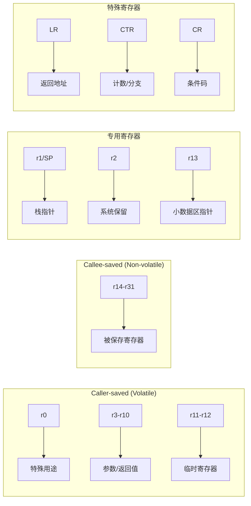

# PPC32 调用约定详解

> PowerPC 32位架构过程调用标准完整规范，包含GPR3-GPR10参数传递、栈帧结构、链接区和代码示例

## 概述

PPC32调用约定是PowerPC 32位架构的标准过程调用约定，定义了函数调用时参数传递、返回值处理、寄存器使用和栈管理的规则。该约定基于System V ABI for PowerPC规范，广泛应用于嵌入式系统、游戏主机（如Nintendo Wii/GameCube）和早期Mac电脑。

### 适用范围

| 架构版本 | 处理器系列 | 适用性 |
|----------|------------|--------|
| PowerPC 1.0 | 601 | ✓ |
| PowerPC 2.0 | 603/604/750 (G3) | ✓ |
| PowerPC 2.01 | 7400/7450 (G4) | ✓ |
| e500/e600 | QorIQ系列 | ✓ |
| Broadway | Nintendo Wii | ✓ |
| Gekko | Nintendo GameCube | ✓ |

### 核心特性概览

| 特性 | 规范 |
|------|------|
| **整数参数寄存器** | GPR3-GPR10（8个） |
| **浮点参数寄存器** | FPR1-FPR8（8个） |
| **整数返回值** | GPR3（32位）/ GPR3-GPR4（64位） |
| **浮点返回值** | FPR1 |
| **栈对齐** | 16字节 |
| **栈清理** | 调用者（Caller） |
| **链接寄存器** | LR |
| **栈指针** | GPR1 (r1) |

---

## 寄存器分类

### 通用寄存器概览

PPC32提供32个32位通用寄存器（GPR），调用约定对每个寄存器定义了特定用途：

| 寄存器 | 别名 | 用途 | 保存责任 |
|--------|------|------|----------|
| GPR0 | r0 | 特殊用途（不可用于寻址基址） | Volatile |
| GPR1 | r1/SP | 栈指针 | 专用 |
| GPR2 | r2 | 系统保留/TOC指针 | 专用 |
| GPR3 | r3 | 参数1 / 返回值 | Volatile |
| GPR4 | r4 | 参数2 / 返回值高位 | Volatile |
| GPR5 | r5 | 参数3 | Volatile |
| GPR6 | r6 | 参数4 | Volatile |
| GPR7 | r7 | 参数5 | Volatile |
| GPR8 | r8 | 参数6 | Volatile |
| GPR9 | r9 | 参数7 | Volatile |
| GPR10 | r10 | 参数8 | Volatile |
| GPR11 | r11 | 环境指针/临时 | Volatile |
| GPR12 | r12 | 临时/函数入口地址 | Volatile |
| GPR13 | r13 | 小数据区指针 | 专用 |
| GPR14-GPR31 | r14-r31 | 被调用者保存寄存器 | Non-volatile |

### 调用者保存寄存器（Caller-saved / Volatile）

这些寄存器在函数调用后可能被修改，调用者如需保留其值必须自行保存：

```
Caller-saved 寄存器:
┌─────────────────────────────────────────────────────────────────────────────┐
│  r0   │  r3   │  r4   │  r5   │  r6   │  r7   │  r8   │  r9   │  r10  │     │
│ 特殊  │ 参数1 │ 参数2 │ 参数3 │ 参数4 │ 参数5 │ 参数6 │ 参数7 │ 参数8 │     │
├───────┴───────┴───────┴───────┴───────┴───────┴───────┴───────┴───────┤     │
│  r11  │  r12  │                                                       │     │
│ 环境  │ 临时  │                                                       │     │
└───────┴───────┴───────────────────────────────────────────────────────┴─────┘
```

| 寄存器 | 说明 |
|--------|------|
| r0 | 特殊用途，不能用作基址寄存器 |
| r3-r10 | 参数传递和返回值，函数可自由修改 |
| r11 | 环境指针，用于嵌套函数或PIC代码 |
| r12 | 临时寄存器，常用于存储函数入口地址 |

### 被调用者保存寄存器（Callee-saved / Non-volatile）

这些寄存器在函数调用后必须保持原值，被调用函数如需使用必须先保存再恢复：

```
Callee-saved 寄存器:
┌─────────────────────────────────────────────────────────────────────────────┐
│  r14  │  r15  │  r16  │  r17  │  r18  │  r19  │  r20  │  r21  │  r22  │     │
├───────┼───────┼───────┼───────┼───────┼───────┼───────┼───────┼───────┤     │
│  r23  │  r24  │  r25  │  r26  │  r27  │  r28  │  r29  │  r30  │  r31  │     │
└───────┴───────┴───────┴───────┴───────┴───────┴───────┴───────┴───────┴─────┘
```

| 寄存器 | 说明 |
|--------|------|
| r14-r31 | 通用被保存寄存器，函数必须保存和恢复 |

### 特殊寄存器

| 寄存器 | 全称 | 用途 |
|--------|------|------|
| **LR** | Link Register | 存储函数返回地址 |
| **CTR** | Count Register | 循环计数/间接分支目标 |
| **CR** | Condition Register | 条件码（8个4位字段） |
| **XER** | Fixed-Point Exception Register | 溢出和进位标志 |
| **FPSCR** | FP Status and Control Register | 浮点状态和控制 |

### 寄存器分类图示



---

## 整数参数传递

### 参数寄存器顺序

PPC32使用8个寄存器传递整数和指针参数：

| 参数位置 | 寄存器 | 说明 |
|----------|--------|------|
| 第1个参数 | r3 | 第一个字（32位） |
| 第2个参数 | r4 | 第二个字 |
| 第3个参数 | r5 | 第三个字 |
| 第4个参数 | r6 | 第四个字 |
| 第5个参数 | r7 | 第五个字 |
| 第6个参数 | r8 | 第六个字 |
| 第7个参数 | r9 | 第七个字 |
| 第8个参数 | r10 | 第八个字 |
| 第9个及以后 | 栈 | 参数保存区 |

### 参数传递规则

#### 基本规则

1. **整数和指针类型**：使用r3-r10传递前8个字（32位）参数
2. **小于32位的整数**：零扩展或符号扩展到32位
3. **超过8个参数**：第9个及以后的参数通过栈传递
4. **栈参数位置**：位于调用者栈帧的参数保存区

#### 64位参数对齐规则

**重要**：64位参数（如`long long`、`double`）必须在偶数寄存器对开始：

| 情况 | 分配方式 |
|------|----------|
| 第1个64位参数 | r3-r4 |
| 第2个64位参数（如果r5-r6可用） | r5-r6 |
| 64位参数在r4时 | 跳过r4，使用r5-r6 |
| 寄存器不足 | 通过栈传递（8字节对齐） |

### 参数传递示例

```
函数: int func(int a, int b, int c, int d, int e, int f, int g, int h, int i)

寄存器分配:
┌─────────────────────────────────────────────────────────────────────────────┐
│ a → r3   b → r4   c → r5   d → r6   e → r7   f → r8   g → r9   h → r10    │
└─────────────────────────────────────────────────────────────────────────────┘

栈布局（函数入口时）:
高地址
┌─────────────────┐
│    参数 i       │  [SP + 8]  (参数保存区)
├─────────────────┤
│    链接区       │  [SP + 0]
└─────────────────┘ ← SP
低地址
```

### 64位参数对齐示例

```
函数: void func(int a, long long b, int c)

参数分配:
┌─────────────────────────────────────────────────────────────────────────────┐
│ a → r3                                                                      │
│ b → r5-r6 (跳过r4以保持64位对齐)                                            │
│ c → r7                                                                      │
│ r4 → 未使用（填充）                                                         │
└─────────────────────────────────────────────────────────────────────────────┘

函数: void func(long long a, long long b, long long c, long long d, int e)

参数分配:
┌─────────────────────────────────────────────────────────────────────────────┐
│ a → r3-r4                                                                   │
│ b → r5-r6                                                                   │
│ c → r7-r8                                                                   │
│ d → r9-r10                                                                  │
│ e → 栈 [SP + 8]                                                             │
└─────────────────────────────────────────────────────────────────────────────┘
```

### 代码示例

#### PowerPC汇编语法

```asm
# 函数: int sum_eight(int a, int b, int c, int d, int e, int f, int g, int h)
# 参数: r3=a, r4=b, r5=c, r6=d, r7=e, r8=f, r9=g, r10=h
# 返回: r3=a+b+c+d+e+f+g+h

    .text
    .globl sum_eight
    .type sum_eight, @function

sum_eight:
    # 寄存器参数相加
    add     r3, r3, r4          # r3 = a + b
    add     r3, r3, r5          # r3 += c
    add     r3, r3, r6          # r3 += d
    add     r3, r3, r7          # r3 += e
    add     r3, r3, r8          # r3 += f
    add     r3, r3, r9          # r3 += g
    add     r3, r3, r10         # r3 += h
    blr                         # 返回

    .size sum_eight, .-sum_eight
```

#### 带栈参数的函数

```asm
# 函数: int sum_nine(int a, int b, int c, int d, int e, int f, int g, int h, int i)
# 参数: r3-r10=a-h, [SP+8]=i
# 返回: r3

    .text
    .globl sum_nine
    .type sum_nine, @function

sum_nine:
    # 寄存器参数相加
    add     r3, r3, r4          # r3 = a + b
    add     r3, r3, r5          # r3 += c
    add     r3, r3, r6          # r3 += d
    add     r3, r3, r7          # r3 += e
    add     r3, r3, r8          # r3 += f
    add     r3, r3, r9          # r3 += g
    add     r3, r3, r10         # r3 += h
    
    # 栈参数相加
    lwz     r11, 8(r1)          # r11 = i (从参数保存区加载)
    add     r3, r3, r11         # r3 += i
    
    blr                         # 返回

    .size sum_nine, .-sum_nine
```

#### 调用示例

```asm
# 调用 sum_nine(1, 2, 3, 4, 5, 6, 7, 8, 9)

    .text
    .globl caller_example
    .type caller_example, @function

caller_example:
    stwu    r1, -32(r1)         # 分配栈帧（包含参数保存区）
    mflr    r0                  # 获取LR
    stw     r0, 36(r1)          # 保存LR到链接区
    
    # 设置栈参数
    li      r0, 9
    stw     r0, 8(r1)           # 参数 i = 9
    
    # 设置寄存器参数
    li      r3, 1               # 参数 a = 1
    li      r4, 2               # 参数 b = 2
    li      r5, 3               # 参数 c = 3
    li      r6, 4               # 参数 d = 4
    li      r7, 5               # 参数 e = 5
    li      r8, 6               # 参数 f = 6
    li      r9, 7               # 参数 g = 7
    li      r10, 8              # 参数 h = 8
    
    bl      sum_nine            # 调用函数
    
    # 结果在 r3 中 (= 45)
    
    lwz     r0, 36(r1)          # 恢复LR
    mtlr    r0
    addi    r1, r1, 32          # 释放栈帧
    blr                         # 返回

    .size caller_example, .-caller_example
```

#### 64位参数示例

```asm
# 函数: long long add64(int a, long long b, int c)
# 参数: r3=a, r5-r6=b (r4跳过), r7=c
# 返回: r3-r4

    .text
    .globl add64
    .type add64, @function

add64:
    # 将32位参数a符号扩展到64位
    srawi   r4, r3, 31          # r4 = 符号扩展（高32位）
    
    # 64位加法: (r3,r4) + (r5,r6)
    addc    r3, r3, r5          # 低32位相加，设置进位
    adde    r4, r4, r6          # 高32位相加（带进位）
    
    # 加上参数c
    srawi   r0, r7, 31          # r0 = c的符号扩展
    addc    r3, r3, r7          # 低32位相加
    adde    r4, r4, r0          # 高32位相加
    
    blr                         # 返回 (r3=低32位, r4=高32位)

    .size add64, .-add64
```

---

## 浮点参数传递

### 浮点参数寄存器

PPC32使用8个浮点寄存器传递浮点参数：

| 参数位置 | 寄存器 | 说明 |
|----------|--------|------|
| 第1个浮点参数 | f1 | 64位浮点寄存器 |
| 第2个浮点参数 | f2 | 64位浮点寄存器 |
| 第3个浮点参数 | f3 | 64位浮点寄存器 |
| 第4个浮点参数 | f4 | 64位浮点寄存器 |
| 第5个浮点参数 | f5 | 64位浮点寄存器 |
| 第6个浮点参数 | f6 | 64位浮点寄存器 |
| 第7个浮点参数 | f7 | 64位浮点寄存器 |
| 第8个浮点参数 | f8 | 64位浮点寄存器 |
| 第9个及以后 | 栈 | 参数保存区 |

### 浮点寄存器保存规则

| 寄存器 | 保存责任 | 说明 |
|--------|----------|------|
| f0 | Volatile | 临时寄存器 |
| f1-f8 | Volatile | 参数传递寄存器 |
| f9-f13 | Volatile | 临时寄存器 |
| f14-f31 | Non-volatile | 被调用者必须保存 |

### 浮点参数传递规则

1. **float参数**：提升为double，使用f1-f8传递
2. **double参数**：直接使用f1-f8传递
3. **整数和浮点参数独立计数**：各自使用自己的寄存器序列
4. **超过8个浮点参数**：通过栈传递（8字节对齐）

### 混合参数示例

```
函数: double mixed(int a, double b, int c, double d, double e)

参数分配:
┌─────────────────────────────────────────────────────────────────────────────┐
│ 整数参数:                                                                   │
│   a → r3 (第1个整数)                                                        │
│   c → r4 (第2个整数)                                                        │
├─────────────────────────────────────────────────────────────────────────────┤
│ 浮点参数:                                                                   │
│   b → f1 (第1个浮点)                                                        │
│   d → f2 (第2个浮点)                                                        │
│   e → f3 (第3个浮点)                                                        │
└─────────────────────────────────────────────────────────────────────────────┘
```

### 浮点代码示例

```asm
# 函数: double sum_floats(double a, double b, double c, double d)
# 参数: f1=a, f2=b, f3=c, f4=d
# 返回: f1

    .text
    .globl sum_floats
    .type sum_floats, @function

sum_floats:
    fadd    f1, f1, f2          # f1 = a + b
    fadd    f1, f1, f3          # f1 += c
    fadd    f1, f1, f4          # f1 += d
    blr                         # 返回

    .size sum_floats, .-sum_floats

# 混合整数和浮点参数
# double mixed_params(int n, double x, int m, double y)
# 参数: r3=n, f1=x, r4=m, f2=y
# 返回: f1 = n*x + m*y

    .globl mixed_params
    .type mixed_params, @function

mixed_params:
    stwu    r1, -16(r1)         # 分配栈帧
    
    # 将整数转换为浮点
    stw     r3, 8(r1)           # 存储n到栈
    lfs     f3, 8(r1)           # 加载为单精度
    fcfid   f3, f3              # 转换为双精度（如果支持）
    
    stw     r4, 8(r1)           # 存储m到栈
    lfs     f4, 8(r1)           # 加载为单精度
    fcfid   f4, f4              # 转换为双精度
    
    # 计算 n*x + m*y
    fmul    f3, f3, f1          # f3 = n * x
    fmul    f4, f4, f2          # f4 = m * y
    fadd    f1, f3, f4          # f1 = n*x + m*y
    
    addi    r1, r1, 16          # 释放栈帧
    blr                         # 返回

    .size mixed_params, .-mixed_params
```

### 单精度浮点（float）

```asm
# float add_floats_single(float a, float b)
# 参数: f1=a, f2=b (作为double传递)
# 返回: f1

add_floats_single:
    fadds   f1, f1, f2          # 单精度加法
    blr                         # 返回

# 注意：在PPC32中，float参数通常提升为double传递
# 使用fadds指令进行单精度运算
```

---

## 返回值规则

### 整数返回值

| 返回类型 | 寄存器 | 说明 |
|----------|--------|------|
| 8位整数 | r3 | 零扩展或符号扩展到32位 |
| 16位整数 | r3 | 零扩展或符号扩展到32位 |
| 32位整数 | r3 | 完整32位 |
| 64位整数 | r3-r4 | r3=低32位，r4=高32位 |
| 指针 | r3 | 32位地址 |

### 返回值寄存器布局

```
32位返回值:
┌─────────────────────────────────────────┐
│                  r3                     │
│              (32位返回值)               │
└─────────────────────────────────────────┘

64位返回值:
┌─────────────────────────────────────────┐
│        r4 (高32位)  │  r3 (低32位)      │
│                     │                   │
│  bits 63-32         │  bits 31-0        │
└─────────────────────────────────────────┘
```

### 浮点返回值

| 返回类型 | 寄存器 | 说明 |
|----------|--------|------|
| float | f1 | 单精度浮点 |
| double | f1 | 双精度浮点 |

### 结构体返回值

结构体返回值的处理取决于其大小：

| 结构体大小 | 返回方式 | 说明 |
|------------|----------|------|
| ≤4字节 | r3 | 直接在寄存器中返回 |
| ≤8字节 | r3-r4 | 使用两个寄存器 |
| >8字节 | 隐藏指针 | 调用者分配空间，地址通过r3传入 |

### 返回值代码示例

```asm
# 返回32位整数
# int get_value(void)
get_value:
    li      r3, 42              # 返回值 = 42
    blr

# 返回64位整数
# long long get_big_value(void)
get_big_value:
    lis     r3, 0xDEAD          # r3 = 0xDEAD0000
    ori     r3, r3, 0xBEEF      # r3 = 0xDEADBEEF (低32位)
    lis     r4, 0x1234          # r4 = 0x12340000
    ori     r4, r4, 0x5678      # r4 = 0x12345678 (高32位)
    blr

# 返回小型结构体（8字节以内）
# struct Point { int x, y; };
# Point get_point(void)
get_point:
    li      r3, 100             # x = 100 (低32位)
    li      r4, 200             # y = 200 (高32位)
    blr

# 返回大型结构体（通过隐藏指针）
# struct BigStruct { int data[4]; };
# BigStruct get_big_struct(void)
# 隐藏指针在 r3 中传入
get_big_struct:
    # r3 指向调用者分配的空间
    li      r0, 1
    stw     r0, 0(r3)           # data[0] = 1
    li      r0, 2
    stw     r0, 4(r3)           # data[1] = 2
    li      r0, 3
    stw     r0, 8(r3)           # data[2] = 3
    li      r0, 4
    stw     r0, 12(r3)          # data[3] = 4
    # r3 保持不变，作为返回值
    blr
```


---

## 栈帧结构

### 栈帧布局概览

PPC32栈帧采用固定的布局结构，栈向低地址方向增长。每个栈帧包含以下区域：

```
高地址
┌─────────────────────────────────────────────────────────────────────────────┐
│                        调用者栈帧                                           │
├─────────────────────────────────────────────────────────────────────────────┤
│                     参数保存区 (可选)                                       │
│                   (用于传递超过8个参数)                                     │
├─────────────────────────────────────────────────────────────────────────────┤
│                        链接区                                               │
│  ┌─────────────────────────────────────────────────────────────────────┐   │
│  │  +4: LR保存位置 (调用者的返回地址)                                  │   │
│  │  +0: 回链指针 (指向调用者的栈帧)                                    │   │
│  └─────────────────────────────────────────────────────────────────────┘   │
├─────────────────────────────────────────────────────────────────────────────┤ ← 调用者SP
│                     被调用者栈帧开始                                        │
├─────────────────────────────────────────────────────────────────────────────┤
│                   浮点寄存器保存区 (可选)                                   │
│                     (f14-f31, 每个8字节)                                    │
├─────────────────────────────────────────────────────────────────────────────┤
│                   通用寄存器保存区 (可选)                                   │
│                     (r14-r31, 每个4字节)                                    │
├─────────────────────────────────────────────────────────────────────────────┤
│                      CR保存区 (可选)                                        │
│                        (4字节)                                              │
├─────────────────────────────────────────────────────────────────────────────┤
│                     局部变量区 (可选)                                       │
├─────────────────────────────────────────────────────────────────────────────┤
│                     参数保存区 (可选)                                       │
│                   (为被调用函数预留)                                        │
├─────────────────────────────────────────────────────────────────────────────┤
│                        链接区                                               │
│  ┌─────────────────────────────────────────────────────────────────────┐   │
│  │  +4: LR保存位置                                                     │   │
│  │  +0: 回链指针                                                       │   │
│  └─────────────────────────────────────────────────────────────────────┘   │
└─────────────────────────────────────────────────────────────────────────────┘ ← 当前SP (r1)
低地址
```

### 链接区详解

链接区是PPC32栈帧的核心组成部分，位于每个栈帧的底部（最低地址）：

| 偏移 | 大小 | 内容 | 说明 |
|------|------|------|------|
| SP+0 | 4字节 | 回链指针 | 指向调用者栈帧的SP值 |
| SP+4 | 4字节 | LR保存位置 | 存储返回地址 |

#### 回链指针（Back Chain）

- 存储在 `[SP+0]`
- 指向调用者栈帧的栈指针位置
- 形成栈帧链表，用于栈回溯和调试
- **必须始终有效**，即使是叶子函数

#### LR保存位置

- 存储在 `[SP+4]`
- 由**调用者**在调用前保存当前LR
- 被调用函数通过此位置恢复返回地址

### 栈帧大小计算

栈帧大小必须满足以下要求：

1. **16字节对齐**：栈指针必须始终16字节对齐
2. **最小大小**：至少8字节（链接区）
3. **计算公式**：

```
栈帧大小 = ALIGN_16(
    链接区(8) +
    参数保存区(调用的最大参数数 × 4) +
    局部变量区 +
    CR保存区(如需要, 4) +
    GPR保存区(保存的GPR数 × 4) +
    FPR保存区(保存的FPR数 × 8)
)
```

### 参数保存区

参数保存区用于存储传递给被调用函数的栈参数：

| 偏移 | 内容 |
|------|------|
| SP+8 | 第9个参数（如果有） |
| SP+12 | 第10个参数 |
| SP+16 | 第11个参数 |
| ... | ... |

**重要规则**：
- 即使参数通过寄存器传递，调用者也**可以**在参数保存区预留空间
- 这允许被调用函数将寄存器参数"溢出"到栈上
- 对于可变参数函数，这是**必需的**

### 寄存器保存区

#### GPR保存区

被调用者保存的通用寄存器（r14-r31）存储在此区域：

```
GPR保存区布局（从高地址到低地址）:
┌─────────────────┐
│      r31        │  最高地址
├─────────────────┤
│      r30        │
├─────────────────┤
│      ...        │
├─────────────────┤
│      r14        │  最低地址
└─────────────────┘
```

#### FPR保存区

被调用者保存的浮点寄存器（f14-f31）存储在此区域：

```
FPR保存区布局（从高地址到低地址）:
┌─────────────────┐
│      f31        │  最高地址 (8字节)
├─────────────────┤
│      f30        │  (8字节)
├─────────────────┤
│      ...        │
├─────────────────┤
│      f14        │  最低地址 (8字节)
└─────────────────┘
```

### 栈帧代码示例

#### 标准函数序言和尾声

```asm
# 函数: int complex_func(int a, int b, int c)
# 使用: r14, r15 (需要保存)
# 局部变量: 16字节

    .text
    .globl complex_func
    .type complex_func, @function

complex_func:
    # ===== 函数序言 =====
    
    # 计算栈帧大小:
    # 链接区: 8字节
    # 参数保存区: 0字节 (不调用其他函数)
    # 局部变量: 16字节
    # GPR保存: 8字节 (r14, r15)
    # 总计: 32字节 (已16字节对齐)
    
    stwu    r1, -32(r1)         # 分配栈帧，更新回链指针
    mflr    r0                  # 获取LR
    stw     r0, 36(r1)          # 保存LR到调用者链接区 [SP+32+4]
    
    # 保存被调用者保存寄存器
    stw     r14, 24(r1)         # 保存r14
    stw     r15, 28(r1)         # 保存r15
    
    # ===== 函数体 =====
    
    # 使用r14, r15进行计算
    mr      r14, r3             # r14 = a
    mr      r15, r4             # r15 = b
    
    add     r3, r14, r15        # r3 = a + b
    add     r3, r3, r5          # r3 += c
    
    # 局部变量示例
    stw     r3, 8(r1)           # 存储到局部变量区
    lwz     r3, 8(r1)           # 从局部变量区加载
    
    # ===== 函数尾声 =====
    
    # 恢复被调用者保存寄存器
    lwz     r14, 24(r1)         # 恢复r14
    lwz     r15, 28(r1)         # 恢复r15
    
    lwz     r0, 36(r1)          # 恢复LR
    mtlr    r0
    addi    r1, r1, 32          # 释放栈帧
    blr                         # 返回

    .size complex_func, .-complex_func
```

#### 叶子函数优化

叶子函数（不调用其他函数）可以进行优化：

```asm
# 叶子函数: int leaf_add(int a, int b)
# 不需要保存LR，不需要栈帧

    .text
    .globl leaf_add
    .type leaf_add, @function

leaf_add:
    # 无需序言 - 叶子函数优化
    add     r3, r3, r4          # r3 = a + b
    blr                         # 直接返回

    .size leaf_add, .-leaf_add
```

#### 调用其他函数的示例

```asm
# 函数: int caller_func(int x)
# 调用: helper(x, x+1, x+2)

    .text
    .globl caller_func
    .type caller_func, @function

caller_func:
    # 栈帧大小: 链接区(8) + 参数保存区(0) = 16字节 (对齐)
    stwu    r1, -16(r1)         # 分配栈帧
    mflr    r0                  # 获取LR
    stw     r0, 20(r1)          # 保存LR [SP+16+4]
    
    # 保存参数x到栈（因为需要多次使用）
    stw     r3, 8(r1)           # 保存x
    
    # 准备调用helper(x, x+1, x+2)
    # r3 = x (已经在r3中)
    lwz     r4, 8(r1)           # r4 = x
    addi    r4, r4, 1           # r4 = x + 1
    lwz     r5, 8(r1)           # r5 = x
    addi    r5, r5, 2           # r5 = x + 2
    
    bl      helper              # 调用helper
    
    # 返回值在r3中
    
    lwz     r0, 20(r1)          # 恢复LR
    mtlr    r0
    addi    r1, r1, 16          # 释放栈帧
    blr                         # 返回

    .size caller_func, .-caller_func
```

---

## 可变参数函数

### 可变参数调用约定

可变参数函数（如`printf`）需要特殊处理：

1. **固定参数**：按正常规则传递
2. **可变参数**：必须在栈上有对应的参数保存区
3. **寄存器参数溢出**：被调用函数可能将r3-r10溢出到参数保存区

### 参数保存区要求

对于可变参数函数，调用者**必须**分配完整的参数保存区：

```
可变参数函数栈布局:
高地址
┌─────────────────────────────────────────────────────────────────────────────┐
│                     参数保存区                                              │
│  ┌─────────────────────────────────────────────────────────────────────┐   │
│  │  [SP+36]: 第8个参数位置 (r10)                                       │   │
│  │  [SP+32]: 第7个参数位置 (r9)                                        │   │
│  │  [SP+28]: 第6个参数位置 (r8)                                        │   │
│  │  [SP+24]: 第5个参数位置 (r7)                                        │   │
│  │  [SP+20]: 第4个参数位置 (r6)                                        │   │
│  │  [SP+16]: 第3个参数位置 (r5)                                        │   │
│  │  [SP+12]: 第2个参数位置 (r4)                                        │   │
│  │  [SP+8]:  第1个参数位置 (r3)                                        │   │
│  └─────────────────────────────────────────────────────────────────────┘   │
├─────────────────────────────────────────────────────────────────────────────┤
│                        链接区                                               │
│  [SP+4]: LR保存位置                                                         │
│  [SP+0]: 回链指针                                                           │
└─────────────────────────────────────────────────────────────────────────────┘ ← SP
低地址
```

### 可变参数代码示例

```asm
# 可变参数函数: int sum_varargs(int count, ...)
# 参数: r3=count, r4...r10=可变参数, 栈上可能有更多

    .text
    .globl sum_varargs
    .type sum_varargs, @function

sum_varargs:
    stwu    r1, -48(r1)         # 分配栈帧
    mflr    r0
    stw     r0, 52(r1)          # 保存LR
    
    # 将寄存器参数溢出到参数保存区
    stw     r4, 12(r1)          # 保存第2个参数
    stw     r5, 16(r1)          # 保存第3个参数
    stw     r6, 20(r1)          # 保存第4个参数
    stw     r7, 24(r1)          # 保存第5个参数
    stw     r8, 28(r1)          # 保存第6个参数
    stw     r9, 32(r1)          # 保存第7个参数
    stw     r10, 36(r1)         # 保存第8个参数
    
    # 初始化
    li      r11, 0              # r11 = sum = 0
    mr      r12, r3             # r12 = count
    addi    r0, r1, 12          # r0 = 指向第一个可变参数
    
.Lloop:
    cmpwi   r12, 0              # count == 0?
    beq     .Ldone              # 如果是，结束循环
    
    lwz     r3, 0(r0)           # 加载当前参数
    add     r11, r11, r3        # sum += 参数
    addi    r0, r0, 4           # 移动到下一个参数
    addi    r12, r12, -1        # count--
    b       .Lloop              # 继续循环

.Ldone:
    mr      r3, r11             # 返回值 = sum
    
    lwz     r0, 52(r1)          # 恢复LR
    mtlr    r0
    addi    r1, r1, 48          # 释放栈帧
    blr

    .size sum_varargs, .-sum_varargs
```

---

## 与C语言互操作

### C函数调用汇编

```c
// C代码
extern int asm_add(int a, int b);
extern long long asm_add64(long long a, long long b);

int main() {
    int result = asm_add(10, 20);           // 调用汇编函数
    long long big = asm_add64(0x100000000LL, 0x200000000LL);
    return 0;
}
```

```asm
# 汇编实现
    .text
    .globl asm_add
    .type asm_add, @function

asm_add:
    add     r3, r3, r4          # r3 = a + b
    blr

    .size asm_add, .-asm_add

    .globl asm_add64
    .type asm_add64, @function

asm_add64:
    # 参数: r3-r4=a, r5-r6=b
    # 返回: r3-r4
    addc    r3, r3, r5          # 低32位相加
    adde    r4, r4, r6          # 高32位相加（带进位）
    blr

    .size asm_add64, .-asm_add64
```

### 汇编调用C函数

```asm
# 从汇编调用C函数
# extern int c_multiply(int a, int b);

    .text
    .globl asm_caller
    .type asm_caller, @function

asm_caller:
    stwu    r1, -16(r1)         # 分配栈帧
    mflr    r0
    stw     r0, 20(r1)          # 保存LR
    
    # 调用 c_multiply(5, 7)
    li      r3, 5               # 参数1
    li      r4, 7               # 参数2
    bl      c_multiply          # 调用C函数
    
    # 结果在r3中 (= 35)
    
    lwz     r0, 20(r1)          # 恢复LR
    mtlr    r0
    addi    r1, r1, 16          # 释放栈帧
    blr

    .size asm_caller, .-asm_caller
```

### 结构体参数传递

```c
// C结构体定义
struct Point {
    int x;
    int y;
};

// 小结构体（≤8字节）通过寄存器传递
extern struct Point asm_make_point(int x, int y);

// 大结构体通过隐藏指针传递
struct BigStruct {
    int data[8];
};
extern struct BigStruct asm_make_big(int value);
```

```asm
# 返回小结构体
    .globl asm_make_point
    .type asm_make_point, @function

asm_make_point:
    # 参数: r3=x, r4=y
    # 返回: r3=x, r4=y (结构体通过r3-r4返回)
    # 参数已经在正确的寄存器中
    blr

    .size asm_make_point, .-asm_make_point

# 返回大结构体（通过隐藏指针）
    .globl asm_make_big
    .type asm_make_big, @function

asm_make_big:
    # 参数: r3=隐藏指针, r4=value
    # 返回: r3=隐藏指针
    
    # 填充结构体
    li      r5, 0               # 索引
.Lfill_loop:
    cmpwi   r5, 8
    beq     .Lfill_done
    slwi    r6, r5, 2           # r6 = 索引 * 4
    stwx    r4, r3, r6          # data[索引] = value
    addi    r5, r5, 1
    b       .Lfill_loop
.Lfill_done:
    # r3保持不变（隐藏指针）
    blr

    .size asm_make_big, .-asm_make_big
```

---

## 特殊寄存器使用

### 链接寄存器（LR）

LR用于存储函数返回地址：

```asm
# LR操作指令
mflr    r0              # 将LR移动到r0
mtlr    r0              # 将r0移动到LR
blr                     # 分支到LR（函数返回）
bl      function        # 分支并链接（设置LR为下一条指令地址）
```

### 计数寄存器（CTR）

CTR用于循环计数和间接分支：

```asm
# CTR循环示例
    li      r3, 10          # 循环10次
    mtctr   r3              # 设置CTR
.Lloop:
    # 循环体
    bdnz    .Lloop          # CTR--, 如果非零则分支

# CTR间接调用
    lis     r3, func@ha     # 加载函数地址高位
    la      r3, func@l(r3)  # 加载函数地址低位
    mtctr   r3              # 设置CTR
    bctrl                   # 分支到CTR并链接
```

### 条件寄存器（CR）

CR包含8个4位字段（CR0-CR7），用于条件分支：

```asm
# CR字段结构
# 每个CRn字段包含: LT(小于), GT(大于), EQ(等于), SO(溢出)

# 比较并分支
    cmpwi   r3, 0           # 比较r3和0，结果存入CR0
    beq     .Lequal         # 如果CR0.EQ=1则分支
    blt     .Lless          # 如果CR0.LT=1则分支
    bgt     .Lgreater       # 如果CR0.GT=1则分支

# 使用其他CR字段
    cmpwi   cr1, r4, 10     # 比较r4和10，结果存入CR1
    beq     cr1, .Lequal10  # 如果CR1.EQ=1则分支
```

---

## 调试和栈回溯

### 栈回溯机制

PPC32通过回链指针实现栈回溯：

```
栈回溯链:
┌─────────────────┐
│   当前栈帧      │
│  [SP+0] ────────┼──┐
└─────────────────┘  │
                     ▼
┌─────────────────┐  │
│   调用者栈帧    │◄─┘
│  [SP+0] ────────┼──┐
└─────────────────┘  │
                     ▼
┌─────────────────┐  │
│  更早的栈帧     │◄─┘
│  [SP+0] = 0     │    (栈底)
└─────────────────┘
```

### 栈回溯代码示例

```asm
# 栈回溯函数
# void stack_trace(void)

    .text
    .globl stack_trace
    .type stack_trace, @function

stack_trace:
    stwu    r1, -16(r1)
    mflr    r0
    stw     r0, 20(r1)
    stw     r31, 12(r1)         # 保存r31
    
    mr      r31, r1             # r31 = 当前SP

.Ltrace_loop:
    lwz     r31, 0(r31)         # r31 = 回链指针（上一个栈帧）
    cmpwi   r31, 0              # 检查是否到达栈底
    beq     .Ltrace_done
    
    lwz     r3, 4(r31)          # r3 = 保存的LR（返回地址）
    # 这里可以打印或记录返回地址
    bl      print_address       # 打印地址
    
    b       .Ltrace_loop

.Ltrace_done:
    lwz     r31, 12(r1)         # 恢复r31
    lwz     r0, 20(r1)
    mtlr    r0
    addi    r1, r1, 16
    blr

    .size stack_trace, .-stack_trace
```

---

## 参考资料

### 官方规范

- [System V Application Binary Interface - PowerPC Processor Supplement](http://refspecs.linux-foundation.org/elf/elfspec_ppc.pdf)
- [PowerPC Embedded Application Binary Interface (EABI)](https://www.nxp.com/docs/en/application-note/PPCEABI.pdf)

### 相关文档

- 参见: [PowerPC概述](./overview.md)
- 参见: [PPC64 ELFv1/v2调用约定](./ppc64.md)
- 参见: [PowerPC寄存器参考](./registers.md)
- 参见: [栈帧结构](../07-stack-frames/ppc-frames.md)

### 交叉引用

- [术语表](../appendix/glossary.md)
- [寄存器快速参考](../appendix/register-reference.md)
